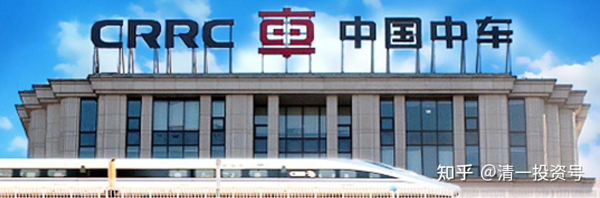
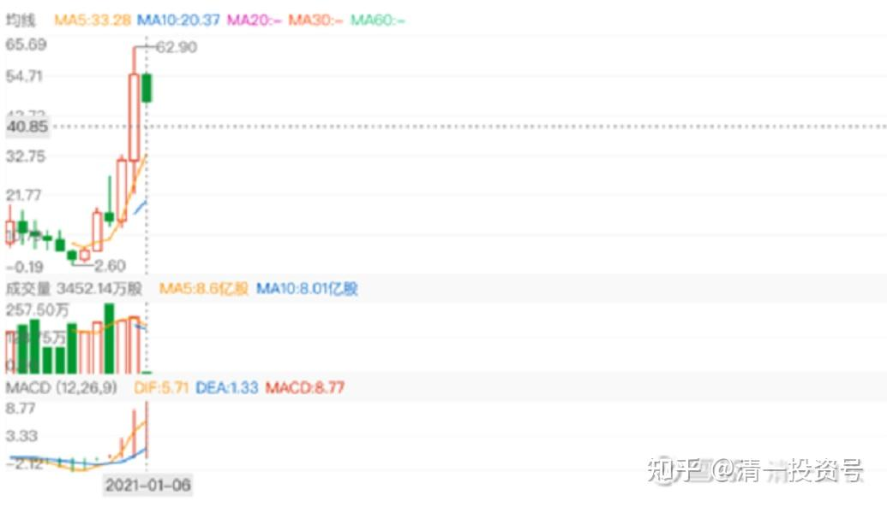
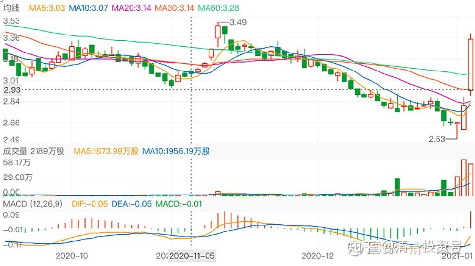

31篇.投资中国中车的理由（二）

清一山长 2021年1月～4月

**一、独一无二的龙头股+股息率高**

**[清一山长](http://link.zhihu.com/?target=https%3A//xueqiu.com/9310099567)** 2021-01-06 16:26

[$中升控股(00881)$](http://link.zhihu.com/?target=http%3A//xueqiu.com/S/00881) 这是我错过的大牛股。3元多买的，大概是7元多就跑了。一去不回头。错过了涨20倍的机会。买的也不多，就赚了几十万。后来看它飞了，又去买了个垃圾股正通汽车。2.55元的成本，涨到快10元也全出了。赚了700多万港币。

不过，现在要我重新来一遍，我估计还是会跑的。我买入中升，是因为我的丰田汽车在它家店里保养，觉得这公司还不错，3元多的价格很低。股息也可以，就买了。但涨了两倍还不走，我觉得太贪了，就走了。所以，**我赚不了我看不懂的钱。**我现在都不懂：为啥它就值60多元？为啥就值20多PE？

买正通，是当时的最低价。2.8元开始买入，跌到2.20元还补货。最终成本2.55元左右，幸运的是涨到10元前后就跑光了。因为几家券商都出来站台。说价值14元。我一看：站台的皮条客都出来了，此时不跑，更待何时？就溜之乎也。傻乎乎地赚了700多万HDK。

但以我现在的心境来看，这两笔投资，我都不会做。因为，其实我不懂！其实这种公司，也没啥技术含量。要买低估，就买中国中车这种，死拿不涨也不管。

所以，我不以赚钱论英雄。如果我总结中升没有多赚钱的原因，是跑早了，我就会在正通上死拿，今日不但没赚钱，还赔几百万。

正通我也不因为赚钱了，就去大买其他汽车股，买了，大概率也赚不到啥钱！

**要买，还是买中国中车这种：龙头股。这种独一无二的股，跌到股息率都超过6%了，等于上了双重的保险，不买白不买，涨了白赚，跌了死拿股息。等于是包赚不赔的，拿了可以安心睡觉的，**不比啥卖汽车的股，好多了？特别是就算财富良好，但是不是造假，天知道！**中国的很多私企，私德都很有点靠不住！**

**[清一山长](http://link.zhihu.com/?target=https%3A//xueqiu.com/9310099567)** 2021-01-06 17:33

这家公司（中升控股）超过一千亿港币的市值。中国中车H股，今天涨了20%，也才900多亿的市值。三天前，盘中还破了800亿的“底裤”。

但，只要是正常人，怎么算账，都不会认为一家卖汽车的，可以代换的公司，比一家造高铁车的公司更牛？更有价值吧？港股就是专治各种不服！

**我们没法跟市场先生讲道理，我们只能利用市场先生。**

我们不能要求中升控股价格合适，我们只是比较一下，知道：如果有钱，宁肯买中车，不要买中升。两者就差一个字，10年后，可能差一个数量级别的账户数值！

**[清一山长](http://link.zhihu.com/?target=https%3A//xueqiu.com/9310099567)** 2021-01-06 19:42

[$中国中车(01766)$](http://link.zhihu.com/?target=http%3A//xueqiu.com/S/01766) 从跌破3元我就开始买中车，一直买到2.56元。这些买入动作，都在雪球上留下了记录，一路打脸过来。总共买了3M多不到4M的货。其实也没多少钱。因为股价实在是太便宜了，总值也才一千万左右。昨天就涨了超过5%，今天居然一天就大涨20%，涨得不可思议。恐怕是我买入后涨最快的股了，我还真的不太适应。

我赚的钱其实不太多。最低2.56元买入的货，是7.20元卖掉宏桥买的，今天中国宏桥也涨到7.70元了。买入中车的逻辑，是：**中车是全球竞争力最强的公司。中车的世界推销员，是中华人民共和国的总理！这种股，是独一无二的概念股，也是垄断股。**比茅台的概念，垄断价值都高。茅台还有一众的跟随者捣乱，还有难辨真假的茅台镇酒。但中车，是全中国独此一家的公司，行业第一，也是行业唯一。**护城河高极了，没有谁能够替代他的。**这一点，连世界第一名的中国宏桥都没有这么宽的护城河，因此准备逐步换入更多的，甚至超过中国宏桥的持仓数量。如果将来遇到个啥风口，天知道会怎样表现。所以，**我一看股息率已经达到了6-7%的超级击球点，就开始卖掉别的公司买入了。特别是卖掉赚了钱的中国宏桥买入，心理障碍不大。**2.99元买入中车，2.80元也在买入中车，2.56元，自然更多买入。一路上我的买入都是打脸买入，一路买，一路套。没钱了，就到处卖股筹钱来换中车，没赚钱的股也卖掉换中车。只要中车跌了，就等于别的股涨了。

今天我要卖股吗？我还不想卖。虽然很短时间就赚了25%，但真没到我想卖的点。

会不会还跌回去？很可能会，甚至跌得更低，跌破2.50元，也不是没可能。中美两国竞争，不会这么简单就反转的，中车的日子，也不会过了新年就大发红利的。

为啥不现在趁涨的时候卖掉，等跌了再买回来？这才是聪明人呀？

很简单：如果我确定会跌，我当然现在就卖。但我不能确定会跌呀？我知道我的脾气，是卖掉后如果涨了，我绝对不会追涨买入的。但中车，我买入的时候的算计，是没有想到它会涨，只想它不涨我拿十年行不行？我真的想拿它放十年的。涨了几毛钱我就走了，也太对不起初衷了。所以——我决定继续坐电梯！今天一股没卖！

还有，你们发现我这次中车操作的特点了？典型的左侧买入者。一路跌，一路买。你们说：干嘛不等跌到底部买。这又是聪明人的想法。

我是笨人，我哪里知道什么是底部？我真知道了，三天前我卖掉所有的股，全仓买入中车算了。啤酒也不喝了。

我知道我笨，**我不知道底部，也不知道顶部**。所以，我只好一路跌，就一路买，我还想会不会跌破2元呢！特别是港股，涨跌都不可思议。有时候，一天就把你一个月的跌幅给修复了。**天天计较几分钱的赔赚，都是呆子！**

未来的银行股，中国建筑股，我怀疑就会这样——天天计较几分钱涨跌幅的人，很可能一天之内，就丢了筹码，再也接不回来了。我相信在3元以下买入的人，很多已经在3元以后跑掉了。今天中车成交16个亿，您以为是美国人抛出的吗？我认为是最近一段时间接手的散户，跑得最多！

所以，散户的命真惨：跌起来，动不动就腰斩，再腰斩！看看中车，一路跌下来，散户一路死拿，都砍到脚脖子上了。80%的跌幅。

好不容易到了赚钱的时候，你拿了几毛钱就跑掉了！这就是**散户：概率上，你买入赚钱和赔钱的机会一半一半。但你对赚钱股和赔钱股处理的方式不同，就导致了你今天赚和赔的结果不同！**

中国宏桥，涨涨跌跌，涨了我卖一点，跌了我买一点。涨涨跌跌我都可以接受。今年跌到三元多，我又买了不少，总共增加了一百多万股。现在慢慢又把这一百万股减掉，换了中车、中国电信等。就算是账户不升值，我的持股，也是越来越多了。**熊市赚股！下跌赚股！**

现在的港股，依然熊气弥漫。我们就手上尽量多一点股吧！将来涨了，就少一点股，多一点钱！祝福大家新年大吉大利！

为国接盘，好心有好报！为中国加油！

[清一山长](http://link.zhihu.com/?target=https%3A//xueqiu.com/9310099567) 2021-04-22 15:10

[$中国电信(00728)$](http://link.zhihu.com/?target=http%3A//xueqiu.com/S/00728) 今天2.74元清仓了中国电信。这一波美国打压，买进已经赚了30%多的利润。够满意了，今天全部换入了中国中车H股，买入价格3.39元。理由就是：

1：股息率更高，中国电信才4个多点，中车有6个多点。

2：PE更好。中国电信9PE，中国中车才7PE。

3：PB。两者差不多，中国中车更低一点。

4：中国中车是中国第一，世界上也能排上名、排前三没问题吧？说不定排第一呢！中国电信中国也只是老二，全世界？就不知道排第几了！

5：中国中车有专有的高技术储备，花钱买不来的竞争力。但是电信？好像有钱就能玩吧？加上有牌照。

6：中国中车还会制造电动车。比亚迪的利润，还没中车的高，但市值却是中车的两三倍多，凭啥？比亚迪的竞争对手，要比中车的要多多了。

7：中车还会造风能发电机。新能源概念妥妥的。比亚迪会吗？将来也许就是利润之源？

8：中车是美国制裁的对象，证明中车有实力。美国人都怕。不是说：未来美国赢不了中国吗？所以，就不能买美国人支持的比亚迪，必须买中车才行。

9：不说了，再说 ，你们都来抢筹了[大笑]

我自己，其他啥理由都不要了，就认一条：**中车是中国唯一，根本就没对手。而且，现在的价格，——拿利息也很不错。不涨就不涨，我不在意。**虽然中车的成长率，看样子有点看不清，比不过中国建筑。但由于它没对手，护城河很宽，有“恶龙”守卫，还有总理的推销员。所以，就算它的业绩没有成长，我也可以接受。想要让它业绩下跌，似乎也不容易。只要这行业存在，它就必然生存下去，比亚迪之类的新能源牛企们，天知道十年后还在不在！中车肯定是在的。所以，比确定性，中车更强。

好的，这就是今天换仓的理由，说完了！守股吃利息去了。

（标题为编者所加）

参考链接：

[清一投资号：16篇.中国中车与中国中铁](https://zhuanlan.zhihu.com/p/501574841)（山长新作）

[清一投资号：30篇.投资中国中车的理由（一）](https://zhuanlan.zhihu.com/p/562828027)（整理文）

[清一投资号：32篇.中国中车：敢于融资持有](https://zhuanlan.zhihu.com/p/508326510)（整理文）

[清一投资号：33篇.关于中车的换股操作](https://zhuanlan.zhihu.com/p/514998133)（整理文）

[清一投资号：34篇.中国中车的技术分析](https://zhuanlan.zhihu.com/p/521835261)（整理文）

[清一投资号：35篇.评论几个关于中车的观点](https://zhuanlan.zhihu.com/p/524719401)（整理文）

[清一投资号：37篇.在美国制裁之前关于中车的操作](https://zhuanlan.zhihu.com/p/527206511)（整理文）

