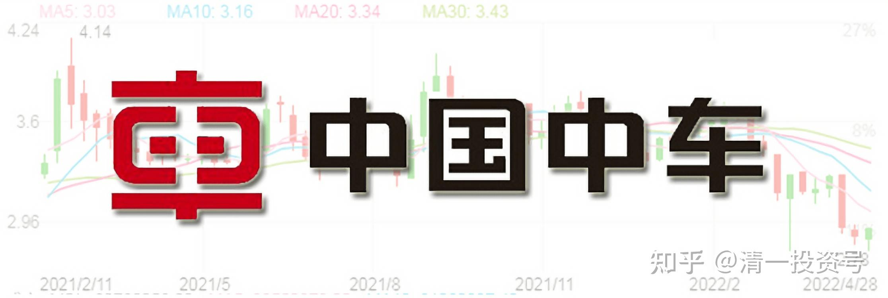
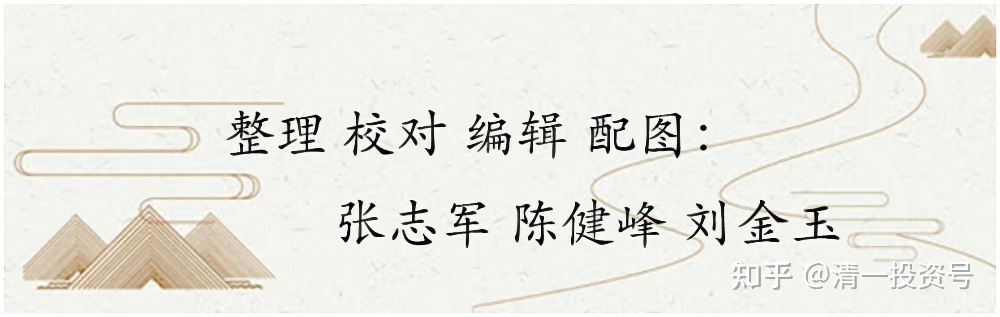

32篇.中国中车：敢于融资持有

清一山长 2020年12月~2021年6月

**一、便宜且保障**

**[十一面](http://link.zhihu.com/?target=http%3A//xueqiu.com/n/%25C3%25A5%25C2%258D%25C2%2581%25C3%25A4%25C2%25B8%25C2%2580%25C3%25A9%25C2%259D%25C2%25A2)回复[清一山长](http://link.zhihu.com/?target=http%3A//xueqiu.com/n/%25C3%25A6%25C2%25B8%25C2%2585%25C3%25A4%25C2%25B8%25C2%2580%25C3%25A5%25C2%25B1%25C2%25B1%25C3%25A9%25C2%2595%25C2%25BF):**

大A的中车看不上？[鼓掌]

**[清一山长](http://link.zhihu.com/?target=https%3A//xueqiu.com/9310099567)** **[2020-12-16 14:29](http://link.zhihu.com/?target=https%3A//xueqiu.com/9310099567/165898275)回复[十一面](http://link.zhihu.com/?target=http%3A//xueqiu.com/n/%25C3%25A5%25C2%258D%25C2%2581%25C3%25A4%25C2%25B8%25C2%2580%25C3%25A9%25C2%259D%25C2%25A2)**:

您钱多多，贵的票您买！一样的东东，我只要最便宜的。华为手机，我都喜欢买海外版的，**因为便宜[大笑]**。

**[清一山长](http://link.zhihu.com/?target=https%3A//xueqiu.com/9310099567)** 2020-10-21 12:26

$中国中车(01766)$ 今天买了一点中国中车，才3元左右的价格，我觉得太低了。作为一个垄断行业的龙头股，给出这个估值很荒唐。我买入，是准备长期持有的“中国概念股”。买入后再跌，我也无所谓。我不管价格，反正我不会2元多卖给你，只会买入更多。我只吃利息就可以了。**在中国投资，买国企应该比较靠得住。民企风险太大**。**国企**起码业绩有保障的。最新消息：国资委20日发布数据显示，第三季度中央企业实现营业收入7.8万亿，同比增长1.5%。其中，9月实现营业收入2.8万亿，同比增长4.3%，月度增速创今年最好水平。前三季度中央企业累计实现营业收入21.1万亿元，收入降幅由上半年的7.8%收窄到4.6%。第三季度中央企业实现净利润4748亿元，同比增长34.5%，其中9月实现净利润2046.3亿元，创历史同期最好水平。前三季度累计实现净利润9133.5亿元，效益降幅由上半年的37.7%收窄到13.6%。前三季度，中央企业收入利润率保持在7%以上，9月份达到9.5%，创十年来最好水平。经营活动现金流净额超过4000亿元，已经恢复到正常水平。

**二、受命于国家布局氢能汽车**

**[月光66666666](http://link.zhihu.com/?target=http%3A//xueqiu.com/n/%25C3%25A6%25C2%259C%25C2%2588%25C3%25A5%25C2%2585%25C2%258966666666)回复[清一山长](http://link.zhihu.com/?target=http%3A//xueqiu.com/n/%25C3%25A6%25C2%25B8%25C2%2585%25C3%25A4%25C2%25B8%25C2%2580%25C3%25A5%25C2%25B1%25C2%25B1%25C3%25A9%25C2%2595%25C2%25BF)**:

借山长的楼问个问题，电车对碳中和有用吗？一次能源主要还是煤炭啊！能源效率更好，不一定吧！

**[清一山长](http://link.zhihu.com/?target=https%3A//xueqiu.com/9310099567)** **2021-01-09 13:04 回复[月光66666666](http://link.zhihu.com/?target=http%3A//xueqiu.com/n/%25C3%25A6%25C2%259C%25C2%2588%25C3%25A5%25C2%2585%25C2%258966666666)**:

您这个问题，就是丰田董事长对新能源汽车的质疑，对特斯拉路线的质疑[赞]。

他认为：现在的新能源，发展电池车，无非是把汽油消耗，改成了煤炭的消耗（发电），但对地球环保本质上没有差别，甚至可能更糟糕（因为制造电池额外需要耗费大量能源）

丰田的思路，是“氢能汽车”，使用氢气来做电力供应，排出的废气是H2O，这才是真正的环保车。丰田是这个路线的领先者，但被美国为代表的利益集团压制很厉害（想想看特朗普怎样对待华为的？只要对自己不利，就拼命打击，才不管对地球有啥好处呢）。日本国小，根本没机会发展氢能技术，也不敢跟美国人对刚。所以，很无奈，丰田就在前两年，把氢能汽车的专利，全部都公开了。实际上是想让中国来接手这一烫手的山芋。中国缺能源，缺汽油，也敢于和美国对着干。所以，以后我认为，中国会是新能源氢能技术的引领者。比特斯拉要有价值得多。就是不知道该投谁？

氢能汽车还有一个好处，就是它其实就是一个移动的发电机，所以，将来家里有汽车的，就可以连上汽车，用自己发的电照明等，需要多少就发多少，不用储能的。这样，全球的电力企业，也会受到巨大的冲击。所以，因为氢能路线对现有的能源集团冲击太大，才被冷置的。**中国政府，正在悄悄的布局氢能，只做不说，**也是为了避免引起过多注意。

顺便说一句：**中国中车，就正在做氢能汽车。**12月份发货量增加很多倍。我认为：**这些任务，国家会交给国企来做的，**现在这些热热闹闹的新能源企业，也许将来怎么死的都不知道！所以，我一家都不敢投[大笑]。只能看着！

**三、分红覆盖融资利率**

引用雪球文章《疯狂造富的大时代，一去不返》

[https://xueqiu.com/1333325987/183108633](http://link.zhihu.com/?target=https%3A//xueqiu.com/1333325987/183108633)

**[清一山长](http://link.zhihu.com/?target=https%3A//xueqiu.com/9310099567)** 2021-06-16 22:27

【2013年，杨百万年过6旬，逐渐淡出股市，在接受采访时，他坦言“比起当年的2万块本钱，今天我股市的2000万，资产增加了1千倍，钱够用就好，养老也可以不靠国家、靠自己了，除了抽根烟、喝个茶，没有什么奢侈的爱好】

我还以为他股市资产早就过亿了，一个资产很高的起点，最终才这点钱。**说明他一路的追涨杀跌，其实收益不是太高。不如保守持仓的收益更大。**很多比他晚很多入市的人，现在都比他更有收益吧？比如燕京的牛散唐建华。各位算算，如果以杨百万的资产量，他进入股市之初，就保守投资，稳拿头部的几只股票不放，到了2013年都不止这数字。如果跟上大波段，做一点逃顶抄底的事情，就更多了。

当年我就是这样做的，我在几个人声顶沸，人人买股的时刻取钱离场，那时候是券商现场付钱的。记得一次，是别人存钱，我把我所有的股票卖掉，然后拿钱走人，结果券商居然在大厅给我一整包的钱。我只好出来打滴往相反的方向走，然后中途再换车回家。防止被人追踪。更有几次，我是券商大厅都无人的时候，冷清至极的时候进场的，而且进场只买绩优股，防止再跌。所以，300点的底，以及2005年1000底，我都是抄到了的。

2005年，我还借了几百万去抄底，结果弄到家都散了，但这是我赚钱最多的一次抄底行动。2005年，我买的重仓是武钢股份。当时价格2.41元～2.42元，每天织布，后来居然涨了快十倍（可惜涨了三倍我就跑掉了，买了别的也涨了）。

第二次大规模入市，就是2014年借钱炒股，我告诉周围朋友，这是一次可能一生都难遇的机会，请大家珍惜，带了数百人入市买银行股。这一次，已经可以动用融资了，不用私人借钱了。结果我就动用了上千万的融资额度来买银行（当时的逻辑——银行股的分红，已经可以基本覆盖融资利息），这一回的大赌，彻底反转人生。现在看，我就是这一次抄底行动，才超过了杨百万的资产值。

现在正在抄底十年不涨的股票，中国建筑也6年不涨了。也许，他们将带给我再上一个数量级。**我相信价值投机——只在有价值的股票上进行投机行为，高卖低买。高价股、投机股，一概不碰。**这个逻辑让我穿越了过去的28年，超过了这些过去的股神。我相信也可以让您的未来稳定，甚至高速获益。

剧透一下：**现在的中国建筑、中国中车H股，分红都已经可以覆盖融资利息了。这种股票，我是敢于融资持有的。**至于其他说不清的股就算了，我相信这两家公司，未来10年，20年，是倒不了的。至于说国企啥的？我相信这两家公司，未来都必须和国际市场竞争，他们的国企病，会在国际竞争中治疗的，不用太担心这一点。（中车已经从底部涨了30%多了，不推荐保守投资者此时进场，右侧投资者才可以入场。也许中国建筑更稳一点，我看跌不下去了）。

（标题为编者所加）

参考链接：

[清一投资号：16篇.中国中车与中国中铁](https://zhuanlan.zhihu.com/p/501574841)（山长新作）

[清一投资号：30篇.投资中国中车的理由（一）](https://zhuanlan.zhihu.com/p/562828027)（整理文）

[清一投资号：31篇.投资中国中车的理由（二）](https://zhuanlan.zhihu.com/p/504483885)（整理文）

[清一投资号：33篇.关于中车的换股操作](https://zhuanlan.zhihu.com/p/514998133)（整理文）

[清一投资号：34篇.中国中车的技术分析](https://zhuanlan.zhihu.com/p/521835261)（整理文）

[清一投资号：35篇.评论几个关于中车的观点](https://zhuanlan.zhihu.com/p/524719401)（整理文）

[清一投资号：37篇.在美国制裁之前关于中车的操作](https://zhuanlan.zhihu.com/p/527206511)（整理文）

