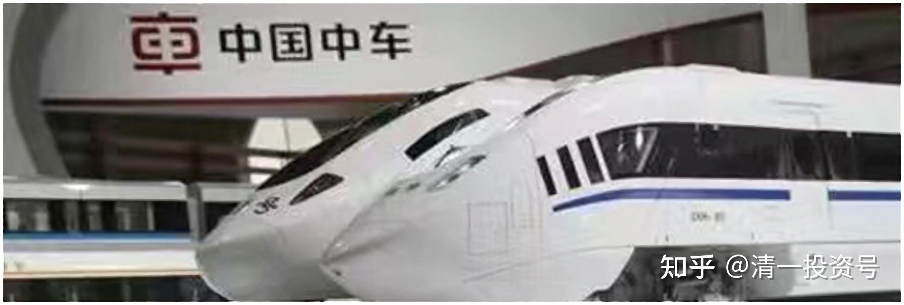
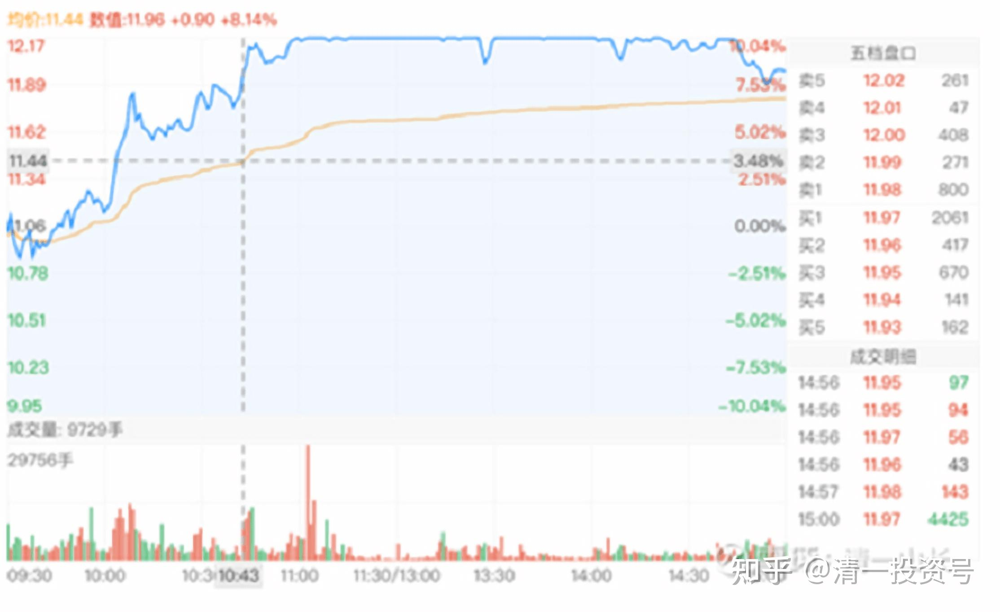

33篇.关于中车的换股操作

清一山长 2020年12月～2021年6月

**1.涨了的宏桥换中车，都是行业第一**

**[质真如渝](http://link.zhihu.com/?target=http%3A//xueqiu.com/n/%25C3%25A8%25C2%25B4%25C2%25A8%25C3%25A7%25C2%259C%25C2%259F%25C3%25A5%25C2%25A6%25C2%2582%25C3%25A6%25C2%25B8%25C2%259D)回复[清一山长](http://link.zhihu.com/?target=http%3A//xueqiu.com/n/%25C3%25A6%25C2%25B8%25C2%2585%25C3%25A4%25C2%25B8%25C2%2580%25C3%25A5%25C2%25B1%25C2%25B1%25C3%25A9%25C2%2595%25C2%25BF):**

去年看完山长这个贴子开始建仓老白干，中间来来回回买进卖出，最终成本12元多，从18元开始减仓，直到今天老白干酒终于清仓完毕，家里就剩下重仓的啤酒等风来[献花花] 感恩山长一路分享[笑]

**[清一山长](http://link.zhihu.com/?target=https%3A//xueqiu.com/9310099567)** **[2020-12-16 15:46](http://link.zhihu.com/?target=https%3A//xueqiu.com/9310099567/165908395)**

**回复[质真如渝](http://link.zhihu.com/?target=http%3A//xueqiu.com/n/%25C3%25A8%25C2%25B4%25C2%25A8%25C3%25A7%25C2%259C%25C2%259F%25C3%25A5%25C2%25A6%25C2%2582%25C3%25A6%25C2%25B8%25C2%259D):**

[献花花]我的还有一些，没清仓。[笑]

**[质真如渝](http://link.zhihu.com/?target=http%3A//xueqiu.com/n/%25C3%25A8%25C2%25B4%25C2%25A8%25C3%25A7%25C2%259C%25C2%259F%25C3%25A5%25C2%25A6%25C2%2582%25C3%25A6%25C2%25B8%25C2%259D)回复[清一山长](http://link.zhihu.com/?target=http%3A//xueqiu.com/n/%25C3%25A6%25C2%25B8%25C2%2585%25C3%25A4%25C2%25B8%25C2%2580%25C3%25A5%25C2%25B1%25C2%25B1%25C3%25A9%25C2%2595%25C2%25BF):**

我觉得赚够了，就不跟了[笑] 今天港股宏桥也盈利140%，清仓买了中国中车，等它恢复估值。

**[清一山长](http://link.zhihu.com/?target=https%3A//xueqiu.com/9310099567)** **[2020-12-16 16:49](http://link.zhihu.com/?target=https%3A//xueqiu.com/9310099567/165914391)**

**回复**<**a href**="[http://xueqiu.com/n/%C3%A8%C2%B4%C2%A8%C3%A7%C2%9C%C2%9F%C3%A5%C2%A6%C2%82%C3%A6%C2%B8%C2%9D](http://link.zhihu.com/?target=http%3A//xueqiu.com/n/%25C3%25A8%25C2%25B4%25C2%25A8%25C3%25A7%25C2%259C%25C2%259F%25C3%25A5%25C2%25A6%25C2%2582%25C3%25A6%25C2%25B8%25C2%259D)"> 质真如渝:

您真会跟[献花花]，**我今天的中车就是宏桥换的。两家都是行业第一，这就是我要一直持有的国际龙头企业，永远满仓龙头企业。涨了换一换。**

**[清一山长](http://link.zhihu.com/?target=https%3A//xueqiu.com/9310099567) 2021-01-04 16:11 **

[$中国电信(00728)$](http://link.zhihu.com/?target=http%3A//xueqiu.com/S/00728) 买入了差不多一百万股中国电信，价格是2.10元。看差不多是10年的最低价。**还买入了不少仓位的中国中车，2.56元。**我以为：电信这种股，就跟公用事业股一样，稳稳地赚钱。稳稳地分红的股。没啥成长的空间，不能指望他急涨，但也没啥潜在的危险，几乎是垄断经营。居然会出现十年多的最低价，我就买入，当准现金股来用吧！

**资金是卖了几十万股中国宏桥腾出来的。**去年两个股都是3元多4元的样子，我在3元多还补仓了宏桥的。现在宏桥涨到了7.20元，以后估计还会继续涨，我现在只剩460万股了[捂脸]。以后宏桥可能继续涨，我也认了。但万一别的股跌惨了，我可以卖出中国电信来加仓（就算不涨价，我这样也赚了[大笑]），这就是准现金股的意思，宏桥止盈一部分。总得让别人也有机会赚钱（铝和金属高价时刻来临）

我算是为国接盘吗？还是在帮美帝亏钱？（我认为被迫卖出的美国人，肯定没人能赚钱。十几年的最底部位置，赚个毛线？）

**[ROE20笨财猫](http://link.zhihu.com/?target=http%3A//xueqiu.com/n/ROE20%25C3%25A7%25C2%25AC%25C2%25A8%25C3%25A8%25C2%25B4%25C2%25A2%25C3%25A7%25C2%258C)回复[清一山长](http://link.zhihu.com/?target=http%3A//xueqiu.com/n/%25C3%25A6%25C2%25B8%25C2%2585%25C3%25A4%25C2%25B8%25C2%2580%25C3%25A5%25C2%25B1%25C2%25B1%25C3%25A9%25C2%2595%25C2%25BF):**

山长，能看看宏桥什么状况吗，跌了3分1，成本在4元，到14元没卖，跌回到10元。

**[清一山长](http://link.zhihu.com/?target=https%3A//xueqiu.com/9310099567) 2021-06-18 14:59 回复[ROE20笨财猫](http://link.zhihu.com/?target=http%3A//xueqiu.com/n/ROE20%25C3%25A7%25C2%25AC%25C2%25A8%25C3%25A8%25C2%25B4%25C2%25A2%25C3%25A7%25C2%258C):**

您好搞笑喔。14元你都淡定地坚持不卖，现在10元，却心慌慌地拿不住的样子。到处问人。

涨跌，你以为我说得清吗？问我，你问错人了。我不是股神。我的宏桥投资历史，就不是一个聪明人知道涨跌的大神的决策；而是一个傻瓜，傻傻地相信张世平不会骗我的信心。

2017年，我从3元多持有到13元，又再度跌回2.88元。我80%的持股，坐了一回过山车跌下来。如果我知道会这样走，早就全跑光了。低价再接回来不香吗？问题是我不知道它会跌回来，我以为它要涨过20。跌下来，只好承认自己笨蛋，继续买买买。2017年第四季度，一个季度成交89亿元，换手率9%。其实可以看出：大多数筹码都没有跑，持仓心态都很稳，结果大家的判断都是错的。

现在：一季度破13元，高位换手已经220亿。如果再发生一次跌回2.88元的走势，其实我一点也不觉得奇怪。因为已经有过这样的历史，干嘛就不会有这样的未来？这样的换手率，证明很多资金已经跑掉了。

不过，您放心，就算可能跌回2元多，我不会抛掉我剩下的200万股的。我不去预测涨跌。低于10元我不想卖。就傻傻的继续持有。高于14元，我会继续减仓，因为我已经发现了更低的、值得持有的标的可以买。**宏桥出来的钱，我很多买了中国中车H股，3元多一点点的股价。因为我认为这是一个伟大的企业，我愿意慢慢地坚守这家公司，不在乎它涨不涨。**起码当年宏桥3元的时候，中车还10元呢。现在换过来挺划算的。

本轮，我的确在12～14元之间跑了很多持仓，一大半。因为我吸取了2017年的教训，不要去预测股价。我跑的时候，并不知道会跌得这么惨的。因为大家都在说：这一次肯定会涨到20元。我想：已经赚够多了，可以卖一部分出去，给点钱给别人赚。没想到现在居然跌了这么多。我不会后悔我没卖完。我也不预测未来会不会重新跌到2.88。我只想说：**我就用负成本的200万股陪同中国宏桥继续跌吧，无悔这笔投资**（目前是我创利最多的个股）。就行了。万一宏桥真跌到2.88元，我相信我会加仓多一倍，超过千万股的。**不知道市场会不会给我这个机会？如果真给了，我买入1000万股，依然是成本不到零。所以，我不会去预测股价涨跌。我安心持有睡觉就行了，这种股，有啥看行情的必要吗？**一般来说，涨停了会有人私信告诉我的[大笑]。

**2.涨停的啤酒换中车，价值更高**

**[清一山长](http://link.zhihu.com/?target=https%3A//xueqiu.com/9310099567)** 2020-12-22 15:36

[$珠江啤酒(SZ002461)$](http://link.zhihu.com/?target=http%3A//xueqiu.com/S/SZ002461) 抱歉，下午的涨停板，我承认是我打下来的。不是我故意的，就是本来盘面上好好的，但我的卖盘一放上去成交，就发现买盘开始哗啦哗啦的往下掉，但成交也没多少，我猜是主力撤单？不想要？很快就破了涨停价。我其实没卖多少，也就卖了百多万股[滴汗]。今天总成交七千多万股，我就是个小零头，账上还有超过百万股的珠江没动呢！打下来，不符合我的利益[吐血]。早知道会跌，趁涨停板有买盘的时候，我全走了好不？不过，真跌了也不怕。不是腾出资金来了吗？改天，我会重新买回来的。多少价位是买点？具体就不多说了。珠江过10元就不示范操作了。

燕京啤酒，我还可以多说两句，没过10元[大笑]。燕京今天的成交非常的不寻常，这两天的涨幅其实很高了。今天总成交12亿还多。是最近几年的天量。是不是后期要调整？从盘面上看，今天倒是没有出货的迹象，主力、散户，都一起在吃货。昨天盘中出了一点货，但不多。正常的倒手行为。

上一次成交量放出天量，是2019年连续两天涨停追货。第二天成交11亿。比今天少一点，但数量上应该更多。一般来说，天量天价。上一次创天量后，燕京走上了漫长的调整之路，吞吃了全部的涨幅。这一次会这样吗？我认为不会简单的重复历史，但是有可能会调整一下，调整的幅度和时间，都不可能跟2019年的那次相比。因为燕京目前是价值价格比最好的股票。实质上，市值跟珠江差不多（264亿：270亿）。但燕京的销量是珠江的三倍。按照销量来测算，燕京的空间比珠江大（不过如果按照重庆啤酒的逻辑来算，珠江比燕京更像重庆，所以我拿不准两个都买成重仓）。市场的基本面上，燕京于去年已经很不一样了。所以，我除了逢高减掉一点仓位还融资外，现在还不想大量卖出燕京。不过，我特别感谢燕京的主力照顾。本来昨天我涨停板（9.41元），挂了100万股燕京卖出的。结果没卖掉。今天为了表示感谢主力不吃之恩，就在9.77附近，出了相当一部分仓位出来，换点别的跌到地板上的绩优股去了。今天主要大量卖出的，还是珠江惠泉等涨停股。**买入了一些跌惨了的股。包括中国中车，今天在2.76元买进。我用没啥技术含量的啤酒，换世界第一牛的中华神车，我觉得就算这种交换在钱上吃了亏，我也蛮自豪的[俏皮]。再看看2019年年初的时候，中车和啤酒都是6元多点。现在啤酒涨了一倍多，中车跌了一倍多，我就瞎猜：我这样换，是不是就相当于我赚了四倍？[大笑]**

不过换了中车、中建等，就不好玩了。只管傻傻的等。现在装索罗斯的玩法，可以玩得挺HI的。好在现在仅仅是开始，账户上依然有超过千万股的啤酒，等着慢慢派发。我不急，慢慢走，也许几年后还在，只要账户是负成本持有啤酒就安心了。涨到天上都不怕！（我有恐高症）

（标题为编者所加）

参考链接：

[清一投资号：16篇.中国中车与中国中铁](https://zhuanlan.zhihu.com/p/501574841)（山长新作）

[清一投资号：30篇.投资中国中车的理由（一）](https://zhuanlan.zhihu.com/p/562828027)（整理文）

[清一投资号：31篇.投资中国中车的理由（二）](https://zhuanlan.zhihu.com/p/504483885)（整理文）

[清一投资号：32篇.中国中车：敢于融资持有](https://zhuanlan.zhihu.com/p/508326510)（整理文）

[清一投资号：34篇.中国中车的技术分析](https://zhuanlan.zhihu.com/p/521835261)（整理文）

[清一投资号：35篇.评论几个关于中车的观点](https://zhuanlan.zhihu.com/p/524719401)（整理文）

[清一投资号：37篇.在美国制裁之前关于中车的操作](https://zhuanlan.zhihu.com/p/527206511)（整理文）

