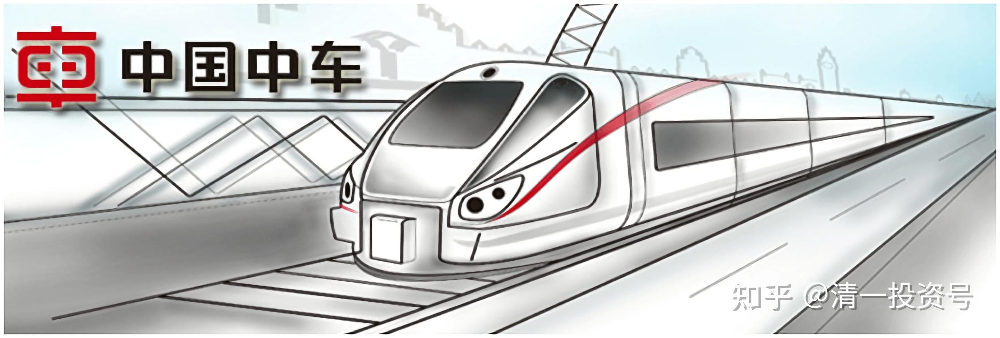
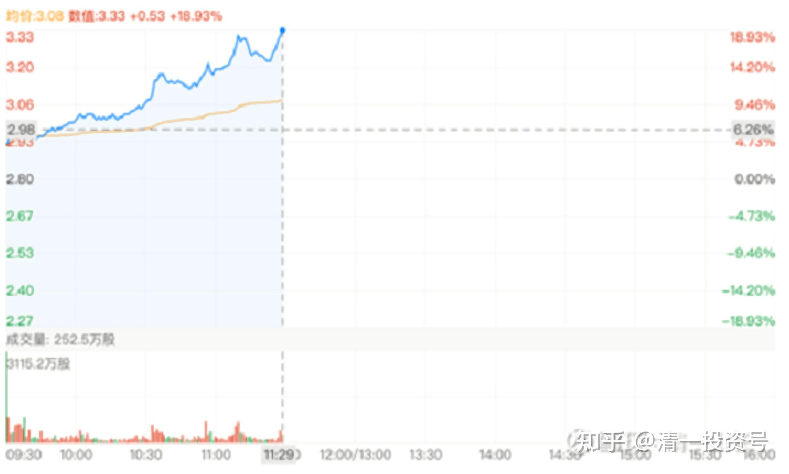
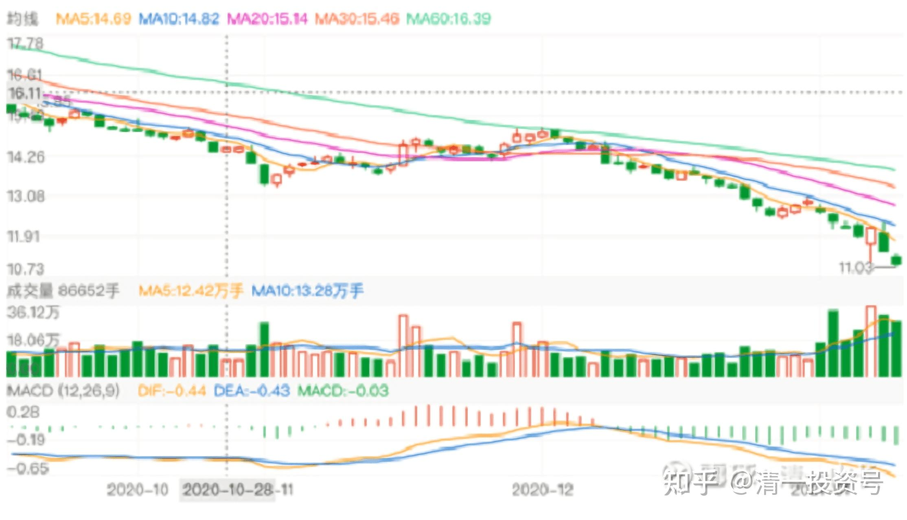
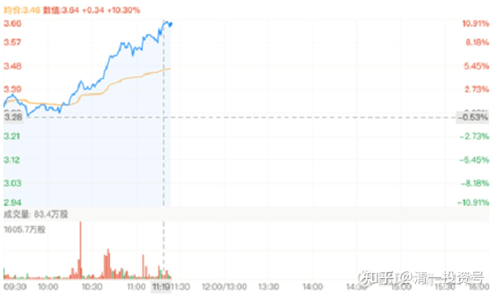
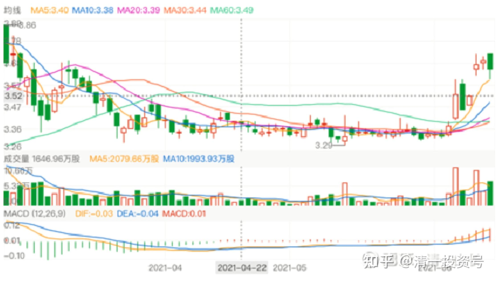
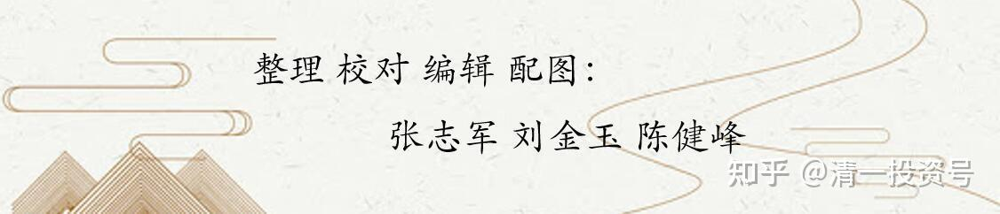

34篇.中国中车的技术分析

清一山长2020年12月～2021年6月

**一、关于中车的技术分析**

[清一山长](http://link.zhihu.com/?target=https%3A//xueqiu.com/9310099567)2020-12-20 21:45

[$中国中车(01766)$](http://link.zhihu.com/?target=http%3A//xueqiu.com/S/01766)最后一分钟成交两亿多股打下来8分钱，有意思。这个价格不错，明天我也接一点？

[清一山长](http://link.zhihu.com/?target=https%3A//xueqiu.com/9310099567)2021-01-06 11:31

[$中国中车(01766)$](http://link.zhihu.com/?target=http%3A//xueqiu.com/S/01766)这就大涨了？这可能是我买入后，涨得最快的股了，没有慢慢地熬时间。运气真好。

[清一山长](http://link.zhihu.com/?target=https%3A//xueqiu.com/9310099567)2021-01-12 14:01

[$华夏幸福(SH600340)$](http://link.zhihu.com/?target=http%3A//xueqiu.com/S/SH600340)大家要小心一点，华夏的走势不太好，纯技术上看，似乎前景不妙。因为最近一周股价创7年来的新低，新低其实也不可怕，可能是主力在有意打压。但低位它却在放量，前期下跌13～12元途中，其实量能已经明显收敛了，说明市场惜售，但现在继续下跌了10～20%，量能反而开始放大，最近一周都在放大，而且越跌越多。这是不祥之兆！说明有场内资金，在不计成本的外逃。有啥特别的坏消息吗？或者有人知道要有坏消息出台了？

当然，也可能现在是主力借势打压造成的放量，底部换筹充分，也许就会拉涨了，这样子就不知道了。**比如中国中车，也是底部放量，我敢大力买入，就是赌美资抛完，内资接手，就没有压力了，不用太担心下跌。上涨多少不知道，但底部放量未必是坏事**。

不过，以我的习惯，底部放量，除非有明确的理由，如上述的中国中车。其他未知情况，我会选择观望的。我宁肯买底部缩量，需要耐心收购的股，买了再跌我也不怕，因为量上不来，跌就是假跌的。一旦上涨，就恢复了活跃。买低迷的股，底部就只能慢慢买。想多买，就只能等主力有意制造的跌停这样的机会了，如惠泉啤酒！今天早上的低开，只可以抢一点，但没多的给你的。

**[股市小白菜10](http://link.zhihu.com/?target=http%3A//xueqiu.com/n/%25C3%25A8%25C2%2582%25C2%25A1%25C3%25A5%25C2%25B8%25C2%2582%25C3%25A5%25C2%25B0%25C2%258F%25C3%25A7%25C2%2599%25C2%25BD%25C3%25A8%25C2%258F%25C2%259C10)回复[清一山长](http://link.zhihu.com/?target=http%3A//xueqiu.com/n/%25C3%25A6%25C2%25B8%25C2%2585%25C3%25A4%25C2%25B8%25C2%2580%25C3%25A5%25C2%25B1%25C2%25B1%25C3%25A9%25C2%2595%25C2%25BF):**

记得不久前，也是这么点评过信立泰。

[清一山长](http://link.zhihu.com/?target=https%3A//xueqiu.com/9310099567)2021-01-25 16:23**回复[股市小白菜10](http://link.zhihu.com/?target=http%3A//xueqiu.com/n/%25C3%25A8%25C2%2582%25C2%25A1%25C3%25A5%25C2%25B8%25C2%2582%25C3%25A5%25C2%25B0%25C2%258F%25C3%25A7%25C2%2599%25C2%25BD%25C3%25A8%25C2%258F%25C2%259C10):**

没错呀？我的确说过：信立泰底部放量，我是不敢买的。你买了他，今天大赚了，是你的。希望华夏是第二个信立泰[献花花]。

但如重新来一次，我依然不会买信立泰。底部放量，依然不会进场。因为我现在也不知道它为啥这样涨。难道您知道吗?

别忘了，我前期，也买过底部放量的股：中国中车！我赚的比例，也不比买信立泰少。关键是理由——**中国中车放量的原因，我知道是美国人抛的。我知道中国中车没有任何经营不善的问题**。信立泰放量，是谁干的？你知道吗？基本面坏不坏？有没有地雷，你知道吗？

干什么，都要有逻辑。**股会错过，但逻辑不会错。坚持逻辑下来，才会常赢少输。没有逻辑的人，今天赢了，明天也会赔掉的。**

[清一山长](http://link.zhihu.com/?target=https%3A//xueqiu.com/9310099567)2021-01-13 11:30

[$中国中车(01766)$](http://link.zhihu.com/?target=http%3A//xueqiu.com/S/01766)真的在抢核心资产呀？现在知道为啥涨20%的那天我示范不要卖了？因为卖掉了，你可能就是赚了一点小钱。虽然第二天就跌了，但跌了你会再度买入吗？因为跌的也不多。其实两天后就拉起来。

我认为:**第二天的大跌，是机构故意干的。直接拿货，拿不到的。所以第一天抢进来一些货，第二天砸出去。真实的目的，是要抢货的。原来中车的筹码，都在外资手里，现在别人低价主动让出来，中资乘机低价拿到手。未来有看头。**

我依然持仓不动，继续看涨。不为赚一点小钱就走，就放弃“中国核心资产”。白酒、酱油就算了，我认为中车比它们更有价值，长远来看！

[清一山长](http://link.zhihu.com/?target=https%3A//xueqiu.com/9310099567)2021-06-15 20:55

[$中国中车(01766)$](http://link.zhihu.com/?target=http%3A//xueqiu.com/S/01766)这个日线图走势很好看，显然有资金在平台上收集，现在突破平台，未来有戏。不过中车是我的长持股，不打算做短线，只是看看图玩。

**二、中车的买入价格**

[寂寞守护者](http://link.zhihu.com/?target=http%3A//xueqiu.com/n/%25E5%25AF%2582%25E5%25AF%259E%25E5%25AE%2588%25E6%258A%25A4%25E8%2580%2585)回复[小羊4tb](http://link.zhihu.com/?target=http%3A//xueqiu.com/n/%25E5%25B0%258F%25E7%25BE%258A4tb):

淘宝有清一书店。

[清一山长](http://link.zhihu.com/?target=https%3A//xueqiu.com/9310099567)2020-10-30 15:21回复[寂寞守护者](http://link.zhihu.com/?target=http%3A//xueqiu.com/n/%25E5%25AF%2582%25E5%25AF%259E%25E5%25AE%2588%25E6%258A%25A4%25E8%2580%2585):

我没开店卖东西，我也没开淘宝店。谁开的，我不知道。卖的啥内容，怎么卖的，我也不知道[为什么]。我说过：我的知识分享是公开的，不要版权。所以，你们买卖双方，自己负责。跟我无关！

我对开店不感兴趣，我只对买入伟大的公司有兴趣。以后，坐在中外的高铁列车上，告诉自己的女儿：这些车，都是我们家的公司造的，这感觉多棒[笑]！（**今天2.99港币，刚买了一点[中国中车](http://link.zhihu.com/?target=https%3A//xueqiu.com/S/SH601766%3Ffrom%3Dstatus_stock_match)**）

**[灵动小宝](http://link.zhihu.com/?target=http%3A//xueqiu.com/n/%25C3%25A7%25C2%2581%25C2%25B5%25C3%25A5%25C2%258A%25C2%25A8%25C3%25A5%25C2%25B0%25C2%258F%25C3%25A5%25C2%25AE%25C2%259D)回复[清一山长](http://link.zhihu.com/?target=http%3A//xueqiu.com/n/%25C3%25A6%25C2%25B8%25C2%2585%25C3%25A4%25C2%25B8%25C2%2580%25C3%25A5%25C2%25B1%25C2%25B1%25C3%25A9%25C2%2595%25C2%25BF):**

跟着买了2.7的中国中车，非常感谢。

[清一山长](http://link.zhihu.com/?target=https%3A//xueqiu.com/9310099567)2021-01-13 11:44回复[灵动小宝](http://link.zhihu.com/?target=http%3A//xueqiu.com/n/%25C3%25A7%25C2%2581%25C2%25B5%25C3%25A5%25C2%258A%25C2%25A8%25C3%25A5%25C2%25B0%25C2%258F%25C3%25A5%25C2%25AE%25C2%259D):

恭喜，您已经赚40%了，我底部买的一大把（**2.56元买的**），已经赚50%多了。做多中国，有钱赚，做空中国，活该赔钱！祝福中国！[献花花]

**[佛性苦行僧](http://link.zhihu.com/?target=http%3A//xueqiu.com/n/%25C3%25A4%25C2%25BD%25C2%259B%25C3%25A6%25C2%2580%25C2%25A7%25C3%25A8%25C2%258B%25C2%25A6%25C3%25A8%25C2%25A1%25C2%258C%25C3%25A5%25C2%2583%25C2%25A7)回复[清一山长](http://link.zhihu.com/?target=http%3A//xueqiu.com/n/%25C3%25A6%25C2%25B8%25C2%2585%25C3%25A4%25C2%25B8%25C2%2580%25C3%25A5%25C2%25B1%25C2%25B1%25C3%25A9%25C2%2595%25C2%25BF):**

很认同你很多看法，上海机场可能不够便宜，但是中国中车价格也不绝对不低估，要说中国中车是核心资产，有技术吧，我认，确实是国家技术龙头，但是要说它能像上海机场那样涨个10年，在此打一个很大问号，从中国中车财务报表和管理费用、各项费用，包括核心指标ROE来看，这是一家讲情怀的公司，它的存在并不是回报股东，当然中国中车它也不是市场经济，以前南北双车拼杀了很多年，是国家意志大于个人的公司，而我为啥不看好它，是因为我以前接触过中国中车中的最好资产南车时代，谈公司治理体系管理上，这并不是一家企业文化比较现代化的优秀公司，更多是国企行政官腔式管理，当然也没看到股权激励机制，公司死气沉沉，就拿中国建筑来说，它是一家市场化的央企，管理层够好，公司有股权激励，财务指标和ROE，包括各项管理费用都不错。如果确实讲爱国情怀，中国建筑确实比不过中国中车，对此我很想反问您，中国中车除了爱国情怀、核心资产外，还有什么值得坚持？

[清一山长](http://link.zhihu.com/?target=https%3A//xueqiu.com/9310099567)2021-02-02 11:32**回复[佛性苦行僧](http://link.zhihu.com/?target=http%3A//xueqiu.com/n/%25C3%25A4%25C2%25BD%25C2%259B%25C3%25A6%25C2%2580%25C2%25A7%25C3%25A8%25C2%258B%25C2%25A6%25C3%25A8%25C2%25A1%25C2%258C%25C3%25A5%25C2%2583%25C2%25A7):**

我其实买的中建比中车要多得多。中车买的还是港股，才2元多人民币，最近才买入的。您认为：2元多的中车，难道就没有值得与5元的中建一样坚持的地方吗？[笑]。2014年我还买了5元的北车呢！后来赚了不少跑掉了。中车是当时的上机？

（标题为编者所加）

参考链接：

[清一投资号：16篇.中国中车与中国中铁](https://zhuanlan.zhihu.com/p/501574841)（山长新作）

[清一投资号：30篇.投资中国中车的理由（一）](https://zhuanlan.zhihu.com/p/562828027)（整理文）

[清一投资号：31篇.投资中国中车的理由（二）](https://zhuanlan.zhihu.com/p/504483885)（整理文）

[清一投资号：32篇.中国中车：敢于融资持有](https://zhuanlan.zhihu.com/p/508326510)（整理文）

[清一投资号：33篇.关于中车的换股操作](https://zhuanlan.zhihu.com/p/514998133)（整理文）

[清一投资号：35篇.评论几个关于中车的观点](https://zhuanlan.zhihu.com/p/524719401)（整理文）

[清一投资号：37篇.在美国制裁之前关于中车的操作](https://zhuanlan.zhihu.com/p/527206511)（整理文）

