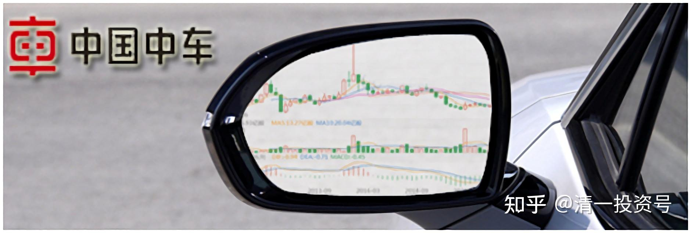

37篇.在美国制裁之前关于中车的操作

清一山长2016年11月～2021年4月

**1.之前5元买入，2015年22元卖出**

[respark](http://link.zhihu.com/?target=http%3A//xueqiu.com/n/respark):回复[清一山长](http://link.zhihu.com/?target=http%3A//xueqiu.com/n/%25C3%25A6%25C2%25B8%25C2%2585%25C3%25A4%25C2%25B8%25C2%2580%25C3%25A5%25C2%25B1%25C2%25B1%25C3%25A9%25C2%2595%25C2%25BF):

山长一直买中车，有没有卖过啊？

**[清一山长](http://link.zhihu.com/?target=https%3A//xueqiu.com/9310099567)**[2020-12-16 17:53](http://link.zhihu.com/?target=https%3A//xueqiu.com/9310099567/165920572)回复[respark](http://link.zhihu.com/?target=http%3A//xueqiu.com/n/respark):

卖过呀！20多元卖掉的。2015年之前是5元买进的。中国北车，没逃到顶，也没抄到底！[滴汗]

**[清一山长](http://link.zhihu.com/?target=https%3A//xueqiu.com/9310099567)**2017-10-08 12:27

专栏文章《财富之心：金融炼金术》节选

我分享的**“国家担保标的”**一天内就超过140万人阅读。看起来想要赚钱的人真的很多。我找到了市场金融的错配，用实体企业做生意的方式来比喻，提供了一种理解和利用金融市场的思维方式和行为方式，也满足了一些人总想找可以赚钱的标的这种心理追求。

不过说实话，根据常识，这些仅仅只是想找赚钱标的的人，其实最终是赚不到钱的。比如，这两年，买到了十倍股融创和恒大的股民，应该不少吧？只需投入十万元，你就轻松赚到百万元。有多少人赚到了百万呢？（大多数赚了一点小钱就跑掉了，然后买个烂股就全赔掉了）。我的投入并不太多，但每只股我都赚了大几百万，每只股都拿两年以上。现在融创都还拿得有呢！可惜目前就只

有数百万元的持仓了，如果有数百万股就好了[大笑]。

炒股的人，每个人都一定买过牛股。但是这些牛股，很多不但没有帮你赚钱，还很可能帮你赔钱。

**2015年，我买过中国北车，4元的买入价格。最高在冲到22元的时候，我就全部都卖出了，并且明示了我的学员的操作过程，告诉大家我全部卖出了。最后看他冲到40元，所有人都嘲笑我“老了，胆子小了，有钱不赚”，不过中车之后又掉下来了。后来我才知道：有些已经来上过课的学员，居然在30～40元的时候还满仓满融，甚至用数倍的杆杠去追涨，买入中车。最后，我相信你们看到结果了。**

所以，我根据经验发现，从长期来看，90%的人，就是怎么做，都不会赚钱的（巴菲特认为98～99%的人都不适合进入股市）。如果从我入市的时候算起（1993年），在金融市场上活到现在的人，真的不足1%。我开户证券公司的账户记录，已经证明了这一点。其他跟我一起入市的人，短期可能赚了一点钱，但一轮牛熊下来，就基本上完蛋了。就算侥幸没完的人，下一轮牛熊又被干掉了。几轮牛熊下来，没几个人成功超越金融市场的魔咒。每年都有人进入市场当韭菜，割完后又有新韭菜产生。大多数人的命运，就是进入市场让人宰割的。

一句话：大多数人似乎就是命中注定，来金融市场的命运就是赔钱的，不管给他什么标的，你怎么帮他，都无法赚钱。除非他能够改变自己的“金融苦命”，除非他真正的拥有了“财富之心”，否则短期赚钱可以靠运气，长期赚钱一定是靠“命”的。**你的运气再好，迟早要消失的。只有命好，才能一生富足。**

**今日学堂的教育，核心实质**，就**是“心理和行为教育”**。很多家长都说，这种教育是改命的。没错，我们通过优质的教育，改变了你的思维和行为，你的命运从此改变。**只要你拥有了富足之心，你就拥有了富足的生活。**即使我们快速突破英语的教学法，本质上就是帮助孩子建立学习外语的信心，改变对外语的错误认知和学习的方法，就轻松实现了4个月突破外语的超级行为效果。

我原来觉得自己赚钱很简单的，本以为把赚钱的标的和方式分享给学员，他们就可以轻松赚钱了，就像我一样不费力赚钱。但最后发现：他们就是做不到！很多人一定要跟我反着做才舒服。

我研究的结果，就是他们都拥有**“反财富的思维和心理”**。如果只是告诉他们正确的财富知识，是没有用的，他们就是用不上这些知识。必须把财富思维和心理，与财富知识一起输入，并把这些人原有的**“反财富行为”**，改变成“财富行为”，才有可能获得长期稳定的赚钱结果。

**2.如果2015年高位买中车，恐怕十年无法回本**

ellhll李华丽:回复清一山长：

我跟了几个月的雪球，看到山长有正通，于是在2020年2月以2.13元买入的正通。按我理解的山长对正通只是小玩的份额，所以我尝试的是零点几的仓位。后来山长在2元多一点的时候清空并发帖提醒，我当时想【这个价格比我买入的稍微低些，如果卖去是亏损的，等几天它上到我的成本位再清】，结果是一去不复返，正通一路下跌，最近好像看到有0.6元多一点。最低多少没有留意，就算跌到0元，当是自己的股市之行，在出发的时候先买一个警醒牌。

1.自己是小白，绝对不要有侥幸的心理，山长说危险的东西，一定要第一时间远离。

2.山长可以各种小玩，我没有这样的修为，不要碰小股票，只守着几个大的确定的。

3.相信山长的配仓，保持大方向一致。比如山长主仓位的中建、燕京。

[清一山长](http://link.zhihu.com/?target=https%3A//xueqiu.com/9310099567)2021-4-23 07:33回复[ellhll李华丽](http://link.zhihu.com/?target=http%3A//xueqiu.com/n/ellhll%25C3%25A6%25C2%259D%25C2%258E%25C3%25A5%25C2%258D%25C2%258E%25C3%25A4%25C2%25B8%25C2%25BD)：

[献花花]。我会有一些“风险投资”投资的仓位，拿来买一些“危机股”，输了就算了。有时候不看基本面，只看K线，觉得有机会就会买。但发现不对也就马上卖掉。所以不支持大家跟风，有些股。我买了也不说。怕误导人。就像当初买中国海外宏洋一样，当时别人都说它老千，我没看出老千的样子，就买了。恒大也一样。都是顶着亏光的风险去买的。所以不敢大仓。这些都是赚了的，也有赔钱的。比如江南，华融，忠旺。总的说来，还是赚的。但大仓位的投资，是肯定确定性很强，才会投入。如中建等。只是这种股，就不太好玩，一直不涨。需要耐心。比如啤酒中惠泉，其实可靠性不如燕京和珠江。但看他技术性好，明显有主力介入，所以买进去。但更大的仓位，还是在珠江和燕京身上。最终好笑的是：惠泉的成本最低，以总量不到珠江一半的仓位，赚的却跟珠江差不多[笑]。这就是风险股的好处。坏处就是看错了就亏掉[滴汗]

**投资，不可能每次都赚钱的，总有亏损的股**。巴菲特亏掉的也不少。甚至是大亏。但不要让亏损拖垮你，就好了。小股民往往在不确定的机会上投入重资产，是一种赌博的行为。不确定的投资，风险股，一定是报“亏了就算了”的心态才敢买的。比如茅台，现在能不能买？当然能。但要报未来十年可能都不赚钱的准备。十年不涨，一涨十年的股多了去了。**中国中车肯定是好企业，但2015年买的，恐怕再过十年都无法回本。**中石油，上市买的，恐怕30年都回不了本。这些都是风险。**好股也看价格，垃圾也可以发电。**

**3.2016年6元多买入**

清一山长2016-11-07 15:28

$中国建筑(SH601668)$上周五8元以上出货中建三分之一仓位，今天一看打脸了。[滴汗]

今天继续打脸操作，尾盘以8.24元卖出50w股，**换入50w股中国中车，港币6.94元每股**。余下的钱，就去买银行和保险等廉价股了。都是2013年的价格，以2016年的资金，买2013年的资产，怎么算都很开心。

换股逻辑：我持有的中建、神华等，考虑的是持有“中国大制造行业的关键核心企业”，跟随中国的企业一起成长。2013年年底，中建的价格勉强站在3元上方，我是2014年3元多大举介入的，目前成本早已是负数。而今天中车的价格，就是2013年的相同价格（7元多一点）。**我用8元多的中建，换中车，就等于拥有了2.7倍,2013年的股份，再加上中建炒差价赚到的钱，用增值的资本买入，我多赚了数倍的中车股。这种生意太划算了，干嘛不做？**

另外，我发现中建是有竞争对手的，中铁、铁建、交建，以及其他各种的建筑公司，都会抢它的生意。所以当初只是看它估值很低而买入。但**中车，国内没有人能够抢它的生意，国外它还在抢日本人、德国人的生意**。这种唯一性，2013年只是嫌它估值相对更高而没有买入。现在还是原价，这么便宜，我干嘛不要呢？

至于中车涨不涨？我不知道。我只知道：如果没有一倍的涨幅，我是不会轻易卖掉的。至于下跌了怎么办？反正我的持股是不卖的，要卖你卖。它想跌就跌，谁怕跌？我喜欢跌。只要大股东不卖，我也不卖。我以后坐高铁的时候，就告诉孩子：我们坐的车，我们家的公司自己造的[笑]！

前几天去峨眉坐火车已经告诉小明慧了——坐的是我们家造的火车。

我卖掉中建后，会不会继续涨？我不知道，再涨，我就再换股。执行10%减仓法则。下跌40%后，再考虑买入的事情。直到中建退出我的重仓股地位后再说。

申明：本人操作不构成投资建议。本人是反向指标，经常卖出后上涨，买入后下跌。套牢是常事。本人基本上是靠忍功才度过艰难日子。各位请勿模仿。

清一山长2016-11-08 15:14

中国建筑上周五打脸的操作，今天看来消肿了。昨天卖出，准备今天继续打脸的，居然是以高价卖出成功了。真对不住拿了我高价货的朋友，希望是庄家拿了这些货。

卖出的原因，是估值上不再便宜，技术上有调整的需要。双重的信息，让我果断卖出。可惜就是没卖完，本人执行力不够好。当然，也因为估值上中建依然不贵（只是不便宜罢了）。如果估值“贵”了，就会理所当然的全部卖出了。就像是**去年的中车，22元卖出**，**结果冲到40元**。只能认自己没财运，但也不后悔。忍住到今年来买中车，大概率亏不了太多。

清一山长2016-11-09 11:46

$中国人民保险集团(01339)$2.94元。今天狂买保险，买完就睡去。真奇怪，美国大选，中国香港的银行，保险等居然大跌。正好把前天卖掉的中建资金补仓买H股保险了。**前天挂单买的中车，只买进15W，今天6.67补足数量**。长期持有等未来十年的发展（先涨先卖）。

清一山长2016-11-09 12:35

刚去看了，才发现我的中车成交价又是比最低价多一分，跟人保一样。下午如果不跌，又创造了记录。我可没多想去买什么最低价，只是按当时的现价的卖价，直接打进去的，纯属运气好。说不定下午就现眼了。

清一山长2016-11-22 11:03

$中国建筑(SH601668)$中国建筑，今天9元多了，我又被打脸了，8元多跑了不少。**6.67元买的中车H**，也刚过7元，没涨多少。很不好意思，我是反向指标。最好我买了，你们等等再买，还有更低价。我卖了什么，你们等等再卖，还有更高价。不过我在中建也没踏空，还有一百多万，等过十元再跑（不排除下午就跑掉一部分）。

昨天是天量，一天一百多亿元的成交。今天似乎又是天量，是不是天价呢？还是等等看吧！

清一山长2017-12-30 22:40

$中国中车(01766)$我以为中车才七元多，原来早过了8元，达到两年来的新高了。都是不看账户的毛病。**不管7元也罢，8元也罢，反正我现在不想卖，涨多涨少，跟我一点关系没有。账上一股也没有多，没有什么值得高兴的。反而涨上来，没机会继续买了。**现价我不会加仓的，也不减仓，继续持有。

（标题为编者所加）

参考链接：

[清一投资号：16篇.中国中车与中国中铁](https://zhuanlan.zhihu.com/p/501574841)（山长新作）

[清一投资号：30篇.投资中国中车的理由（一）](https://zhuanlan.zhihu.com/p/562828027)（整理文）

[清一投资号：31篇.投资中国中车的理由（二）](https://zhuanlan.zhihu.com/p/504483885)（整理文）

[清一投资号：32篇.中国中车：敢于融资持有](https://zhuanlan.zhihu.com/p/508326510)（整理文）

[清一投资号：33篇.关于中车的换股操作](https://zhuanlan.zhihu.com/p/514998133)（整理文）

[清一投资号：34篇.中国中车的技术分析](https://zhuanlan.zhihu.com/p/521835261)（整理文）

[清一投资号：35篇. 评论几个关于中车的观点](https://zhuanlan.zhihu.com/p/524719401)（整理文）

