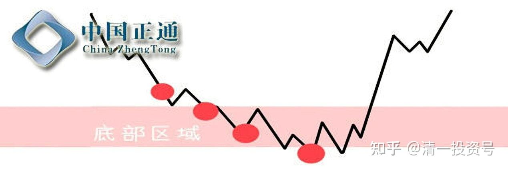

**

**

42篇.正通汽车2016年操作——2元多买入

清一山长2016年8月～2017年3月

清一山长2016-08-23 14:53:47

$正通汽车(01728)$昨天挂单6.19元卖出中升控股（看了港股通的买入成本为2.775元），今天看已经成交了。一笔计划长期投资，却持有不到两年的股，感谢市场给予的意外收益。**今天2.890元买入40w股正通汽车**。理由：今天的价格真便宜。我的中升换正通，就相当于持有的汽车消费股，成本才一元多了。已经跟踪正通很久，老想卖出中升买正通（因为觉得中升涨了是不是贵了一点点），但昨天看正通跟随中升涨了，就没换。挂了个单就忙带学生去了。今天外资报告一水的看正通“中期纯利跌27%”，没看到营业额和毛利率都提升了，证明公司的运行良好，这样的公司怕买入吗？估计影响利润的是今年的财务费用增加，可能跟调整店面有关。我不管这么多，只管企业经营良好，管理团队没有贪污钱就行了。现在的市盈率也就十倍多一点，下半年盈利起来后，股价可能又同中升一样狂涨，那时候选择卖出就是了。只看利润表的外资投研分析师，日子也太好过了。所出的报告一点技术含量都没有。不过**感谢这些外资投研报告，让跟随外资报告的基金经理们大量卖出持股，否则怎么可能低价买入这么多的资产？**这也是持有港股的一笔意外收益（中报年报后，等着收跳楼的廉价货）

山治回复清一山长:

你好牛！同样的动作，我是一个月前中升大涨前4.3元换的正通，结果前者涨了50%，后者价格没变，欲哭无泪啊！

清一山长2016-08-24 16:12:06回复山治:

我的中升也卖飞了[哭泣]。今天中升涨，正通跌。我一样很傻的，可见我绝对是不懂预测的。不过**我算拥有的内在资产值提高了就行**。（4元多的中升，当时算过，跟2.8元的正通内在价值差不多，没高估，所以没换。当初3元左右买入就是认为中升最低估）。现在6元多差价大了，我才换的。以后正通跌，我就再买一点。这样跌很不正常嘛！**只要买的是资产，定价就交给市场吧**！祝福中升的买家吉祥。

清一山长2016-08-25 14:24:44

刚买的正通汽车，被怀疑是老千股。我也吓了一跳，赶快找找历史依据。一看号称香港巴菲特的谢清海也买了正通。一些国际公司也买了正通，放心一些了。只要不是老千，就不怕跌。

消息：

惠理集团于2012年11月9日，场内增持公司仓位90.7万股，耗资464.1119万港币，成交均价5.117港币，最高成交价5.13港币。变动后持股2.21769亿股，持股占比10.04%。

消息2：正通汽车(01728)主要股东GMT Capital Corp.于2014年3月21日，场内增持公司好仓283.1万股，耗资2329.913万港币，成交均价8.23港币，最高成交价8.23港币。变动后持股1.11595亿股，持股占比5.05%。

去年2015年10月的消息：大摩报告指出，中国新公布削减汽车购置税，利好市场气氛，正面影响扩散至贵价汽车，令贵价汽车销售代理正通汽车([http://01728.HK](http://link.zhihu.com/?target=http%3A//01728.HK))长线受惠。集团的汽车贷款业务亦能受惠车市行情好转，金融业务自2017年起的贡献超过1亿元人民币。

目标价由3.8元上调至4.5元，相当于8.7倍2016年预测市盈率，与集团平均约9倍市盈率相符。评级由「与大市同步」上调至「增持」。

一跌，股民就大叫“老千股”，一涨，就感觉良好。也不去查证涨跌的原因和公司的具体情况。这种思维水平，还是别在股市上混了。很危险的。

全球化视野回复清一山长:

清一山长估计没有研究好，看便宜就买了正通，就像现在买火电股一样。大趋势没有分析。哎！

清一山长2016-09-02 11:55:22回复全球化视野:

谢谢提醒。我的确没有好好分析汽车销售行业，所以没有重仓。原来的中升也没有好好分析，钱也是糊涂赚的。算是捡便宜货的风险投资收益吧！不影响大局就好。我只是简单的认为：电商对汽车销售商的冲击很难，而且汽车主要的利润在售后服务，所以分销商唯一靠谱的可能就是汽车行业了。不仅仅是销售。只有加上服务的销售机构，未来才可能生存。

就这么试试回复清一山长:

我就是你说的只看财报不看大趋势的人，目前1/4仓位的华能国际，密切跟进你的仓位，今天2.71刚进了一点仓位的正通汽车，以后紧跟你了。

清一山长2016-09-03 13:36:16回复就这么试试:

恭喜，你抄了我的底。[笑]

**这些小票我都只是玩玩的，不会重仓，就算输了也基本不会影响我的账户资产回报水平。**因此各位千万别当真，别跟我。我是反向指标，跟我的往往亏本。**正通我买进的时候，就想过可以几年都不动的。大涨了可能才考虑买。**

清一山长2016-09-13 13:49:44

$正通汽车(01728)$2.93第一次抄底，到现在已经

我不服，2.61补仓[加油]

常被套回复清一山长:

山长：跟你买的正通被套怎么办啊？

清一山长2016-10-12 18:17:32回复常被套:

一般来说，我买的股，基本上都是买进后就被套。比如江南我1.3元以上就入手了，买了后就跌破一元。我就这丑水平，您跟我不是找死吗？我也不知咋办呢？

一个建议：我买入后，您先不要动，看我深套了，您再买入。如果还是继续跌，至少您心理上会好过一点——成本比我低，要死我先死！[笑]

清一山长2017-02-28 21:45:35

正通现在总算开始表现了，我2.8元开始入手后，这货居然一直跌，弄得到处都说它是老千股。我研究半天也没发现老千股的特征，只是发现它早期高价买了一些4S店，成本上不划算。于是就**继续加仓买进该股，最低到了2.3元左右**。但我太没本事了，实力太差，居然越买越跌，不小心都买成“重仓”了（M级），它还是趴在底部不动。我只好学老办法：睡觉去了。**一般来说，现在还没有睡觉功夫比我强的庄家和主力，他们的资金要计算成本，我根本不算账。只算我的股能够赚利息，不亏就行了。**所以，一般都是他们认输。

24年股市不败，说起来就这么简单。[笑]

Alicezhong回复清一山长:

[很赞]买山长买过的标的，只要有耐心就够。感恩！

清一山长2017-03-01 10:42:55回复Alicezhong:

千万别跟投，我也有买了不涨的标的。还有，原来的成功，并不意味着以后就成功。请大家不要盲目模仿跟随。

正因为怕大家跟我，所以，**我有些股，是从来不分享的。**比如光宇国际，2元多买，6元多卖掉了。不分享，就是我觉得有点危险，但因为太便宜，还是忍不住买了，准备不行就认损失的。结果往往这种股赚得最多。**这是我的风险投资股。分享出来的，基本是价值股，更多是大盘股。**

（标题为编者所加）

参考链接：

[清一投资号：41篇.正通汽车2020年操作——没赚没赔](https://zhuanlan.zhihu.com/p/534182401)（整理文）

[清一投资号：45篇.正通汽车2017年操作——最高9元多卖出](https://zhuanlan.zhihu.com/p/539970718)（整理文）

[清一投资号：47篇.正通汽车操作后反思](https://zhuanlan.zhihu.com/p/542671281)（整理文）

