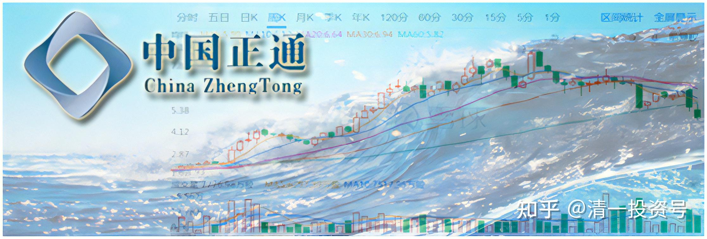

45篇.正通汽车2017年操作——最高9元多卖出

清一山长2017年3月～2017年10月

**1.涨了就卖一些，换没涨的股**

清一山长2017-03-02 11:50:01

$正通汽车(01728)$正通这几天涨疯了。也说明港股进行价值投机，是非常好的市场。**需要投资人多一点耐心，多一点眼光，多一点研究**。我还是没有想卖的冲动，虽然觉得涨太快了，应该有一个回调的。但是就是不想动。继续看吧！

清一山长2017-03-10 16:36:36

$正通汽车(01728)$今天操作：**4.22元卖出正通20万股**，目前该股已经浮赢3M多。换入一个市盈率不到五，分红率7%的某港股。名字就不分享出来了，怕你们去抢也抢不到，还来骂我。因为该股今天的成交，十来万股，基本上都是我的。我看看别人的只有两千多股，也就是说:一旦买进去，你就出不来了。反正我也不想出来，拿分红就行。我去年买胜狮，也是一点点买的，买起来很费劲。不过现在已经可以成百万股的卖出去了（还没开卖，正在想该不该卖）

我不是不看好正通，实在是它一路下跌，让我一路追买。比我希望持有的份额要多了一点，所以**涨了就卖掉一些，换换没涨的股**。**这样我的账户股份才会越来越多**。**我关心持有股多了没有，不关心价格涨了没有。我喜欢低价躺在地下不动的股票**。[大笑]

befunder:回复清一山长:

唉，每次看山长的帖子就感觉股市就是山长家的提款机啊……各种酸葡萄！[哭泣][哭泣][哭泣][滴汗][滴汗]

清一山长2017-03-10 18:47:12回复befunder:

的确是。

我已经提了24年，越提账上的钱还越多。[笑]

只要你们学习了巴菲特、索罗斯，再加上老子和鬼谷子，赚钱一点都不难。

虽然正通我买入后就阴跌不止，被人评为老千股，成为想看我笑话人的一个“失败案例”。我都以为会是我的“滑铁卢”。没想到还是赚回来了。现在的任务，就是守住利润。方法就是：**再去买我认为跌不下去的股**。

**2.祝福买我股票的人**

云梦子虚:回复清一山长:

今天的$正通汽车(01728)$卖得有点早了[吐血][吐血][吐血]

清一山长2017-03-13 12:14:17回复云梦子虚:

**卖了的股，就不是自己的。要学会祝福别人，我祝福买了我上周20万股正通的股民多多赚钱**。你赚，我也赚。

今天我再卖掉10%的持仓，20万股，4.52元，剩下的继续待涨。也祝福买我股票的人明天就赚钱。我去买别人不要的股票，**我追求确定性投资**。

清一山长2017-03-13 14:41:27

今天正通打脸，大涨了10%以上。**祝福上周买我股票的人，祝福您多赚一点**。

正通一直是跟我“不对路”的股，上次买入就跌，害得我继续买入。现在卖出后继续上涨。可见，我一向买入后下跌，卖出后上涨的股市规律，目前看来依然有效。可见我不是神，无法预见未来。请大家千万不要跟风我的操作。

**今天继续卖出10%的正通持仓**，4.55元卖出后就到了4.73元了。[鼓鼓掌]

**如果明天正通继续上涨，我就继续卖10%出去**，涨我就一直卖。谁怕谁！我怕涨不怕跌[大笑]

**3.准备每涨5%就卖出5%持仓**

清一山长2017-05-22 23:10:56

$正通汽车(01728)$不经意间，居然涨到了2015年的最高价附近了。走到了四年来的最高点平台附近。从盘面来看，主力洗盘成功，今天利用除权日直接填权，把一些在意港股通20%利息税的小散直接轧空了。从技术上说，应该开启一轮主升浪了。

我感谢正通汽车给我的赚钱机会，我正在等待出局的时机。下月用这个汽车股赚到的利润总额10%不到的钱，买一辆新车，替换原来送给老婆的订婚纪念车[笑]。已经订了新车，只是需要等很久。我比较小气，原来开的丰田，现在换本田，不升级，只升档，五档车换个9档车[大笑]。再过十年，再换回来，反正都是股市送的钱。

清一山长2017-06-21 10:38:46

$正通汽车(01728)$今天执行卖出操作，一早就挂单，以6.49元卖出正通汽车。刚才查看已成交。目前剩下的仓位不多了，只剩了97万股，成本已经是“忽略不计”了。**准备每涨5%就卖出十万股**。目前已经赚了10辆宝马5系车，20辆本田URV的钱[大笑]。决心这个月一定要换一辆车，以纪念我对汽车股的投资。

**有点惭愧，其实当初买的时候，我并没真正地看懂正通。只是觉得当时太便宜了，K线图上看，是一个空头陷阱。**明显是主力故意打下来的坑。加上我持有的中升汽车上涨卖出后我需要配置一些汽车股。因此才买入的，没想到买入就被套，后期看更低了更加仓不少，居然持仓接近2M了，超过了我正常的风险股投资头寸，当时一些人说它是老千股，还造成一定的心理压力。

目前从技术层面来说，正通依然是不应该卖出的。因为K线图上看，筹码依然在集中的过程中，锁定很稳定。也许以后会爆出一个大冷门来，难说它会成为中升第二，我3元多买，现在居然十几元了。港股也很疯的。

基本面上，因为宝马的销量今年开始急剧增加，2018年估计是个销售的大年。正通的半年报，年报应该都很好看。我应该等利好出尽的时候再走，最佳的出货时间应该是年底或者明年年初。但我有点耐不住性子，心想**赚了就先走一部分再说，剩下的部分持仓观望。原来只是2元多的成本买入，能够耐心持有到现在6元多，我也佩服我的耐心了。已经够了，留一点给胆大的人赚去。我是胆小的人，赚小钱就够了。**

清一山长2017-07-03 22:57:19

我卖掉后就跌破了6元。当时心想买回来，是一个包赚不赔的好事。可惜**我就是不喜欢追涨**，虽然K线图上看，还要涨。今天果然涨了。这一次虽然卖了当天的最高价，依然是“打脸”。正通到底要涨到多少？我都看不清楚了。不管了，**觉得心不安的时候继续卖就行了。慢慢地卖。**

**4.主升期已到**

清一山长2017-07-03 23:12:42

$正通汽车(01728)$今天的成交，比昨天的还低，很不正常。只能说筹码锁定很好。或者说，浮动筹码，昨天已经洗干净了。从盘面上看，7元之前不用考虑卖出的问题。下一次调整，将在7元-8元的区间进行了。

清一山长2017-07-07 16:18:44

原定说正通每涨5%，我就卖出5%持仓的，但现在已经涨了15%，我还没卖，让等我抛出的朋友失望了。

**原因就是我看出：正通已经到了主升期，现在不要急于抛出。**像恒大我就看错了，过早下车。好在当时换入的【绿城中国】表现也不错，加上仓位比卖掉的恒大更多一些，账面上勉强跟上了一些步子，不至于踏空太多。

今天正通走势终于证明了：正通主力不再磨叽，已经开始快速拉升了。最近几天的大幅上涨后，每次居然只调整一天，就结束调整继续上涨。我倒要好好的看看戏。虽然看不懂正通值多少钱（因为已经进入投机阶段了），正好让我这种“价值投机派”发挥一下作用。

下次调整窗口，正常情况下要到8元左右了。真假不知道，看正通怎么走好了。

感谢正通送我的新车。

清一山长 2017-07-17 13:58:50

$正通汽车(01728)$今天7.77元卖出10万股正通，尚余87万股等待出手。主要是**这几天涨得我都不好意思不卖了**。今天继续分一点给想要的朋友。查看成交状况，有13名朋友分别买入了我卖出的正通。其中三位只买了500股。**我很奇怪：为啥他们两元多的时候不买？**想半天没想通，最后突然想通了：他们全都是土豪，都比我钱多，比我更会算账，比我出手更大方。比我更会判断未来的趋势，更善于使用金融工具和手段。所以，以我的档次和脑子，自然想不通他们的投资逻辑了[滴汗]！

清一山长2017-09-13 12:21:21

$正通汽车(01728)$**你敢创新高，我就敢卖**，居然快9元了。再卖掉26万股（26万股，仅仅利润都购买三辆URV了。赚到不好意思，我啥都没干，就按按键盘，这么多钱就来了。只好多做点好事，多收点免费生了[加油]）。正通还剩余61万股持仓，再等等，看风到底有多大！

**5.最高9元多卖出**

清一山长2017-10-27 15:23:56

$正通汽车(01728)$我是9月21日**以9.49元卖出了最后一单仓位**的。刚刚重新看了走势图，发现10月3日应该就是“多头陷阱”，跳空上涨，让卖出的人觉得跌了还会涨回去的，所以安心持股。这一次上涨不久，很快又掉下来了。10月23日又来一次假冲击，无果。今天快速下跌。但从图形上看，庄家并没有充分的出货量，不应该这样杀跌的。这样出货，除非后市太差了，有坏消息，否则难以全身而退的。

反正：不懂我就不做。只看不动手，涨涨见识就好。

**6.从行业的角度看正通**

清一山长2017-09-10 18:59:02

$东风集团股份(00489)$真的好便宜[眼钱钱]，但我真的不敢下手买东风。我只敢买一辆东风造的车。

好几个月前，我就跟刘老师说：我家买的，送给刘老师的一辆结婚十周年纪念车（不好意思，就是东本的URV，很没档次，但老婆很喜欢，很满足)，估计是我们在中国国内买的最后一辆传统汽车（汽油车）。（泰国已经买了一辆车，估计还要买车。以后人越来越多，一辆车不够用的。以后我们国内的车要换的话，估计都没私家车可用了。应该是“无人驾驶”时代到了，或者“共享汽车”时代来临了。最起码是【电动车时代】了。十年后的私家车，说不定跟现在的老爷车一样，是有钱人的玩具，不再是交通工具了。果然，今天看到了工信部的文件：

工信部：我国已启动传统能源车停产停售时间表研究

在2017中国汽车产业发展(泰达)国际论坛上，工信部副部长辛国斌表示，当前，全球汽车产业正加速向智能化、电动化的方向转变，为抢占新一轮制高点，把握产业发展趋势和机遇，我国已启动传统能源车停产停售时间表研究。

说明：我的言论其实并不超前。国家重要部门都知道，就是你不知道。我为一些人看汽车股便宜就买的行为感到后心发凉：我都不知道10年后什么车还能够存在，他们就敢买汽车企业？我只敢买一辆车，就当自己傻！买了玩的。

PS：**我不敢买汽车制造业，但还是敢买汽车销售业**。所以先后买了中升汽车，以及正通汽车。我承认是投机的，不看PE，看PB和K线买的。我认为卖车总需要商店吧？**最近才发现，商店都不行了**。网上的汽车商城已经出现了，网上卖车，网下交车，全国联网O2O。**所以，我的4S店看来也要跟我byebye了**。（我已经卖出一大半了，拿了其中利润的一点部分，买了一辆东本的新车送老婆）

**7.正通是投资组合的一部分**

清一山长2017-10-06 20:31:04

山长雪球专栏文章7篇：揭秘【国家担保标的】

[https://zhuanlan.zhihu.com/p/464047434](https://zhuanlan.zhihu.com/p/464047434)

蒋有超:回复清一山长:

谢谢！山长给我们这些小散，示范投资思维。从国家担保标的这篇文章中，我获得很多信息；使我提前布局一些国家担保标的。

1、嘉华国际：如果我没有分析错的话，应该是9月20号平均成本2.83买进2M；此股价值低估，吕老板信誉一流。

2、这个持股组合非常不错，硬要找一点缺点的话，那就是行业配置太过于集中在金融行业（当然这并不是老师你唯一账号）。我自己单一账号的话，我一定会再配置制造业、煤炭行业个股等，这样假如金融业发生黑天鹅事件，也不会伤筋动骨。

清一山长2017-10-14 18:29:34回复蒋有超:

[很赞]。我的融资方案，是用安全无忧的【国家标的】来借款，融资一倍。但**我用其他跌不动的，高息、小盘、低市盈率、市净率的小股票，来作为保障的资金池**。比如【胜狮国际】之类的，还有消费类、制衣业等。共20来种小股票。**如果发生意外的下跌，这些小股就提供了最大的安全垫。如果上涨，这些小股票涨的最疯，比正股还有“投资、投机价值”。如正通跌到2.5元，涨到9元多卖出**。这些股票就是“安全垫”，比公布的还要厚实。但我不方便透露过多，避免影响市场。我公布的正股，主要好处是跌不下去。它们是不是最能涨的，倒不一定。

（标题为编者所加）

参考链接：

[清一投资号：41篇.正通汽车2020年操作——没赚没赔](https://zhuanlan.zhihu.com/p/534182401)（整理文）

[清一投资号：42篇.正通汽车2016年操作——2元多买入](https://zhuanlan.zhihu.com/p/537086158)（整理文）

[清一投资号：47篇.正通汽车操作后反思](https://zhuanlan.zhihu.com/p/542671281)（整理文）

