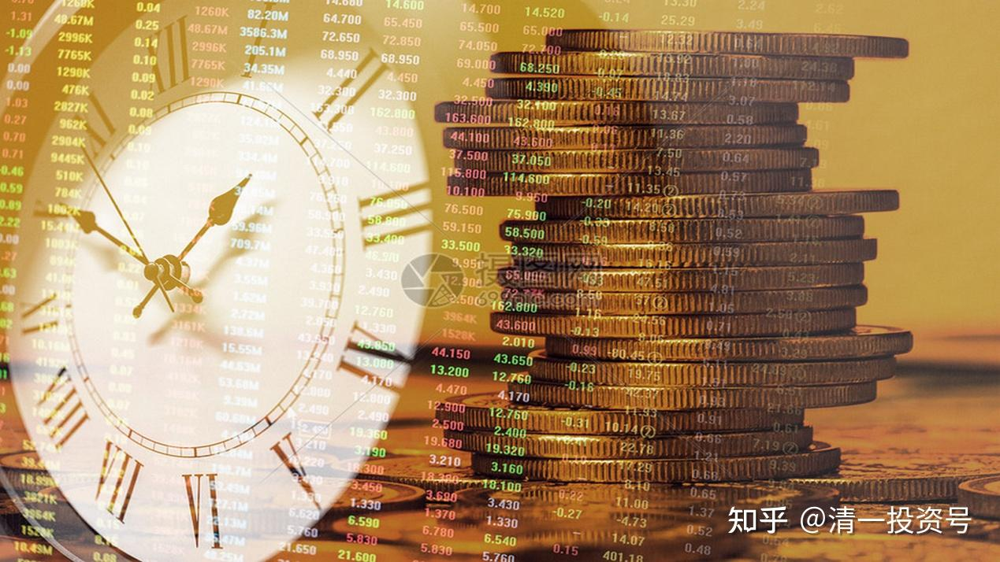
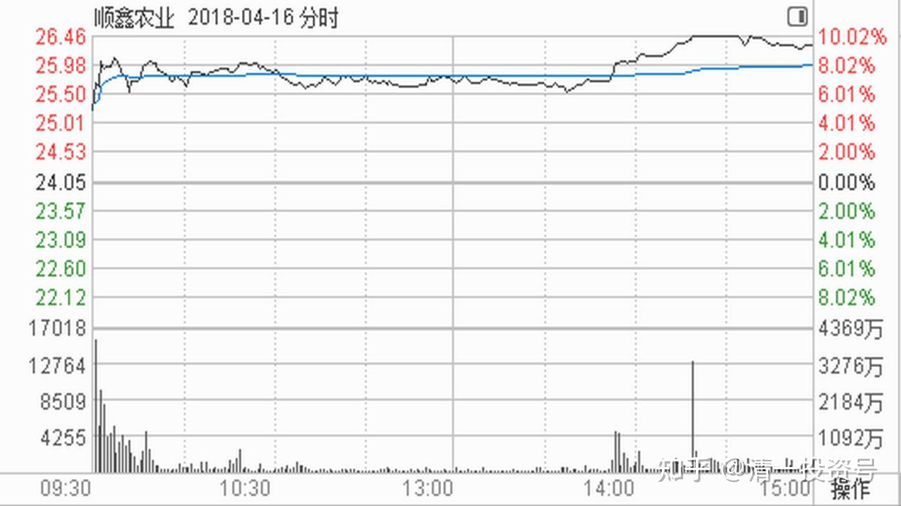
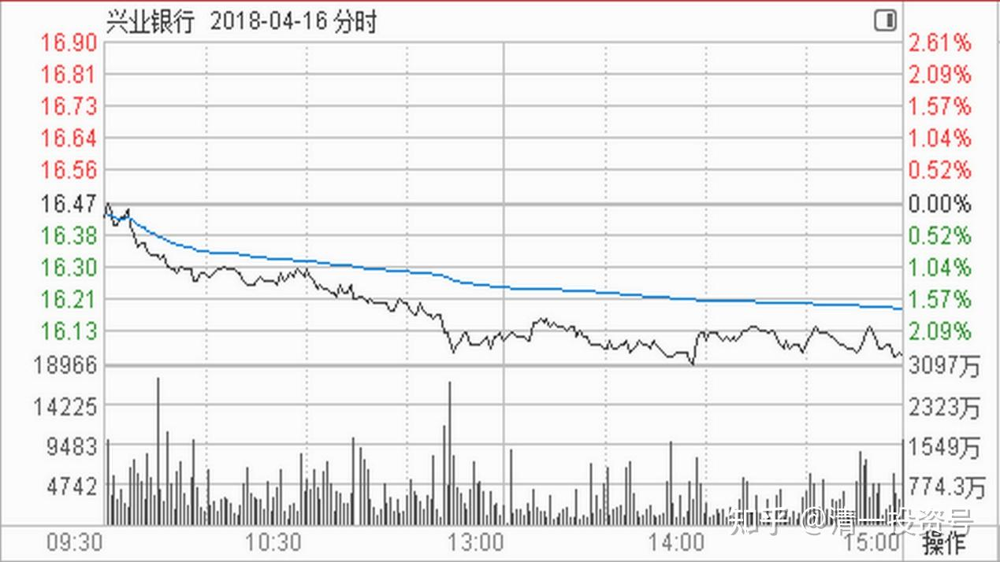
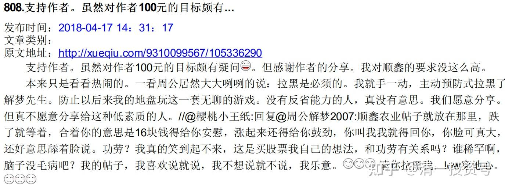
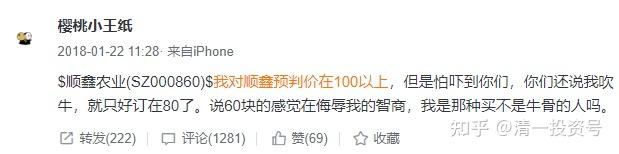
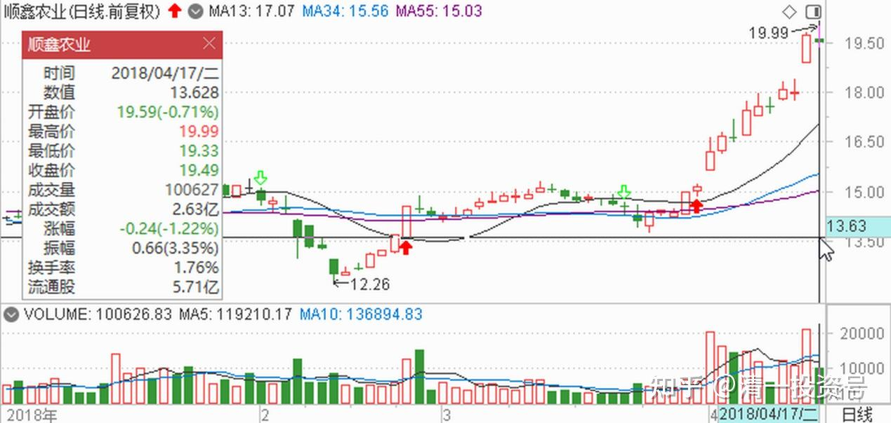
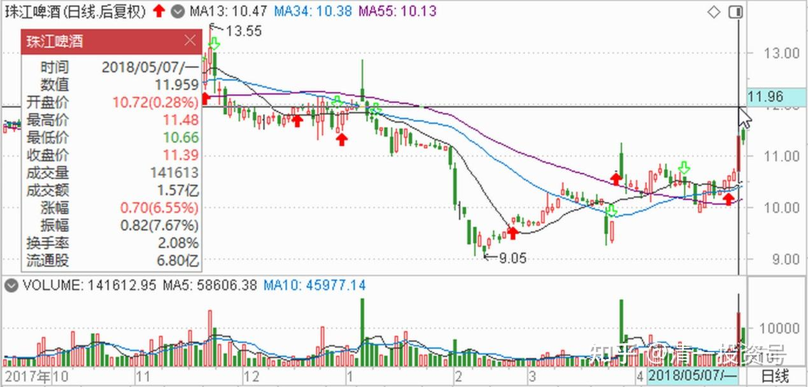
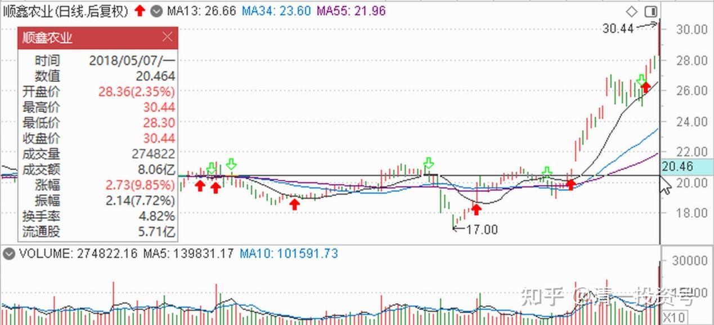
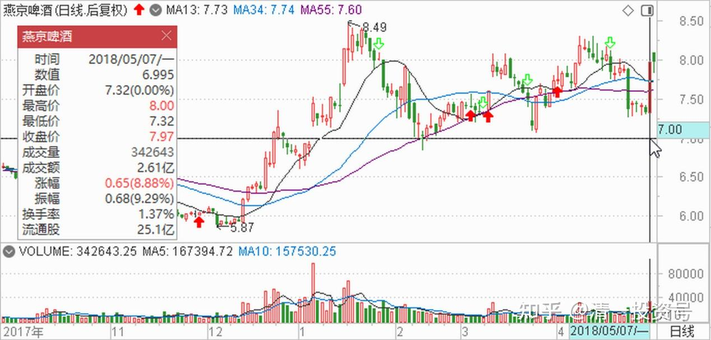

46篇.顺鑫农业记录二：最多输时间不输钱

清一山长2018年4～5月

题记：清一山长2022年6月7日“大家可以参考顺鑫农业原来的走势，这就是“长庄股”的走法。我甚至有点怀疑，现在的**就是原来的顺鑫主力。当年这个顺鑫的老庄，也是恶心人恶心得要死的。把很多老手都熬垮了。很多人刚涨一点点就走了。我是中途进场的顺鑫，都被这庄傻熬了两年。幸亏后来守住了，结果还算不错。主升浪的钱赚到了，吃了鱼头和鱼身子。虽然最后的晚宴中，似乎鱼尾巴最好吃，但我们就别指望吃全了。”

**顺鑫记录二《最多输时间不输钱》**

**一、主力故意示弱，借机杀一波**

**清一山长2018-04-16 14:37:43**

$顺鑫农业(SZ000860)$居然封板了？就先卖出10万股庆祝一下吧。不对，怎么才有20多万股封板？再卖10万股。结果——被我打穿封板了。真对不起了[哭泣][哭泣]都怪我不好，下次我负责买回来。

今天先去救救兴业，买20万股回来。才16元了[哭泣]。真是悲惨的一天。一切都被我弄砸了。

//@春天的鸢尾花:回复@清一山长:

今天的操作跟山长同步了。我也是这么计划的。[庆祝]

**清一山长2018-04-16 14:44:21**

回复@春天的鸢尾花:别学我喔！我大仓还没动的。今天是我第一次卖出顺鑫，原来都是买买买！今天总算一吐恶气，可以卖一点了。我习惯边涨边卖，也喜欢边跌边买！比如兴业，继续跌，继续买。

奶爸行者:回复@清一山长:

今天的卖点很服[大笑]俄毛子的股，实在没底。

**清一山长2018-04-16 15:25:25**回复@奶爸行者:

[滴汗]。不好意思。雪球有人告诉我：顺鑫涨停了才去看的，打开账户想卖掉10万股，冲冲喜。但刚卖掉就看封板快速下降，就赶快又多卖10万股，结果卖完就破板了。真抱歉。

明天涨跌我不知道。继续涨，就继续卖一点，直到剩下半仓，就不卖了。我只知道赚这么多，已经很满足了。给我钱去买更便宜的股票，我很感激了。

//@明达野老:回复@清一山长:

原来是山长出的[很赞]，换股操作漂亮[很赞]。

主力封板后怕是也没料想到——“这都两年了，我也洗得够干净了，谁还留这种“温股””[大笑]。看盘口，应该是主力上午做弱洗盘完成后想着下午抽个时间封掉板就下班了的，后面恐怕是要直接推到28-30元区间，让这批资金上不了车。但是，今天这一开板，不知道主力会不会顺势洗洗盘？还是继续拉起来到30元区间仔细洗洗？不过不管如何，这种反复削尖了脑袋往上冲让我很没安全感。慢下来、缓一缓，我倒也就不急着出了；涨太急了，我就分批慢慢卖。

如果明天筹码松动迹象明显，我也考虑卖出一点点。便宜货太多，卖了也不怕飞掉。

**清一山长2018-04-16 15:31:51**回复@明达野老:

我就出了区区20万股，居然就把主力的板破了。这破主力，实力也太差劲了吧？我卖的时候，还有60多万股封板货的。刚卖掉10万，就看见封板的筹码快速消失。害得我快追才追上10万股。

**我判断主力是故意示弱的。故意的封不住版（实在没多少股）。所以，借机杀一波的可能性很大。**在25元左右充分换手，对主力很重要。不会这么容易的拉上去的。

不过，长期持股的话，这些都可以忽略。不看盘就行了

二、**守住自己的安全边际，赚稳定的钱**

雪球球友原贴：

$顺鑫农业(SZ000860)$做为一个22年股市幸存的草根，只想说一句，散户赚钱一定得底部潜伏。

仓位和成本则决定了你的心态。所以我不会老是去想要是22～23元不抛一大半我又多赚了多少？这是我老公这些天挂在嘴上的话。我顺鑫还是15.3元抛了西水换的呢？西水可是两个月后涨到36！北京城建13.6元抛后涨到19（雄安横空出世）我换9.2元的天健还趴地上呢？天健大湾区出来后我11.5元抛出后才会有6.5元的燕啤，最后才是19.3元开买的顺鑫。每一次交易只要能赚就是对的，赚不到的就是你命里注定没有的，而且我对目前的组合很满意。

我不会在股价相对涨幅较大时再发贴，因为我怕误导看贴后相信你的人。跟踪我的人都知道我是只会在底部为大家为自己打气的。

上周三跟顺鑫公司打电话，感谢他们的增持，感谢牛栏山酒厂的全体员工。我会长期做他们的股东，因为成本太低了。

哈哈，想起每一次在京东买的二锅头，最贵的698，最便宜的是买倍儿爽送的陈酿光瓶酒！

**清一山长2018-04-16 15:18:41（评论上贴）**

良心话[很赞]，涨了不说话，不吹票，是为了保护自己的粉丝不高位追涨。有人涨了就吹票，不小心让人追涨，套住了就不好交代了。

**投资人，就要守住自己的安全边际，赚稳定的钱，就行了。多赚的是运气，赚不到的是没福气，抱怨是没骨气。**

虽然我今天第一次涨停价开卖了一点顺鑫，但不敢说是我的能力，只能说是我的运气好。银行股今天的下跌，让我纳闷。反正市场上不缺便宜货，干嘛不卖掉一点秀涨停的货？逻辑就这么简单。总是对出来秀涨停的股充满了不信任。市场普涨的话，反而啥都不卖了。有涨有跌，才给了我们选择配置的机会。

@樱桃小王纸:回复@周公解梦2007:

顺鑫农业帖子就放在那里，跌了就等着，合着你的意思是16块钱得给你安慰，涨起来还得给你鼓劲，你叫我我就得回你，你脸可真大，还好意思舔着脸说功劳？我真的笑到起不来，这是买股票我自己的想法，和功劳有关系吗？谁稀罕啊！脑子没毛病吧？我的帖子，我喜欢说就说，我不想说就不说，我乐意。[笑][笑][笑]请你拉黑我，low穿地心。[笑][笑][笑]

@樱桃小王纸：

$顺鑫农业(SZ000860)$我对顺鑫预判价在100以上，但是怕吓到你们，你们还说我吹牛，就只好订在80了。[笑][笑][笑]说60块的感觉在侮辱我的智商，我是那种买不是牛骨的人吗。[笑][笑][笑]

**清一山长2018-04-17 14:31:17（评论上贴）**

支持作者。虽然对作者100元的目标颇有疑问[大笑]。但感谢作者的分享。我对顺鑫的要求没这么高。

本来只是看看热闹的。一看周公居然大大咧咧的说：拉黑是必须的。我就手一动，主动预防式拉黑了解梦先生。防止以后来我的地盘玩这一套无聊的游戏。没有反省能力的人，真没有意思。我们愿意分享，但真不愿意分享给这种低素质的人。

@大非哥@清一山长：

$顺鑫农业(SZ000860)$就服@清一山长,对卖出时机的把握，当初卖复星也几乎卖到最高点[很赞]

quaker123:回复@大非哥:

能不吹捧吗？$顺鑫农业(SZ000860)$

**清一山长2018-04-18 11:35:13**回复@quaker123:

[滴汗]。刚看到居然跌了。

虽然我卖出了20万股，但我更多仓位，现在跟你一样“下跌套牢中”，“损失”不小。早知道这样，我就全跑了[哭泣]。证明我真是靠运气。你们放心，再跌我再买回来。看能否把顺鑫拉起来，让大家开心一点[大笑]

**三、便宜就买，见高就走**

清一山长2018-04-17 14:45:11

（下面有8个帖子山长根据球友的互动跟帖）

$顺鑫农业(SZ000860)$从盘面上观察，今天是强势缩量调整。昨天刚涨停过，今天这样小幅调整，走势是相当强的股。未来一定继续创新高[赚大了]。

至于我卖掉的20万股，是否要买回来呢？已经T成功了，如果现价买回，还有8-9万的水钱。但我决心放弃可能的利润，算了，不跟了。我还有其他更安全的股。反正我还有不少仓位跟涨就行了。不要想把所有的钱都赚到自己兜里。另外，本股的主力操盘手法很厉害，很难判别方向。所以就干脆啥都不去猜了。反正便宜就买，见高就走，怎么都亏不死我，就行了。

**提醒——**

**虽然看好后市，但我T成功也不回补，新资金更不会加买。假如您因为我继续看好后市就买入顺鑫，盈亏自负，与我无关**

@明达野老:回复清一山长:

今天上午29.99元挂的单刚看到已经全部成交，涨停板追上再出掉一小部分，总计减掉20%仓位。顺鑫主力太厉害了，我也看不明白了，就乱卖了，今天第一次卖出，庆祝一下这只“温股”终于不温了。继续拉涨停我就继续卖，便宜货太多，忍不住手抖的毛病。我不看空，我只认为相对于更低洼处的好股，顺鑫这样快速拉升在我这里显得就“高”了。

卖出的仓位拿出一小部分买入了兴业A，现在兴业A买回已经有原出掉仓位的5成。

剩下的资金放一放，都涨飞了就算了，继续跌我就继续买。

**清一山长2018-05-07 15:55:11**回复@明达野老:

恭喜明达君暂获无数[很赞]

**今天顺鑫，涨停版故意的封不住，一直在洗来洗去的，应该就是故意让技术派“跑掉”的**。后市看高一线。也许会在30元洗一洗再走，也许会直接脱离30元的区域。不清楚他怎么玩，既然不清楚，我就继续观望。

我这段时间一直在补啤酒，吃了一肚子，有点撑了。今天一看又大涨了，只好罢手不买了。还纳闷怎么现在啤酒和白酒一起混合喝？难道中国人有发明了新的喝法？虽然赚钱了，但我还不想走，继续等消息吧！中国人喝起酒来都不讲道理的，发酒疯。

**四、最多输时间不输钱**

朴拙君:回复@清一山长:

从山长与51对话中，山长好心向其提示今年啤酒股的投资机会比银行股更好，但其并没有接收到。我接收到后，这段时间一有钱就在加珠江啤酒，感恩山长的提示[握手]

清一山长2018-05-07 17:09:17回复@朴拙君:

51君是不了解就不做的人。不可能听别人说什么就买什么。你们就算赚了钱，也许只是运气更好罢了[大笑]。别笑话别人[滴汗]。

//@51nxp:回复@朴拙君:

嗯，我骨子里是银粉。如果买啤酒我就不会抛顺鑫。

清一山长2018-05-07 17:30:09回复@51nxp:

[如果买啤酒我就不会抛顺鑫]。

**我和你讨论一下操作手法和安全边界的问题：**如果手上的顺鑫已经涨了不少，但啤酒还在十年来的底部价格没动，特别是珠江。最近还跌出了黄金坑。显然是主力有意做的坑，从11元的长期盘整平台，居然打到了8元多。就像是顺鑫19元的平台，意外地打到16元多一样。如果您发现了这种典型的主力进驻手法和痕迹，加上你知道啤酒行业已经进入了十年一遇的涨价周期，当时珠江9～10元的价格买入后安全度极高，会不会使劲买一堆呢？

不过，你是价投派，可能不喜欢看K线图买入卖出。**我是“价值投机派”的，会习惯看K线，加上基本面来买入卖出，特别是比价买入。我觉得这样更好玩一些[大笑]。起码我通过看K线来跟随主力进入股票，在时间上，不需要守候太久。**

顺便评点一下燕京（这两只啤酒，都是我现在的重仓了，比兴业仓位多不少）：这货洗盘手法非常凌厉，狂跌狂涨。方向莫测，害得我高位出掉一些后，只敢补低位的珠江。这个手法，说明主力还没有完成洗盘，还没有进入上涨周期。但以洗盘的力度而论，燕京主力志在长远，也是一个未来的牛股。**顺鑫已经完成洗盘了，我看未来走势和价格，就看主力的愿望了。所以，观望为主，少动为妙。**

@安心潜伏:回复@清一山长:

啤酒青岛应该是龙头吧？

清一山长：2018-05-07 23:03:13回复@安心潜伏:

很荣幸，我26元多买入了青岛H[大笑]，一直潜伏至今。目前持有三家啤酒公司的股票，算是重仓了

51nxp:回复@清一山长:

买燕啤正是这么想的。读了很多高集中度后垄断提价的案例，格力和美的是最显性的案例。然而中国这么大的市场，啤酒5巨头占80%的份额了，怎么提价的幅度还是不能拉抬ROE呢？我觉得产品干不过外来的私酿的是主因，产能过剩是次因。

山长，你原来和我不熟，你不知道我曾经多么怕金融危机。2011年4月～2012年9月我空仓。2015年初我空仓，怕的是人民币贬值带来的危机，2015年1月底才买上药H股，3月11出后一直空，大盘涨了1000点，420才投机做了华闻传媒，5月15～16出后又空仓，直到5月底的大调整才买五粮液，6月12号全空了，我害怕融资带来的踩踏风险。但是我看了欧美股市，发现自1988年起，每次危机最多持续一年，股市就能走出阴霾，哪怕2008年10月的金融海啸和2011年欧债危机。丝毫不像1929～1932年的大萧条和1970年的石油危机（这两次都是10年以上的调整），我不是经济学家，瞎猜是否与现在货币发行取消与黄金挂勾（金本位）相关，这几十年每次危机都被各种QE冲淡了。

**想清这一点，只要大盘还在5000点以下，我都会坚定做多，昨天看了雪球上巴菲特和芒格的发言，更让我坚定了持股信念。**$兴业银行(SH601166)$

清一山长：2018-05-08 17:21:12回复@51nxp:

**你才看5000点呀？长期我看两万点都有可能**[大笑]**。反正我在中国股市一万点之前，都看多，不会跑（不排除会卖掉一些股票，换仓等，但绝对不会清仓的）。**

//@明达野老:回复@清一山长:[赞][握手]

我的看法和山长有些相似，当基本面和技术面出现共振的时候，好的时机就会出现。尤其是啤酒行业的十年一遇的基本面情况的变化趋势，再加上华润、青岛的打样，燕京、珠江的一前一后的颇为相似的挖坑动作（和顺鑫大的操盘思路上并无二致）。这真的只是巧合吗？

啤酒行业这个价格战继续打下去的概率已经越来越低了——抢地的战役基本打完了，市场基本被几个寡头分割了，大家均已在各自领地占山为王，不打远比继续打下去带来的收益风险性价比高得多（海外啤酒不太可能给国内市场带来大的冲击，就像你不太可能看到外国烟草会抢了国产烟草市场一样，最多意思意思让他们进来小打小闹下，这个跟国家钱袋子密切相关的低技术高利润垄断行业，我想不出哪个国家会傻到把这个利润让给别人赚）。

所以**我更倾向于认为这不是巧合，而是主力对啤酒行业内部的状况有了较为确定性的把握后的一种争前恐后进场的布局表现（甚至不排除有行业内部高层人士参与这次建仓和洗盘的可能）**。退一步讲，就算真的是巧合，这个黄金坑买入啤酒股至少也亏不到哪里去（行业利润已经这么糟糕了，价格十年没怎么涨，大头的啤酒价格和水价差不多）。

外加其独一无二的抗通胀、抗金融危机特性，在目前全球金融震荡不确定性较大的多事之秋**，烂透的啤酒股是集安全和收益可能性性价比最高的行业之一。**

清一山长：2018-05-08 17:26:22回复@明达野老:

**我其实从来不敢重仓低盈利的股票。这一次敢大量买酒，就是认为十年一遇的机会正在出现。现在买入，最多输时间不输钱。**如果看到了主力的动作，看来时间上也快了。只是燕京的动作让人意外。意外的提前上涨，又意外的后续很软弱。恐怕跟大腕们的幕后沟通有关系——提醒裘国根，现在还不是涨的时候。所以，也许需要更长一点时间来等待。不过也不长了，最多一两年吧！我愿意持有啤酒五年（在没有其他更佳选项情况下，所以也不排除随时逃跑[大笑]。

@深呼吸a:回复@清一山长:

山长老师，就是不知道啥时能到啊

清一山长：2018-05-08 17:38:58

回复@深呼吸a:你们只要还年轻，还愿意好好锻炼身体，肯定有机会熬到这一天的[眼钱钱]

@回报和乐趣成反比:回复@清一山长:

山长兄，那不年轻了怎么办啊[悲]！

清一山长：2018-05-08 19:21:12回复@回报和乐趣成反比:

不如别人年轻，就要比年轻人更努力锻炼身体，学养生。设法比普通人活长一点。争取看到这一天。实在觉得太累的话，就买好一家好公司的股票，再找一台时光机，穿越到未来两万点的中国去，享受收益[大笑]

（标题为编者所加）

参考链接：

[清一投资号：29篇.2021年评顺鑫](https://zhuanlan.zhihu.com/p/498221415)（整理文）

[清一投资号：44篇.顺鑫农业记录一：开始关注买入](https://zhuanlan.zhihu.com/p/539035593)（整理文）

[清一投资号：49篇.顺鑫农业记录三：买、卖、拿住股票的理由](https://zhuanlan.zhihu.com/p/543704521)（整理文）

[清一投资号：51篇.顺鑫农业记录四：主力还没有开始减仓](https://zhuanlan.zhihu.com/p/544147559)（整理文）

[清一投资号：53篇.顺鑫农业记录五：中国炒股最重要的技术是保本](https://zhuanlan.zhihu.com/p/544149372)（整理文）

[清一投资号：58篇.顺鑫农业记录六：最靠谱的投资方法就是不炒股](https://zhuanlan.zhihu.com/p/545612289)（整理文）

[清一投资号：61篇.顺鑫农业记录七——机构坐庄三招：养、套、杀](https://zhuanlan.zhihu.com/p/556331421)（整理文）

[清一投资号：65篇.顺鑫农业记录八：基本面的估值修复和主力技术面的空间](https://zhuanlan.zhihu.com/p/560419930)（整理文）

