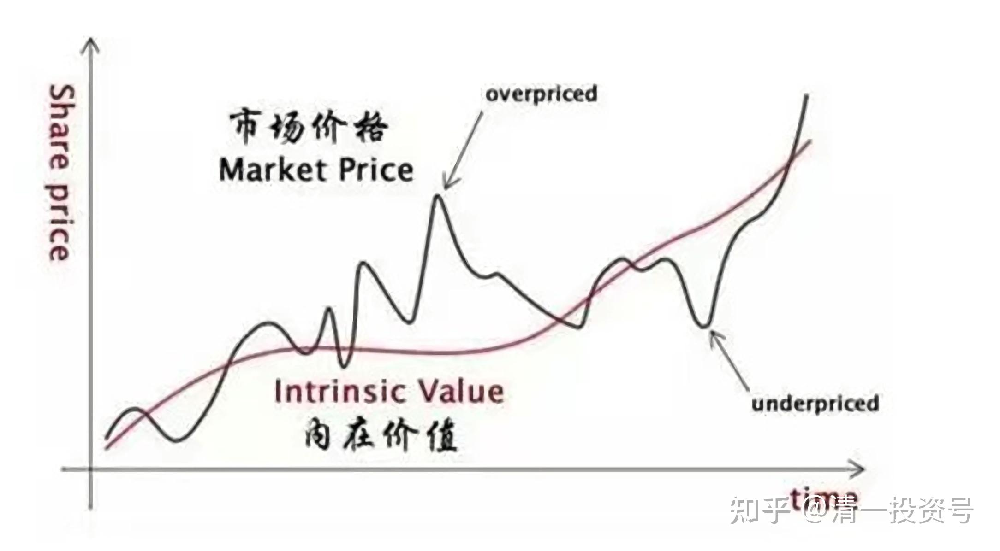

39篇.基于“估值”基础上的换仓套利

清一山长 2015年11月4日

[清一山长](http://link.zhihu.com/?target=https%3A//xueqiu.com/9310099567) [2015-11-04 15:4](http://link.zhihu.com/?target=https%3A//xueqiu.com/9310099567/197395936)9

**$浦发银行(SH600000)$** **恒大地产（03333）估值的艺术**

今天做了两笔套利操作。一笔是以16.91元的价格，卖出了10万股浦发，换入了40多万股的中信Ｈ。**这就在我没有增加对银行的资产投资情况下，直接增厚了我的银行资产头寸达1.73倍，我对此换仓结果感觉很满足。后期浦发如果继续上涨，我就继续换仓。**（刚才盘后看图，愕然发现我卖出浦发的价钱，刚好比今天的最高价低了一分钱，够幸运的。我是提前挂的单，很抱歉套住了买我股的股民。我本希望今天你能够冲过17元的。）

另外一个操作，就是以6.19元卖出40%仓位的恒大地产股票：理由——并不是判断恒大不会涨了，而是这一批恒大持仓，与我购入的原始价（2.99～3.03元，派息后持仓成本不到2.5元）相比，升值已经超过100%了，**现在执行10%减仓法，每涨10%，就减掉10%的恒大仓位，买入我事先看中的一只风险投资股票，符合我“让利润奔跑”的原则。**（说实话，恒大其实是我年初的一笔“风险投资”，在市场最不看好房地产的时候，用数百万买入这样一只很有争议的股票，是抱有大不了就全部认亏的准备）。

**其余卖掉30%的恒大仓位，换入了我认为被市场低估了的，在香港上市的内资地产股，执行我“长期持有中国稳定发展的企业资产”的投资原则**，**保持我对于地产股的投资头寸不减少**（从我的估值法来看，这种换仓，等于我多了两三倍的有效地产资产）。

要了解我这样换仓的原因，就必须给出我的“估值系统”来，起码是“地产企业估值系统”，为什么我会认为卖出恒大，会换来比原来的持仓更多的“地产资产”？（当然，我下面的算账，忽略了恒大的非地产业务的价值，这个不好算。）

**巴菲特所说的：投资只需要知道两件事情：第一是学会估值。第二就是学会面对涨跌。**

**第一条是投资能力的问题，第二条就是心理品质的问题。**的确，只要把这两条把握好了，在股市上赚钱并不难！

**今天我的换仓，就是基于“估值”基础上的换仓套利行为。**虽然估计恒大地产还会在不断爆出的恒大利好和许家印不断的稳定增持中上涨，但是我已经准备好了逐步退场了——因为我找到了更加低估的地产股。以后每上涨10％，我就减掉10％的仓位，换入别的低估值股票。

房地产股票如何估值？如果你只会PE，就太小儿科了。当然，已经比只会看价格的高低，以为两元多的股票一定比20元多的股票便宜的家伙要强多了。但真正的估值，是基于你对企业的了解和对生意的态度来决定的。炒股客往往亏损，即使持有好股也赚不了钱，就是因为不懂估值。**不懂估值就是因为他们不懂企业，不懂经营。他们只不过是胡乱碰运气的赌徒罢了。**

我今天比较了几家港股上市公司，从它们的市值与今年的销售额的比例来看他们的股票售价是否合理。毕竟：企业的最基本使命就是要赢得市场，必须用业绩来说话。自然业绩最好的公司，才应当得到我们的追捧。对由于人性的弱点，正在上涨的明星股过于耀眼，会让你舍不得卖掉，从而忽略了低估的好企业。为好股付出好价钱，最终的投资结果恐怕就不一定让你满意了。**而我的投资，是找到被市场忽略的好股，以低价买入大家没看见的好股，这才能获得超额收益。这也才是我们这些投资人在金融市场上的真正意义所在——发现并纠正市场的价值错判！**

我以今天几家香港上市地产公司的价格，参考了市销率概念来进行估值比较，找出最被低估的标的，市场相对股价的竞争力最强的公司。不过跟教科书不一样，我反过来用了这个指标。用今年1-10月的销售额，除它们的总市值。最后的得分越高，相对股价就越便宜，越值得购买。

企业1-10月销售额市值得分恒大地产1417亿元899亿港元1.57融创中国502亿元177亿港元2.83绿城中国486亿元151亿港元3.21龙湖地产415亿元645亿港元0.64华润置地708亿元1542亿港元0.45建业地产110亿元38亿港元2.89花样年控股95亿元（估）55亿港元1.72雅居乐326亿元170亿港元1.91富力地产376亿元82亿港元4.53

从上面来看，目前最值得买入的资产，就是富力地产。融创中国，以及建业地产排在前三名。（绿城得分虽然较高，但我对于绿城老板实在不看好，就放弃了，而且绿城今年的相当一部分业绩来自融创创造的，是否真正体现了它的竞争力，我还看不透）。如果用恒大来做标准，最便宜的富力地产，价格仅仅是恒大的0.35倍。而最贵的华润置地，价格是恒大的3.14倍。龙湖的价格也蛮高的，不过我实在看不出龙湖为啥这么值钱。

**还有一种估值法，就是用相对估值法来计算，也证明这三只股相对是值得买入的。**

在我今年1～2月，以2.99～3.03元的价格买进恒大的时候，富力的股价在9元左右波动，融创的股价在7元左右波动。而现在的富力仅仅8元左右，融创5元左右。相对恒大已经涨了一倍以上，而这两个股的价格，反而低于今年1、2月份的价格。因此，现在用卖出恒大涨价一倍多后的资本，来买进这两家依然低估的地产股，显然是一件很划算的套利投资模式，比当初持股不动买入这两只股要划算得多（当时我认为恒大最为低估，因此只投了恒大一只地产股）。

利用市场估值的相对错判提供的机会，来为自己赢得最佳的投资收益，显然是一种很不错的投资法则。我认为：就算是将来熊市，恒大股价可能的下跌幅度应该大于融创和富力下跌的幅度。如果是牛市，从销售情况来看的实力，富力和融创将获得“市场纠正”的话，它们的上涨幅度很可能大于恒大。

因此，最终的决定就是：今天就开始换股！减仓10%的恒大，换掉30%的恒大。总减值40%的恒大仓位，剩下的头寸，就边打边撤。享受许家印老板拉升恒大带来的额外财富效应。

**最后说明：估值是一种艺术。我这种套利投资，是在坚持长期持有良好企业的基础上，对相同行业的股份进行换股操作，以期待获取最优化投资回报的套利方式，不是大家理解的炒股。**因此我也不打算去比较这些股价的未来涨跌情况。因此，**我分享的目的，只是示范我的估值体系和套利方式，不是对各位的投资建议。**

请看我文章的人，不要胡乱盲目模仿我的操作，否则亏损自负。我对于总喜欢在高位热情地买股，低位却像躲瘟疫一样逃离股市的大批“中国投资人”来说，实在没有什么共同兴趣和爱好。我只愿意远远地欣赏他们。

目前，正是我深耕、谋划、栽种的时候，我愿意慢慢地研究和等待收获。

@人淡若菊回复@清一山长:

还有一些，虽然销售额不高，但是商业地产很强悍，比如华润置地。

清一山长 2015-11-04 16:32 回复人淡若菊:

谢谢提醒。富力的总市值的确怎么算并不清楚，A股正在准备上市，可以算未来有上拉股票的动力（估值高）。因此我这种算法，只是个估值参考罢了（估值既然是估，不可能面面俱到的）。考虑到市盈率，以及PB，分红率，目前富力都占优势。只是我对于未来的商业地产不看好，因此上个月对3元的SOHO中国都下不了手，所以当时只敢买4.1元的融创，今天看来SOHO涨的更好一些。但再来一次，我的选择还是一样的--尽量不碰商业地产，除非便宜得离谱。因此，华润置地既然看不懂，就不理它了。

淸一山长2015-11-04 16:48

您对地产的确很熟悉，希望以后多看你的地产分享文。实话实说：除了2007年买入万科B避险，以及2014年初低价买入新城B获利三四倍外，我真正对于地产的研究，是从今年1月买恒大才开始的。我认为地产业的调控和衰退，有利于少数竞争力强的企业，并不需要回避全部的地产行业。对于远大住工厂模式的竞争力很佩服，只是不知道如何介入。

