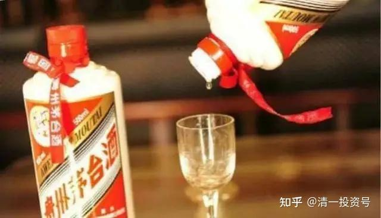
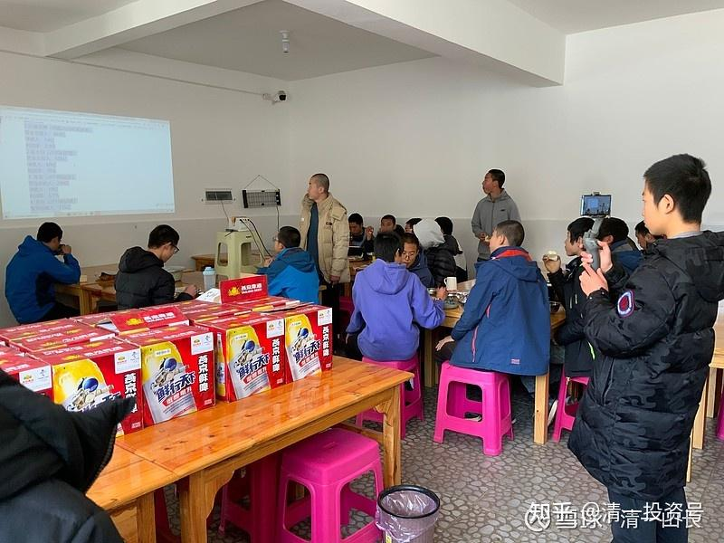
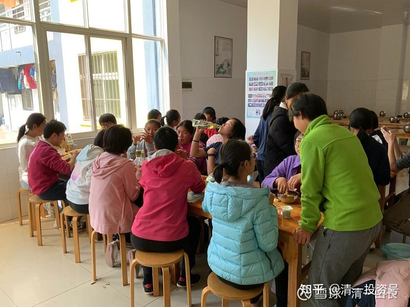

50篇.最赚钱的“投资”——投资人类的欲望

清一山长2021年3月15日～4月9日

[清一山](http://link.zhihu.com/?target=https%3A//xueqiu.com/9310099567%2522%2520%255Ct%2520%2522https%3A//xueqiu.com/u/_blank)[长](http://link.zhihu.com/?target=https%3A//xueqiu.com/9310099567%2522%2520%255Ct%2520%2522https%3A//xueqiu.com/u/_blank)

[2021-03-15 16:51](http://link.zhihu.com/?target=https%3A//xueqiu.com/9310099567/174468476%2522%2520%255Ct%2520%2522https%3A//xueqiu.com/u/_blank)

[$燕京啤酒(SZ000729)$](http://link.zhihu.com/?target=http%3A//xueqiu.com/S/SZ000729%2522%2520%255Ct%2520%2522https%3A//xueqiu.com/u/_blank)为了助力燕京走出低迷，清一大学今天举办啤酒节。今天学生们要喝一天的啤酒，彻底了解中国的酒文化。不醉不休[大笑]。

巾帼不让须眉，一样连瓶狂饮！[大笑]

相信大家看了照片，就知道清一大学少年班，不同于中国忽略性别差异的学校体系，我们是男女分开教学的，不同的班主任带不同的班。因为**正值青春期，分开教学，更能让学生们提升学习效率，同时解决她们不同的成长进度和需要。**

今天的啤酒节，是孩子们经过家长同意、支持的**“中国民间文化体验系列课程”**，属于参与式课程，预计晚上十点结束。不知道他们会帮助燕京提升多少营业额[俏皮]。

课程目标：亲自感受神经心理学的神奇效果，学习神经链调整术，将来可以用于心理行为学的应用。

方式：**反者道之动。用饮酒的方式来反饮酒。**

[@舒隽熙](http://link.zhihu.com/?target=http%3A//xueqiu.com/n/%25E8%2588%2592%25E9%259A%25BD%25E7%2586%2599%2522%2520%255Ct%2520%2522https%3A//xueqiu.com/u/_blank)回复[@清一山长](http://link.zhihu.com/?target=http%3A//xueqiu.com/n/%25E6%25B8%2585%25E4%25B8%2580%25E5%25B1%25B1%25E9%2595%25BF%2522%2520%255Ct%2520%2522https%3A//xueqiu.com/u/_blank):

【低级人故事——啤酒节】

我花了一天时间喝了整整12瓶啤酒，从早上10点喝到将近晚上10点，喝得我头晕眼花。喝到最后，还唱起了歌来，别人拉我回去，我还不乐意了，一个人跑去散了会步，结果引得许多人来找我。

但我最后发现，这种既糟蹋自己、又麻烦别人的行为就是低级人类才做的事情。因为，低级人类，就是浪费时间和精力去找抽，就是宁愿去消费时间、精力、金钱，消费别人，都不愿意花时间去提升自己。

啤酒的酒精度数虽然不高，但是，我喝了整整12瓶啤酒。因此，叠加的酒精度数就会急剧提升，加速肝脏的负担，严重的时候甚至还会损害自己的肝脏组织，从而增加肾的处理压力。到时候，心肌功能也会因为大量酒精的作用下降，长期这么下去，不死也会心力衰竭。而且，别看网上说的“喝啤酒能够预防高血压和心脏病”，其实，这个就是商家忽悠我们买啤酒的一种套路，因为啤酒喝多了非但不能预防，还会起到动脉血管的硬化，而且还会诱发心脏病和脂肪肝等等疾病，尤其是像我这种喜欢大量饮用啤酒的人，胃粘膜受损都算好的，如果引发毛细血管的收缩，那我的消化功能都会出问题。最后，如果我一直这么喝下去，还会有啤酒肚。而且，这还不只是影响形象问题这么简单，为什么呢？就如上面说的，大量喝啤酒之后，会让人体的胃粘膜受损，从而引发胃炎和消化性溃烂，进而让自己的胃消化功能出现下滑的情况。而这，还仅仅是喝啤酒对于我身体的损害。

如果我把喝啤酒的这12个小时拿来提升自己，我可以上4节山长的课，或是看5本书，或是做一天的极限训练磨练我的意志……但是，我居然用这12个小时，去喝啤酒[哭泣]。我的这12个小时，就永远消失了，我的生命离死亡又更近了一步，但是我却没有比之前的自己有任何进步，反而是变得更蠢、更迷糊了（连走路都走不稳了[捂脸]）。

不过，喝啤酒可不只会对自己造成伤害、浪费自己的时间。事实上，喝啤酒给别人带来的麻烦，一点也不比给我自己带来的麻烦小。对老师来说，他们要花费自己宝贵的时间，去为我们挑选合适的啤酒，以及合适的下酒菜，还要耗费不可再生的石油去将这些啤酒和食物用车给拉回来。

对那些不喝啤酒的伙伴来说，他们的工作就更加艰巨了。他们首先要提前好几天收集各种资料，比如要怎么喝酒才对人体伤害较小，酒精中毒有什么症状等等。其次，在我们喝酒的这12个小时里，他们也一刻都未停下，一直在我们身边严密地监视着我们的情况。如果我们要去上厕所，出去透透气，他们都会紧随其后。最后，我们喝完酒后，喝啤酒的同学已经醉得不省人事，都回宿舍休息了。这些没喝啤酒的同学，却还在辛苦地为我们清理残局，将满桌的空啤酒瓶，黏糊糊的地板，以及桌上的各种液体和垃圾都清理干净。更令人抓狂的是，很多喝醉了的同学还散落在校园各地，有在厕所中神志不清的，有在操场上散步的，有在教室里发消息的……所以，这些清醒着的同学，还需要分出一批人手，专门来寻找这些散落各地的“醉酒者”。而且有些醉酒者还比较亢奋，不想这么快去睡觉，所以这些早已身心俱疲的同学还需要苦苦地劝说这些已经神志不清的同学乖乖躺回床上休息。

并且，啤酒不仅给我以及我身边的人带来了如此多的麻烦，还造成了全世界范围内成百上千万人的死亡。世界卫生组织的一份报告显示：单单是2016年一年，全世界就有300多万人因有害使用酒精而死亡，占全球死亡总数的二十分之一。我们用宝贵的粮食，大量的人力、物力、财力，经过十几道工序，如此辛苦地工作，却是为了制造毒害人类的毒药。而我，还花钱买抽，花钱找死。用一天时间，不仅收获了一副“充满毒素的身体”，还消费了他人的时间和精力，浪费了人类的资源。

所以——我干了一件低级人类才干的事情，就是损人不利己！不过，好在我有老师的引导，让我及时发现了自己的愚蠢，也建立了“喝啤酒=身心痛苦+消费自己与他人的时间和精力+浪费人类资源+显示自己的愚蠢”的痛苦链接。今后，我如果再看到啤酒，就会跟看到毒品、看到魔鬼一样，躲得远远的。最后，感谢老师们为我们精心准备的“啤酒节”，让我们在还未正式踏入社会之前，就帮助我们提前认识到了喝酒的危害，让酒无法再影响到我们。

[清一山长](http://link.zhihu.com/?target=https%3A//xueqiu.com/9310099567%2522%2520%255Ct%2520%2522https%3A//xueqiu.com/u/_blank)

[2021-03-19 16:24](http://link.zhihu.com/?target=https%3A//xueqiu.com/9310099567/174912303%2522%2520%255Ct%2520%2522https%3A//xueqiu.com/u/_blank)

回复[@舒隽熙](http://link.zhihu.com/?target=http%3A//xueqiu.com/n/%25E8%2588%2592%25E9%259A%25BD%25E7%2586%2599%2522%2520%255Ct%2520%2522https%3A//xueqiu.com/u/_blank):

没想到他们一天真能喝12瓶啤酒？身体真好[大笑]。我从来没喝过这么多，年轻时候和朋友疯，最多也只喝过三瓶啤酒。

喝酒前，我特别提醒带班老师：不能让他们一开始就猛喝，喝太急，会出事的，一小时只能一瓶。喝不了的也不勉强，不灌酒，让学生自己掌控。呆够一天完成喝酒日就算数。

创意来源是出自安东尼·罗宾。他一生不喝酒，父亲天天喝酒，经常烂醉如泥。这让母亲很厌恶，但对孩子很有吸引力，经常想：这东西可以让一个男人不顾形象都要喝，一定美妙极了。反而更有吸引力了。他到了青春期时候也想喝，母亲就说：要喝就跟你父亲一样喝，一次喝一打。他答应了，结果喝完一瓶就不想喝了，母亲不干，非逼他喝完，结果吐得一塌糊涂的。从此再也不碰酒了。

**很多恶习是慢慢培养的，喝酒、抽烟都是。其实身体不需要，是被利益集团培养出来的习惯。**小孩子，被各种信息告诉这是：成年人的标志，是享受、是刺激，就跟着学，时间长了，上瘾了，就离不开了。慢慢的，一点点地喝，整个社会都这样培养，就成这样了。

我是我的中学同学中，留在家乡的同学里面最不能喝酒的一个，为啥？大学毕业就留校当老师，没有这个环境，成年后也自然的不喝。我也不需要迎合别人而喝酒，所以比较独立。但老家的男人，都爱喝酒，以喝酒为荣。我表妹还是泸州老窖的地区级总代理。我知道国民的这种劣根性，所以买了大量的酒股票。目前酒股票赚到的钱，比全部的银行股，还有建筑股都高。是我最**赚钱的“投资”——投资在人类的欲望上，没有不成功的。**

**投资在教育上，真正的教育，商业上很难成功，但更有功德。得到的回报，不是金钱，而是金钱买不来的东西。**

**我两个都投。一个用来赚钱，一个用来砸钱！**[大笑]

[酒商阿威](http://link.zhihu.com/?target=https%3A//xueqiu.com/u/5303061289)[2021-04-09 15:13](http://link.zhihu.com/?target=https%3A//xueqiu.com/5303061289/176712345)

1953年～2020年茅台酒历年价格大全

[https://xueqiu.com/5303061289/17](http://link.zhihu.com/?target=https%3A//xueqiu.com/5303061289/176712345)[6712345](http://link.zhihu.com/?target=https%3A//xueqiu.com/5303061289/176712345)

[清一山长](http://link.zhihu.com/?target=https%3A//xueqiu.com/9310099567%2522%2520%255Ct%2520%2522https%3A//xueqiu.com/u/_blank)2021-04-09 20:04评论上贴：

我刚打赏了这篇帖子¥66.00，也推荐给你。小时候，知道茅台才几元一瓶，不超过十元。一次应该是要过春节了，跟父亲去酒柜台看酒，父亲知道这是美酒名酒之一，依然觉得“太贵”，买了其他更便宜的“名酒”[大笑]，好像是汾酒之类。当时的人，真没觉得茅台有多高大上的。

今天才知道具体的价格，感谢贴主的分享。收集资料，也需要心血，用心。

同时，也希望喝酒的人知道：其实，所谓的国酒，原来，历史上，也只是一瓶很普通的酒，茅台还差点破产。今天的茅台神话，大家喝的不是酒，是概念、是面子、是想象。**我们喜欢茅台的唯一理由，其实不是啥功能性的东西，而是“它最贵”。**满足了我们“拥有茅台，自己似乎也【最稀奇昂贵】”一样——这是我们内心追求卓越的意识体现。但——如果用买酒来“证明自己”，就是被利益集团收割了。

**我们要学会看清利益集团是如何操纵我们的，也可以跟随他们去买一些能够集中反映人类欲望代表的股票。**我去年从酒股票上，赚到了8位数的钱，估计今年还会赚更多的钱。也许酒股票，会给我9位数的利润。酒给了我投资历史上最多的利润。但是，我自己是不喝酒的。偶尔喝喝红酒、黄酒。

**我们可以顺人，但要逆己；我们可以买酒给别人喝，但自己就别消费酒了。**我持有燕京啤酒，没理由天天去喝燕京，到处去推销燕京的。只是冷眼看人们，是如何被自己的欲望操纵就行了。

**如果世界上我这种人多了，就不能买酒股票了[大笑]。**

