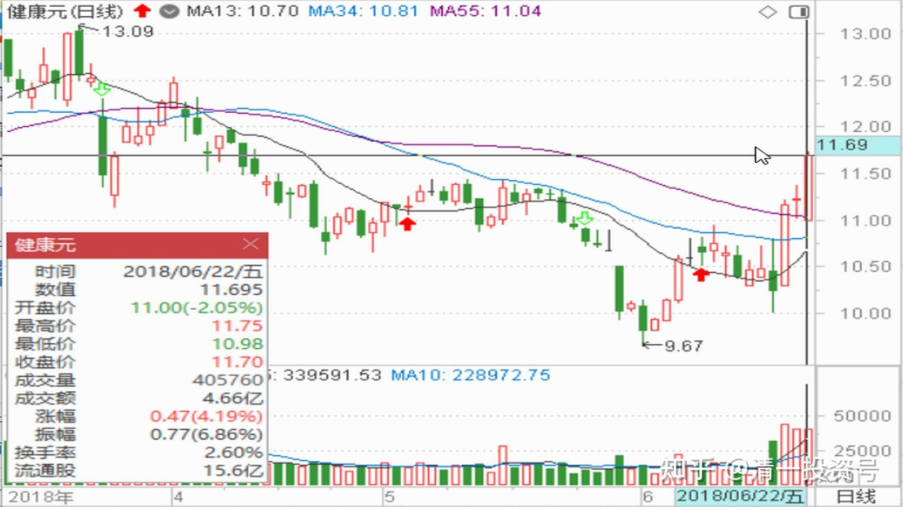
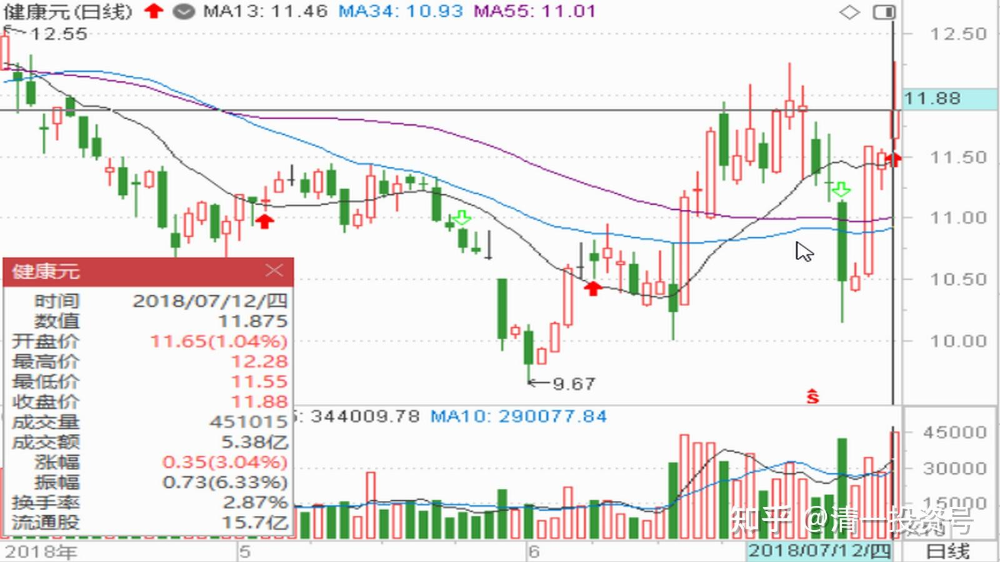
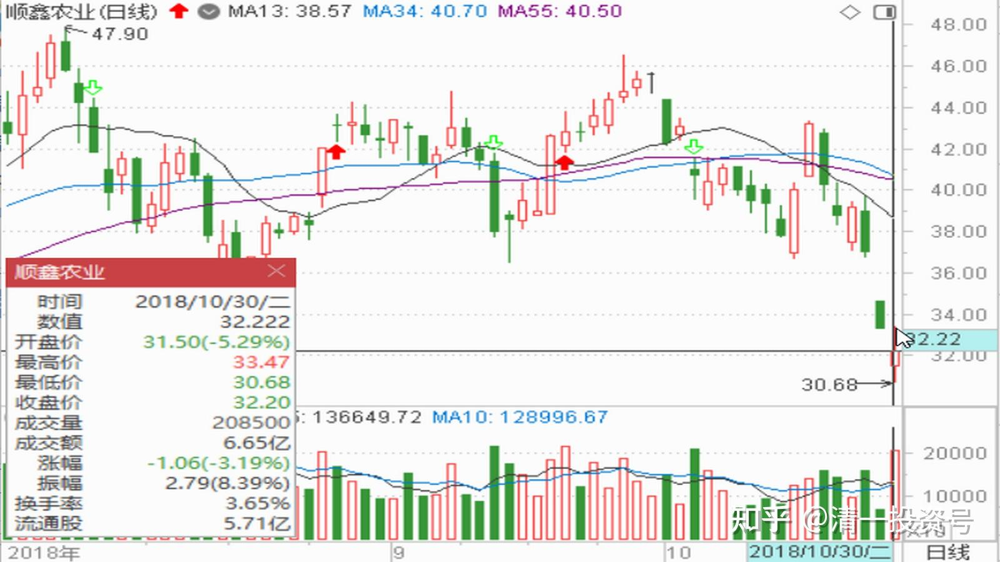
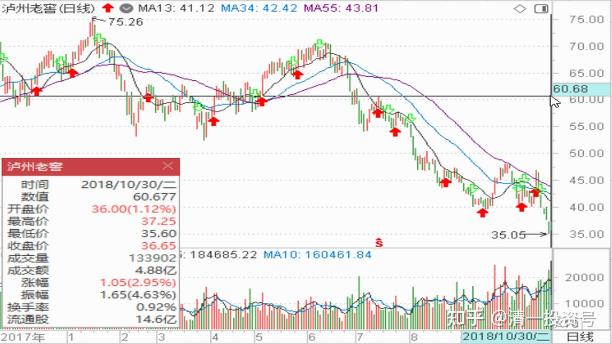

53篇.顺鑫农业记录五：中国炒股最重要的技术是保本

清一山长 2018年6月-11月

题记：清一山长2022年6月7日“大家可以参考顺鑫农业原来的走势，这就是“长庄股”的走法。我甚至有点怀疑，现在的**就是原来的顺鑫主力。当年这个顺鑫的老庄，也是恶心人恶心得要死的。把很多老手都熬垮了。很多人刚涨一点点就走了。我是中途进场的顺鑫，都被这庄傻熬了两年。幸亏后来守住了，结果还算不错。主升浪的钱赚到了，吃了鱼头和鱼身子。虽然最后的晚宴中，似乎鱼尾巴最好吃，但我们就别指望吃全了。”

**顺鑫记录五《中国炒股最重要的技术是保本》**

**一、中国炒股最重要的技术是保本**

51nxp 2018-06-23@清一山长@明达野老

《笑傲江湖盼天青》[https://xueqiu.com/9203843585/109301398](http://link.zhihu.com/?target=https%3A//xueqiu.com/9203843585/109301398)

清一山长2018-06-22 13:01:41 （评论上文）

我刚打赏了这篇帖子 ￥100.00，也推荐给你。

**理性淡定的投资者，是这个扭曲市场的优质平衡器**[献花花]**。希望有更多的人学会理性投资。**

进入这个市场，就必须按照市场的规则来做。不学习、思考，注定是赔钱的。你又何必为这些不思考的盲目之人操心呢？都像你只买好的资产，健康元恐怕你就买不到好价格了，顺鑫也不可能在19元左右让我们慢慢地买个够。**所以，非理性的市场，也提供了非理性的机会。守住利润，守住本金，是最重要的生存之道。中国炒股最重要的技术是保本，散户却以为是盈利。**

51nxp:回复@清一山长:

山长，你才是我的偶像，真的谢谢你！不是这个打赏，而是6月1日健康元暴跌到9.67元，你知道我买的公司很难有超过大盘跌幅的，心情非常沮丧时，是你和明达先后发了两个长贴，给我肯定，给我鼓励。让我在行情低迷时有勇气正视自己的投资。虽然我坚信自己的投资最终必有正回报，然而你的肯定让我有知己之感，让我开心。$健康元(SH600380)$

清一山长2018-06-22 18:39:02 回复@51nxp:

谢谢你的吉言吉语。你真会给人找成就感，好像我说一句话真帮了你稳定持有健康元一样 [笑]。我相信当时就算我忽悠你，让你卖掉健康元去买珠江，你肯定一点也不会动心的。你对于自己的持股，有非凡的信心和耐心，不会跌了十几个点就受不了的。当然，有朋友加入一起守，寒风中会更加温暖一点。我看健康元，基本面没问题之后，它突然打下来反而让我意识到主力很着急，正在挖坑。所以我也跟着急，才快速买入的，正好抄了健康元一个底。成本似乎比你还低不到一元（总持仓成本10.22元），只能说明我更幸运，机会更好，遇上了它挖坑这样的机会，手上还正好有钱（卖顺鑫的）。我喜欢**在主力挖坑的时候进场，只要看清楚了基本面，其实不太担心**。就像是珠江现在的坑也够深的，但我真不担心这点，反而暗暗高兴：有人比我更急[大笑]。**急跌其实不怕，怕的是阴跌**。

其实，我才是真的受益于你的分享。健康元如果不是你的原因，我不会关注它的，更不会如此快速地买入。现在就上涨了，正常情况我是来不及研究这么快的，也不会这么短时间重仓的。等我慢慢磨叽，先弄观察仓，等花上一两个月去研究基本面，这个股早飞了，所以我才是真的应该感谢你！[献花花] 。下次欢迎你到我新买的度假村玩，你可以想象这个庄园有相当大比例的资产，是因为你的缘故而赚到的（顺鑫和健康元的盈利）。2019年春节，和家人一起来玩几天吧！我在清迈欢迎你！

清一山长2018-07-13 12:30:38

$健康元(SH600380)$ 上周健康元跌停的那天，我示范了买买买模式。不知道你们跟了吗？[大笑]。昨天晚上有朋友告诉我，顺鑫涨停了，他清仓了，特别来感谢我。我告诉他卖出的资金，可以买入健康元。我认为是下一个顺鑫。我也计划这样操作。没想到今天直接涨了5%以上，我就有点下不去手了。目前持仓已经赚了24%。熊市还赚到钱了，真不容易。

**顺鑫我42元卖出了大部分，只留了几万股挂眼科。**本想换入11元多的健康元，但是今天看涨了，就等几天再说。反正我的健康元仓位也足够多了。现在留一些机动资金在手上，看什么股便宜就慢慢买,不急。看市场上便宜货真多。**今天执行卖出的原因，是顺鑫再涨一倍也不奇怪。但是我买的其他股，涨一倍看样子比顺鑫更容易[大笑]。**关键是有一些股还在10年来的低位，这些企业还每年都在赚钱的。所以现在显然是10年来最低估值，买入后不担心。顺鑫有一点点担心了，关键是赚够了，已经很满意了。

**二、耐心坐电梯的人，比做T的人收获更多**

清一山长2018-07-13 12:42:30

$健康元(SH600380)$ 从技术上说：健康元进入了前期高位的压力线一带，技术上显示应该“超买了，进入卖出位置”，主力也可以借机洗一波，制造“12-13元左右必跌回10元区”的“人造走势规律”。可是，炒股从来就不是炒历史，而是看未来的。我13元不愿意追涨了，可也不愿意卖股。我做好继续跌到10元的准备，反正我也刚从10元的坑里爬出来的人，怕什么[大笑] 。

**上周健康元三天内，从跌停走到涨停，成交却没有放大。这应该是一次可以计入炒股教科书的经典主力洗盘记录，大起大落，**各位的心情是否也跟随大起大落了？而且跌停到涨停的间隔时间之短，也算创纪录吧？**说明这个股已经收集筹码完毕，拉升在即。**不再是原来主力持仓不足，不断考验持股耐心，用各种磨叽手法磨出你的持仓。也许真的快突破了。**所以，我不急于卖出，大家也不别急。**多坐坐电梯，也没啥的。别想抓完所有的波段。**就像是顺鑫，耐心坐电梯的人，都比做T的人收获更多。**

51nxp:回复@清一山长:

这个主力可能偷偷上了雪球，又可能看了山长的贴，反正自从6月1日我们大讨论后，健康元就保持强势，最强的医药板块最牛的个股之一，另一个是通策医疗。

清一山长2018-07-13 22:24:16 回复@51nxp:

呵呵。**主力特别关注“民情”，大众心理的。雪球一定是他们关注的重点区域。**我们的讨论被他们看见很正常。所以，**说多了，我们就成了反向指标了。主力一定反着做的**[大笑]** 。这就是雪球大V话说多了就不灵了的原因。**我们幸亏不是大V，以后也少说一点，免得惹人嫌，还当反向指标。自己看懂了就行[俏皮]

**三、负成本持仓，高价卖出，大跌买回**

清一山长2018-10-30 10:22:25

$顺鑫农业(SZ000860)$ 跌这么惨呀？陪茅台下跌，你也陪得太忠诚了。茅台涨您也没跟多少呀？**还以为我原来在40元前后清掉的顺鑫，**被我卖飞了，再也回不来了，账面上只剩100股了[哭泣] [哭泣]。今天看居然又跌回来了，实在不忍心看它这么惨，今天首次开启买回操作吧！**31元下方大胆买入，等待套牢。**目前已经回收超过十万股了。每次一万股买入（连31元下方，都有人在不停地卖出？你们到底是什么价格买进的顺鑫？这么大方呀？真不可思议！）

独孤贱客:回复@清一山长:

怎么老得瑟成功的？江南集团割了吗？

清一山长2018-10-30 10:37:50 回复@独孤贱客:

我没割，你割吧[大笑]。我就喜欢看你这种“看别人赚钱就是不顺眼。又拿别人没脾气的样子”。你想看我笑话的，就好好等着看好了。我今天已经买进了十几万股顺鑫，你肯定希望明天还会跌停的，让我一天就丢个几十万。不过我不怕的，因为**我目前的持仓，居然还是负成本，就算跌到零元我还是赚的。跌了我继续买。**您生气，就去气个死吧！

清一山长2018-10-30 11:09:35

我卖出了顺鑫农业，想做一点T降低成本。31元以下买的货，一看超过32元了，就想做做短线，很漂亮的T。可是——我只能卖出100股[哭泣] [哭泣]。赶快试用融券卖出吧！可是融券的额度是零。可惜了，刚买十几万股，觉得有点买多了，想换点泸州老窖的，可惜不给换的机会[大笑]。就坚持持仓吧[加油]！

51nxp:回复@清一山长:

顺鑫和老窖这样的比价，我会选老窖。

清一山长2018-10-30 11:24:38 回复@51nxp:

基本同意这个估值[赞成]。我今天也买了36元的老窖，估值更低。也是以为被我卖飞了的好股（似乎我已经习惯了通过做差价来超越中国股市长持不动的收益率，“价值投机”更适合中国国情。）

买入顺鑫，是看中顺鑫的增长率，实在眼馋。有很明显的“成长”的空间，所以估值比老窖高一点，是可以接受的。主要还有恋旧情结，**原来高价卖出赚了钱，大跌了不买回来一点，于心不忍**[俏皮]。

**四、持有什么股票，不一定去用它**

51nxp:回复@清一山长:

我更关注它们的生意。顺鑫的二锅头我买过最高档的，650一个礼盒，瓶装的也买过一件（299每瓶），送人或请客还是不如老窖的1573。

清一山长2018-10-30 11:41:50 回复@51nxp:

你真有趣[献花花]。买企业就先爱上它的产品。我去年看过你买顺鑫白酒的帖子。你说为了坚持顺鑫的投资，了解顺鑫企业，不喝酒的你都开始去买酒来尝了 [笑]。顺鑫的高端酒，只是做形象的摆设，要拼这个价位作为主力部队的话，顺鑫股份就不敢买了，它不可能干过茅、五、泸的。1573是老窖的主力利润大户，两者产品定位是不一样的。

真不好意思，我没喝过老窖，也没有喝过顺鑫。茅台倒是尝过酒，但没买过股票 [哭泣]。我觉得：**持有什么股票，不一定去用它。别人喜欢就好。我可绝对不希望我会用上丽珠和健康元的产品**[大笑] 。

林雪芳:回复@清一山长:

山长原来的顺鑫只留了100股？

**清一山长2018-10-30 11:44:54 **回复@林雪芳:

原本还持有一点仓位的，但是由于股市不停的跌，顺鑫居然一直维持在40元以上，就是不跌。我一看别的股票估值更低，不怕踏空，我就赶快全部卖掉了。原来想卖掉换40元以上的老窖的，一股换一股，我觉得划算。但是后来老窖又涨了一些，就等到了今天[赚大了]

**五、低价敢买，不恋战，赚了就走**

清一山长2018-10-30 21：49：56

$顺鑫农业(SZ000860)$ 刚看了三季度的十大流通股东，原来的“庄家”，去年进入的私募“**大禾投资**”已经开始减仓了，把二季度买入的份额都减掉了。但主仓看来还在。也就是说大禾并不认为40元以上的价格就值得撤退。同时新加入的公募还买了一千多万股，香港的“外资”也在高位抢了一千多万股，看来港资也喜欢高价接盘。这些信息，正好应了我的话：**基金和专业机构投资人，并不一定是小散户的杀手，反而是有钱的“接盘侠”呢！**

极速奔跑王先生:回复@清一山长:

中国建筑、顺鑫农业，每一次进场点位都异常精准，价投水准让技术派汗颜[亏大了]

清一山长2018-10-31 19:47:33 回复@极速奔跑王先生:

不好意思。只是运气好而已。准备买套的，不想真赚了一笔。今天一天都在陪儿子去开私行服务，结果没看盘。晚上一看，居然赚了9.5%？弄得我都想明天就卖掉了——这次操作，可以创造“年化盈利率超1000%”的奇迹[大笑]。

建议大家别追涨，现在涨上去，恐怕还不到时候。如果抄底没有成功，等下次的机会吧！

小小辛巴：2018-10-29 11:20

[https://xueqiu.com/5964068708/115866670](http://link.zhihu.com/?target=https%3A//xueqiu.com/5964068708/115866670)

【跌停心安】$顺鑫农业(SZ000860)$ 跌停了，心也安了。今年顺鑫白酒营收百亿左右，净利增长100%，扣非净利增长超100%。习惯于逆白酒行业周期增长的唯一成长黑马，明后年只会更好，现在连190亿的总市值还不到，有什么担心的。想走的，已走的，一路好走，别再回这个伤心之地了。[大笑]

**清一山长2018-10-30 10:31:19**

辛巴是良心大V[很赞]。顺鑫跌这么惨的时候，出来说话，会挨骂的。但你还是坚持要出来说话，在悲惨的市场情绪下，鼓励顺鑫持股者的持有信心。的确，现在这个价格恐慌抛出，是很不明智的！

我今天宣布回顺鑫了，与大家一起坚守[加油]。已经在31元开启了重新买入模式。原因就是_**如果顺鑫的资深大腕们，在40元也不嫌贵的话。现在才30元左右，是更应该买入的，而不是卖出**（虽然我40元左右就卖出了，但一直感到有些遗憾，今天让我可以不再遗憾了）。我十几元持有的顺鑫，在30元的时候，是根本就不想卖出的，一股都不卖。现在重新回到这个价格，当然要再度买入了

清一山长 2018-11-01 09:56:21:

$顺鑫农业(SZ000860)$ 今天挂单卖出两天前买的顺鑫。34.99元的单子已成交。目前这个市道有点看不懂，不认为有持续上涨的条件。所以**不恋战，赚了就走。持有两天有超过13%以上的收益，我很满足了！小富即安。**

清一山长2018-11-01 10:42:33（评论上贴）

所有买进的十几万股已经全部成交，每次一两万股卖出，一直在忙，挂了很多单卖出。第一单是34.99元成交的，最高挂单的成交价是35.49元[赞成]。现在持仓只剩100股了，彻底安心了。两天前从31元就开始一路买进，最低买入的价格是30.70元。持仓两三天取得13-15%左右的回报，非常理想了，难得。希望顺鑫继续上涨，我错过不要紧，你们坚持的人就好好赚钱吧！我挂眼科，祝福大家多赚大赚！

刚才看了成交回报表，很多买单是100股，两百股成交的。显然是小散户。不知道这些人是干嘛的，手上没几个钱，还这么积极的参与抢盘。两天前很便宜的时候，干嘛不买？当然也有一口气就吃掉一万股的庄家。

（标题为编者所加）

参考链接：

[清一投资号：29篇.2021年评顺鑫](https://zhuanlan.zhihu.com/p/498221415)（整理文）

[清一投资号：44篇.顺鑫农业记录一：开始关注买入](https://zhuanlan.zhihu.com/p/539035593)（整理文）

[清一投资号：46篇.顺鑫农业记录二：最多输时间不输钱](https://zhuanlan.zhihu.com/p/539203562)（整理文）

[清一投资号：49篇.顺鑫农业记录三：买、卖、拿住股票的理由](https://zhuanlan.zhihu.com/p/543704521)（整理文）

[清一投资号：51篇.顺鑫农业记录四：主力还没有开始减仓](https://zhuanlan.zhihu.com/p/544147559)（整理文）

[清一投资号：58篇.顺鑫农业记录六：最靠谱的投资方法就是不炒股](https://zhuanlan.zhihu.com/p/545612289)（整理文）

[清一投资号：61篇.顺鑫农业记录七——机构坐庄三招：养、套、杀](https://zhuanlan.zhihu.com/p/556331421)（整理文）

[清一投资号：65篇.顺鑫农业记录八：基本面的估值修复和主力技术面的空间](https://zhuanlan.zhihu.com/p/560419930)（整理文）

