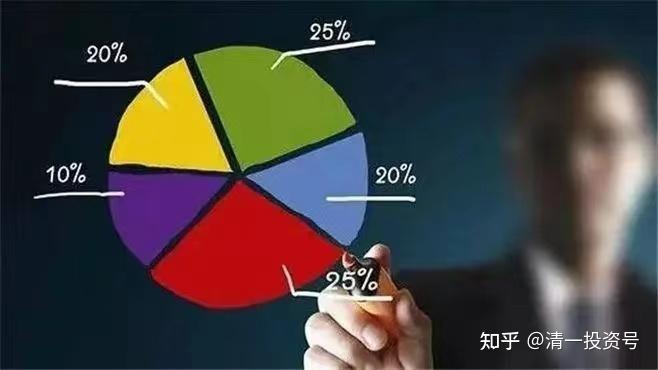

**

**

54篇.分散投资与防守投资策略——永远做好自己错了的准备

清一山长2017年6月13日～2019年1月1日

一、我的投资哲学：永远做好自己错了的准备

二、分散投资可以最大化避免黑天鹅

三、股市生存25年最重要的经验:投资之路，不是看某一年的大赚或者大亏，而是要比谁活得长

**一、我的投资哲学：永远做好自己错了的准备**

[东博老股民](http://link.zhihu.com/?target=https%3A//xueqiu.com/9528220473)[发布于2017-06-07 13:15](http://link.zhihu.com/?target=https%3A//xueqiu.com/9528220473/86912386)

《关于吉艾科技》

雪球链接：[https://xueqiu.com/9528220473/86912386](http://link.zhihu.com/?target=https%3A//xueqiu.com/9528220473/86912386)

清一山长2017-06-13 18:48评论上帖：

我跟我的学员推荐过东老。要他们不懂股票的话（大多数人都不懂），“无脑跟随东博老股民”等。或者买入郭广昌的投资旗舰公司无脑跟随。理由就是：我认为东老是一个有信用的，优秀的老股民，让他们选择“无脑跟随”，就是借用了东老20多年的中国金融上市场经验，是超级划算的。我自己做不到东老这样纯粹，我就不愿意公布我的账户给粉丝模仿。因为我的账户一旦成为示范账户，我操作中就会有顾虑，会有各种议论，我不愿意与噪音相处。

东老去年把兴业银行换艾吉科技，我自己倒是没有跟随（其实我一直只是参考东老的一些观点，我自己有自己的操作模式，比如这几年主要重仓中国建筑等，反复做了几次），虽然我很疑惑，但觉得东老此举会引起很多争论。但如果相信东老，就无脑跟随吧！后来，我看这股一路上升，而兴业死气沉沉，我觉得东老的粉丝一定很高兴，这一手做的漂亮。

好几个月都没看东老的文章了，今天一看，居然因为艾吉科技大跌（也让我意外至极），导致粉丝喷粪，真替东老冤枉：好心没好报。东老其实只要主账户买自己喜欢的股，试验账户示范稳定的股，就没人胡说和争议了。

我想告诉东老的粉丝们：东老分享自己的投资，你跟了，就要自己负责！你赚了钱来说一句“感谢东老”，更有甚之，连招呼都不打一个，觉得是自己有本事。你跟随东老，没赚钱，甚至高价追股，居然赔了钱，就来这里骂娘，活该你家就一世穷人德行，永远翻不了身！**穷人是因为心的匮乏，希望大家都有富足之心！**

清一山长2017-06-14 23:12:17再次评论上帖：

我与老股民投资风格的差异：

我也有可能会“投机”一下，买一些“风险股”，目前为止我“投机”的股比投资的收益更大，还没有遇到严重的损失。**不过，我的风格，无论投资和投机，都不喜欢只买一只股。我觉得这样有点像押宝。**所以我一直没有跟老股民的盘子，而是自己创建投资组合。似乎2014年以来，老股民的实验账户主要是全仓兴业，我却不断在招商、兴业、浦发、民生之间搬砖，谁低我买谁，2016年才被迫锁定在兴业上，但是仓位并不大，主要持有港股。目前的收益比兴业大多了。

**而且就算是2014-2015年主要投资银行股的时候，我也不是只看好一只。而是同时持有四家银行股。我对学员称为四大金刚。**所以，我的银行股投资收益，远远超过死抱有一只股涨跌都不放。我看涨了不少，就跑掉了。兴业原来2015年冲过20元的时候，我就跑光了，现在的都是后来跌到16元区域买进来的补仓。成本已经很低了。

对于老股民买艾吉科技，我今天才知道他居然买了260万股。这个投资总额要在4000万元左右了，算是重仓吧？我个人觉得太冒险了。不知道这是不是他的“全仓看好”。**对于我来说，最多拿10%的资本出来玩这种风险股。因为人算不如天算，万一我错了呢？24年的投资记录归零的话，就从此爬不起来了。**另外一个“93老股民”2015年爆仓的案例，我觉得我无论如何不能接受。**因此永远做好自己错了的准备。这就是我的投资哲学不同于老股民的地方。**我相信我对自己更没自信一些[笑]。

**二、分散投资可以最大化避免黑天鹅**

[云蒙](http://link.zhihu.com/?target=https%3A//xueqiu.com/3037882447)[发布于2018-09-03 09:19](http://link.zhihu.com/?target=https%3A//xueqiu.com/3037882447/113181368)

《银行那些事180903001——兴业银行中报点评》

雪球链接：[https://xueqiu.com/3037882447/113181368](http://link.zhihu.com/?target=https%3A//xueqiu.com/3037882447/113181368)

@[草帽路飞](http://link.zhihu.com/?target=https%3A//xueqiu.com/caomaolufei)2018-09-03 18:16@[云蒙](http://link.zhihu.com/?target=https%3A//xueqiu.com/3037882447)

[跪了]华融告诉我们黑天鹅无处不在。分散投资可以最大化避免黑天鹅，我相信三年后华融还是一条好汉。

云蒙2018-09-03 18:24回复草帽路飞:

王占峰太狠了，完全没有必要把华融搞成这样。

清一山长2018-09-03 21:59:09回复云蒙:

佩服云蒙公开认错的精神。相信我对此局面也有一些责任。我对信达、华融的看好和介绍，误导了云蒙夫妇，造成了如此巨大的损失。非常的抱歉。也对所有因为我看好信达和华融而导致损失的人表示真诚的歉意！虽然我也许比你们买的更多，一样遭受了损失[哭泣]。**我同意草帽路飞上面的观点：分散投资可以最大化避免黑天鹅。云蒙的习惯一直是集中投资，赢了账户会快速的增值，就像原来7年持有招商银行一样。输了也会对账户造成严重的影响。**

我将继续持有160万股华融，并计划有机会再补充一百万股。我们无法知晓很多投资的内幕，只能根据财报投资，只能相信财报的真实。**我们也必须允许一些投资的失误。人不是神，不能保障每笔投资都是对的。所以，永远要做好自己的投资选择有可能失败的准备。因此，唯一的办法就是分散一点标的和行业。我一般持有20-30只股。而且常常轮换，这样勉强熬过了25年的牛熊。**年初减了仓，后面又减了一次，这次的回撤也不太严重。但信达、华融因为一直看好，没有卖出，所以也深度套牢。我准备坚持下去。相信这两家公司不会垮。

@RobinAmos回复清一山长:

云蒙是九成仓，一千来万，加1.5杠杆，比你160万股多多了。

清一山长2018-09-04 12:14:21回复RobinAmos:

我的华融不太多，运气好罢了。主要是信达的持仓较多（因为原来市场在抢华融，我就捡了更便宜的信达），两个股的投入，也超过千万了。目前两股浮亏数百万[哭泣]。

不过，我是做生意出身的。**做生意，总有一些单子是亏损的。我能接受我的投资出现亏损，只要不是每单都亏就行了。**只是这两只股，已经让所有人都厌恶了，恐怕也到了可以买的时候了（当然，不排除国家的资管行业也会破产）。

**三、股市生存25年最重要的经验：投资之路，不是看某一年的大赚或者大亏，而是要比谁活得长**

[云蒙](http://link.zhihu.com/?target=https%3A//xueqiu.com/3037882447)[发布于2018-12-29 10:37](http://link.zhihu.com/?target=https%3A//xueqiu.com/3037882447/119057166)

雪球链接：[https://xueqiu.com/3037882447/119057166](http://link.zhihu.com/?target=https%3A//xueqiu.com/3037882447/119057166)

清一山长2019-01-01 15:19:53评论上帖：

**账面涨跌，只是金融市场的波动和噪音，不必过于在意**。**关键要通过一些失败的投资，看清自己的投资逻辑。赚钱不一定是我们的投资逻辑是正确的，可能只是因为运气更好罢了。如果不正常的赔钱，一定是自己做错了什么，需要修改自己的投资模式。**在心态上，我们可以为失去的200万心痛，也可以为留下的100万而庆幸！可以永远看到积极的一面。

**金融市场，最需要防范的就是黑天鹅，我们认为“不可能，不应该，市场怎么能这样估值”的事情，总会出现的。**如果连巴菲特都无法避免看错股票，我们看错的可能性就更多了。**所以，我们需要做的，并不是让自己成为不犯错误的股神（我认为这是不可能的），而是让自己的错误，不会遭受过大的打击，不会让自己站不起来。如果随时抱有“黑天鹅”的心态，就会对每一笔“我相信结果很好”的投资，都抱有“万一我错了怎么办”的“不自信”，所以我一定会分散投资，防止错误吞灭了我25年的成果。**

这种模式，会让我“失去”很多机会，比如明明看多3元的恒大，4元的融创，但收获并不很多，因为我没有全仓介入。2018年的顺鑫，我也没有全仓，否则2018年账面会很漂亮。**但是，也正因为我的分散，所以一些地雷的引爆，也不可能让我“伤重不起”。投资之路，不是看某一年的大赚或者大亏，而是要比谁活得长。这就是我股市生存25年最重要的经验。**短期大赚的人其实很多，一年十倍的人也不稀奇。但活得长的人很少，我希望是后者。**用巴菲特的话说，就是慢慢地变富。**

**一旦做好了安全措施，我们就不会为某些股票“就是该涨不涨”而叹息，也不会为自己的持仓安排而忧虑得睡不着觉。**2015年股灾，我持仓仅仅一天的“损失”，就超过千万。但因早已卸掉杠杆，照样睡得很好，因为一股也没少。我没觉得有啥不正常的。原来赚了钱，现在回撤一些也很正常。庆幸当时重仓的是银行股，所以股灾中最先恢复，而且跌势中用融资额度买进，赚了30%就走掉，不贪心想多赚。所以2015年的整体计算，不但与5000点的高位相比没损失，反而多赚了一些。但当年周围很多惊慌失措，乱操作的朋友，造成了永久的损失。甚至一些人失去了东山再起的机会。

云蒙是一个非常专注和认真，对自己的投资品“感情很深”的投资者。这是优点，可能也是缺点，所谓的祸福同源。原来七年对招商的专注和热情，收来了大赚的结果。2018年对民生和华融的专情，带来了亏损。

**所以，专注很好，相信自己的投资品也很好。但永远要敬畏市场，要随时防范市场的黑天鹅。巴菲特的不上杠杠，本质上就是无论是企业的黑天鹅还是市场的发疯，都无法击垮他。是防守的投资策略。**进取很好，但进取错了，也会遭遇难以预计的损失。我虽然用杠杆，但用的时候很小心，最怕被意外影响。一旦有风吹草动就赶快卸掉杠杠。

前瞻2019年，我并不乐观，我不想说“新年大家都多多赚钱”这种虚话。我目前依然拥有很多仓位，准备陪市场浮动。但我总觉得2019年，可能出现更多的黑天鹅。**所以，我也会留一些子弹，等待“大象出现的时候”才开枪射击。因为我无法预测市场，所以我要留下足够的安全通道。我在等待市场最悲观的时刻，也在等待“意外的惊喜”。**希望以我这些入市25年的“投资老马”的经验之谈，帮助到一些入市时间不长的朋友。如果你们不嫌弃我的老经验“过时”的话，就拿去不谢[笑]。

