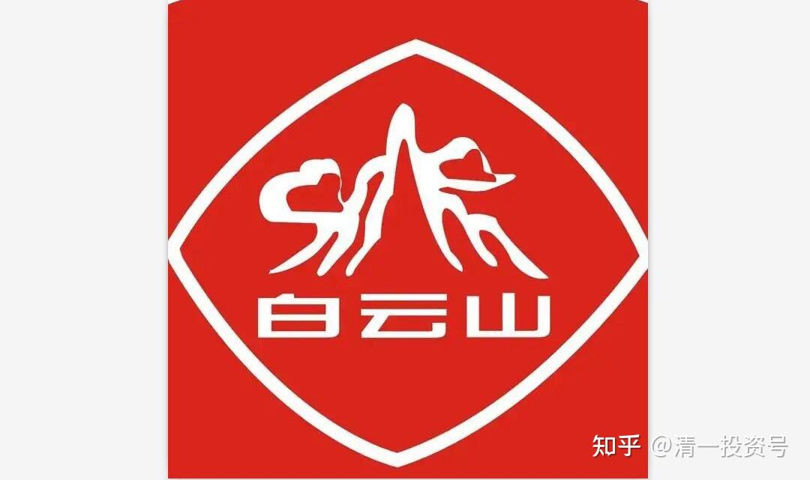
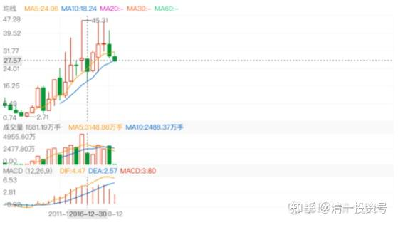
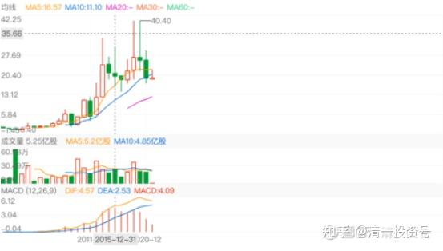
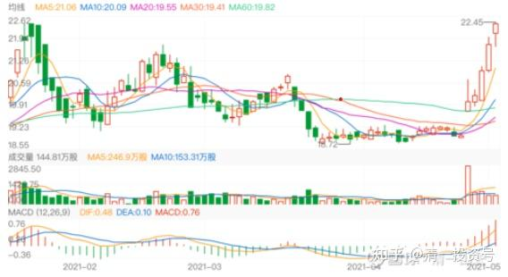

60篇.建仓买入白云山的逻辑

清一山长2021年1月5日～5月4日

[清一山长](http://link.zhihu.com/?target=https%3A//xueqiu.com/9310099567)[2021-01-05 17:31](http://link.zhihu.com/?target=https%3A//xueqiu.com/9310099567/167693385)

[$白云山(00874)$](http://link.zhihu.com/?target=http%3A//xueqiu.com/S/00874)今天居然涨了，真没劲。18元多刚开始买呢，才几十万股[吐血]。能不能慢点涨，我的啤酒还没卖完呢！你缓上个半年一年的再涨吧！拜托了！

[清一山长](http://link.zhihu.com/?target=https%3A//xueqiu.com/9310099567)[2021-02-05 15:56](http://link.zhihu.com/?target=https%3A//xueqiu.com/9310099567/171136869)

[$白云山(00874)$](http://link.zhihu.com/?target=http%3A//xueqiu.com/S/00874)今天买入了一些白云山，买入价19.34元。**买入原因，是股价处于8年来的低位。资金是7.98元卖掉了小部分中国宏桥腾出来的资金。这个股应该还会涨，目前已经是上市以来的次高位，仅次于五年来大涨的那一次了。这是我的长期持股。白云山买入后，计划也是长持股，计划持有五年。**

另外，还买了9.78元的中国建材。从技术形态来看，此股不如白云山靠谱，白云山的安全边际似乎更高一些。我原来5元价位买入过一批建材。不过，这个股由于这几年大额的资金减值计提已经完成，现金流非常高。有可能有爆发的题材，所以，现价还是追买一点吧！

[@xd173](http://link.zhihu.com/?target=http%3A//xueqiu.com/n/xd173)回复[清一山长](http://link.zhihu.com/?target=http%3A//xueqiu.com/n/%25E6%25B8%2585%25E4%25B8%2580%25E5%25B1%25B1%25E9%2595%25BF):

好几年了，山长还有宏桥[鼓掌]。

[清一山长](http://link.zhihu.com/?target=https%3A//xueqiu.com/9310099567)[2021-02-05 16:21](http://link.zhihu.com/?target=https%3A//xueqiu.com/9310099567/171140284)回复[@xd173](http://link.zhihu.com/?target=http%3A//xueqiu.com/n/xd173):

谁让中国宏桥一直不涨呢？去年还玩惨跌，我也只好不断加仓买回来。如果早涨了、大涨了，我早就卖光了。现在只卖掉了两层仓，离清仓还早呢！

[@柳随风77](http://link.zhihu.com/?target=http%3A//xueqiu.com/n/%25E6%259F%25B3%25E9%259A%258F%25E9%25A3%258E77)回复[清一山长](http://link.zhihu.com/?target=http%3A//xueqiu.com/n/%25E6%25B8%2585%25E4%25B8%2580%25E5%25B1%25B1%25E9%2595%25BF):

老哥，为啥我觉得宏桥还是你的第一大重仓股呢[赚大了]。

[清一山长](http://link.zhihu.com/?target=https%3A//xueqiu.com/9310099567)[2021-02-05 17:15](http://link.zhihu.com/?target=https%3A//xueqiu.com/9310099567/171146783)回复[@柳随风77](http://link.zhihu.com/?target=http%3A//xueqiu.com/n/%25E6%259F%25B3%25E9%259A%258F%25E9%25A3%258E77):

现在还是港股第一重仓。但继续涨的话，以后就不是了。现在港股很多趴地下的股票，正好换股。

@岱宗如何回复[清一山长](http://link.zhihu.com/?target=https%3A//xueqiu.com/9310099567)：

清一山长，是不是今天你没减仓中国宏桥了，所以继续涨，不要减那么急，让他再飞一下。跟随山长投资中国宏桥五年的人敬上。

[清一山长](http://link.zhihu.com/?target=https%3A//xueqiu.com/9310099567)2021-02-09 16:27:15回复@岱宗如何：

谢谢关心，中国宏桥今天没减仓。**应该不会清仓的，这是我的长持股，慢慢转一点买低价的股罢了。**

[清一山长](http://link.zhihu.com/?target=https%3A//xueqiu.com/9310099567)[2021-02-05 17:24](http://link.zhihu.com/?target=https%3A//xueqiu.com/9310099567/171147714)

[$白云山(SH600332)$](http://link.zhihu.com/?target=http%3A//xueqiu.com/S/SH600332)有人说，白云山应该买A股，我真看不出A股跟港股比有啥优势[为什么]？

**K线的年线，港股是8年来的底部位置。A股是8年来的中位数，三年来的底部。**

**涨幅上，港股现价19元多，最高跌幅一倍了。恢复前高，就有21元的收益。**

**A股恢复前高，差价只有18元。可是，保险垫（估值安全性），港股每股低了10元。以更低的估值，拿住可能有更高的涨幅，何必拿A股？**

以下是港股和A股的年线图（前复权），各位看看谁的技术形态更好？港股跟随的涨幅难道真不如A股吗？

*（白云山600332年K线）*

*（白云山00874年K线）*

[清一山长](http://link.zhihu.com/?target=https%3A//xueqiu.com/9310099567)[2021-02-08 14:15](http://link.zhihu.com/?target=https%3A//xueqiu.com/9310099567/171332776)

[$绿地香港(00337)$](http://link.zhihu.com/?target=http%3A//xueqiu.com/S/00337)今天卖出了十几万股中国宏桥，挂单价8.66元。看样子这个价格卖得还不错，算是今天的高价范围了。目前持仓已经不足4M了，成本正在接近零元。

**今天的资金回来后，继续找新的标的准备买入。原来一直在买的中国建材和白云山都涨了一些，有些犹豫要不要追涨。**绿地香港看起来很诱人，价格很低，股息率都超过10%了，市盈率才两三倍。但研究了一下，放弃了绿地。原因是:这家公司连员工的工资都不发，销售的奖金都要扣，一家连自己的员工都刻薄克扣的企业，我认为恐怕不靠谱，诚信恐怕有问题。他家的报表是真是假不清楚，别为了贪图10%的股息，丢了90%的本金。（华夏的股息原来也很高，说没就没了）。我看地产股，还是中国海外宏洋更靠谱一些！

当代置业价格也不错，9毛多了一些。但我担忧的是：他的贷款利息太高了,不敢过于重仓。

最后1.17元，买入了一些花样年控股，PE才一倍多一点[捂脸]。剩下的钱，继续等待别的机会。

[清一山长](http://link.zhihu.com/?target=https%3A//xueqiu.com/9310099567)[2021-05-04 16:26](http://link.zhihu.com/?target=https%3A//xueqiu.com/9310099567/178946472)

[$白云山(00874)$](http://link.zhihu.com/?target=http%3A//xueqiu.com/S/00874)拔地而起这么久了，都没看到[滴汗]，今天才看到。港股，不好判断，不过，反正也不想走。

*（白云山2021日K线）*

