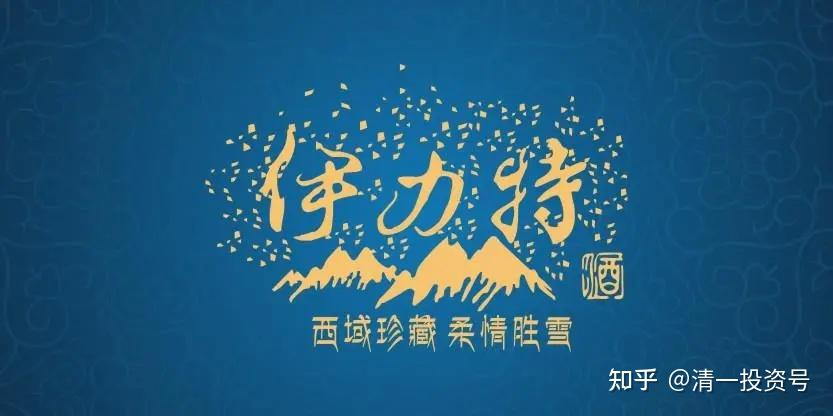
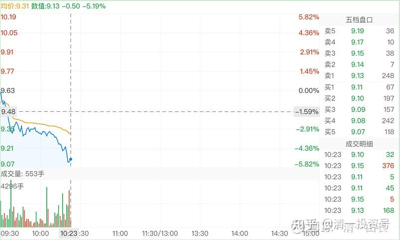
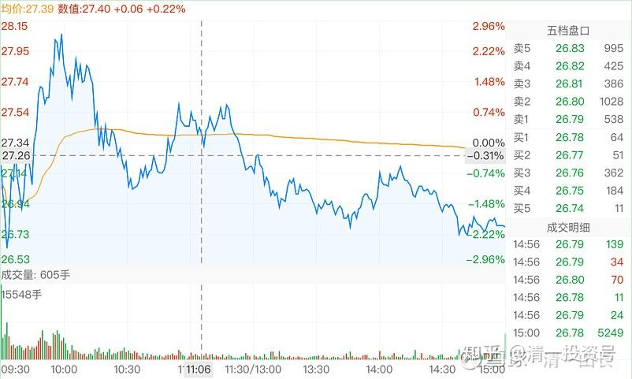
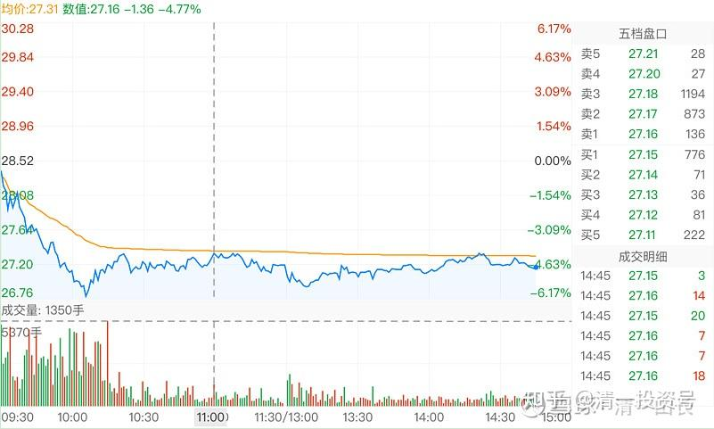
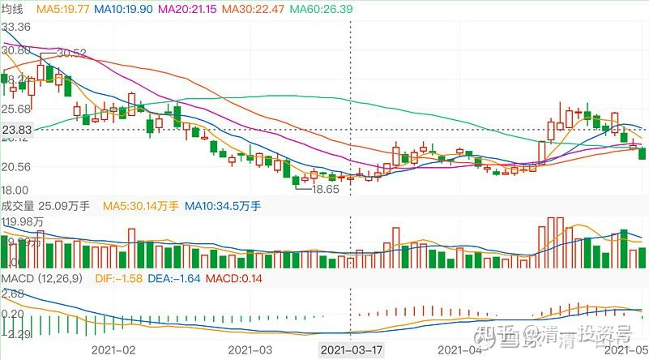
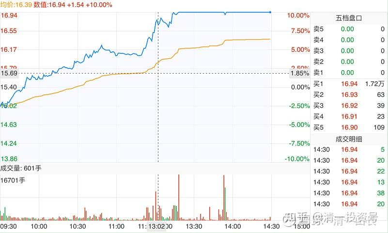

64篇.白酒系列（二）伊力特——“新疆茅台”（下）

清一山长2021年4月～2021年7月

**1.涨了抢买是贪婪**

[清一山长](http://link.zhihu.com/?target=https%3A//xueqiu.com/9310099567)2021-04-28 12:02

[$伊力特(SH600197)$](http://link.zhihu.com/?target=http%3A//xueqiu.com/S/SH600197)刚有人私信给我，说：准备搞价值投资，买伊力特长持。问我意见如何？今天涨停价，来价值投资？这人好虚伪！

我直接拉黑了他！

不是买[伊力特](http://link.zhihu.com/?target=https%3A//xueqiu.com/S/SH600197%3Ffrom%3Dstatus_stock_match)不是价值投资，不是伊力特不会继续涨。我拿伊力特，就是准备长持的，除非伊力特连拉涨停赶我走。我买入价值投资，卖出价值投机，这就是我的投资模式。

但是，这人在[伊力特](http://link.zhihu.com/?target=https%3A//xueqiu.com/S/SH600197%3Ffrom%3Dstatus_stock_match)前段时间，才十几元的时候，你不来价值投资，快30的时候，涨停了，你居然跑来玩“价值投资”,还问我？这种人太虚伪了！我就毫不客气的拉黑了！

BTW：别私信找我问事，很容易被我拉黑的。公开问，问错了，不拉黑，只是不理你。公开的不讲文明礼貌，会拉黑。因为你心黑。

私信找我问私事，要我荐股等等，都拉黑。因为你心理阴暗！说话做事见不得人的样子。除非真的有重要理由。

瞧我这样子，根本不适合做庄。我应该高位大声呼唤：快来呀！看我都赚了大钱了。很多大V都这德行。低的时候不说，因为股票跌了就招人骂。涨了拼命说，因为都叫好。我都怀疑是不是被庄家买了号[俏皮]。

我低位说票，高位不吹票。这是道德。万华一路上涨，我吭都不吭的，就怕谁傻乎乎地跑去“跟学我”！我40元买好不？

跟你们实话实说：每天都有人私信找我**“谈合作”**。我知道是啥人找我，都有目的。我可以轻松卖粉丝赚一笔钱。我相信东博老股民当年就是这样干的——卖粉丝。我不相信全仓[吉艾科技](http://link.zhihu.com/?target=https%3A//xueqiu.com/S/SZ300309%3Ffrom%3Dstatus_stock_match)是他的大脑理性判断的结果，我认为是有人给他钱，让他“全仓”的。

但我理解他卖粉丝的行为。这些粉丝，也没给他什么好处。还老嘲笑他、消费他。他多年一路带过来，帮粉丝赚的钱很多了。庄家拿出上千万，买他吹票，他收一点回扣，可以理解。

我不卖粉丝，是因为我尊重你们，我认为你们不是一个号几百元就可以买走的。你们起码值上万元。有些人还值十几万、几百万的。但我相信没人愿意出上万一个号来买你们的。所以，有人给我千万，我也不卖你们的。

我认为：你们粉我，是你们占我的便宜，不是我占了你们的便宜。因为你们分享了我几十年的人生和股市的成功经验。但有人以为你粉我了，我就欠了你一样。你就应该对我指指点点，胡乱要我做这做那的。这种人，没基本的做人素质，不尊人，不尊自己，就早点滚蛋。我不缺粉丝！

不满意我，就取关。取关我，不是我的损失，是你的损失。不信十年后来看！[大笑]

十年前，取关我的人，活得怎样了？黑我的人，你们好吗？我只知道：真正粉我，学我的人，这十年，已经完全改写了人生。而取关我的人，再度关注进来，已经一身的伤疤！可怜，非要去找抽。[俏皮]

[清一山长](http://link.zhihu.com/?target=https%3A//xueqiu.com/9310099567)2021-05-07 14:42

回头来看，知道这张帖子，是救人帖子了吧？我当天的话是很不好听，骂他骗子，27元多涨停价来抢伊力特。这都是为人好。你听话照做，不吃亏。不至于被收割。第二天高开过了29元多，我当天上午就忙于卖货。你如果不服气，非要跟我对着干，今天跌到24元多了。你每股就要亏5元。你有多少钱来亏的？

好话不好听，骗人的最好听。我如果因为持有伊力特，就吹票伊力特，不知道要害死多少人。

不知道伊力特还跌不跌，再跌，我敢补仓的。涨了敢卖，舍得让利，跌了才有钱补仓。这是股市的铁律，不要贪婪！涨了抢买，就是贪婪，不套你套谁？

**2.主力出货，卖出**

[清一山长](http://link.zhihu.com/?target=https%3A//xueqiu.com/9310099567)2021-04-29 10:52

[$惠泉啤酒(SH600573)$](http://link.zhihu.com/?target=http%3A//xueqiu.com/S/SH600573)报告伙计们：920的防线，已经证明不安全！！刚才派兵92万（元），驻守920防线，结果主力炮火太猛，一单就全打掉了。这股资金部队已经全军覆灭[哭泣]。主力现在似乎只要钱，不要股[捂脸]。可能家里被人绑架了，要拿钱续命。不惜亏本杀跌。由于敌军势力太强，现预备队已经撤退到901防线驻守，看能否守住，这次派的兵力少一些，只派了45万兵丁前往驻守901。希望这些官兵尽量挡住敌军，守住关隘。尽量不被敌人破9，深入惠泉腹地捣乱！现在我还有1.7M的惠泉子民没有逃离战乱呢！好在这些子民已经练成了金刚不坏之体，都已经是负成本了，不担心被打残废。今天使用的现军（资金），是昨天下午3点钟才临时招募的一批雇佣兵。是主力大方地给出了9.62的价码，让我换回的一点宝贵备用军（现金）。今天全压上守卫920防线，结果全军阵亡。只留下一堆股权证书给我。不过似乎我的买和卖，都是主力对敲的。他干嘛白送我钱？白送我股票？真想不通！伊力特今天28.91元也趁机卖出一些。手上还有部队可调用，看何处需要，再调兵去救急[大笑]，先观察敌情再做决定。

[清一山长](http://link.zhihu.com/?target=https%3A//xueqiu.com/9310099567)2021-[04-30 15:09](http://link.zhihu.com/?target=https%3A//xueqiu.com/9310099567/178776491)

[$伊力特(SH600197)$](http://link.zhihu.com/?target=http%3A//xueqiu.com/S/SH600197)剧透一下：这是出货的图形[捂脸]

[清一山长](http://link.zhihu.com/?target=https%3A//xueqiu.com/9310099567)2021-05-07 15:12

这天的帖子，我几乎明说了：伊力特在出货。各位看这一天跟帖的发言，都不信。现在看如何？大跌到24元区域了。所以——**每个人只能赚你看得懂的钱**，一点也没错[捂脸]。我说不说，其实不起作用的。该赔钱的照样要赔！

[清一山长](http://link.zhihu.com/?target=https%3A//xueqiu.com/9310099567)2021-05-24 14:01

[$伊力特(SH600197)$](http://link.zhihu.com/?target=http%3A//xueqiu.com/S/SH600197)真不喜欢你出来秀，到处勾引人[捂脸]。今天先放过你。以后敢继续再出来，乱秀身材勾引人，我们就离婚[哭泣]。

[清一山长](http://link.zhihu.com/?target=https%3A//xueqiu.com/9310099567)[2021-07-09 15:04](http://link.zhihu.com/?target=https%3A//xueqiu.com/9310099567/189938355)

[$伊力特(SH600197)$](http://link.zhihu.com/?target=http%3A//xueqiu.com/S/SH600197)36元卖了一些，33元卖光了。现在考虑接回来一些。虽然还是嫌贵，不过——如果手上没有白酒的话还炒股，怕说起来都丢人。就当原来没抛吧？套牢就假装长期投资了[鼓鼓掌]。

今天不买，看图上，下跌的时候绿油油一片，成交很大，说明多方力量消耗较大。探底之后的回升很小，说明看多力量已经衰竭了。现在是空头优势阶段。不如继续观察一段时间，也许可以捡到更便宜的货。捡不到也没关系，不是还有啤酒可以喝吗？[鼓鼓掌]

**3.伊力特VS老白干**

[清一山长](http://link.zhihu.com/?target=https%3A//xueqiu.com/9310099567)2021-05-06 20:07

[$老白干酒(SH600559)$](http://link.zhihu.com/?target=http%3A//xueqiu.com/S/SH600559)上一轮伊力特和老白干都卖光了。回落的时候，伊力特因为先跌破20，我就开始拣货回来了。老白干因为没有跌破20，就没有买。这一轮，伊力特居然快速涨上去，高位也减了一点。现在两只股都在回调。如果回补仓位的话，似乎老白干的价位更理想一些。只是——低位的成交好高呀！为啥这样子？继续看看再说。跌破20肯定拣货。没跌破就还是继续看算了。

[小乔w](http://link.zhihu.com/?target=http%3A//xueqiu.com/n/%25C3%25A5%25C2%25B0%25C2%258F%25C3%25A4%25C2%25B9%25C2%2594w)回复[清一山长](http://link.zhihu.com/?target=http%3A//xueqiu.com/n/%25C3%25A6%25C2%25B8%25C2%2585%25C3%25A4%25C2%25B8%25C2%2580%25C3%25A5%25C2%25B1%25C2%25B1%25C3%25A9%25C2%2595%25C2%25BF):

老白干比伊力特有潜力。

[清一山长](http://link.zhihu.com/?target=https%3A//xueqiu.com/9310099567)[2021-07-10 08:41](http://link.zhihu.com/?target=https%3A//xueqiu.com/9310099567/190002164)回复[小乔w](http://link.zhihu.com/?target=http%3A//xueqiu.com/n/%25C3%25A5%25C2%25B0%25C2%258F%25C3%25A4%25C2%25B9%25C2%2594w):

此言谬也。光从K线走势来说，伊力特此轮高点，高于上一轮该高点。最近几个月，上一轮高点35元多，30元上方我也卖光了。回调到18元前后，我再度上车的。这一轮高点冲到了37元左右，我36元开卖，33元卖光，现在回调到27元。会不会再跌，天知道。

老白干，上一轮我是持仓数量上最多的白酒股，比伊力特多，因为它跌破10元，害得我不得不多买一点。上一轮高点36.6元。但冲过30多元，我就一路卖，全跑光了。回调到18元的这一轮的抄底，我居然就没买老白干。全买伊力特了。因为，我认为两个股价格一样，都跌破20，但这个价格显然买伊力特更划算。所以——的确这一轮她冲更高。而最近一轮的反弹，老白干只冲到32就止步了，远远不如伊力特的弹性好。现在已经跌到24了，下跌也明显弱于伊力特。如果按这个走势，一波比一波低，难说老白干调整的低点，也会超过上一轮的低点，这样就悲剧了。

您居然说老白干比伊力特有潜力。不知依据是什么。没依据，说什么都是拍脑袋。

**股市上，拍脑袋是很危险的。可能会让你的兵（资金）分分钟战死的**[鼓鼓掌]。

不过，两个股价差在3元左右的时候，买老白干或者伊力特，我认为都差不多。还是可以的。

这就是技术分析。我在惠泉啤酒上，没有说出来的技术分析方式。因为啤酒太娘了，不明显。但我也用一样的方式来做，所以全都赚到了钱。轮动效率更高。

参考链接：

[59篇.白酒系列（一）老白干——人弃我取，人取我予](https://zhuanlan.zhihu.com/p/554525861)（整理文）

[62篇.白酒系列（二）伊力特——“新疆茅台”（上）](https://zhuanlan.zhihu.com/p/557187863)（整理文）

[66篇.白酒系列（三）五粮液（上）——好企业还要好价格](https://zhuanlan.zhihu.com/p/561226672)（整理文）

[67篇.白酒系列（三）五粮液（下）——回顾投资过程](https://zhuanlan.zhihu.com/p/563522180)（整理文）

[69篇.白酒系列（四）泸州老窖——切换与比价](https://zhuanlan.zhihu.com/p/565816330)（整理文）

[71篇.白酒系列（五）迎驾贡酒——优秀的分红率](https://zhuanlan.zhihu.com/p/568112813)（整理文）

