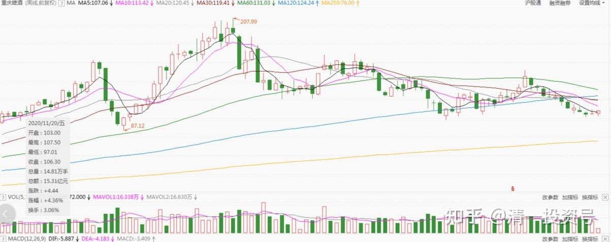
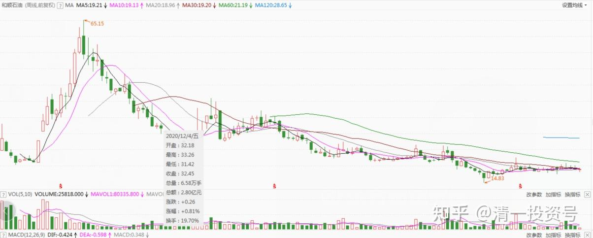

70篇.庄家做庄失败的案例

清一山长2017年3月29日～2020年12月9日

[量化小王子()](http://link.zhihu.com/?target=https%3A//xueqiu.com/9842090891)[2017-03-27 16:44](http://link.zhihu.com/?target=https%3A//xueqiu.com/9842090891/83131933)

证监会公布-标准坐庄对倒手法，欣赏欣赏-建议结合k线：**[https://xueqiu.com/9842090891/83131933?page=5](http://link.zhihu.com/?target=https%3A//xueqiu.com/9842090891/83131933%3Fpage%3D5)**

[清一山长](http://link.zhihu.com/?target=https%3A//xueqiu.com/9310099567/124533350)2017-03-29 14:54评论上帖:

**很精彩的坐庄手法，值得好好看看。原来，真的一个人就可以坐庄了。庄家不是我们想象的这么复杂的。只是觉得：坐庄真划不来。花了接近半年的时间，数十亿的买卖金额，但每股的买卖差价，只赚到了0.11元，却被罚款2亿元。去年2月到6月，正好是大势向上走的时间，有这笔资金，随便买个好股不动，也赚了。**

[清一山长](http://link.zhihu.com/?target=https%3A//xueqiu.com/9310099567/124533350)2020-11-24 17:04

(重庆啤酒 周K线)

[$重庆啤酒(SH600132)$](http://link.zhihu.com/?target=http%3A//xueqiu.com/S/SH600132)**终于成为坐庄超级超级成功的妖股了。可怜的庄家！你们看重庆啤酒的庄家，觉得庄家好牛。我看这个庄家，觉得庄家好惨，都出不来，只好继续拉。反正大多数筹码都在自己手上，就使劲拉吧！爱说多少价就是多少价。有人跟就跟，没人跟自己玩。孤独的舞者。**

你看8月17日、8月18日，连续两个涨停，股价都没回头。9月14日，再涨停，冲98元的高价。但成交只有2.55亿，换手率0.43，连惠泉这样盘子只有它二十五分之一的小股的成交都不如。之后，无论股价是否拉高还是跌低，成交再也无法放大。**庄家可怜，被自己玩到天上去了，下都下不来。只有某天崩盘，资金链断了，才会狂跌一气吧？45倍市净率的啤酒？真开眼界，比白酒更狂热的啤酒。超级“啤茅”——[重庆啤酒](http://link.zhihu.com/?target=https%3A//xueqiu.com/S/SH600132%3Ffrom%3Dstatus_stock_match)[很赞]。**

2016～2017年，才十几元的股，现在一百多元，实际的业绩比珠江好不到哪去，真的价值何在？这是主力的价值！就怕业绩变差，就玩完了。**这主力，不会走群众路线。聪明的庄家，是不断给群众喂食，来来回回的。这种一路涨上去的，孤独到连朋友都没有的庄，叫独食庄，也叫苦庄。**

**[惠泉啤酒](http://link.zhihu.com/?target=https%3A//xueqiu.com/S/SH600573%3Ffrom%3Dstatus_stock_match)的庄，才是真庄、好庄。总让人给机会上车的庄、分享庄，不吃独食！赞一个！**

[清一山长](http://link.zhihu.com/?target=https%3A//xueqiu.com/9310099567/124533350)2020-12-09 21:25

(和顺石油 周K线)

[$和顺石油(SH603353)$](http://link.zhihu.com/?target=http%3A//xueqiu.com/S/SH603353)**还真是的，这个股，傻庄自己套住了自己**[大笑][大笑][大笑]。

不知道是不是某个有钱的土豪来做的庄。我一看图，就知道6月份主力把筹码都收走了，然后再也没机会派发出去。后来我去看股东人数，果然：4月份还有三万七千多人的，6月底就只剩9000多人。这庄，直接就解放了三万多人，这些散户，一去就不回头。而且现在跌了也不回头，现在只剩5000多人了,主力拿着筹码愁死了。换钱换不出来，根本就没人买，每天对倒吸引一点跟风盘（我才不相信主力每天能卖掉几千万的股票呢）。直到现在都是没有人接盘的样子，主力自拉自唱，把自己套在山顶了。现在慢慢走下来，手中的大把筹码，我看根本就派不出来。主力亏定了。

**说实话，坐庄是个技术活，不是光有钱就行了。买股容易，卖股难。要让人愿意接盘，动多少脑子？花多少功夫？别以为坐庄就能赚钱。很多牛人，唐建新之流的，就是坐庄做垮的。当年要是没坐庄，拿了钱老实投资买茅台、五粮液，现在哪有林园的故事讲？**

惠泉我只敢买200多万股，为啥？不是没钱，是没胆。真买多了，买入了燕京的股数，我真成庄了，自己把自己套里面了。就这200多万股，想出货都不容易，要等大机会。如果我拿个两千多万股，就傻眼了，自己都不知道怎么玩。所以，虽然我知道惠泉股性更活，还真不敢重仓，就怕当上“主力”就完了。

**坐庄赚一点钱，必须很耐心、很用心。要不断送钱给跟进的散户，给好处、给甜头，才有人不断跟进玩。要上上下下不停地折腾股价，才赚一点差价钱。没瞧见惠泉的主力，就是不断折腾送钱散财吗？如果他直接一把就拉上去了，起码我就丢掉筹码再也不玩了。**不可能9元还去买的。我9元多买，还不是因为他10元买了我的[俏皮]。

所以，**这个和顺石油的庄，真心不懂事、不懂分享。只管自己直接拉上去，真不是个聪明庄。一个独食庄，把自己吃进去了，以后就只能做第一大股东控股公司做实业算了。**

**看公司业绩也不好，分红1%都不到。庄家心里惨惨的，大叫：各位散户，救救我，我是庄！求求你们，快来呀**[大笑]！

[清一山长](http://link.zhihu.com/?target=https%3A//xueqiu.com/9310099567)[2020-12-09 21:38](http://link.zhihu.com/?target=https%3A//xueqiu.com/9310099567/165359516)

[$江苏银行(SH600919)$](http://link.zhihu.com/?target=http%3A//xueqiu.com/S/SH600919)[$和顺石油(SH603353)$](http://link.zhihu.com/?target=http%3A//xueqiu.com/S/SH603353)

这两只股，都是股东户数一直在减少的股。可以说，股东户数减少，就是有主力大户在吸筹的表现。这两只股的不同，是江苏银行不断下跌，说明散户在低价割肉走掉，庄家收获了廉价的筹码，集中度在提高，所以未来升的可能性更大。和顺石油相反，是涨的过程中股东户数减少，证明庄没有拉到人入伙，散户高价逃掉了。所以，江苏银行属于主力低点进驻，未来涨升是大概率。另外一个是主力被套，走势不知道（它爱拉的话，拉到天上都可以；爱跌的话，如果资金链断了，跌到地下都正常）。很多股神就是拉升后找不到人接盘，最后资金链断裂自然死亡的。**失败的庄，比成功的庄更多**。20多年来，我见多了这种故事。所以，庄不是必胜的，小散们其实跟庄相比有优势（我原来在财富课上讲过散户与庄家的几大优势，利用好了就赢，你用错了就输！）

（标题为编者所加）

参考链接：

[清一投资号：66篇.顺鑫农业记录七——机构坐庄三招：养、套、杀](https://zhuanlan.zhihu.com/p/556331421)（整理文）

[清一投资号：清一山长雪球文章](https://www.zhihu.com/column/c_1472930431733170176)

**

**
