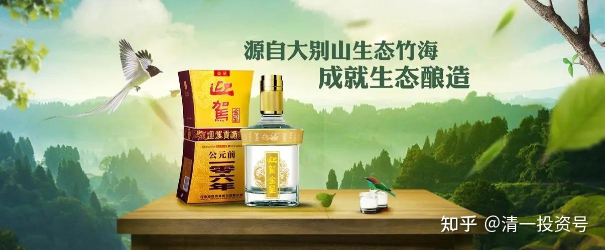
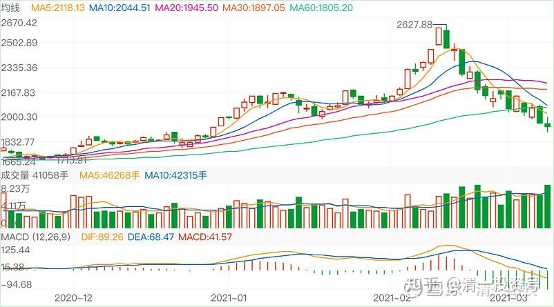
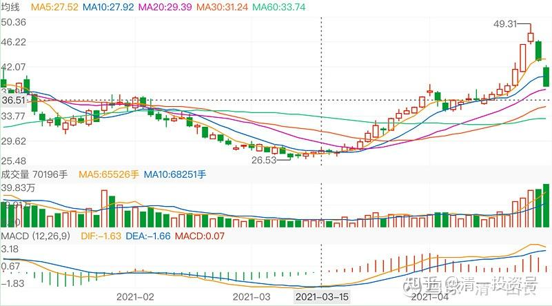
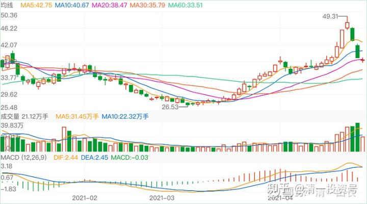

71篇.白酒系列（五）迎驾贡酒——优秀的分红率

清一山长 2019年9月～2021年4月

**1.买入原因：分红率最高的白酒股**

清一山长2019-09-27 15:07

$酒鬼酒(SZ000799)$酒鬼酒是我今年很失败的投资品种，原因是：虽然买入的时点，以及价格都很好，16-17元每股就买入了，而且一直没卖。失败的原因是买入数量太少，还不到10万股。迎驾贡酒17元多也在不断买入，买入了50万股，原因是它是白酒股分红率最高的股。酒鬼酒因为过往业绩不佳，就不敢多拿，有点赌一把“内参”走红的心态才买的。但是，以百万股为单位买入的燕京，却创造了多年新低。给人的感觉，就是买白酒比啤酒要靠谱一些[哭泣][哭泣]。要不就是今年的运气没有去年好了[捂脸]

[水深火热2018](http://link.zhihu.com/?target=http%3A//xueqiu.com/n/%25E6%25B0%25B4%25E6%25B7%25B1%25E7%2581%25AB%25E7%2583%25AD2018)回复[清一山长](http://link.zhihu.com/?target=http%3A//xueqiu.com/n/%25E6%25B8%2585%25E4%25B8%2580%25E5%25B1%25B1%25E9%2595%25BF):

酒鬼酒目标多少啊？

清一山长2019-09-27 15:21:46回复[水深火热2018](http://link.zhihu.com/?target=http%3A//xueqiu.com/n/%25E6%25B0%25B4%25E6%25B7%25B1%25E7%2581%25AB%25E7%2583%25AD2018):

我跟你们不一样，知道自己没本事去决定股票应该以多少价钱交易。我定的[酒鬼酒](http://link.zhihu.com/?target=https%3A//xueqiu.com/S/SZ000799%3Ffrom%3Dstatus_stock_match)目标，就是：假如还跌破17元，我就继续多买一些。高于现价，可能会随时卖[大笑]。万一缺钱。我就卖掉土豪股，去买乞丐股。

清一山长2020-02-04 10:32

$中国建筑(SH601668)$中建涨了？很好，中建就是稳。从昨天来看，就不愿意跌，所以我首先补它。其他继续观望。今天继续买进珠江啤酒，6.11元，比昨天跌停价格补更划算（我可没本事去跟跌停板拼俏皮。我将最多补仓到不超过我去年三季度公开的持仓位（也就是我不多买，只是补充高价卖掉的部分）。迎驾贡酒也买入了，价格是16.02元。原因：我原来是17元多，快18元时候买的，22元多卖出了一多半。现在重新补回来，目前持仓成本11.046元。

**2.卖出原因：疫情影响喝酒场景**

清一山长2020-02-20 15:16

$迎驾贡酒(SH603198)$春节后大跌日，我差不多买了10万股迎驾酒，就因为它跌得多，我在最低15.6元，最高16元买的货。而我正好前期22元卖掉了相当仓位，就算补仓回来了。没想到大盘居然这么快就涨回来了，这么大的疫情尚未解除，国内就在传牛市来了。实在不敢相信。既然如此，我就小富即安，把前期收的十万股先卖掉，卖出价17.82～17.86元。这一会下跌，每股白白赚了两元，已经很满意了。目前持仓成本8.146元，小仓位，只有五位数。

[知而行dyp](http://link.zhihu.com/?target=http%3A//xueqiu.com/n/%25E7%259F%25A5%25E8%2580%258C%25E8%25A1%258Cdyp)回复[清一山长](http://link.zhihu.com/?target=http%3A//xueqiu.com/n/%25E6%25B8%2585%25E4%25B8%2580%25E5%25B1%25B1%25E9%2595%25BF):

感恩山长明示，卖掉一个小赚的股，正想换迎驾那，既然您出了，那就等您下次出手再说[笑]

清一山长2020-02-20 15:31:20回复[知而行dyp](http://link.zhihu.com/?target=http%3A//xueqiu.com/n/%25E7%259F%25A5%25E8%2580%258C%25E8%25A1%258Cdyp):

别用我当指标。我是反向指标。操作不一定是对的，可能还要涨的。我也没卖光，还有五位数的持仓呢！

清一山长2020-02-28 12:05

$迎驾贡酒(SH603198)$我的迎驾贡酒，在前天就卖光了。也不多，就50万股。买的原因，是这个酒分红最高。卖的原因，是认为疫情之后，恐怕喝酒的人会很少（缺乏喝酒的场景了）。在中国人情社会受到重大破坏的时候，未来卖酒恐怕会很难。当然，中国人总要喝酒的，以后跌惨了，也许可以买一点进来。（虽然这样想，可是我手上还是有很多没有卖出去的酒，特别是啤酒[哭泣]）

[清一山长](http://link.zhihu.com/?target=https%3A//xueqiu.com/9310099567)2020-[05-11 14:24](http://link.zhihu.com/?target=https%3A//xueqiu.com/9310099567/149021726)

转载：【迎驾贡酒存隐忧：营收增速乏力现金流趋缓！库存暴增12%】

[https://xueqiu.com/S/SH603198/148940603](http://link.zhihu.com/?target=https%3A//xueqiu.com/S/SH603198/148940603)

认真看完此文，我认为此文的意思，就是这个股万一再跌的话，就可以买点了[大笑]。

**3.示范“躺赚”**

[清一山长](http://link.zhihu.com/?target=https%3A//xueqiu.com/9310099567)2020-11-30 12:35:32

专栏文章：【[示范课——财富的奥秘！你真的知道这些奥秘吗？](https://zhuanlan.zhihu.com/p/551964514)】

[https://zhuanlan.zhihu.com/p/551964514](https://zhuanlan.zhihu.com/p/551964514)

（以下为节选）

这是【清一商学院】毕业的20多岁的学生，在给示范班讲【财富的奥秘】[网页链接](http://link.zhihu.com/?target=https%3A//www.bilibili.com/video/BV1nD4y1X7nY/)。

他不是学堂的专职教师，只是来客串一下老师。他的职业，是“个人资本管理人”。他现在为自己的家族，管理几千万的资本。他的持仓中，[万华化学](http://link.zhihu.com/?target=https%3A//xueqiu.com/S/SH600309%3Ffrom%3Dstatus_stock_match)，还有[迎驾贡酒](http://link.zhihu.com/?target=https%3A//xueqiu.com/S/SH603198%3Ffrom%3Dstatus_stock_match)占了较大比例。账户稳定获利中，比不少基金的收益率更好。比如，迎驾贡酒他是十几元买进的，是当时分红率最高的酒股。因为我教的是“躺赚”。他没啥事干，就兼职做做教师。因为他基本上不需要做什么，只需要偶尔调整一下股份。他买的这些股，都是每年分红很稳定的，收到分红，再买入一些股票，就行了。

清一山长2020-12-27

专栏文章【跨年演讲：亿万富翁的思维模式与人生顶层设计】

[https://zhuanlan.zhihu.com/p/464260540](https://zhuanlan.zhihu.com/p/464260540)

[天天健身83](http://link.zhihu.com/?target=http%3A//xueqiu.com/n/%25E5%25A4%25A9%25E5%25A4%25A9%25E5%2581%25A5%25E8%25BA%25AB83)回复[清一山长](http://link.zhihu.com/?target=http%3A//xueqiu.com/n/%25E6%25B8%2585%25E4%25B8%2580%25E5%25B1%25B1%25E9%2595%25BF):

老师，您儿子重仓万华和白酒，他收益率应该比你高，而且不用天天看盘，轻轻松松就把钱赚了，这么年轻就投资悟道，确实厉害，还是您教育好。

清一山长2020-12-28 09:27:13回复[天天健身83](http://link.zhihu.com/?target=http%3A//xueqiu.com/n/%25E5%25A4%25A9%25E5%25A4%25A9%25E5%2581%25A5%25E8%25BA%25AB83):

是的，他今年的收益率比我高。我教他把股息率和绩优结合。他买的白酒是[迎驾贡酒](http://link.zhihu.com/?target=https%3A//xueqiu.com/S/SH603198%3Ffrom%3Dstatus_stock_match)。一年多以前十几元进入，选它是因为股息率最高的白酒股。我也买了，只是仓位不重，没超过百万股。前段时间利润已经超过一倍，他想卖出了，我就教他：35元以上就可以逐步卖出，然后拿钱来买[中国建筑](http://link.zhihu.com/?target=https%3A//xueqiu.com/S/SH601668%3Ffrom%3Dstatus_stock_match)死守。他很少看盘，操作更少，我的投机方式不教商学院学生。让他们用最笨的方式投资。其实，我示范的珠江啤酒、[惠泉啤酒](http://link.zhihu.com/?target=https%3A//xueqiu.com/S/SH600573%3Ffrom%3Dstatus_stock_match)的投资，估计大多数人只能看吧？能够跟上的人都不多，更别说复制到其他股票上“举一反三”了。因为**这种投机的底层思维，你们还没学会，光看表面，是假的。**

就像杨露禅偷师学艺练太极，只能骗骗你们，写小说玩的。**真太极就算练给你看，你拿录像机录下来都没用的，就是学不会。没有学到太极的底层逻辑，你怎么练都是错的**。所以，卧虎藏龙说的要学的武当功夫，**要点是“心法”，这种心法，必须要师父“心传”，徒弟“心受”，悟性要高，特别要敬师，否则根本学不会。**我的武道馆，主要教这种“内家心法”，似乎中国其他师傅都不知道，最近一年多，一个功夫比我好的老武师，我俩的徒弟中，一起练拳的徒弟，最近双方PK实战，结果惨败给我的徒弟，甚至他的男徒弟，跟我教的女生几乎打了平手。他觉得太丢人了。我认为是他没有教内家心法的原因。懂了内家心法，练出来后，外家不是对手的。

**真正的财富课程，教的也是“财富心法”。**不是啥技术面，基本面。而是**对财富运作的底层逻辑的解析。**想知道是什么？[我儿子（明瑞）在B站示范课明师荟](http://link.zhihu.com/?target=https%3A//www.bilibili.com/video/BV1nD4y1X7nY/)里面，讲了一堂财富课，就是“财富心法课”。如果你们觉得他讲的有道理，可以听听。你们就知道我的商学院，到底教什么东西了。他讲的就是原来商学院上课的时候，我教给他们的内容，后来自己消化整理的结果，算是透露了商学院的课程秘密了[俏皮]。

**[【示范班今日明师荟#12】明瑞老师：“揭秘财富本质”](http://link.zhihu.com/?target=https%3A//www.bilibili.com/video/BV1nD4y1X7nY/)**

[https://www.bilibili.com/video/BV1nD4y1X7nY/](http://link.zhihu.com/?target=https%3A//www.bilibili.com/video/BV1nD4y1X7nY/)

**4.见识“传说中的跌停出货”**

清一山长2021-03-09 23:33:47

[$贵州茅台(SH600519)$](http://link.zhihu.com/?target=http%3A//xueqiu.com/S/SH600519)茅台跌得急了一点，特别是昨天。怎么有点控制不住的样子？2000多元的时候，我判断会跌到1800一线才止跌。难道这么快就要下试1800一线的支撑力吗？可怜这些2600元追买茅台的大神们。一手就要亏6-7万元。[捂脸]。今天成交161亿。有护盘痕迹。

白酒有些已经慢慢跌到价值区了，可以考虑重新建一点仓位了，安全的股。我前期卖掉的[迎驾贡酒](http://link.zhihu.com/?target=https%3A//xueqiu.com/S/SH603198%3Ffrom%3Dstatus_stock_match)、老白干等，还得再等一等。还是等我买入后，再分享吧！继续跌，就可以开始用啤酒换白酒了。原来一直是白酒换啤酒，证明换得不错。啤酒不跌了。

清一山长2021-04-26 20:59

$迎驾贡酒(SH603198)$传说中的跌停出货，总算见识到了，厉害！手段卓越。不过，我早就走掉了，无缘经历现在这种精彩时刻。留个纪念吧！

[fuweisong](http://link.zhihu.com/?target=http%3A//xueqiu.com/n/fuweisong)回复[清一山长](http://link.zhihu.com/?target=http%3A//xueqiu.com/n/%25E6%25B8%2585%25E4%25B8%2580%25E5%25B1%25B1%25E9%2595%25BF):

跌停了，散户卖不出去，谁在接盘呢，搞不懂。

清一山长2021-04-26 23:20:27回复[fuweisong](http://link.zhihu.com/?target=http%3A//xueqiu.com/n/fuweisong):

真是傻帽一个。散户卖什么？有啥卖的？货都在主力手里呢！这些散户在抢反弹，着急买呢！不然咋叫出货？[大笑]

[清一山长](http://link.zhihu.com/?target=https%3A//xueqiu.com/9310099567)2021-04-27 15:17

[$迎驾贡酒(SH603198)$](http://link.zhihu.com/?target=http%3A//xueqiu.com/S/SH603198)

一鼓作气，再而衰，三而竭。

今天是“而竭”。空方力量差不多已经用完了，以后是修整的时间了。双方估计都无心恋战。

参考链接：

[59篇.白酒系列（一）老白干——人弃我取，人取我予](https://zhuanlan.zhihu.com/p/554525861)（整理文）

[62篇.白酒系列（二）伊力特——“新疆茅台”（上）](https://zhuanlan.zhihu.com/p/557187863)（整理文）

[64篇.白酒系列（二）伊力特——“新疆茅台”（下）](https://zhuanlan.zhihu.com/p/558774189)（整理文）

[66篇.白酒系列（三）五粮液（上）——好企业还要好价格](https://zhuanlan.zhihu.com/p/561226672)（整理文）

[67篇.白酒系列（三）五粮液（下）——回顾投资过程](https://zhuanlan.zhihu.com/p/563522180)（整理文）

[69篇.白酒系列（四）泸州老窖——切换与比价](https://zhuanlan.zhihu.com/p/565816330)（整理文）

[72篇.白酒系列（六）酒鬼酒、金徽酒](https://zhuanlan.zhihu.com/p/572004181)

