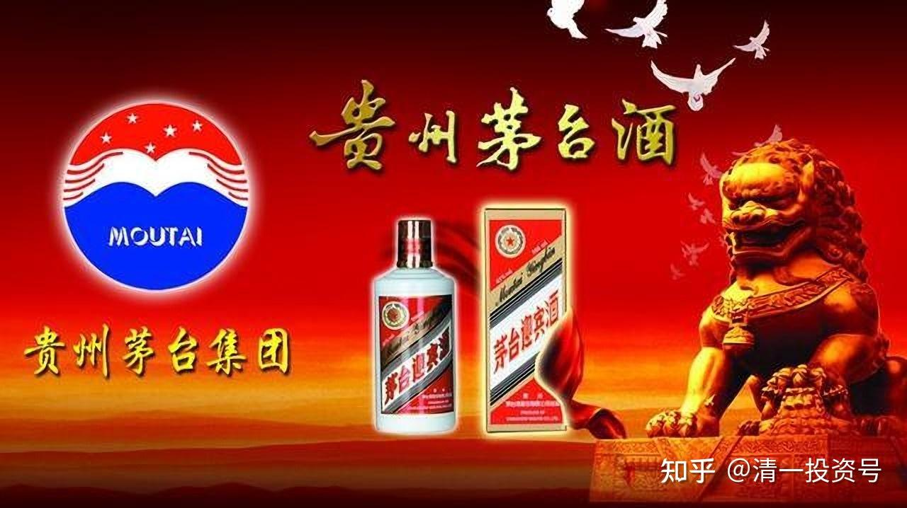

74篇.白酒系列（七）贵州茅台（上）——通过茅台看投资逻辑

清一山长 2017年5月-2021年5月

**1.基本常识：买入低估的股票**

[清一山长](http://link.zhihu.com/?target=https%3A//xueqiu.com/9310099567)2017-05-22 08:48

评论文章：高处看海【邀非完全进化君浅酌茅台】

[https://xueqiu.com/4532094386/85870212](http://link.zhihu.com/?target=https%3A//xueqiu.com/4532094386/85870212)

高先生的一系列的质疑很好，很有力量。学会质疑“专家”，是学会独立思考的关键步骤。

**当股票上涨之后，总有一些人会出来，找一些理由，说明它为何上涨，以及还应该继续涨的理由。**不然似乎就侮辱了他们的智商。

**下跌过程也一样，当茅台下跌到120元的时候，还是总有一些聪明人，出来告诉大家：茅台要破一百。**（我相信今天唱多快伍佰元茅台的但斌但总，如果2015年，居然以180元价格就卖掉了茅台，但没有在120元补回，就是因为他认为要破百。否则这是一个多么好的操作机会，证明自己“灵活价值投资”的机会呀！比死扛的董宝珍要强多了[大笑]。）

巴菲特说：能够预测未来股价的人是巫师。

我们不预测未来，我们只按照基本常识去做：**买入低估的股票，卖出已经实现价值，甚至高出内在价值的股票。**

当然，由于市场的疯狂，以及大众的跟随趋势的特质，会让我们的上述操作显得很愚蠢。**因为我们买入后，惯性的下跌趋势，会让我们“被套”；我们卖出后，惯性的上涨趋势，也会让我们“踏空”。**但是，这个世界，总得有一些“傻人”来做傻事吧？总得让一些“聪明人”，有机会来证明他们的聪明吧？

[杯酒人生](http://link.zhihu.com/?target=https%3A//xueqiu.com/9262059293)[2020-07-14 14:58](http://link.zhihu.com/?target=https%3A//xueqiu.com/9262059293/153963398)

有一次在深圳跟[任俊杰](http://link.zhihu.com/?target=http%3A//xueqiu.com/n/%25C3%25A6%25C2%2588%25C2%2591%25C3%25A6%25C2%2598%25C2%25AF%25C3%25A4)喝酒，有朋友问任总，是何种力量驱使你能够拿[贵州茅台](http://link.zhihu.com/?target=https%3A//xueqiu.com/S/SH600519%3Ffrom%3Dstatus_stock_match)17年的时间而中途不放弃？任总讲了一段，我觉得非常精辟。

他说，股票投资有三种风险，一是选错股票风险，二是系统性风险，三是波动性风险。

从时间纬度拉长看，股票价格最终会反映其价值。对于短期的波动风险和不确定的系统风险，只有坚持长期持股，才会熨平两者的风险。

而长期持股最重要的风险，就是选错股票。如果在错误的方向上选择坚持，那将是投资中最大的风险。

[清一山长](http://link.zhihu.com/?target=https%3A//xueqiu.com/9310099567)2020-[07-16 15:17](http://link.zhihu.com/?target=https%3A//xueqiu.com/9310099567/154212079)

这一句【**最重要的风险，就是选错股票**】。差不多大多数人，都会理解为：拿茅台，就算是价格拿错了，但股票是绝对错不了。所以，肯定是正确的炒股选择。

这就是今天，虽然茅台大跌7.9%，但资金涌入了169亿来接盘的原因吧？这些资金天天看茅台上涨，已经涨得他们等不及上车了。感谢今天茅台终于给了机会入手[俏皮]

不过，任俊杰可不傻，他已经提前走了。虽然走后茅台又涨了不少。

换了是我拿茅台，还真的拿不住。我恐怕早就走了，所以我很傻。

不过我猜最聪明的人，是昨天跑掉的人吧？[大笑]

[赵先生R](http://link.zhihu.com/?target=http%3A//xueqiu.com/n/%25C3%25A8%25C2%25B5%25C2%25B5%25C3%25A5%25C2%2585%25C2%2588%25C3%25A7%25C2%2594%25C2%259FR)回复[清一山长](http://link.zhihu.com/?target=http%3A//xueqiu.com/n/%25C3%25A6%25C2%25B8%25C2%2585%25C3%25A4%25C2%25B8%25C2%2580%25C3%25A5%25C2%25B1%25C2%25B1%25C3%25A9%25C2%2595%25C2%25BF):

14套房子，你竟然说买房不是最好的投资……[怒了][怒了]

[清一山长](http://link.zhihu.com/?target=https%3A//xueqiu.com/9310099567)[2021-06-26 14:59](http://link.zhihu.com/?target=https%3A//xueqiu.com/9310099567/187316084)回复[赵先生R](http://link.zhihu.com/?target=http%3A//xueqiu.com/n/%25C3%25A8%25C2%25B5%25C2%25B5%25C3%25A5%25C2%2585%25C2%2588%25C3%25A7%25C2%2594%25C2%259FR):

**茅台一两百元的时候，肯定是最好的投资。买的越多，越聪明。但你不能说两三千元的茅台，还是最好的投资吧？这时候买得越多，我看越傻。**

我买房子的时候，才千元级别。现在去买万元级别，甚至十万元级别的房子，难道是明智的选择吗？

问题是：我认为买十万元一平方的房子，就跟买两三千元一瓶的茅台酒一样。都很傻，都是超级泡沫，就算是会涨，也不如买2～3千元的茅台股票更符合逻辑。

**脱离现实背景来谈各种买卖，不谈价格高低，只谈商品本身，这就是为收割智商税提供的最佳人选了**[大笑]。

**2.有更好的选择**

[清一山长](http://link.zhihu.com/?target=https%3A//xueqiu.com/9310099567)[2021-08-20 10:32](http://link.zhihu.com/?target=https%3A//xueqiu.com/9310099567/194871917)

[$贵州茅台(SH600519)$](http://link.zhihu.com/?target=http%3A//xueqiu.com/S/SH600519)今天开盘，贵州茅台创近期新低，1555元。观察这种赛道股的成功操作走势，倒是一件很有意思的事情，可以理解到主力进出的手法。去年3月份的时候，茅台股票拉高到价格1000元左右，股东人数10万人。这个价格很敏感，一般人都认为是千元大顶，很多人不追高的，所以股东户数一直没有上升，代表没有人认同这个价格，没人积极买入。但没人买，我就继续涨，持有的人继续卖。到了6月份，就只剩98000人了——跟燕京啤酒现在的股东数差不多。股价涨到了1400元，估计一些人跑掉了。但显然接盘不积极，外面的新散户，接盘动作不明显，主要是自嗨的。9月份，股价继续涨到1700元了，散户受到了一些激励，开始入场了，股东人数增加了15%。之后拉涨到2000元以上，散户受到了更大的热情激励，更多的人入场了。股东人数开始持续增长。觉得手上没茅台都不好意思炒股了。去年四季度，冲高2627元，这一次，降低了4%的人数，一些聪明人跑路了。但随着后期在2000元以上的平台整理，新买入的人数越来越多，最近一期的股东人数达到了14.6万人。从盘面上看，就是茅台涨到1000的时候，市场不认账，散户不入场。不入场咋办？就只能继续拉高，拉高后散户就开始积极入场了。冲高示范，让大家看茅台是可以涨到2627元的。然后，慢慢地调整回1600元，看上去真便宜，跌了1000元，快抄底吧！下跌过程中，涌进来的散户更多。其实完全可以理解：原来的主力，要想兑现利润，不可能2600元卖给散户的，除了自己发新基金，自己拉高价格做示范。其实精明的散户和机构都不会买这个价格。真想出货，是出不了的。所以原来涨上去，股东户数没有增加。但高位盘整，一堆人大呼小叫的吹票，效果还是不错的，散户积极入场。有人说话很搞笑：用40年的眼光来看，1600元和2600元也差不多。无所谓。不过，小散们每股亏上500～1000元，我看这种心理按摩有点不好落实。

一句话：**涨得太高的股票，下跌中就去买入股票，是最傻的。因为你会不断被套住。**茅台从2627元下跌以来，这一千元套住了多少人？你自己算算。目前的白酒，有些股票已经透支了未来数年的业绩，来做漂亮今年的报表，就是为了协助出货。这些票，未来是需要回避的。就算想买白酒，也买没有炒得太过分的，涨了10倍、20倍的。现在的茅台股价，相对原来的低点，依然涨了10倍多，这个价格，需要很长的时间来消化。你们赔不起这个时间的。

我相信未来的茅台还会有新高，但什么时候就不知道了，肯定不会是今年、明年。你想等40年的，肯定有机会创新高。你可以慢慢等它涨去。不过：**现在的市场，有这么多低位的股票，甚至是十年低位的股票，你们干嘛不去买入这些低位的好股，非要买高价的“好股”呢？好企业、好行业，大家也要考虑：好价格！价格高了，什么都不好了。**

[清醒的精神病人](http://link.zhihu.com/?target=http%3A//xueqiu.com/n/%25E6%25B8%2585%25E9%2586%2592%25E7%259A%2584%25E7%25B2%25BE%25E7%25A5%259E%25E7%2597%2585%25E4%25BA%25BA)回复[清一山长](http://link.zhihu.com/?target=http%3A//xueqiu.com/n/%25E6%25B8%2585%25E4%25B8%2580%25E5%25B1%25B1%25E9%2595%25BF):

不能用涨几倍去判断。

[清一山长](http://link.zhihu.com/?target=https%3A//xueqiu.com/9310099567)2019-05-23 21:16回复[清醒的精神病人](http://link.zhihu.com/?target=http%3A//xueqiu.com/n/%25E6%25B8%2585%25E9%2586%2592%25E7%259A%2584%25E7%25B2%25BE%25E7%25A5%259E%25E7%2597%2585%25E4%25BA%25BA)

比如茅台这样的？涨几倍还是可以买？可惜我就是不买。因为——**我相信茅台涨到2000元的时候，我能够找到的其他股，也能翻倍，甚至涨得更多。何必买茅台。**

我会后悔100多元没买茅台，但不会后悔900元没买茅台。即使茅台股价是2000元。对不起茅粉了，我就这么傻的[大笑]。

**3.阴阳两面一起看**

[等着蚂蚁变大象](http://link.zhihu.com/?target=http%3A//xueqiu.com/n/%25C3%25A7%25C2%25AD%25C2%2589%25C3%25A7%25C2%259D%25C2%2580%25C3%25A8%25C2%259A%25C2%2582%25C3%25A8%25C2%259A%25C2%2581%25C3%25A5%25C2%258F%25C2%2598%25C3%25A5%25C2%25A4%25C2%25A7%25C3%25A8%25C2%25B1%25C2%25A1)回复[清一山长](http://link.zhihu.com/?target=http%3A//xueqiu.com/n/%25C3%25A6%25C2%25B8%25C2%2585%25C3%25A4%25C2%25B8%25C2%2580%25C3%25A5%25C2%25B1%25C2%25B1%25C3%25A9%25C2%2595%25C2%25BF):

这里有个常识性问题呀！股市是虚拟经济，市值都是虚的，涨跌是里面的人都赚或都赔的，并不存在赚了谁的钱或把钱赔给谁了，长期看，茅台从2001年底96亿市值，3.3亿净利润，到现在2.5万亿市值，400多亿净利润，难道历史上操作茅台的人赔钱总额在2.5万亿？从短期看，一股不成交只有买盘也可以涨停，一股不成交只有卖盘也可以跌停，那么涨停市值的增加并没引起有人必然损失，跌停也没有人必然有赚的，所以股市不是零和游戏，有赚的必然有赔的，他只是一个虚拟经济体，是因情绪变化而膨胀或缩小的。网上很多人对股市的本质是有误解的。

[清一山长](http://link.zhihu.com/?target=https%3A//xueqiu.com/9310099567)[2021-05-15 10:41](http://link.zhihu.com/?target=https%3A//xueqiu.com/9310099567/179913650)回复[等着蚂蚁变大象](http://link.zhihu.com/?target=http%3A//xueqiu.com/n/%25C3%25A7%25C2%25AD%25C2%2589%25C3%25A7%25C2%259D%25C2%2580%25C3%25A8%25C2%259A%25C2%2582%25C3%25A8%25C2%259A%25C2%2581%25C3%25A5%25C2%258F%25C2%2598%25C3%25A5%25C2%25A4%25C2%25A7%25C3%25A8%25C2%25B1%25C2%25A1):

你只看到了股市虚的一面。但一旦你参与，你的钱可是实的。你进出，赢了，亏了，这可都是实的。**看啥，都要阴阳两面一起看。这样才不偏。**股市，有交易派，有权益派，都是各取一端。其实，两个都有存在的必然性和现实性。

简单一句话：

无交易不成股市（传统经济、传统企业，不上市）无价值不成股市（这就是纯赌场了，企业必须创造价值，要有成长，不然股市的基础就全完了）。

股市，是这两者的聚合！投资偏向，你可以选。你的名字，就是选股权，选成长。但股市放大了股权的收益。当企业从蚂蚁长大成牛的价值的时候，股市会把牛，放大成大象的价格。这就是虚的。

但你兑现了虚，就是变成实的。否则，有一天，所有的大象，最终都要变成蚂蚁的。美国100年前的漂亮50？还有谁活着？

参考链接：

[59篇.白酒系列（一）老白干——人弃我取，人取我予](https://zhuanlan.zhihu.com/p/554525861)（整理文）

[62篇.白酒系列（二）伊力特——“新疆茅台”（上）](https://zhuanlan.zhihu.com/p/557187863)（整理文）

[64篇.白酒系列（二）伊力特——“新疆茅台”（下）](https://zhuanlan.zhihu.com/p/558774189)（整理文）

[66篇.白酒系列（三）五粮液（上）——好企业还要好价格](https://zhuanlan.zhihu.com/p/561226672)（整理文）

[67篇.白酒系列（三）五粮液（下）——回顾投资过程](https://zhuanlan.zhihu.com/p/563522180)（整理文）

[69篇.白酒系列（四）泸州老窖——切换与比价](https://zhuanlan.zhihu.com/p/565816330)（整理文）

[71篇.白酒系列（五）迎驾贡酒——优秀的分红率](https://zhuanlan.zhihu.com/p/568112813)

[72篇.白酒系列（六）酒鬼酒、金徽酒](https://zhuanlan.zhihu.com/p/572004181)

