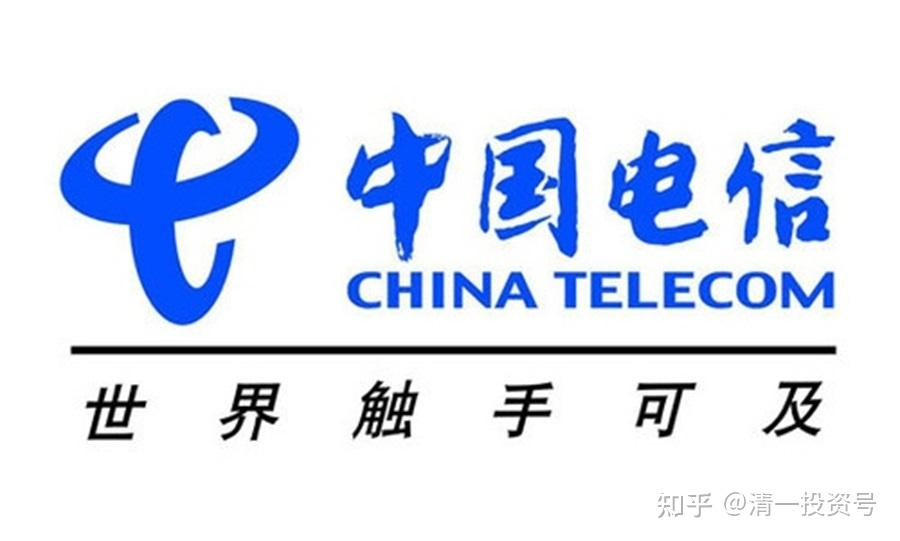
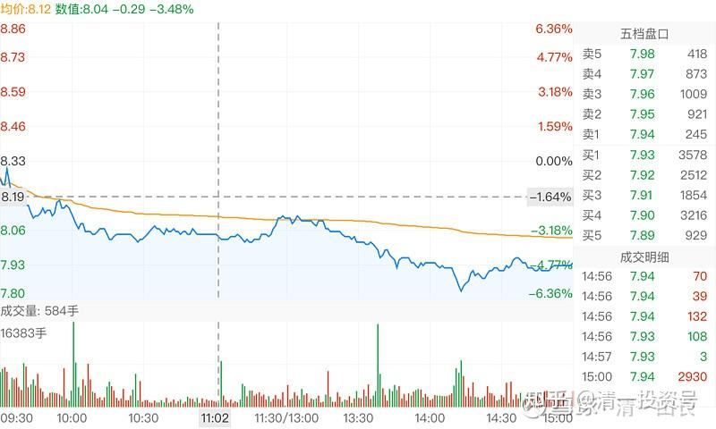

75篇.买入与卖出中国电信H的投资逻辑

2020年11月13日～2021年4月22日

**一、买入中国电信H，当准现金股用**

清一山长2020-11-13 16:10

$中国电信(00728)$今天买一把爱国股：因为特朗普又发疯了，现在连美国人买中国股，都要总统令来禁止了。所谓的民主国家，居然管这么宽，真是太平洋的警察吗？连自己的国人买什么股都要限制。真服了这疯老头。中国股票没美国人买，难道就活不下去了吗？老头快下台了，也不忘了要想尽办法整治中国。不让美国人的钱资助中国人，非说这些公司为军方提供服务。中国人买了这么多的美元债券，是美国人的世界第一债主。但中国人也没霸道到要求美国人：不许你用中国人的钱，去造航空母舰呀？更别说用中国人的钱造大楼，打电话了。

三大电信公司，四大基建公司，都在特朗普的禁止令上。非说他们为军方服务。我看猪肉股、粮食股、酒股，都应该禁止的。因为这些公司的产品，中国的军人都会使用的。我看美国人这种嘴脸，实在气不过。今天就借了美国人的钱（IB是美资券商），买了200万股中国电信港股，每股价格2.46元。查看已经全部成交了。我就要力挺中国。

而且我还要用美国人的钱来力挺中国电信（谁让它跌得最惨）。每年，我只要给美国人1.5%的利息，每年我可以拿中国电信的分红5.24%，涨了，还算我的额外红利。我就跟你死扛下去，拿个三五年。看结果咋样！输了，就算我为国捐躯，不，是“捐钱”了。我就不相信你川普能把我的组合给打爆仓。200万股买入后，检查我账户的剩余流动性，只少了100万左右。我的余地还很大呢[大笑]！

报道：路透华盛顿11月12日特朗普政府周四颁布一项行政命令，禁止美国对部分中国企业进行投资，华盛顿方面称这些企业由中国军方拥有或控制，此举是为了在美国大选后加大对中国的压力。该行政令可能会影响到中国一些最大的公司，包括中国电信[http://0728.HK](http://link.zhihu.com/?target=http%3A//0728.HK)、中国移动[http://0941.HK](http://link.zhihu.com/?target=http%3A//0941.HK)和监控设备制造商海康威视002415.SZ。路透率先报导了相关消息。此举旨在阻止美国的投资公司、养老基金和其他机构买卖31家中国公司的股票，这些公司是国防部今年早些时候认定的得到中国军方支持的企业。从1月11日开始，该命令将禁止美国投资者对这些公司的证券进行任何交易。还禁止美国人在一家公司被认定为中国军事公司60天后买卖该公司的证券。(这一段没有在网上搜索到出处，就先保留了。)

柏铭007发布于2020-10-09 18:26

《中国移动和中国联通同病相怜，移动用户持续流失》

知乎网页链接：[https://zhuanlan.zhihu.com/p/263643565](https://zhuanlan.zhihu.com/p/263643565)

清一山长2020-11-14 13:42评论上帖：

$中国电信(00728)$我为啥买了中国电信？而不是目前的第一名中国移动？看了这篇文章就知道了。

**因为我买的是成长，不是过去的历史。**中国移动的市值是中国电信的6倍。但用户数量，只是三倍。而且移动的用户还在联通和电信的夹击下不断下滑。此时，买价格只是移动二十分之一的中国电信，似乎不是个坏主意。这种企业，就相当于永续经营的企业，相当于这个时代的快消品，不会没有市场的。只需耐心等待回报就够了。

[清一山长](http://link.zhihu.com/?target=https%3A//xueqiu.com/9310099567)2021-[01-04 16:11](http://link.zhihu.com/?target=https%3A//xueqiu.com/9310099567/167552707)

[$中国电信(00728)$](http://link.zhihu.com/?target=http%3A//xueqiu.com/S/00728)买入了差不多一百万股中国电信，价格是2.10元。看差不多是10年的最低价。还买入了不少仓位的中国中车，2.56元。我以为：电信这种股，就跟公用事业股一样，稳稳地赚钱，稳稳地分红的股。没啥成长的空间，不能指望它急涨，但也没啥潜在的危险，几乎是垄断经营。**居然会出现十年多的最低价，我就买入，当准现金股来用吧！**

资金是卖了几十万股中国宏桥腾出来的。去年两个股都是3元多4元的样子，我在3元多还补仓了宏桥的。现在宏桥涨到了7.20元，以后估计还会继续涨，我现在只剩460万股了[捂脸]。以后宏桥可能继续涨，我也认了。但万一别的股跌惨了，我可以卖出中国电信来加仓（就算不涨价，我这样也赚了[大笑]），这就是准现金股的意思，宏桥止盈一部分。总得让别人也有机会赚钱（铝和金属高价时刻来临）。

我算是为国接盘吗？还是在帮美帝亏钱？（我认为被迫卖出的美国人，肯定没人能赚钱。十几年的最底部位置，赚个毛线？）

[清一山长](http://link.zhihu.com/?target=https%3A//xueqiu.com/9310099567)[修改于2021-01-07 16:10](http://link.zhihu.com/?target=https%3A//xueqiu.com/9310099567/167947290)

[$燕京啤酒(SZ000729)$](http://link.zhihu.com/?target=http%3A//xueqiu.com/S/SZ000729)今天一直在买啤酒，以及其他我认为便宜的股，比如2.04元的中国电信，为国接盘！在中国，只能过醉生梦死的日子，还要配上个手机上网用。

啤酒股持仓，跟高点相比，我已经“严重套牢”，市值损失超过千万。大家千万别学我，千万别追高。安全线是燕京五元区。最好等燕京破五再买，这样子基本不会套牢了。

喝酒怕醉的人，怕燕京破产的人，建议买破五的中国建筑，以及破9的中国建材，买了就可以睡觉去了。中国电信也一样，买了睡觉去。估计这几家公司都不会破产。

今天的图形：资金流出！我反向做，拯救主力。主力今天打压出货，我帮他忙。因为我是主力的吹鼓手[大笑]。

[二郎基金](http://link.zhihu.com/?target=https%3A//xueqiu.com/8164125924)[发布于2021-01-12 12:13](http://link.zhihu.com/?target=https%3A//xueqiu.com/8164125924/168439708)

《5G时代，谁的优势更大？》

雪球链接：[https://xueqiu.com/8164125924/168439708?page=5](http://link.zhihu.com/?target=https%3A//xueqiu.com/8164125924/168439708%3Fpage%3D5)

[清一山长](http://link.zhihu.com/?target=https%3A//xueqiu.com/9310099567)2021-[01-13 11:58评论上帖：](http://link.zhihu.com/?target=https%3A//xueqiu.com/9310099567/168574067)

我刚打赏了这篇帖子¥16.00，也推荐给你。

同意本文逻辑。本轮三大通讯公司中，我只买了中国电信，理由就是它可能是未来最有发展潜力的电信公司。移动的确很强，但移动已经是顶峰，未来再上一层楼，几乎不可能。联通一向最差，学渣将来也大概率是学渣。电信是中等生，向上可以挑战优等生移动，向下可以吸收低等生的资源，所以弹性可能最强。股价也低，所以博弈价值最高。

也了解了用户的迁移状况，似乎看到是：中国移动的用户数据一直在流出，中国联通也在不断流出。而中国电信在流入。所以，果断选择只买电信。

[@江左苏佑](http://link.zhihu.com/?target=http%3A//xueqiu.com/n/%25E6%25B1%259F%25E5%25B7%25A6%25E8%258B%258F%25E4%25BD%2591):回复[@清一山长](http://link.zhihu.com/?target=http%3A//xueqiu.com/n/%25E6%25B8%2585%25E4%25B8%2580%25E5%25B1%25B1%25E9%2595%25BF):

理解，美国接下来两三年都会笼罩在后疫情阴影之下，想集中精力对付中国，难！如果说什么时候能感受到国运，可能就是当下吧！

[清一山长](http://link.zhihu.com/?target=https%3A//xueqiu.com/9310099567)2021-[01-16 17:57](http://link.zhihu.com/?target=https%3A//xueqiu.com/9310099567/168943944)回复[江左苏佑](http://link.zhihu.com/?target=http%3A//xueqiu.com/n/%25E6%25B1%259F%25E5%25B7%25A6%25E8%258B%258F%25E4%25BD%2591):

基本同意[献花花]。特朗普现在居然出昏招，赖着不肯正常让权。我在海外看到很多美国的华裔发表支持特朗普的言论，坚持认为拜登是联合中国作弊，偷走了特朗普的总统宝座。他们在期待20日出奇迹，让特朗普继续执政。我在感觉很搞笑的同时，也觉得：如果华裔都这样认为，我相信美国人不服拜登的人会很多。这造成美国的严重分裂，让他们更加无法集中精力来对付中国了。

特朗普落选下台前，疯狂地封杀中国企业，封杀三大电信。看起来气势汹汹，其实证明美国手上现在已经没牌了，才会这样打乱拳。原来的定点打击华为、中芯，的确会让中国短期受伤。但是，不让美国人买中国电信公司、中国中车公司，打击中国的基础建设公司，这根本对美国就毫无意义。伤不到中国的企业正常发展。只会影响股票市场的短期波动。**美国的资本家，才是真正的受伤害方，他们被迫卖出，失去了未来的机会。**

所以，看来拜登上台，的确没多少牌可以打。想要联合其他国家对付中国，需要给好处。当年中美建交，就是给中国进入世界市场体系赚钱的机会，用这个大好处，来拉拢中国一起对付苏联。美国现在自顾不暇，恐怕也拿不出多少好处来组建反华同盟。但中国似乎倒是可以在目前混乱的局势下，利用疫苗，以及提供急需的轻工业品，跟全世界“搞好关系”。

**二、清仓中国电信，全部换入中国中车H股**

[清一山长](http://link.zhihu.com/?target=https%3A//xueqiu.com/9310099567)[2021-04-22 15:10](http://link.zhihu.com/?target=https%3A//xueqiu.com/9310099567/177876623)

[$中国电信(00728)$](http://link.zhihu.com/?target=http%3A//xueqiu.com/S/00728)今天2.74元清仓了中国电信。这一波美国打压，买进已经赚了30%多的利润。够满意了，今天全部换入了中国中车H股，买入价格3.39元。理由就是：

1：股息率更高，中国电信才4个多点，中车有6个多点。

2：PE更好。中国电信9PE，中国中车才7PE。

3：PB。两者差不多，中国中车更低一点。

4：中国中车是中国第一，世界上也能排上名、排前三没问题吧？说不定排第一呢！中国电信中国也只是老二，全世界？就不知道排第几了！

5：中国中车有专有的高技术储备，花钱买不来的竞争力。但是电信？好像有钱就能玩吧？加上有牌照。

6：中国中车还会制造电动车。比亚迪的利润，还没中车的高，但市值却是中车的两三倍多，凭啥？比亚迪的竞争对手，要比中车的要多多了。

7：中车还会造风能发电机。新能源概念妥妥的。比亚迪会吗？将来也许就是利润之源？

8：中车是美国制裁的对象，证明中车有实力。美国人都怕。不是说：未来美国赢不了中国吗？所以，就不能买美国人支持的比亚迪，必须买中车才行。

9：不说了，再说，你们都来抢筹了[大笑]。

我自己，其他啥理由都不要了，就认一条：中车是中国唯一，根本就没对手。而且，现在的价格，——拿利息也很不错。不涨就不涨，我不在意。

虽然中车的成长率，看样子有点看不清，比不过中国建筑。但由于它没对手，护城河很宽，有恶龙守卫，还有总理当推销员。所以，就算它业绩没有成长，我也可以接受。想要让它业绩下跌，似乎也不容易。只要这行业存在，它就必然生存下去，比亚迪之类的新能源牛企们，天知道十年后还在不在！中车肯定是在的。所以，比确定性，中车更强。

好的，这就是今天换仓的理由，说完了！守股吃利息去了。

