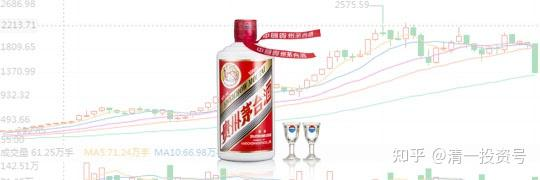
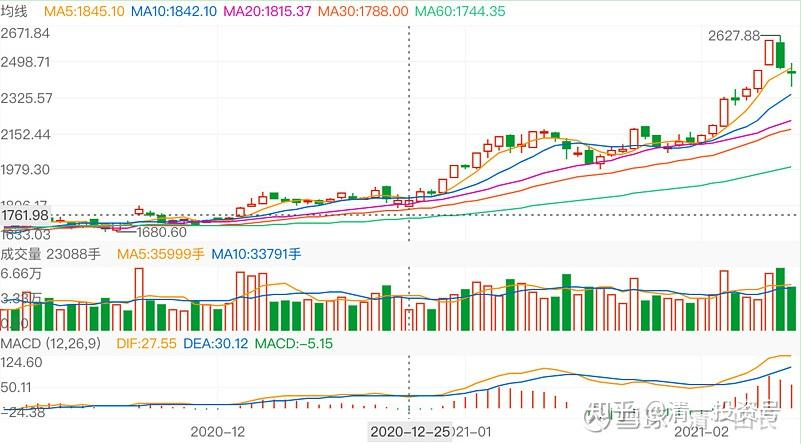
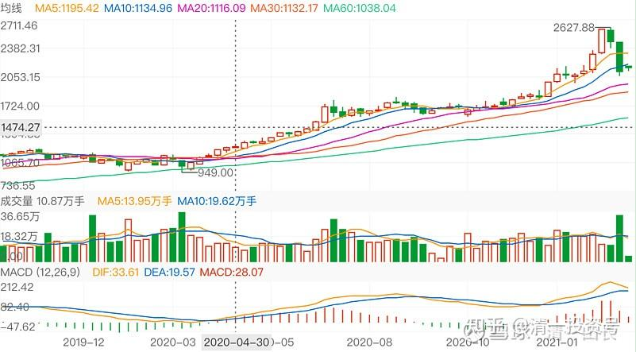
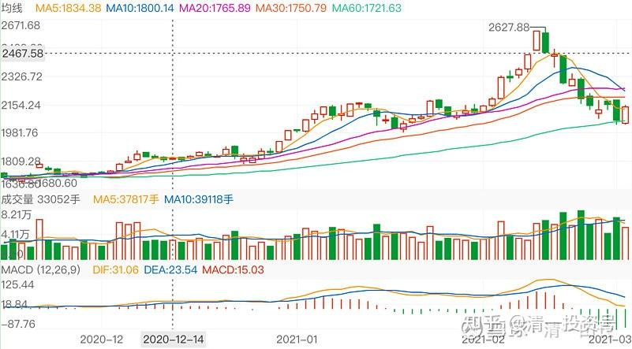
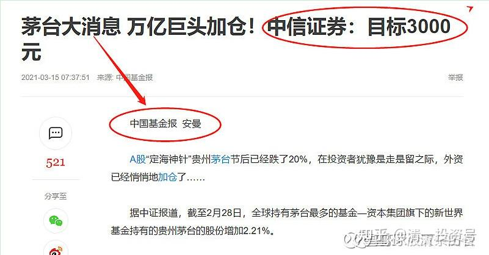
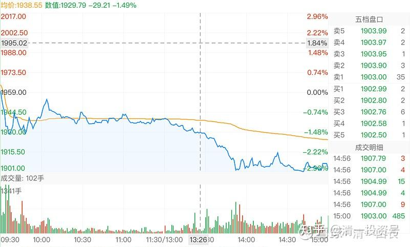
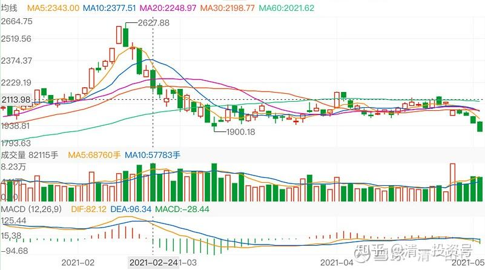

78篇.白酒系列（七）贵州茅台（下）——技术分析

清一山长2021年3月～2021年4月

**1.茅台的技术分析**

[清一山长](http://link.zhihu.com/?target=https%3A//xueqiu.com/9310099567)2021-[02-19 13:31](http://link.zhihu.com/?target=https%3A//xueqiu.com/9310099567/172123846)

[$贵州茅台(SH600519)$](http://link.zhihu.com/?target=http%3A//xueqiu.com/S/SH600519)我怎么看图，感觉茅台的走势，已经走完上涨拉升阶段？看来今年要进入相对较长一个时间的调整平台了。不过，这么牛的股票，也不会大跌的，只是不会像原来一样不断创新高罢了。是否意味着：热点开始转型了？也许以后会转过来抱团啤酒？[大笑]，只是笑话，别当真喔！

[清一山长](http://link.zhihu.com/?target=https%3A//xueqiu.com/9310099567)2021-[03-01 21:59](http://link.zhihu.com/?target=https%3A//xueqiu.com/9310099567/173149173)

[$贵州茅台(SH600519)$](http://link.zhihu.com/?target=http%3A//xueqiu.com/S/SH600519)从周线上看，明显是加速赶顶，有人借机拉升出货的走势。上周机构出货780个亿。不过，相对茅台三万亿的市值来说，这只是小菜一碟。算不上大出货吧？被套住的散户走不走呢？不知道。多看看K线图，熟悉这种走势。如果从惠泉啤酒的走势来看，加速赶顶之后，回撤了一半。茅台毕竟是茅台，应该没有啤酒这么水的吧？[大笑]

[清一山长](http://link.zhihu.com/?target=https%3A//xueqiu.com/9310099567)2021-[03-03 15:37](http://link.zhihu.com/?target=https%3A//xueqiu.com/9310099567/173348373)

[$贵州茅台(SH600519)$](http://link.zhihu.com/?target=http%3A//xueqiu.com/S/SH600519)个人认为，技术上说，2000～2100元。茅台的平台支撑还是很强的。如果出货过猛，1800元的平台支撑也更强。不太可能低于此线。未来在1800～2600之间箱体震荡的可能性较大。

恭喜拿茅台赚了的人。我没有茅台。也不眼红你们，只是看看茅台的走势，对我想象啤酒的未来走势，可能会有一定的帮助。（不懂酒，我以为啤酒、白酒都是酒[大笑]）。

[清一山长](http://link.zhihu.com/?target=https%3A//xueqiu.com/9310099567)2021-[03-15 13:22](http://link.zhihu.com/?target=https%3A//xueqiu.com/9310099567/174441122)

[$贵州茅台(SH600519)$](http://link.zhihu.com/?target=http%3A//xueqiu.com/S/SH600519)快下手，要涨到3000元的茅台，今天特别的便宜，现在一股只要一瓶茅台的酒钱。茅粉快上[俏皮]我是中国建筑粉。我就一直趴地上的[哭泣]。正在想要不要换茅台[为什么]

[清一山长](http://link.zhihu.com/?target=https%3A//xueqiu.com/9310099567)2021-[05-08 22:17](http://link.zhihu.com/?target=https%3A//xueqiu.com/9310099567/179282098)

[$贵州茅台(SH600519)$](http://link.zhihu.com/?target=http%3A//xueqiu.com/S/SH600519)茅台的走势，很不乐观呢！跌破了前期平台，而且放量下跌，颇为不善。今天过百亿的成交。分时图上明显跑路的走势。抱团股松动了。4月28日最高的这根柱子，虽然是红的，其实是勉强拉维持股价的。成交164亿。趋势走坏，从这一天开始。茅台开跌，别的白酒股大概率也好不到哪里去。所以，前期自豪满满的茅粉、酒粉们，估计下周会有点不好过了。囚徒困境，看谁见机得早。这么大的盘子，维护起来很难的。

**2.关于茅台酒**

[清一山长](http://link.zhihu.com/?target=https%3A//xueqiu.com/9310099567)2021-[04-09 20:04](http://link.zhihu.com/?target=https%3A//xueqiu.com/9310099567/176740496)

评论文章：【1953年-2020年茅台酒历年价格大全】

[https://xueqiu.com/5303061289/176712345](http://link.zhihu.com/?target=https%3A//xueqiu.com/5303061289/176712345)

我刚打赏了这篇帖子¥66.00，也推荐给你。小时候，知道茅台才几元一瓶，不超过十元。应该是要过春节了，跟父亲去酒柜台看酒，父亲知道这是名酒之一，依然觉得“太贵”，买了其他更便宜的“名酒”[大笑]，好像是汾酒之类。当时的人，真没觉得茅台有多高大上的。

今天才知道具体的价格，感谢贴主的分享。收集资料，也需要心血，用心。

同时，也希望喝酒的人知道：其实，所谓的国酒，原来，历史上，也只是一瓶很普通的酒，茅台还曾差点破产。今天的**茅台神话，大家喝的不是酒，是概念，是面子，是想象**。**我们喜欢茅台的唯一理由，其实不是啥功能性的东西，而是“它最贵”。满足了我们拥有茅台，自己似乎也“最稀奇高贵”一样。这是我们内心追求卓越的意识体现。但——如果用买酒来“证明自己”，就是被利益集团收割了。**

我们要学会看清利益集团是如何操纵我们的，也可以跟随他们去买一些能够集中代表人类欲望的股票，我去年从酒股票上，赚到了8位数的钱，估计今年还会赚更多的钱。也许酒股票，会给我9位数的利润。酒给了我投资历史上最多的利润。但是，我自己是不喝酒的。偶尔喝喝红酒、黄酒。

**我们可以顺人，但要逆己，**我们可以买酒给别人喝，但自己就别消费酒了。我持有燕京啤酒，没理由天天去喝燕京，到处去推销燕京的。只是**冷眼看人们，是如何被自己的欲望操纵就行了。**

如果世界上我这种人多了，就不能买酒股票了[大笑]。

**3.茅台笑谈**

[清一山长](http://link.zhihu.com/?target=https%3A//xueqiu.com/9310099567)2020-07-28 20:02

$万科A(SZ000002)$我在想：假如中美疫情，美国损失惨重，美方就是要我们拿一家上市公司给美国作为赔偿。美方提出：万科或者中建，随便给一家给美国都行。各位爱国华人们，你们是投票送万科出去，给美国人做陪嫁呢？还是把中建送给美国人？万科3100亿的市值，中国建筑2100亿的市值。好像很容易选择喔！当然给个便宜的货。我猜你们都是送中建去陪嫁吧？把更有价值的万科留在手中？不过，我想的是：中国就算是少了一个万科，分分钟大把的地产公司，就可以取代它的市场地位。比如融创、保利等。中国少了个万科，根本伤不了筋骨。就是少了一点钱罢了。但是，如果中国少了个中国建筑，中国“基建狂魔”的名号，恐怕会要有大大的折扣吧？说不定，我们此举就助力美国，成为另一个世界级的“基建狂魔”，成为中国最大的对手。川普不正在头痛，丢钱刺激美国经济，美国也要上大基建。就是找不到人来干活吗？给个中建公司，正好雪中送炭了。至于让美国多一个万科呢？无非是川普这样的地产商，多一个土豪朋友罢了。[俏皮]

让我选的话，我觉得：不如把【贵州茅台】送给美国。反正茅台的利润率是90%以上。所以，都是虚的。我们中国人，分分钟另外弄一个新的“中国茅台”出来，反正没啥技术含量的，还不如泸州老窖需要“历史悠久的酒窖”来制造。只要我们不割让茅台镇的土地出去，其他东西都给美国人，品牌、存货、渠道、人员等。另外拉一帮人来制酱香酒，只要五年之后，中国茅台就和贵州茅台味道一样了。十年后，就完全恢复市值了。因为我们号召：中国人只喝【中国茅台】就行了。不喝美国人的【贵州茅台】。让美国人自己喝去。美国人会不会答应这个交易呢？不过，我估计中国人肯定不干的，茅台是国酒，怎么能送美国鬼子？还是送最便宜的中国建筑赔偿，对我们更划算……我这贴子，明显就是找抽的帖子[俏皮]。惹茅粉、万科粉生气。但我真心是这样想的……

大师说：想不通，就换一个位置去想，就很简单了。我就想：如果我是川普，我要中国人给我谁？华为——如果不行的话，还有上面的谁还不错？我猜他肯定不会要茅台。

[云道子](http://link.zhihu.com/?target=http%3A//xueqiu.com/n/%25C3%25A4%25C2%25BA%25C2%2591%25C3%25A9%25C2%2581%25C2%2593%25C3%25A5%25C2%25AD%25C2%2590)回复[清一山长](http://link.zhihu.com/?target=http%3A//xueqiu.com/n/%25C3%25A6%25C2%25B8%25C2%2585%25C3%25A4%25C2%25B8%25C2%2580%25C3%25A5%25C2%25B1%25C2%25B1%25C3%25A9%25C2%2595%25C2%25BF):

山长，请问您现在的茅台和片仔癀是否已经到顶了呢？

[清一山长](http://link.zhihu.com/?target=https%3A//xueqiu.com/9310099567)2020-[09-06 20:31](http://link.zhihu.com/?target=https%3A//xueqiu.com/9310099567/158580252)回复[云道子](http://link.zhihu.com/?target=http%3A//xueqiu.com/n/%25C3%25A4%25C2%25BA%25C2%2591%25C3%25A9%25C2%2581%25C2%2593%25C3%25A5%25C2%25AD%25C2%2590):

没到顶。不是说牛市不言顶吗？我用天眼看了一下：茅台将来会涨到一万元一股的！时间在2120年前就能实现。您打算买多少股？买了就睡觉去，等到了一万元再来卖[俏皮]

**参考链接：**

[59篇.白酒系列（一）老白干——人弃我取，人取我予](https://zhuanlan.zhihu.com/p/554525861)（整理文）

[62篇.白酒系列（二）伊力特——“新疆茅台”（上）](https://zhuanlan.zhihu.com/p/557187863)（整理文）

[64篇.白酒系列（二）伊力特——“新疆茅台”（下）](https://zhuanlan.zhihu.com/p/558774189)（整理文）

[66篇.白酒系列（三）五粮液（上）——好企业还要好价格](https://zhuanlan.zhihu.com/p/561226672)（整理文）

[67篇.白酒系列（三）五粮液（下）——回顾投资过程](https://zhuanlan.zhihu.com/p/563522180)（整理文）

[69篇.白酒系列（四）泸州老窖——切换与比价](https://zhuanlan.zhihu.com/p/565816330)（整理文）

[71篇.白酒系列（五）迎驾贡酒——优秀的分红率](https://zhuanlan.zhihu.com/p/568112813)

[72篇.白酒系列（六）酒鬼酒、金徽酒](https://zhuanlan.zhihu.com/p/572004181)

[74篇.白酒系列（七）贵州茅台（上）——通过茅台看投资逻辑](https://zhuanlan.zhihu.com/p/574257684)

[76篇.白酒系列（七）贵州茅台（中）——对比茅台和中建](https://zhuanlan.zhihu.com/p/576469606)

