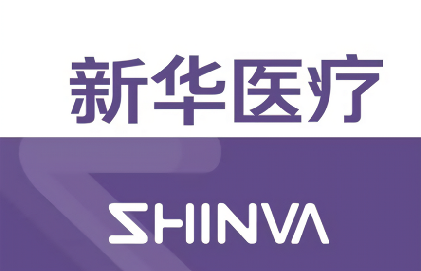
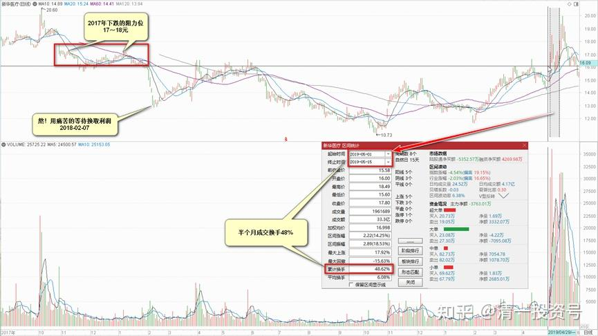
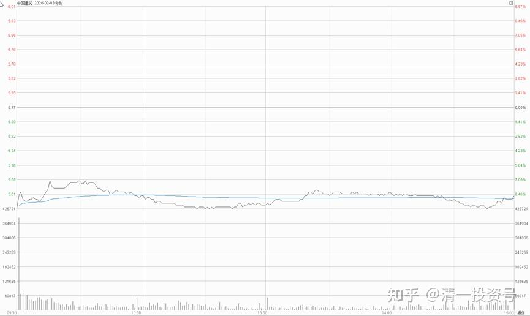
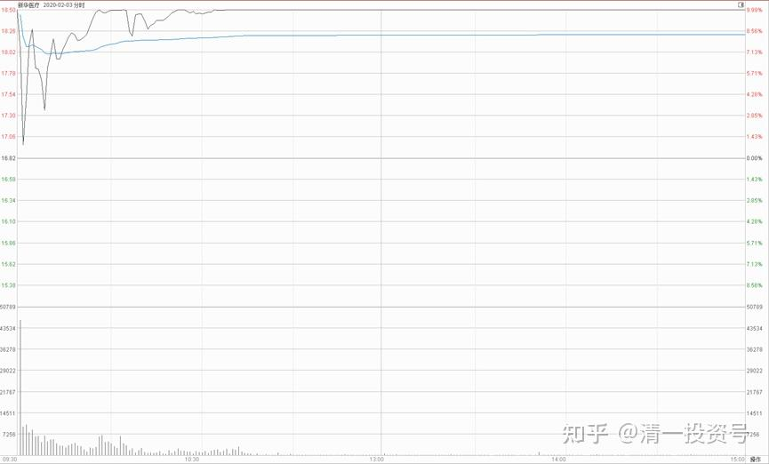
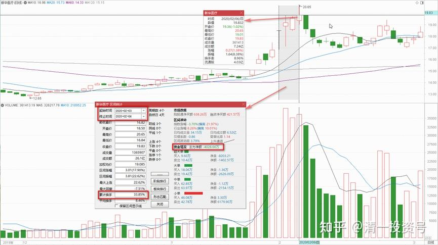
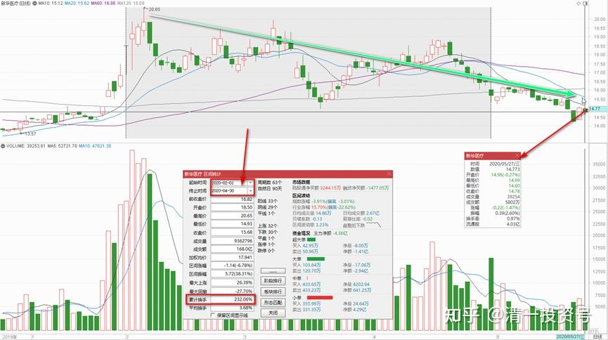
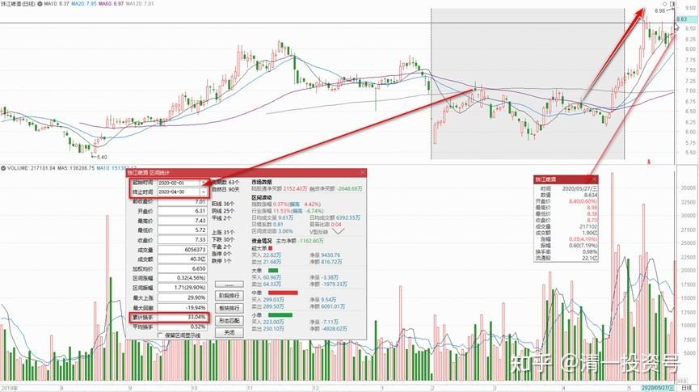

79篇.妖股新华医疗的投资记录

清一山长2016年～2021年

**一、背景：开始关注辛巴、关注新华医疗**

百炼生2018-01-16

《为什么辛巴老师有走下神坛的可能？》

[https://www.jianshu.com/p/715a8d4f7102](http://link.zhihu.com/?target=https%3A//www.jianshu.com/p/715a8d4f7102)

清一山长：2018-01-21 09:50:12评论上文

我刚打赏了这篇帖子￥10.00，也推荐给你。打赏不是支持本文的逻辑，还是支持作者的勤奋和独立思考，也感谢作者给了我新的视角。

看完后我开始关注辛巴了！我认为：辛巴的脑子没有出问题，他的这个组合，看起来这几年错过了很多，甚至很可能2018年还是继续的低迷，但我认为不会永远低迷下去的，会有一天会大放异彩！

美丽的邂逅2018-02-03 16:01

新华医疗投资策略——熬（原贴已删）

$新华医疗(SH600587)$

王近山将军曾对上甘岭战役如何打请教过林彪，林彪回答了一个字:“熬”。这个字，也可以恰如其分的表达我对未来新华医疗的核心投资思想。一般只有当我做好一年以上的中长期持仓准备的股票，才会这般认真对待。今天在本周股价大跌之后，再次审视一遍。

[https://xueqiu.com/3687992824/100949156](http://link.zhihu.com/?target=https%3A//xueqiu.com/3687992824/100949156)

清一山长2018-02-07 23:09:36（评论上文）

我刚打赏了这篇帖子￥66.00，也推荐给你。**熬！用痛苦的等待换取利润**[大笑]。支持作者。我也研究看看，是否也陪陪各位大腕一起熬一碗苦药汤！

**二、买入新华医疗，投机的成分居多**

清一山长2019-05-15 15:36:12

$新华医疗(SH600587)$技术分析。**此股应该进入了一个关键平台的突破整理区期**。2017年下跌的阻力位17～18元，成为了现在上攻的压力线。但我看突破这个位置的问题并不大，换手已经很充分了。**近期的成交量（仅仅半个月成交换手48%），说明了主力的上攻意愿不容忽视**。本股居然在千股跌停的时候涨停，这股子倔强劲，实在是不容忽视。这招低位的涨停，其实让很多不坚定的持股者都赶快逃走了，换手换的很充分。后期如果能够一举突破2016年的20～24元平台，此股可能一飞冲天，涨出一片新天地来。但如果不能冲破此平台，又会重回15元的长期平台整理。

基本面分析——我就免了。这里高手如云，还是不说了吧！本人是价值投机者，买入此股，投机的成分居多。成本14元多，继续持股待涨。涨了就换酒喝，跌了就吃药反省[大笑]。

**三、脱身卖掉新华，买其他更有价值的标的**

清一山长2020-02-03 11:36:48

$中国建筑(SH601668)$默默的再度买进中国建筑，买入价格4.94元。再度奉行跌破5元就买入的自我承诺。用的资金是卖出新华医疗的。我不相信一个肺炎中国人就不搞建筑了。中建直奔跌停的架势太不理性。虽然今天一天，我的账面损失惊人，不过幸亏一股也没少。今年开年，中国人过得真不容易，2020年只要坚持下去，明年就会好的。中国加油！

洪睿彰回复清一山长:

我刚打赏了这个帖子￥6，也推荐给你。感谢张老师分享！今天卖了接近涨停的新华医疗，买了冀东水泥。别人争着卖，我就捡一点[鼓鼓掌]

清一山长2020-02-03 13:49:23回复@洪睿彰:

新华是个妖股，涨跌都完全合理。从技术上看，今天是不应该卖出的。看趋势明天还要涨。我只是卖出了一部分（30W股），赚了一部分就可以了。不支持大家跟风卖新华。这种操作是两头不讨好的，万一继续涨，有人又会骂我[哭泣]。

无名布衣回复范小苗:

医院还是少建点吧[抠鼻][抠鼻][抠鼻]

清一山长2020-02-03 18:39:10回复无名布衣:

有人传说美国已经研究出了药物可以治这种病，这叫谣言。美国人自己都说了：对这种病毒所知甚少，不知道如何防范。所以只好把所有人都隔离在外面。大家想要进医院住院等等，都只是安慰剂罢了。这种病毒，目前是没有特效药的，我认为以后也不会有特效药，因为根本就不可能研发出来，只有隔离是最好的办法。连医生得病，都是只能自己回家自我隔离的。小民居然真的相信医院[哭泣]。当然，能够控制病情就好。我对内部学生的发言：别相信美国人的药物能治疗这种病，多贵都没用的。最多只能控制病情。**真的疗愈方式，只能是“正气存内”。**不懂这个就没办法了。刘老师正在给我们的团队做的，就是调节个人能量场，防止病气进入，进入之后也不可能发展。原来教的继续有效，别眼巴巴地指望美国救兵。这些只是商人，忽悠你只为了钱。

**防治方法**有没有？**我们的内部方法是，每天都运动，出一身汗。饮食清淡，早睡早起。这就是最好的防病方法！**

清一山长2020-02-03 18:57:42回复无名布衣:

小道消息，清粉内部信息：我原来的一个同事就是美国一家医药公司的高管，这家公司的产品都是抗病毒的，他们把一个治疗埃博拉病毒的抗病毒药，正在修改适应症，预计1个月内就能审批完成。打算进入中国市场，售价相当不菲。

点评：都是骗傻子的[大笑]，中国钱多，人傻！快来!

中国建筑 2020年2月3日走势

新华医疗2020年2月3日走势

清一山长2020-02-07 12:17:35

$珠江啤酒(SZ002461)$珠江啤酒涨了，但我却高兴不起来，倒不是后悔涨之前没有补仓，实际上这轮下跌中，我低价补进了1M多的仓位，继续巩固了我在十大流通股东的地位（虽然没有啥投票表决权，也没有人通知我开会，更没人请我去吃公司的工作餐，喝工作酒，连一个盒饭也没得到[哭泣]）。还是小散户的命，我也认了，好处是不承担任何企业责任。想买就就买，想卖就卖。不用发公告。

我不开心的原因，主要是有点小纠结：按道理估值是燕京更低，跌下来应该买燕京，或者用珠江换燕京。但我就是不敢换，弄得有点内心冲突。

另外我不看好这轮反弹，我认为肺炎对于中国经济的影响，似乎不是一个跌停版就能够解决的。所以，**我手上的医疗股，如新华医疗乘机跑光了，健康元也在跑。**珠江涨了，按道理也应该跑一部分的，但我认为它很可能是下一个重庆啤酒。重啤可以有17倍的市净率，凭啥珠江只能有1.7倍？这也太低了点。今天她们两双双起舞，啥意思？所以，现在就算珠江涨了一点，我也不敢卖。继续放着好了，反正也攒了这么久！

明达野老回复清一山长:

支持山长医药股的操作，也恭喜山长收获满满[献花花]我的医药仓位也在快速缩水中。医药股大概率会重复去年“猪肉股”的模式——前期疯涨，往后则是漫长的阴跌之路；爆炒的结果就是筹码越来越分散，分散到“接盘侠”手中了，因此阴跌不可避免。当然，如果拿的优质廉价的医药股，不动倒也还过得去，因为通过一定时间的震荡消化还会重拾升势的，至于这个“一定时间”是多久就不知道了。

山长关于珠江的观点——【我认为它很可能是下一个重庆啤酒】我很认同，参照重啤估值，确实是非常值得重点“关照”的好标的。今天看了下市值，仍然是我的AH第一重仓，所以这次下跌没有太“关照”它了。另外，从盘面看，控盘程度很高。因此，从空间来说，我不认为会跑输重啤，所以我现在还蛮舍不得在这个位置扔掉筹码的。和山长一起“锁筹”[赞成]

清一山长2020-02-07 22:52:48回复明达野老:

你的盘感真好[很赞]。**主力其实早已控盘，今天涨近5%也不放量，说明盘子很轻。但主力却不拉升，显然是志在长远，不愿意赚点小钱就走**。估计是现在的企业基本面还不配合，需要时间去消化。所以，我们得只能慢慢陪他们磨时间了。比耐心，我们应该不会输给他们。经常忘记看盘就行了[笑]

清一山长2020-02-20 14:28:32

$新华医疗(SH600587)$很明显，主力并不恋战，这个价格，他们才不想要呢！只想卖掉手上的持股。昨天大盘上涨，它是跌的。今天大盘继续涨，它涨了一分钱[俏皮]。感谢主力的眷顾，让我可以脱身卖掉新华，去买其他更有价值的标的。19元多，已经把涨停后剩余的持仓全部脱手了。

如果看到了春节后这么大的换手，依然幻想它以后还会继续大幅上涨的人，真的对新华的爱恋和期待都很深。幸亏我没有这么深情，也不想赚够了翻倍才走（与我从19元持有顺鑫的心情是完全不一样的。持有一个全国销量第一的白酒股，觉得很自然。持有新华医疗，总觉得有些靠不住）

清一山长2020-05-27 23:04:13

$新华医疗(SH600587)$这个股我19元走掉了，居然还赚了钱，真不好意思。今天来看，好危险，2、3、4三个月的成交总额，超过230%。换手很充分——可是股价是下跌的。而珠江啤酒同期三个月的总成交额，不过30%多一点换手，只有新华换手率的零头，就已经涨了50%以上——这意味着**新华是典型的主力出货图形，而珠江是弓满待发。**新华更恐怖是价跌量升（2015年新华爆发时，价涨量也升，主力玩得最舒服，最终货卖完了，韭菜还可以反复割多次，才会有这么巨量的成交额。所以后来才有长期多年下跌的新华。新主力最近也出局了）。现在看样子，2月份之后，新华主力借疫情概念完成了出货任务，股价未来将陷入长期低迷，成交低落。股民士气涣散。股价将跟随大市波动，别指望什么惊喜了。除非牛市启动，或者牛人再度降临，否则本股没希望了。

**我要反思自己的投资思维**——**当初怎么会买这种妖股**？虽然我是看出了有主力进出的迹象买的，但万一主力也被套，我不一起赔死吗？幸亏出了一个疫情爆发概念行情，让我在股灾中还获取了卖出新华的本利去购买难得跌价的好股。但这属于运气，不是确定性。以后**基本面不好的股，还是尽量远一点**。这个股很妖，但别指望妖股赚钱，除非你更妖[俏皮]！

[价值1981](http://link.zhihu.com/?target=http%3A//xueqiu.com/n/%25E4%25BB%25B7%25E5%2580%25BC1981)回复[清一山长](http://link.zhihu.com/?target=http%3A//xueqiu.com/n/%25E6%25B8%2585%25E4%25B8%2580%25E5%25B1%25B1%25E9%2595%25BF):

山长有看好的中药股吗？

[清一山长](http://link.zhihu.com/?target=https%3A//xueqiu.com/9310099567)[2021-06-05 14:59](http://link.zhihu.com/?target=https%3A//xueqiu.com/9310099567/181905900)回复[价值1981](http://link.zhihu.com/?target=http%3A//xueqiu.com/n/%25E4%25BB%25B7%25E5%2580%25BC1981):

我看好中医，不等于看好中药，更不等于看好中药上市公司。这是两码子事情。别混在一起。

你们想赚钱，最好买西药公司。就因为有大批的黄大V这样的死忠一定只吃西药，而且西药价格更高，利润更好。我也买过新华医疗、健康元，还赚了大几百万呢！我如果去买国货阿胶，今天就成了清一卫南了[俏皮]

至于中医、中药，现在这局面，能不死就不错了，别想啥赚大钱。清一医学院将来的宗旨，就是不想赚钱的学生可以来学。

[清一投资号：44篇.顺鑫农业记录一：开始关注买入](https://zhuanlan.zhihu.com/p/539035593)

[清一投资号：46篇.顺鑫农业记录二：最多输时间不输钱](https://zhuanlan.zhihu.com/p/539203562)

[清一投资号：49篇.顺鑫农业记录三：买、卖、拿住股票的理由](https://zhuanlan.zhihu.com/p/543704521)

[清一投资号：51篇.顺鑫农业记录四：主力还没有开始减仓](https://zhuanlan.zhihu.com/p/544147559)

[清一投资号：53篇.顺鑫农业记录五：中国炒股最重要的技术是保本](https://zhuanlan.zhihu.com/p/544149372)

[清一投资号：58篇.顺鑫农业记录六：最靠谱的投资方法就是不炒股](https://zhuanlan.zhihu.com/p/545612289)

[清一投资号：61篇.顺鑫农业记录七——机构坐庄三招：养、套、杀](https://zhuanlan.zhihu.com/p/556331421)

[清一投资号：65篇.顺鑫农业记录八：基本面的估值修复和主力技术面的空间](https://zhuanlan.zhihu.com/p/560419930)

[清一投资号：29篇.2021年评顺鑫](https://zhuanlan.zhihu.com/p/498221415)

