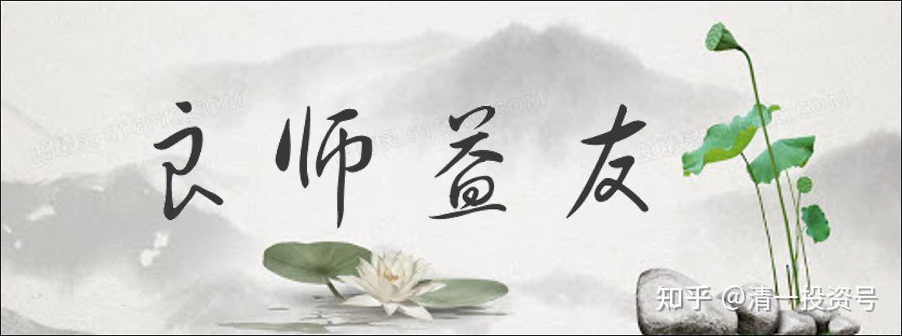
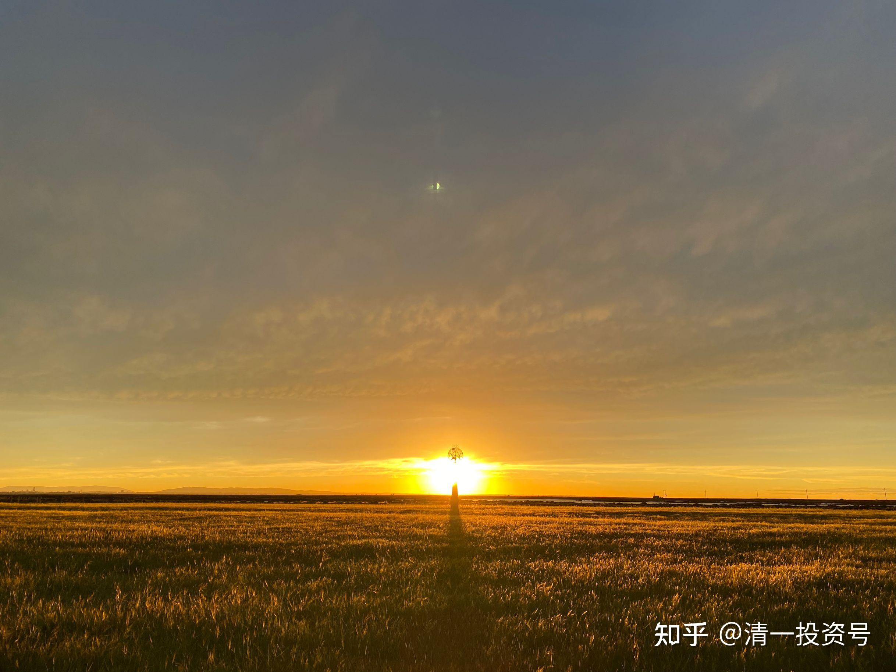

原37篇.股市不赌，游戏不玩，善存款，贵益友

清一山长 2021年10月13日

清一山长雪球非专栏帖子整理文章第36篇《股市不赌，游戏不玩，善存款，贵益友》

此文整理自山长关于一篇文章的讨论：

[又一位15年股龄的雪球老股民跟我们说再见了！这次是中远海控！](http://link.zhihu.com/?target=https%3A//xueqiu.com/6292223557/200025968)

**一、我们不能教育市场先生，只能利用市场先生**

[清一山长](http://link.zhihu.com/?target=https%3A//xueqiu.com/9310099567)[2021-10-13 23:33](http://link.zhihu.com/?target=https%3A//xueqiu.com/9310099567/200052050)

这位爆仓的人的基本逻辑就是：活了这么多年，见了这么多风雨，我都过来了。没想到今天会在海控上翻了船。买1PE的股票也能爆仓，更说明：不是我有问题，而是这个市场太不正常了。是别人太没眼光了。

我纳闷：巴菲特早就说了，市场先生本来就脑子不正常，经常乱报价。你的脑子正常，就别和市场先生较劲呀？我们不能教育市场先生，只能利用市场先生。这伙计，炒股15年，怎么连这个基本的概念都没有？还吹自己见多识广。真是的。对市场，疯不疯我们没法去讲理。我们只能报敬畏的心，来面对市场先生的疯狂。

我如果被狗咬了，我不能说：我多善良呀，我做了多少好事，多少人都尊重我，一只狗瞎了眼，怎么能咬我呢？这种说法多傻气。

我的逻辑是：如果我被狗咬了，绝对不是狗的问题。肯定我做了某种会导致狗咬我的事情，起码我走到了它的地盘，而没有对可能的危险做好防范。如果我随时有个打狗棒在手里，我相信就不会被狗咬了。跟狗较劲到底谁对谁错？肯定我也疯了！

**二、不管赔率多高，用赌博的方式来炒股，不可能有赢家**

[流水白菜](http://link.zhihu.com/?target=http%3A//xueqiu.com/n/%25E6%25B5%2581%25E6%25B0%25B4%25E7%2599%25BD%25E8%258F%259C)回复[2020那个冬天](http://link.zhihu.com/?target=http%3A//xueqiu.com/n/2020%25E9%2582%25A3%25E4%25B8%25AA%25E5%2586%25AC%25E5%25A4%25A9):

对的。一个赌场，去一次的输光率是1%。同一个人，连续去了这家赌场100次，输光的概率有多大？所以，投资千万不要有侥幸心理。任何有乘以0的风险，哪怕概率极低，也不要去做。

[清一山长](http://link.zhihu.com/?target=https%3A//xueqiu.com/9310099567)[20212-10-14 12:30](http://link.zhihu.com/?target=https%3A//xueqiu.com/9310099567/200096665)回复[流水白菜](http://link.zhihu.com/?target=http%3A//xueqiu.com/n/%25E6%25B5%2581%25E6%25B0%25B4%25E7%2599%25BD%25E8%258F%259C)：

对于赌徒来说，股市也一样是赌场。如果一个人去赌场赌了15年，一直赚钱，就认为赌场是为他提钱开的，他不相信你提出来的概率论，就认为他是例外的，是上帝的特选之民。

还看一个夫妻的故事，很早在股市上就赚到了三个亿。然后加满杠杆。最后遇到股灾，亏到只剩2000万本金出局。还好，依然是中国1%的富豪阶层。

A股，是赌场，也不是赌场。看你怎么看，怎么做。把他当市场，就可以获得市场的机会。当赌场，就可以获得赌场的暴利和暴亏。两种人都在里面晃，其实，骨子里面不一样。别以为一个人说他买涨了10倍的股，才1PE，就自以为是价值投资了。

[攸而宁](http://link.zhihu.com/?target=http%3A//xueqiu.com/n/%25E6%2594%25B8%25E8%2580%258C%25E5%25AE%2581)回复[清一山长](http://link.zhihu.com/?target=http%3A//xueqiu.com/n/%25E6%25B8%2585%25E4%25B8%2580%25E5%25B1%25B1%25E9%2595%25BF):

白菜的意思我懂，但这个例子并不恰当，反而反映出白菜对数字的不敏感。

一个赌场，去一次的输光率是1%。同一个人，连续去了这家赌场100次，输光的概率有多大？

答：1-0.99的100次方＝0.64

[清一山长](http://link.zhihu.com/?target=https%3A//xueqiu.com/9310099567)[2021-10-14 17:35](http://link.zhihu.com/?target=https%3A//xueqiu.com/9310099567/200132269)回复[攸而宁](http://link.zhihu.com/?target=http%3A//xueqiu.com/n/%25E6%2594%25B8%25E8%2580%258C%25E5%25AE%2581)：

你们几个人算数学题的数学水平，都好高喔！高到我看不懂你们的计算公式。虽然我是理工科大学的毕业生。

我只知道用基本常识来算，用小学数学来算，不用你们的高等数学。我知道常识就是，我去玩一个只有1%胜率的游戏，我连玩2次都赢的机会，就只有万分之一了。我连玩3次都赢的机会，是百万分之一。如果连玩100次，我都一直赢的机会——无限趋近于零吧！你们居然算出0.64？啥数学?肯定是高等数学，我不懂的那种。

如果你进入股市，知道我上面说的小学数学的算法，你就知道：用以上的方式来赌博炒股，不断加码，每次都押宝一只股，再加上一倍的杠杆，跌50%就没了。就算你每次抓的股票，都有80%上涨的可能，只有20%的概率会下跌。但你梭哈连玩两次，你就只剩64%的赢率。继续玩第三次，你就只有不到50%的赢率，如果你连玩100次？基本上也是趋近于零了。

也就是说：按照赌博的方式来炒股，不可能有赢家。中间你赢了多少都不重要，最重要最后你的结局，一定是输光光！

记得电影【贫民窟的百万富翁】，就是这样的游戏，每一次赢了晋级，奖金加倍，最终的奖金是不可思议的高数字。但理论上，是没有人能够拿到这笔钱的。狗屎运要特别的好。居然被一个贫民窟的小年轻人拿到了。他不爱钱，只想扩大影响，找到他的爱人，结果电影里面让他成功了。正常情况下，早就被中途淘汰了！所以警察局把他抓起来盘问，认为一定有内鬼，作弊等。

股市就是这样：不尊重投资的基本规律，想赌，总有一天会把你输光光的。赔率再高都不行，这就是巴菲特不让借钱炒股的根本原因。因为理论上是活不下去的。不管你赚多少钱都没用！

网上传芒格买阿里巴巴的故事。买完后就快腰斩了。如果芒格是全仓，加一倍的融资买入，现在就爆仓了。但他没有这样贪婪，现在他再用一半的价格，再买入相同数量的股票，大大降低了成本。这就是他的方式，保障了你不可能击败他。他不用数学来炒股，他用常识和逻辑！

[狱天](http://link.zhihu.com/?target=http%3A//xueqiu.com/n/%25E7%258B%25B1%25E5%25A4%25A9)回复[清一山长](http://link.zhihu.com/?target=http%3A//xueqiu.com/n/%25E6%25B8%2585%25E4%25B8%2580%25E5%25B1%25B1%25E9%2595%25BF):

你看错题目了，他说的是胜率99%，输光的概率只有1%，但是连续去赌100次，也会有64%的可能输光，输光概率极高。

[清一山长](http://link.zhihu.com/?target=https%3A//xueqiu.com/9310099567)[2021-10-14 17:48](http://link.zhihu.com/?target=https%3A//xueqiu.com/9310099567/200133748)回复[狱天](http://link.zhihu.com/?target=http%3A//xueqiu.com/n/%25E7%258B%25B1%25E5%25A4%25A9):

有一只左轮枪，满载100子弹，但只上了一颗。让你对自己脑袋扣一下，没死就拿一个亿。你干不干？

至少巴菲特不干。他不玩这种1%输掉的可能性，但输一次就输光的游戏。

**三、生活到处都是“鱿鱼游戏”**

[清一山长](http://link.zhihu.com/?target=https%3A//xueqiu.com/9310099567)[2021-10-14 19:45](http://link.zhihu.com/?target=https%3A//xueqiu.com/9310099567/200143906)回复[清一山长](http://link.zhihu.com/?target=http%3A//xueqiu.com/n/%25E6%25B8%2585%25E4%25B8%2580%25E5%25B1%25B1%25E9%2595%25BF):

这种游戏，很多人其实真愿意去干的。最新大火的韩国电视剧【鱿鱼游戏】就是这样的剧情。拿命去玩一些很简单的小游戏，如【一二三木头人】。赢了的人就可以拿一个亿，拿命换。四百多人去争抢机会，最终只有一个人赢，通过了六局游戏，最终拿到了相当于两个多亿的人民币。但他一分钱都没花，一直放着不动。从一路的死亡中走过来，才发现：钱原来根本就不重要。

这个电视剧，我拿来当教材，给学堂的小孩看，让他们知道：世界上有很多人，是愿意拿命去换钱的。这种人，自然就什么事情都做的出来了。让他们去理解底层社会的法则就是没有规则——丛林法则——金钱第一，活命第一。

[江南价值投资王](http://link.zhihu.com/?target=http%3A//xueqiu.com/n/%25E6%25B1%259F%25E5%258D%2597%25E4%25BB%25B7%25E5%2580%25BC%25E6%258A%2595%25E8%25B5%2584%25E7%258E%258B)回复[清一山长](http://link.zhihu.com/?target=http%3A//xueqiu.com/n/%25E6%25B8%2585%25E4%25B8%2580%25E5%25B1%25B1%25E9%2595%25BF):

你不是也在玩股票，这个股票不像“鱿鱼游戏”么？雪球里貌似都是大神，有几个真的是赚钱的？还有房贷、车贷，哪样不是“鱿鱼游戏”？

[清一山长](http://link.zhihu.com/?target=https%3A//xueqiu.com/9310099567)[2021-10-14 20:28](http://link.zhihu.com/?target=https%3A//xueqiu.com/9310099567/200147285)回复[江南价值投资王](http://link.zhihu.com/?target=http%3A//xueqiu.com/n/%25E6%25B1%259F%25E5%258D%2597%25E4%25BB%25B7%25E5%2580%25BC%25E6%258A%2595%25E8%25B5%2584%25E7%258E%258B):

的确，很多人炒股就是跟“鱿鱼游戏”一样玩的。只是拿时间拉长了，一个游戏玩很多年而已。你们每天对着屏幕，止损止盈的，不也一样在消耗自己的生命吗？多空双方，不就是游戏的两军对擂吗？

不过，虽然你们玩的股票，玩出了“鱿鱼游戏”的精彩，但我不是跟你们一样的。我只是等你们双方战得差不多，分了胜负，我出来捡点战利品的。我才不参与你们的“鱿鱼游戏”，我远观。

另外，我玩游戏不是为了钱，是为了捡一点很容易捡到的战利品，然后带回家，去养道馆。我才不会用命来跟你们拼涨跌呢！

你的名字很酷——价值投资王。可惜，玩止盈止损，比心眼，比聪明的，肯定不是价值投资的术语。是鱿鱼股票游戏的术语吧？

据我所知:价值投资比傻，不比聪明。

[江南价值投资王](http://link.zhihu.com/?target=http%3A//xueqiu.com/n/%25E6%25B1%259F%25E5%258D%2597%25E4%25BB%25B7%25E5%2580%25BC%25E6%258A%2595%25E8%25B5%2584%25E7%258E%258B)回复[清一山长](http://link.zhihu.com/?target=http%3A//xueqiu.com/n/%25E6%25B8%2585%25E4%25B8%2580%25E5%25B1%25B1%25E9%2595%25BF)：

另外，你想想，房贷怎么回事？谁收了大头？土地出让金是房子成本百分之七十，利差之大世界之最，而这些都是某个国有的。房贷是啥？一群永远不知所谓的人，还几十年利息，几十年工资，最后落了一身毛病一命呜呼。再怎么努力也只能老老实实地做一辈子打工人，这点，国外也类似，这里不多说，说到了“鱿鱼游戏”，有感而发而已。现在你知道为啥要鼓励生育了吧！因为参与游戏的人少了，没人玩了就是要命的。

[清一山长](http://link.zhihu.com/?target=https%3A//xueqiu.com/9310099567)[2021-10-14 21:06](http://link.zhihu.com/?target=https%3A//xueqiu.com/9310099567/200150307)回复[江南价值投资王](http://link.zhihu.com/?target=http%3A//xueqiu.com/n/%25E6%25B1%259F%25E5%258D%2597%25E4%25BB%25B7%25E5%2580%25BC%25E6%258A%2595%25E8%25B5%2584%25E7%258E%258B)：

呵呵，您说得对。

除了股市，这个社会上，其他行业，也基本上就是个“鱿鱼游戏”，国人本质上都在玩“鱿鱼游戏”。都在拿命换钱。

不同之处，就是他们还不如游戏里面的人清醒，别人是清清楚楚的知道游戏规则，但依然要玩，以为自己不得不玩。

国人是假装不知道自己玩的就是“鱿鱼游戏”，免得自尊心受损。

您知道是，你依然在玩，也算有觉知了。

也许你们都认为，生在这里，就不得不玩这个游戏。其实不一定。

**四、摆脱欲望、我不要了，就能不玩“鱿鱼游戏”**

我真不是参与你们玩“鱿鱼游戏”的。我也在教自己的孩子，怎样才能不玩“鱿鱼游戏”——就是永远不要为了钱去工作。比如我的孩子，我教她：你可以为赢得别人的尊重和喜欢而工作，但绝对不能为钱而工作。这样子，就不是玩“鱿鱼游戏”了。

另外，别人玩“鱿鱼游戏”，难免有很多人会留下很多的战利品，我们知道别人在玩这种游戏，我们可以躲在旁边观看，有机会，就下场捡一点漏。没机会，就一直等。犯不着冲进去，一起玩，一起死。有钱、没钱都高兴，这就是我教我孩子的玩法。

今天，我女儿就被我弄来玩了一个我们自己的游戏：因为早上她没有按时起床跑步运动，就被我赶出家门流浪去了，要在外面流浪12个小时，才准回家，而且一分钱没有给她。她妈有点担心她弄不到饭吃，但我相信她会有办法的。我认为这就是我给她玩的生存游戏，她会适应得很好的。她这富二代，需要学会的是学会生存，不是赚钱。13岁被赶出家门流浪一天，对她长大后，会是一个很好的记忆。她哥哥姐姐听说了都笑坏了。因为都被我这样整过。

顺便说一句：没谁攻击你的名字，除非你认为【说你的名字酷，就是攻击】，就没办法了。每个人都有自己的【价值投资】理念。

[ellhll李华丽](http://link.zhihu.com/?target=http%3A//xueqiu.com/n/ellhll%25E6%259D%258E%25E5%258D%258E%25E4%25B8%25BD)回复[清一山长](http://link.zhihu.com/?target=http%3A//xueqiu.com/n/%25E6%25B8%2585%25E4%25B8%2580%25E5%25B1%25B1%25E9%2595%25BF):

感谢山长分享小明慧的【一天流浪】教育方法。山长三个孩子都用过，那肯定是一个很有好的办法，才会被您一直使用。我记下了，创造机会践行。

【国人是假装不知道自己玩的就是“鱿鱼游戏”，免得自尊心受损。您知道是，你依然在玩，也算有觉知了。也许你们都认为，生在这里，就不得不玩这个游戏。】山长提到的这两种人，都是明知道，还继续玩，这是不是出于【沉没成本】的心理呢？

[清一山长](http://link.zhihu.com/?target=https%3A//xueqiu.com/9310099567)[2021-10-15 09:34](http://link.zhihu.com/?target=https%3A//xueqiu.com/9310099567/200180431)回复[ellhll李华丽](http://link.zhihu.com/?target=http%3A//xueqiu.com/n/ellhll%25E6%259D%258E%25E5%258D%258E%25E4%25B8%25BD)：

不是你想的答案。我的回答，已经再回复中写了，我怎样培养明慧不为钱打工。这就是唯一的答案。只要你的欲望重，就被牵着玩，无法摆脱。跟自己已经有了多少钱，是没有关系的。比如许家印，数千亿资产，千亿身价，改了没？输一次就彻底玩完，身败名裂。跟“鱿鱼游戏”一样一样的。只有摆脱对金钱的欲望，我“不要”了，就从中解脱了。其实，这时候，自己做事需要的金钱会自动来的。多余的也不来，因为不需要。

**五、如何改命、如何为“宇宙账户”存款**

[ellhll李华丽](http://link.zhihu.com/?target=http%3A//xueqiu.com/n/ellhll%25E6%259D%258E%25E5%258D%258E%25E4%25B8%25BD)回复[清一山长](http://link.zhihu.com/?target=http%3A//xueqiu.com/n/%25E6%25B8%2585%25E4%25B8%2580%25E5%25B1%25B1%25E9%2595%25BF):

感谢山长的分享。谢谢您一早就给我们上财富心理课，修身敦品课。

南怀瑾老师说佛学是百货店，道家是药店，儒家是粮店。我怎么觉得您这里是三种店铺合而为一，只要用心学，什么东西都有。感谢您的法布施：

1.只要你的欲望重，就被牵着玩，无法摆脱。只有摆脱对金钱的欲望，我“不要”了，就从中解脱了——壁立千仞，无欲则刚。

2.自己做事需要的金钱会自动来的。多余的也不来，因为不需要——山长跟我们分享过的“宇宙账户”，只兑现自己需要的部分，因为账户的数额是有定数的。用多了，剩余的就少了。把福德兑换成多余无用的东西，那是傻瓜，拿宝贵的福德换无用的钱财。

[清一山长](http://link.zhihu.com/?target=https%3A//xueqiu.com/9310099567)[2021-10-15 10:11](http://link.zhihu.com/?target=https%3A//xueqiu.com/9310099567/200189409)回复[ellhll李华丽](http://link.zhihu.com/?target=http%3A//xueqiu.com/n/ellhll%25E6%259D%258E%25E5%258D%258E%25E4%25B8%25BD)：

“宇宙账户”不是定数的。每个人不一样的。你做的好事多，存的账户数就高。好事少，想提款也提不出来。研究提款技术是没用的。不如天天研究怎么存款进去。用的时候，切忌不浪费，必须的才提款来用，这样就会越来越有福气。

实施方案：公主班是这样来培养孩子们经营者思维模式的——就是每天都总结思考以下三大问题：

今天我给自己做了什么样的有价值的事情？为自己做了什么贡献？

今天我给父母家人，做了什么样的有价值的事情？为家人做了什么样的贡献？

今天我给班级和伙伴，做了什么样的有价值的事情?为团队做了什么样的贡献？每天的学习日记，是必要的要求。

然后，要求孩子，每周给家长沟通汇报自己的一周学习情况，都用这个模式来展开。1：这一周，我对自己做了什么有价值的事情？为自己做了什么样的贡献……

[ellhll李华丽](http://link.zhihu.com/?target=http%3A//xueqiu.com/n/ellhll%25E6%259D%258E%25E5%258D%258E%25E4%25B8%25BD)回复[清一山长](http://link.zhihu.com/?target=http%3A//xueqiu.com/n/%25E6%25B8%2585%25E4%25B8%2580%25E5%25B1%25B1%25E9%2595%25BF)：

谢谢山长的分享。

您说每个人的“宇宙账户”定数不同，这点我明白；但是，您的第二个意思，说“宇宙账户”不是定数，说人的命数是可以改的，这是事实，但只是适用于一部分人：大善，大恶，大智慧之人。

《了凡四训》里云谷禅师说【但惟凡人有数；极善之人，数固拘他不定；极恶之人，数亦拘他不定。汝二十年来，被他算定，不曾转动一毫，岂非是凡夫？】与山长所说的一模一样。

山长给公主班的实施方案，就是了凡的改命之法：为世界创造价值，积善积德。您是在用《了凡四训》的智慧为孩子们改命。袁了凡千古只有一人，遇到了云谷禅师得到了开示，才有了改命的可能。这些公主班的孩子，更有福，更早地、集体地、接受到了这样的智慧，有这样改命的机会。我很羡慕，我一定要再努力些、精进些，为我的两个孩子创造这样的机会，能成为公主班的学生。

[清一山长](http://link.zhihu.com/?target=https%3A//xueqiu.com/9310099567)[2021-10-15 10:54](http://link.zhihu.com/?target=https%3A//xueqiu.com/9310099567/200198947)回复[ellhll李华丽](http://link.zhihu.com/?target=http%3A//xueqiu.com/n/ellhll%25E6%259D%258E%25E5%258D%258E%25E4%25B8%25BD)：

大善之人命不定，“宇宙账户”总在存款，所以总有意外的好事。大恶之人命也算不清，“宇宙账户”总在透支，所以总有想不到的坏事会发生。凡人，每天浑浑噩噩混日子，自然“宇宙账户”就是“定数”。

现在大善之人少，但恶人太多，古人畏惧因果，不敢乱做事。

现代人不畏因果，什么事情都敢做，所以会出现我们想不到的坏事。

中国“凡人”不多，“坏人”很多。泰国是佛教国家，有点像古代的中国。凡人很多，小民淳朴，胆小，畏惧因果。大善之人，大恶之人都不多。

你用我教的方法教孩子，在你身边也是上公主班。不需要等着以后来上公主班的。年龄满了来考学，也更容易考上。

不要等，等就等不出了。

**六、伙伴是教育中第一位的因素**

[ellhll李华丽](http://link.zhihu.com/?target=https%3A//xueqiu.com/3931532042)2021-10-15 11:06清一山长：

非常非常感谢山长的教导。每天都在接受您的智慧，哪里敢空等？尽量跟着新教育的大原则走，但是伙伴氛围是我没办法给他们的，妈妈的身份也总会有些情执，所以细节的实施很难像新教育的学生一样。我自我安慰，父母的言传身教是最重要的，我想孩子成为什么样的人，我自己先要成为那样的人，所以先把自己练出来。还是希望能早些开放国境，国门不开，泰国开的话，我们就直接去泰国。

[清一山长](http://link.zhihu.com/?target=https%3A//xueqiu.com/9310099567)2021-10-15 11:17[ellhll李华丽](http://link.zhihu.com/?target=https%3A//xueqiu.com/3931532042)：

挺聪明的家长：伙伴的确是教育中第一位的因素，甚至比老师更重要。起码对我来说，是这样。我在书中可以找好老师，但没有伙伴，独学而无友，就难坚持了。

泰国明年就开放了。公主班，明年9月会来泰国长居。也许以后就不回去了。不过公主班的考试入学，是在国内暑假期间。也许可以给你们这种情况特别面试机会。

[ellhll李华丽](http://link.zhihu.com/?target=https%3A//xueqiu.com/3931532042)2021-10-15 11:29[清一山长](http://link.zhihu.com/?target=https%3A//xueqiu.com/9310099567)：

太好了，感谢山长，我要把您这句话记录下来【可以给你们这种情况特别面试机会】。

山长一言九鼎。

孩子的伙伴一直是我在澳洲最难解决的问题，之前也提过，为了给她找伙伴，尝试了一年最后无果。所以觉得国内的新教育孩子家长很是幸福，走到哪里都有伙伴，经常看国内新教育家庭学堂组织的团队活动，非常羡慕。

我想未来的泰国清粉家园氛围一定是更好的。非常期待。

[YQ杨琴](http://link.zhihu.com/?target=https%3A//xueqiu.com/1908544167)2021-10-15 14:45[ellhll李华丽](http://link.zhihu.com/?target=https%3A//xueqiu.com/3931532042)：

也不是走到哪里都有，我女儿也是因为伙伴的问题，送去学堂受教了。

[洋洋无忌](http://link.zhihu.com/?target=https%3A//xueqiu.com/7888053913)2021-10-15 12:18

我也截屏记录了，国际今日7～10岁明年开学，我明年去。

（标题、图片为编者所加)

