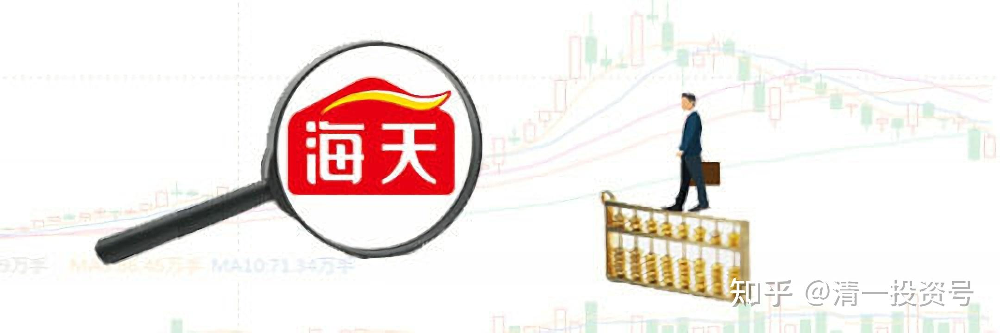
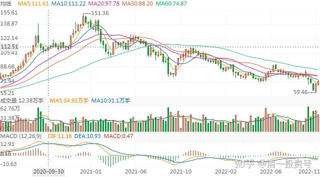

84篇.海天味业——各种指标的真实含义

清一山长 2020年9月～2020年12月

**1.市盈率和回本时间**

[清一山长](http://link.zhihu.com/?target=https%3A//xueqiu.com/9310099567) 2020-[09-04 08:02](http://link.zhihu.com/?target=https%3A//xueqiu.com/9310099567/158432332)

[$海天味业(SH603288)$](http://link.zhihu.com/?target=http%3A//xueqiu.com/S/SH603288) **市盈率111倍。您拿钱投海天的话，估计一百年回本**，分红率0.49%。活期利息都不到。估计够买酱油拌饭吃，坚持一百年，就拿回本钱了[牛]。当然，也许海天是成长股，估计中国人未来人口会下降，每天会少吃一口米饭，但每天都会多吃一口酱油的[大笑]。

另外，海天市值，可以拿来把四大“基建狂魔”全部买下来了。很纳闷特朗普怎么就要打击四大基建。干嘛不去打击海天？或者是因为知道特朗普看不上海天，我们才狂炒海天？看样子四大惹了特朗普没好处[大笑]

[世间成长路](http://link.zhihu.com/?target=http%3A//xueqiu.com/n/%25C3%25A4%25C2%25B8%25C2%2596%25C3%25A9%25C2%2597%25C2%25B4%25C3%25A6%25C2%2588%25C2%2590%25C3%25A9%25C2%2595%25C2%25BF%25C3%25A8%25C2%25B7%25C2%25AF)回复[清一山长](http://link.zhihu.com/?target=http%3A//xueqiu.com/n/%25C3%25A6%25C2%25B8%25C2%2585%25C3%25A4%25C2%25B8%25C2%2580%25C3%25A5%25C2%25B1%25C2%25B1%25C3%25A9%25C2%2595%25C2%25BF):

虽然海天贵了，但你这样算回本是明显不对的，那些银行有的才几倍市盈率，你几年回本了吗？

[清一山长](http://link.zhihu.com/?target=https%3A//xueqiu.com/9310099567) 2020-[09-04 08:30](http://link.zhihu.com/?target=https%3A//xueqiu.com/9310099567/158433914)回复[世间成长路](http://link.zhihu.com/?target=http%3A//xueqiu.com/n/%25C3%25A4%25C2%25B8%25C2%2596%25C3%25A9%25C2%2597%25C2%25B4%25C3%25A6%25C2%2588%25C2%2590%25C3%25A9%25C2%2595%25C2%25BF%25C3%25A8%25C2%25B7%25C2%25AF):

**银行还真的大多数都四五年回本了**。我们用宇宙行来对照：2014年年中，工商银行5倍的市盈率。四年后，收盘价5.4元。是不是正好回本了？而且，市盈率没有提升。还是5倍左右。海天四年后，能涨到400元的股价吗？[俏皮]

现在银行的估值，基本上相当于2013年至2014年上半年的水准。四五年后，难说又是一倍。

[北北w9z](http://link.zhihu.com/?target=http%3A//xueqiu.com/n/%25C3%25A5%25C2%258C%25C2%2597%25C3%25A5%25C2%258C%25C2%2597w9z)回复[清一山长](http://link.zhihu.com/?target=http%3A//xueqiu.com/n/%25C3%25A6%25C2%25B8%25C2%2585%25C3%25A4%25C2%25B8%25C2%2580%25C3%25A5%25C2%25B1%25C2%25B1%25C3%25A9%25C2%2595%25C2%25BF):

4年后到400真的不可能吗，你扪心自问下，茅台破700的时候你心里是不是也说过类似的话

清一山长 2020-09-04 09:26回复[北北w9z](http://link.zhihu.com/?target=http%3A//xueqiu.com/n/%25C3%25A5%25C2%258C%25C2%2597%25C3%25A5%25C2%258C%25C2%2597w9z):

我可没说不可能，真要说，海天破4000都有可能。五六年前，我认为只值两元的某很烂的教育股，还破过400呢！所以，我从来不做空。不敢跟中国酱酒，中国酱油的勇士们去作对。

但我也绝对不想加入你们，**我才不会去赌海天四年后一定过400**。所以我一股都不买[大笑]。我的钱，用来买啤酒了。说明**我认为四年后啤酒涨一倍的可能性，比海天要大**。我用钱来赌啤酒赢[俏皮]！我还赌中国建筑会赢。欢迎你们用钱来赌海天赢！当然，谁赢，谁输，就真不知道了。市场先生会给出答案的。也许是您赢，提前恭喜您[很赞]。

**2.市盈率和增长率**

[sunpeak](http://link.zhihu.com/?target=http%3A//xueqiu.com/n/sunpeak)回复[清一山长](http://link.zhihu.com/?target=http%3A//xueqiu.com/n/%25C3%25A6%25C2%25B8%25C2%2585%25C3%25A4%25C2%25B8%25C2%2580%25C3%25A5%25C2%25B1%25C2%25B1%25C3%25A9%25C2%2595%25C2%25BF):

你不算它每年的增长么？按每年15%的增长，大概16年后就翻十倍

[清一山长](http://link.zhihu.com/?target=https%3A//xueqiu.com/9310099567) 2020-09-04 11:41回复[sunpeak](http://link.zhihu.com/?target=http%3A//xueqiu.com/n/sunpeak):

如果您此说就算是事实，您也真相信您自己是用这个逻辑来做投资的。并愿意按照这个逻辑来买股，那么我问你：中国建筑每年都有15%以上的增长，上市以来的常年ROE，都在15%以上平均。而且手上已经拿了未来五年的订单，可以保证未来的这种增长是确定性的。现在它还按净资产打折出售。**您干嘛不买同样是15%成长的，目前是低价的，才0.8PB的中国建筑？偏要去买110倍PE，32PB的海天？**

第二：**海天企业的成长，跟您投入资本的成长，是不可能成比例增长的**。就算是您说的是对的，海天16年后，他的企业内在价值的确提升了10倍。万一它的价格，只是从110倍PE，提升到了11倍PE。您的这笔投入，赚钱了没？万一将来企业价值涨了10倍的海天，居然也来学中建，就算是成长股，市场先生也给了个垃圾股的价格，16年后它只卖5PE。您说，您赔了多少钱？不算利息？

我问的这两个问题，都是投资的基本常识。如果您不懂的话，只好说您没常识了[大笑]。我相信您是懂的[很赞]，祝您发财！

*2020年9月至2022年11月海天味业周线图*

清一山长 2020-09-04 11:56

我没敢说他们不能买海天，更不敢说海天一定跌。虽然我昨天说的，它今天跌了。但真不是我干的[为什么]。我真没去融券做空。我说了，海天也有可能会涨到400，甚至4000的。只是我不拿钱来赌它一定会涨到400，我还是拿钱赌中建涨到10元要靠谱些[大笑]。

**3.市净率和成本**

[清一山长](http://link.zhihu.com/?target=https%3A//xueqiu.com/9310099567) 2020-12-04 17:51

[$海天味业(SH603288)$](http://link.zhihu.com/?target=http%3A//xueqiu.com/S/SH603288)这瓶酱油，市值5896亿。它一家可以换：青岛啤酒（1312.75亿）加上燕京啤酒（241.83亿），珠江啤酒（223.32亿），加上重庆啤酒，惠泉啤酒等等。全部上市啤酒公司的市值总合，加起来，都不如一瓶中国酱油更值钱！

这说明：酱油比啤酒酿制过程更有技术含量。也说明：中国人认为，酱油比啤酒好喝得多[大笑]

**海天32倍的市净率，就是你认为：你需要花32倍的投资，才能制造出一瓶跟海天一样的酱油**。这绝对是高新酱油。估计海天酱油的门槛，比芯片制造技术都更高。

**啤酒两倍的PB，就是说，你卖出两瓶啤酒的成本，大致相当于燕京卖一瓶啤酒的成本**。所以，除非你降低成本，否则没法和燕京竞争。其实，我认为：你就算制造出与燕京一模一样的啤酒，燕京每卖两瓶出去，你未必能卖出一瓶，甚至只有十分之一瓶都很难。所以，2PB这个代价，不符合市场的事实。

至于酱油：我的习惯是，货架上有啥就买啥。我才不看海天还是海地产的呢！当然，估计我不是中国人。因为中国人只买海天[为什么]

**4.傻庄和成功的庄**

[清一山长](http://link.zhihu.com/?target=https%3A//xueqiu.com/9310099567) 2020-[12-09 21:25](http://link.zhihu.com/?target=https%3A//xueqiu.com/9310099567/165358486)

[$和顺石油(SH603353)$](http://link.zhihu.com/?target=http%3A//xueqiu.com/S/SH603353) 还真是的，这个股，傻庄自己套住了自己[大笑][大笑][大笑]。

不知道是不是某个有钱的土豪来做的庄。我一看图，就知道6月份主力把筹码都收走了，然后再也没机会派发出去。后来我去看股东人数，果然：4月份还有三万七千多人的，6月底就只剩9000多人。这庄，直接就解放了三万多人，这些散户，一去就不回头。而且现在跌了也不回头，现在只剩5000多人了。主力拿着筹码愁死了。换钱换不出来，根本就没人买，每天对倒吸引一点跟风盘（我才不相信主力每天能卖掉几千万的股票呢）。直到现在都是没有人接盘的样子，主力自拉自唱，把自己套在山顶了。现在慢慢走下来，手中的大把筹码，我看根本就派不出来。主力亏定了。

说实话；坐庄是个技术活。不是光有钱就行了。买股容易，卖股难。要让人愿意接盘，得动多少脑子？花多少功夫？别以为坐庄就能赚钱。很多牛人，唐建新之流的，就是坐庄做垮的。当年要是没坐庄，拿了钱老实投资买茅台，五粮，现在哪有林园的故事讲？

惠泉我只敢买200多万股，为啥？不是没钱，是没胆。真买多了，买入了燕京的股数，我真成庄了，自己把自己套里面了。就这200多万股，想出货都不容易，要等大机会。如果我拿个两千多万股，就傻眼了。自己都不知道怎么玩。所以，虽然我知道惠泉股性更活，还真不敢重仓。就怕当上“主力”就完了。

**坐庄赚一点钱，必须很耐心，很用心。要不断送钱给跟进的散户，给好处，给甜头，才有人不断跟进玩。**要上上下下不停的折腾股价，才赚一点差价钱。没瞧见惠泉的主力，就是不断折腾送钱散财吗？如果他直接一把就拉上去了，起码我就丢掉筹码再也不玩了。不可能9元还去买的。我9元多买，还不是因为他10元买了我的[俏皮]

所以，这个和顺石油的庄，真心不懂事。不懂分享。只管自己直接拉上去，真不是个聪明庄，一个独食庄。把自己吃进去了。以后就只能做第一大股东控股公司做实业算了。

看公司业绩也不好，分红1%都不到。庄家心里惨惨的。大叫：各位散户，救救我，我是庄！求求你们，快来呀[大笑]

[大股爱好者2](http://link.zhihu.com/?target=http%3A//xueqiu.com/n/%25C3%25A5%25C2%25A4%25C2%25A7%25C3%25A8%25C2%2582%25C2%25A1%25C3%25A7%25C2%2588%25C2%25B1%25C3%25A5%25C2%25A5%25C2%25BD%25C3%25A8%25C2%2580%25C2%25852)回复[清一山长](http://link.zhihu.com/?target=http%3A//xueqiu.com/n/%25C3%25A6%25C2%25B8%25C2%2585%25C3%25A4%25C2%25B8%25C2%2580%25C3%25A5%25C2%25B1%25C2%25B1%25C3%25A9%25C2%2595%25C2%25BF):

我感觉海天味业也是，山长兄怎么看？

[清一山长](http://link.zhihu.com/?target=https%3A//xueqiu.com/9310099567) 2020-[12-09 21:56](http://link.zhihu.com/?target=https%3A//xueqiu.com/9310099567/165360818)回复[大股爱好者2](http://link.zhihu.com/?target=http%3A//xueqiu.com/n/%25C3%25A5%25C2%25A4%25C2%25A7%25C3%25A8%25C2%2582%25C2%25A1%25C3%25A7%25C2%2588%25C2%25B1%25C3%25A5%25C2%25A5%25C2%25BD%25C3%25A8%25C2%2580%25C2%25852):

不是。**海天的庄是成功的。参与者众多，庄不是一个，多个庄联合的。庄懂分享，很多吃客一起来忽悠小散，一起享用大餐，而且吃相不难看，小散也有机会，不是独食庄**。

