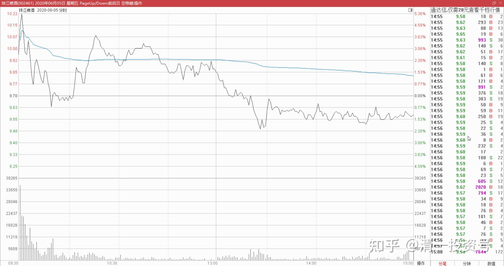
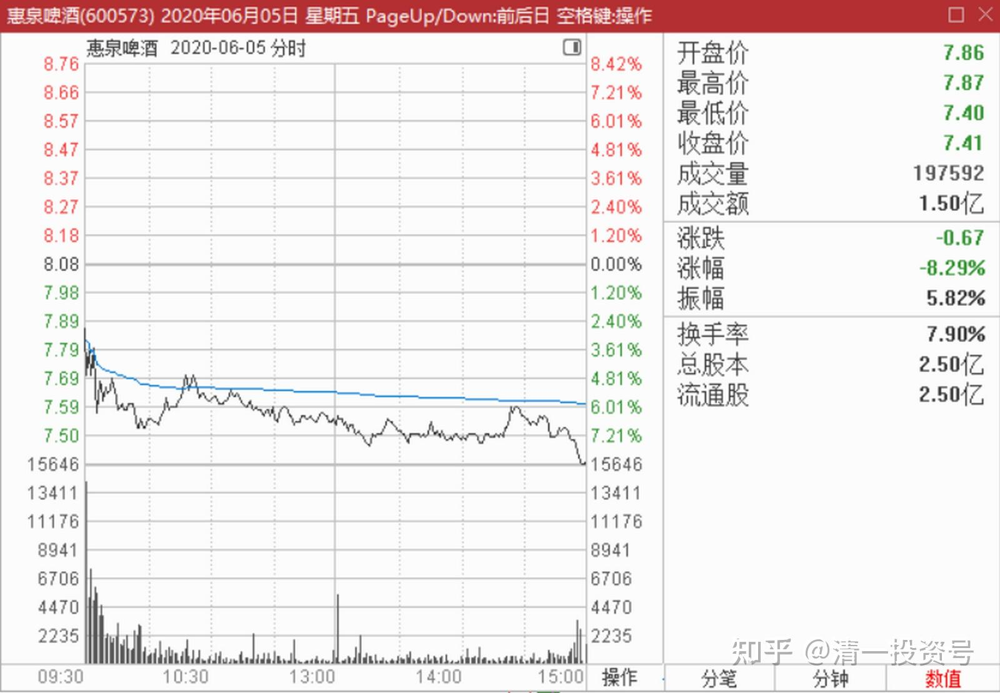
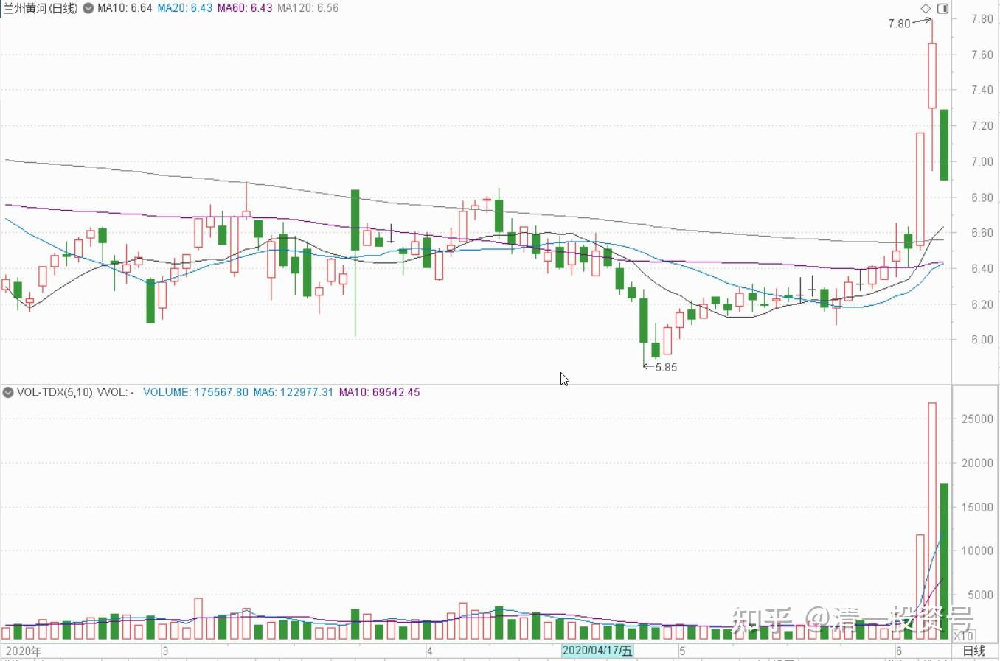
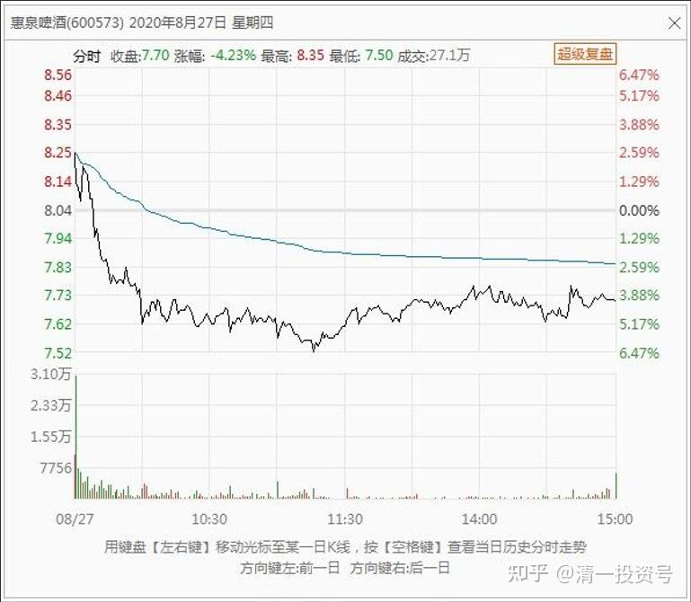
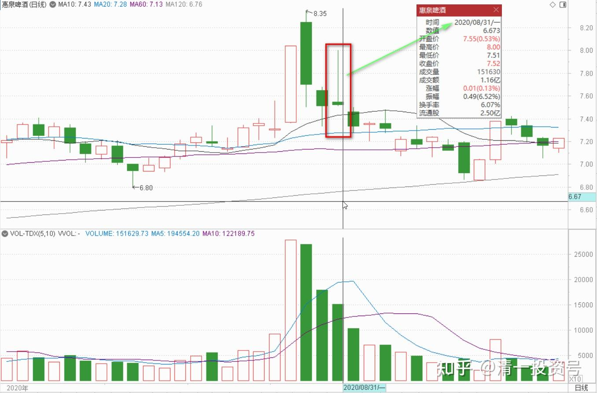
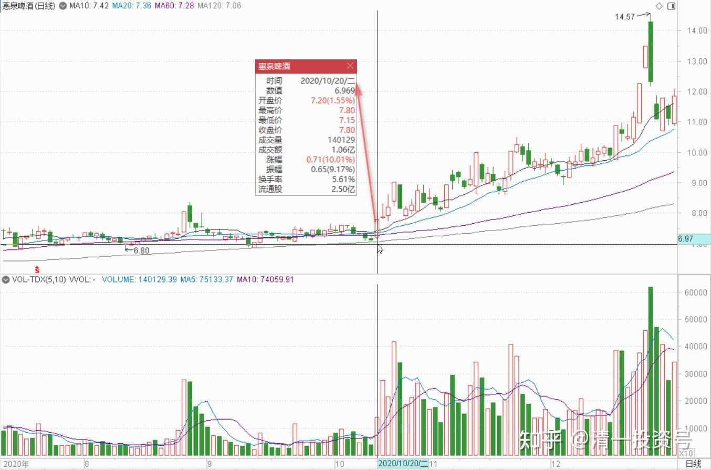
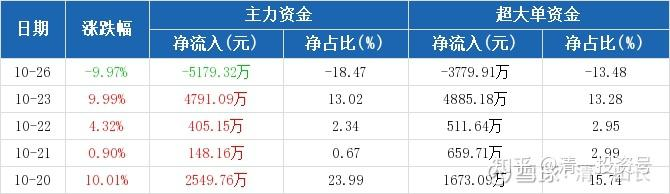

86篇. 游资闲谈二：快进快出的“小李飞刀手法”

清一山长 2020年6月-10月

一、明出暗进，明攻暗退

清一山长 2020-06-05 16:28:19

这张图是今天的珠江走势图，明天就看不到了。所以特别发在这里做个纪念。上午是主力派货，很成功，**可以断定是短炒的游资成功出逃了。**最后的一个多小时，却并不是出货，而是**长期的主力在慢慢收货。**我注意到9.50元有30万股的买单，下面两分钱下方9.48元，还有20多万股等着。估计是昨天涨停出货的人想低价买进来。但一直没有被打掉。如果有人急于出货的话，绝不会放过这种大单派货机会的。但交易却一直在9.50元上方不断出现几万股的成交，就是不碰9.50元小买单不断地吃掉抛盘。如果上方有较大的抛盘（五万股以上的），就会主动上浮10个价位去快速吃掉，然后有退下来，这种挂的卖单时间都不长，往往很快就没了。最后的一单也是上移吃货接盘的（9.58元）。尾盘的买卖挂单还看得到，可以看到上面都是小卖单，没有大卖单。因为有了就会被定点收掉。这个就说明：**珠江的主力惜售，9.7元上方。特别10元以上，高兴的派货，9.5元上下却在吸货。说明此波行情还没有完。后面还有大的机会。**

这张图是惠泉的，相比就完全两回事了。昨天就在借题材出货，不像珠江是洗掉跟风盘快速拉升。当然也有拉升的地方，但主力筹码的出逃迹象很明显。**核心点评就借势涨停出货，而不是真的要货。**你们别以为出货一定价跌，**聪明的高手会利用外围的人气来在涨势中出货的。**今天表现就更是典型了，盘面上一直是在派货，很明显的痕迹。比珠江主力差很多了。特别是尾盘，更是拿出了不加掩藏的“我就是不想要筹码”的典型走势。虽然上方的卖单看起来也不多，但与珠江不一样。珠江是往上吃推上去看不到大卖单。惠泉尾盘是往下打，涌进来的卖单。因为大一点的买单，都被抛盘打掉了。所以，短期内，惠泉走牛的希望不大。珠江短期依然处于强势。其实燕京相对也稳定得多。只是差价尚小，我还不想买入做T的砝码。想等几天再看。

**看图其实很难，第一张是明出暗进。盘面夸张，但人气极佳。今天高开低走，成交比昨天放大了很多。证明主力成功地拉来了不少同盟军。另一张图是看起来走势有点柔弱无力，假装几次上攻却有退下来。主力这样就悄然撤退。股价在慢慢的降低。**操盘手法上，珠江一流。惠泉比较平庸。可能是主力的实力差太远。恭喜昨天涨停卖出的主儿，你们赢了！我以五元多的惠泉持仓成本，继续看惠泉大佬们的表演。短期难以期待精彩演出了。我相信长期输不掉的。

二、快进快出的“小李飞刀手法”

清一山长 2020-06-05 18:13:01

$兰州黄河(SZ000929)$

**这就是游资---快进快出的“小李飞刀手法”。**徐翔的老乡们发明的战法。第一天涨停，量不大。因为别人还没反应过来。但他们消息灵通，知道第二天的风口是啤酒。所以，第二天拉珠江做龙头，宣传机器跟上，团队作战，这一天看起来黄河啤酒是跟涨，其实是出货。长长的上下影线，说明这一天很精彩（可惜我昨天没看）。今天是收尾了，底仓都全抛光了。就算是第一天涨停拿的货，也可以盈利跑掉，绝不恋旧，资金利用率极高。但是，昨天和今天才跟新闻----夜市要喝啤酒，因此跑来接盘的侠们，就只能老老实实的站在高岗上等“解放军”了。继续等下一个风口。

处理方式：如果你没有持仓，就看看就行。如果你正好持有，昨天是跑掉的最佳时间，实在来不及，今天接着跑[大笑]，你还要感谢宁波解放军的到来。

这个股市值真低。涨了也才12亿，真心不贵。不如把啤酒业务直接卖掉算了，可能指标和市场都比自己做更值钱。估计是没人接盘。

清一山长 2020-08-27 10:29:20

$惠泉啤酒(SH600573)$ **今天走势，证明是游资手法。没有长远的规划，吃相特别难看。**早盘一个小时，已经成交一个多亿。游资应该已经顺利脱身了。证明昨天涨停，出掉一些仓位，换燕京是明智的。可惜没有全出。今天出，也没机会了。我的持仓其实比二季度显示出来得到高，因为上次卖出后，后来全补回来了。这一次卖出，是否要补仓，我慢慢看看再说，不急。**游资这样大进大出，造成的扰动，会造成较长时间的沉寂期。**因为已经换了燕京在手，心中不慌。也许燕京继续涨，惠泉继续跌，又给我最佳的换仓机会呢[俏皮]！

清一山长 2020-08-27 15:36:26

$燕京啤酒(SZ000729)$ **昨天的研判正确，很开心，不是因为赚了钱，惠泉一跌换燕京一涨，多了9%的利润，而是因为此战证明我的看盘能力并没有消退，判断燕京两天内必涨的判断也证明了正确性。**我一次性就把这两只股票的主力手法，都基本上看透了。而且加仓燕京的时机，以及仓位，把握都还不错。

思考：青岛啤酒可以有6倍的PB，重庆啤酒可以有43倍的PB。那么，燕京的漓泉，应该也有43倍的PB。因为漓泉的市场占有率更高，具有更强的垄断地位。综合一起来算，燕京最差，也应该有3.5倍的PB。所以，目前来看，燕京向上的空间还很大。惠泉不知道该给多少PB，投机的空间也不错，至少2PB是低估了。

反省：昨天的惠泉盘面上，不断看到买盘堆积从几万手，降到几乎零，又很快的恢复上去。这是主力换单，让跟风者有机会去接抛盘的手法。我应该发现昨天的跟风接盘并不特别的多，虽然抛盘也不多。所以我应该借机全部抛售是难得的机会，考虑过一单就卖出一百万股的，两次就全部卖光了。但我没有这样做的原因，是因为我误判为是主力故意示弱，制造接盘不足的恐慌。所以没有彻底抛空。不过，已经走了不少仓位了，更买了不少燕京，比抛出惠泉更多的仓位。所以，我已经很满意了。

祝贺各位啤友，大家一起hi啤！

清一山长 2020-08-31 14:54:05

$惠泉啤酒(SH600573)$ 今天这个走势，就是说：我还要继续跌。俗称上吊线。不过我不卖了。成本4元多，没啥好担心的。

清一山长 2020-09-01 12:05:00

上个交易日的“上吊线”出现后，今天果然“上吊”了。今天继续跌。把这次涨停的幅度，已经全部跌回来了。**证明这次游资袭击，果然是快进快出。**我比上次涨停多出了4倍的量，算是学乖了一点，从庄家身上捞了一把。加上燕京上涨赚到的双方差价部分，此次操作算是很成功的，差价有15个点了。我继续看空不做空。如果继续低迷，不排除重新买入筹码。

三、涨停是否减持的思考

清一山长 2020-10-20 13:29:46

$惠泉啤酒(SH600573)$ 今天是惠泉今年来的第三次涨停。一个多月来的第二次涨停。以三大的身份，以及三季度大量增持的眼光，享受了这次涨停，感觉还是不错的，自我表扬一下。

上次涨停，我抓住机会，减持到只剩90万股了。这一次涨停，我是否也要减持呢？思考一下：

**第一：时机。**上次是下午才拉的涨停，且几次被打破涨停后被拉上去的，说明浮筹码尚多，所以走掉是明智的，其实我应该全部走掉的，连90万股都不应该留。而今天是上午涨停，而且没有量，说明这一次的浮动筹码很少了。成交还没有上次的一半。

**第二：从成交量上来看，今天不需要涨停就跑。**目前只有11.85万手成交，几千万筹码。压力很轻。

**第三：基本面配合情况分析：上次涨停，是没有业绩来配合的游资拉升。本次的三季度，报表业绩非常的好。双位数的双增。**说明惠泉在啤酒市场总体萎缩的局面下，逆向成长，殊为不易！加上走势上的量价配合良好，今天还不是出货的时候。除非换股。

如果燕京没涨的话，我再换回来7元多的燕京，就划算了，看燕京也涨了不少，价格上，比惠泉差价也不大，就一毛钱，就先等等再说。上一次燕京换惠泉很划算。这一次，再等几天看看！

清一山长 2020-10-27 19:21:13

$惠泉啤酒(SH600573)$ 惠泉啤酒2020年10月26日收报8.13元，涨跌幅-9.97%，换手率13.58%。当日该股主力资金流入5342.98万元，流出1.05亿元，主力净流出5179.32万元。其中，超大单流入669.14万元，流出4449.05万元，净流出3779.91万元。当日散户资金流入2.21亿元，流出1.7亿元，散户净流入5179.32万元。资金流向分布情况如下图：

我的分析五天前的交易日，涨停7.8元。主力是打压制造恐慌后同涨停拿货的。**上周五的涨停，主力是拉升目的。资金大量流入。但昨天主力资金撤退。散户资金接盘。主力退出的资金，大致上与前一天拉涨停的资金相同。可以说主力基本上全身而退，用极为罕见的跌停出货法，快速完成了换仓。还是游资打法——快进快推，不恋战。**后市如何不好说。可以继续高举高打，也可以长期调整。我觉得看其他两个啤酒的走势，可能惠泉不至于长期低迷。短期就不知道了。以下资料供参考。**我认为：敢于用跌停来出货的主力，绝非凡人！操盘手段一流，不好预测。**只能尽量让自己站在不败的地位上，就算判断错误了也不会损失。这样才能玩惠泉。由于涨停我几乎全出了，所以目前的地位很有利。只要买入数量不超过我的卖出数量，就吃不了亏。最多把这次赚的钱赔回去。

参考链接：

[清一投资号：85篇.游资闲谈一：进货与出货手法及散户如何防骗？](https://zhuanlan.zhihu.com/p/585167445)

[清一投资号：87篇.游资闲谈三：炒股秘诀——看空不做空](https://zhuanlan.zhihu.com/p/591303412)

[清一投资号：88篇.游资闲谈四：吃亏的游资，饱食的游资](https://zhuanlan.zhihu.com/p/593039607)

