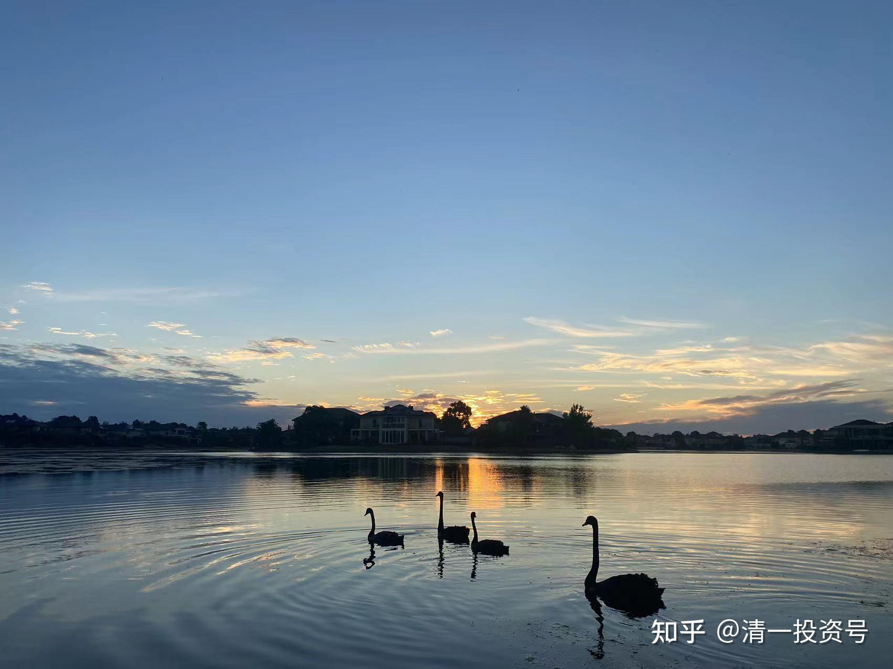
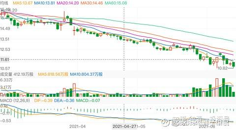
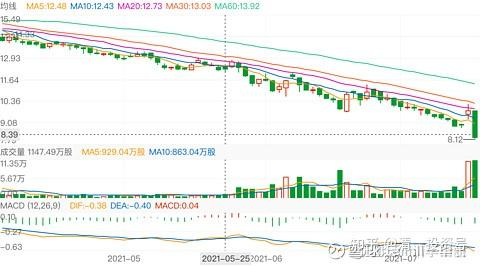
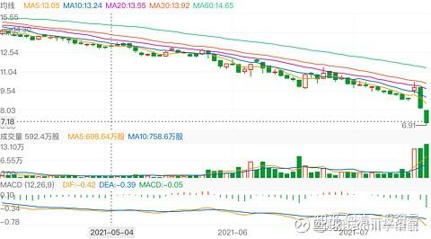

38篇.黑天鹅无处不有——恒大启示录

清一山长2021年5月～2021年9月

清一山长雪球非专栏帖子整理文章，第38篇《黑天鹅无处不有——恒大启示录》

[清一山长](http://link.zhihu.com/?target=https%3A//xueqiu.com/9310099567)[2021-05-30 08:58](http://link.zhihu.com/?target=https%3A//xueqiu.com/9310099567/181259816)

去年十月恒大集团地区公司商票的利率就已经由20%上升至33%～38%。

看了这些信息，就知道：能够拿到4%以下融资利息的放弃是多么的可贵。恒大是第一个让我赚大钱的内房股。真担心的现状，估计熬不过去了。干嘛不卖汽车来还债？有5000亿市值呢！

不过都是虚的，母公司恒大一旦出问题，恒大汽车一样数千亿就化为虚无。别看它高点时可以买下3个中国建筑。其实都是虚的，没人会跟它换的。

[清一山长](http://link.zhihu.com/?target=https%3A//xueqiu.com/9310099567)[2021-06-15 15:42](http://link.zhihu.com/?target=https%3A//xueqiu.com/9310099567/183050122)

[$中国恒大(03333)$](http://link.zhihu.com/?target=http%3A//xueqiu.com/S/03333)提醒大家小心，这只股一路阴跌，底部放量的走势。要么后续是换手，底部散户惊慌逃走的筹码，被主力震仓接走了，后续就看涨。如果是一些实力大户，有内幕消息，不计成本地抛售逃走。贪便宜赶紧来的无知散户拿了这些筹码，后续将继续跌。这两种可能，大家都做好准备吧！我也不知道是哪一种可能，但我不敢入坑，只敢看看热闹，打打酱油。不做空，也不做多。

我不是恒大黑，我恐怕是雪球这里买恒大最早的人之一。恒大是第一只总共帮我赚了上千万的内房股，所以我对恒大是很有感情的。2017年卖掉恒大股票后，我还用恒大赚到的利润，买了2000多平方的恒大现房---号称**“公园里的家”**的郊外旅游地产，价格很便宜。现在看它跌到这样，感觉比当年我3元港币买入恒大的时候更难过。当年虽然股价才3元，但我对它信心十足，买了差不多300万股。现在虽然还有10元的股价，但我已经不敢买了，再跌到3元我都不敢买了。当年3元买入，一年的分红就有17%（记得是0.54元的分红，拿了两三年的分红后走掉的）。现在股价涨了，但股息跌了，每股才0.18元了。风光万丈的恒大，居然还不如当年低迷，被人看低快破产的时候股息多。我更担心的不是股息，而是会不会年报就亏损了？现在，恒大高息债券都发不出去，看着怕怕！

[清一山长](http://link.zhihu.com/?target=https%3A//xueqiu.com/9310099567)[2021-7-19 22:23](http://link.zhihu.com/?target=https%3A//xueqiu.com/9310099567/191094360)

[$中国恒大(03333)$](http://link.zhihu.com/?target=http%3A//xueqiu.com/S/03333)就为了还不上广发银行1.32亿的欠款，居然导致市值丢掉了一百多个亿。这得，这失的。

提醒一下：上周五的上涨放量，10个亿的成交是假的，用强势反弹来诱多。今天全部跌回来还有多的，这一次抢反弹的多方全阵亡了，阴包阳，前途凶险异常。我个人判断——恒大就算不死也要脱层皮，将来再也无力争雄天下了。许总惹上大麻烦了，除非他早就想好了脱身之计，否则，未来将迎来真正的下跌。恒大的慢慢熊途，才刚刚开始！我心中的财富英雄，又要倒下一位了。恒大——地产股中我第一只赚到达到8位数的港股财富英雄，就这么快奔向末路了吗？

[清一山长](http://link.zhihu.com/?target=https%3A//xueqiu.com/9310099567)[2021-7-20 13:45](http://link.zhihu.com/?target=https%3A//xueqiu.com/9310099567/191175531)

[$中国恒大(03333)$](http://link.zhihu.com/?target=http%3A//xueqiu.com/S/03333)昨天就说了：恒大走势凶险。不要去抢反弹。今天果然继续狂跌。

才半天，成交量已经突破了昨天一天的数字，创了新高。说明场内资本在竭力外逃。今天勇敢抢进来接盘的恒大多方，我看大概率要被埋。今天还带坏华人置业的股价也狂跌不止。

这一轮，恒大真的不好过了。一波接一波的打击，许老板今年真心不容易。何必做这么大呢？两年前就收手，学道家急流勇退，不再野心勃勃得不断扩大债务，守成就好。起码不扩张，啥都稳了。去年疫情，也拼命的四处出击，不是找死吗？许家印应该多看看**《道德经》**的，就不会犯这个错误了。

其实恒大是家好企业，被穷折腾作死的，贪欲太大了。比较之下，中国海外宏洋集团(00081)和万科的稳健，才是真的靠得住的公司！恒大这种激进的做派，有点玄。短期没事，长期靠不住的。**极端低估的时候可以买，高位崩塌的时候离远点。**不好意思，资本就是很无情的。不会因为你过去的情面来拯救落难的你。特别是基本面走坏了，所有人都会远离。

其实人也一样：**低位的时候，依然努力上进的人，值得交朋友。但高位垮下来的人，交往的价值真没有意义。**你**不可能去替他接飞刀的。**所以，提醒各位**身处高位的人：你能够守住就算赢了。别为了去赚自己根本就不需要的钱，却丢了自己根本就输不起的老本！**许老板就是干了这种蠢事！[滴汗]

当企业得不到银行的支持，当银行集体不给恒大的购房者放贷款的时候，恒大的房子咋卖？一个**“歧视性政策”**就能搞死你。恒大可能成为未来中国房产国家大战略的第一个牺牲者。不知道收敛的，都将以此为榜样。

[清一山长](http://link.zhihu.com/?target=https%3A//xueqiu.com/9310099567)[2021-08-27 10:28](http://link.zhihu.com/?target=https%3A//xueqiu.com/9310099567/195838950)

三年前，花旗给恒大的评级是买入，目标价是25元。现价是4.37元；给融创中国的评级买入，目标价60元，现在三分之一的价格都不到；给绿城中国的评级是沽售，目标价是6元。这三个股我都买过，我记得恒大是2015年左右买入的，价格3.1港币，外资给的评级是卖出，目标价是2港币。融创中国我是5港币买入的，当时有人说要到2.5元。等这些外资大行吹票时，我就跑了，恒大上十就开跑，最后22元跑光，没有等25元；融创中国37元跑光，没有等60元。买入了外资沽售的绿城，还有中国海外宏洋。我全作反了，如果相信这些大行专家，我估计早破产了。记得中国宏桥3元的时候，他们还要鼓励你卖出，信他们你就完了。

[https://xueqiu.com/1009375290/195039679](http://link.zhihu.com/?target=https%3A//xueqiu.com/1009375290/195039679)

[清一山长](http://link.zhihu.com/?target=https%3A//xueqiu.com/9310099567)[2021-09-14 14:35](http://link.zhihu.com/?target=https%3A//xueqiu.com/9310099567/197700949)

[$中国恒大(03333)$](http://link.zhihu.com/?target=http%3A//xueqiu.com/S/03333)恒大跌到2元字头了。终于出现了一倍市赢率的股票，恒大。如果不谈特别分红，不想转移资产，不去惹翻债主，恒大也不至于这么狼狈吧？特别是一些地方银行出台政策，恒大的楼盘不给按揭融资，这一招就直接要了恒大的命。除了低价卖项目，卖资产之外，已经别无出路了。这样算起来，恒大活下来的可能很小。现在的1PE优质股，0.17PB，打折到骨折的价值股，明年恐怕就变成巨额的亏损股，ST股。

只会看PE、PB炒股的人，今天学了一大课没有？**千亿买来的教训。苏宁花了200亿，持有市值4000亿的恒大，现在跌去了90%**。这些老板脑子坏了吗？有200亿，你去买中国建筑、中国银行不好吗？买这些靠不住的民企，还这么多钱，不是找抽吗？我五六年前，只买了几百万股恒大，总金额限制千万以内。都是当可能丢了的钱。不然我会买上上千万股的，那就赚死了，上亿都赚进来了。但我不敢，就怕它突然黑天鹅。苏宁投200亿，也不怕黑天鹅？太不珍惜金钱了！

对于企业来说，现金就相当于血液。当恒大最需要补血的时候，不但得不到补血（融资卡死了，现在谁还敢借钱给他？销售收入端卡死了：银行不给按揭，出售资产端卡死了——同行等着以破烂价买便宜货）。这些缺血政策，可能就导致根本就不该死的恒大，死在这个冬天。

对此感到难过——曾经从恒大赚了一笔不小的钱，现在还住在用恒大利润买来的恒大房子（各位看到原来发的照片上，可以容纳100多人的培训大厅，就是我的恒大自购房子，总共两千多平方）。现在恒大要面临这个比几年前，它去香港打牌更艰难的处境，我都担心它过不去。五六年前，许老板抱着大把钱，去香港买自己的股，和唱空的空头叫板。我也选择了与许老师同进退。今天呢？许老板一字不提回购，我也只是远远地看着，感到阵阵的凉意。感觉自己持有的地产股，会不会也被跟着带崩了，我还持有中国海外宏洋，还有绿城中国。我认为不买国内的房子，也可以买地产股。目前虽然是账面盈利中，但会跟着带崩不？

[清一山长](http://link.zhihu.com/?target=https%3A//xueqiu.com/9310099567)[2021-09-14 18:15](http://link.zhihu.com/?target=https%3A//xueqiu.com/9310099567/197730842)

[$中国恒大(03333)$](http://link.zhihu.com/?target=http%3A//xueqiu.com/S/03333)查看了一下恒大的贷款：[民生银行](http://link.zhihu.com/?target=https%3A//xueqiu.com/S/SH600016%3Ffrom%3Dstatus_stock_match%26xueqiu_status_id%3D197708820%26xueqiu_status_from_source%3Dhtl%26xueqiu_status_source%3Dstatusdetail%26xueqiu_private_from_source%3D0105)293亿元、[农业银行](http://link.zhihu.com/?target=https%3A//xueqiu.com/S/SH601288%3Ffrom%3Dstatus_stock_match%26xueqiu_status_id%3D197708820%26xueqiu_status_from_source%3Dhtl%26xueqiu_status_source%3Dstatusdetail%26xueqiu_private_from_source%3D0105)242亿元、浙商银行107亿元、[光大银行](http://link.zhihu.com/?target=https%3A//xueqiu.com/S/SH601818%3Ffrom%3Dstatus_stock_match%26xueqiu_status_id%3D197708820%26xueqiu_status_from_source%3Dhtl%26xueqiu_status_source%3Dstatusdetail%26xueqiu_private_from_source%3D0105)100亿元、[工商银行](http://link.zhihu.com/?target=https%3A//xueqiu.com/S/SH601398%3Ffrom%3Dstatus_stock_match%26xueqiu_status_id%3D197708820%26xueqiu_status_from_source%3Dhtl%26xueqiu_status_source%3Dstatusdetail%26xueqiu_private_from_source%3D0105)94亿元、[中信银行](http://link.zhihu.com/?target=https%3A//xueqiu.com/S/SH601998%3Ffrom%3Dstatus_stock_match%26xueqiu_status_id%3D197708820%26xueqiu_status_from_source%3Dhtl%26xueqiu_status_source%3Dstatusdetail%26xueqiu_private_from_source%3D0105)94亿元等。

我要哭了，我持有一些民生银行，这一回民生又爬不起来了。还有农行。我以为不买恒大就没事了，看样子：不买恒大我也要被拖下去水。只是还好，不至于拖死。

**黑天鹅无处不有，千万别死磕一家。连行业龙头都靠不住。**恒大也当过房地产第一名的。这老大，也不好当。一哥可能还是万科靠谱。

[清一山长](http://link.zhihu.com/?target=https%3A//xueqiu.com/9310099567)[2021-09-16 11:30](http://link.zhihu.com/?target=https%3A//xueqiu.com/9310099567/197946707)

[$中国恒大(03333)$](http://link.zhihu.com/?target=http%3A//xueqiu.com/S/03333)底部放量，一些人在亡命，一些人在搏命。双方谁才是聪明人？

[清一山长](http://link.zhihu.com/?target=https%3A//xueqiu.com/9310099567)[2021-09-17 16:21](http://link.zhihu.com/?target=https%3A//xueqiu.com/9310099567/198129717)

[$中国恒大(03333)$](http://link.zhihu.com/?target=http%3A//xueqiu.com/S/03333)据港交所股权披露，许家印老友刘銮雄于9月10日减持恒大2443.6万股，均价3.5812港元，持股比例由8.96%下降到7.96%；当年联手作战大空头的老战友都慌了，27元不卖的股，现在3元多都在卖。收回一点算一点。看样子对恒大已经彻底失去希望了。这一大笔财富说没就没了，不知算总账，刘老板赚了钱没有？现在跌到2元多，一直不止跌，我猜与刘老板都开始卖股跑路的消息有关。铁杆老兄弟都扛不住了！

[清一山长](http://link.zhihu.com/?target=https%3A//xueqiu.com/9310099567)[2021-09-19 08:03](http://link.zhihu.com/?target=https%3A//xueqiu.com/9310099567/198229705)[$恒大汽车(00708)$](http://link.zhihu.com/?target=http%3A//xueqiu.com/S/00708)今年2月份，这个股72元的时候，你知道9月份居然就只要2元多吗？比它大涨之前的6元起涨点，还腰斩了？

看成交量，高位一直没放量，月度换手率，也才1%左右。显然就知道主力是自弹自唱的。傻瓜才去接盘，但显然还是有傻瓜冲进去了。这个股的暴涨，就是恒大老板心态变坏的证据：一辆汽车都没有生产出来，凭啥有7000亿的市值？（现在291亿，我看都贵了）。他已经不再愿意老老实实的干活了，正在玩**金融骗术、财富障眼法**。而且，骗谁？恐怕是骗银行质押的。否则自己都把自己的股票买光了，谁手上都没有。谁要？当然，还有一种方法，就是维持高位，等别人习惯了，慢慢地卖。不过资金链撑不住了，只好跌下来了。于是就这样腰斩、腰斩，再腰斩，再腰斩。要上港股杠杆的话，够斩你十次了。

[清一山长](http://link.zhihu.com/?target=https%3A//xueqiu.com/9310099567)[2021-09-19 08:17](http://link.zhihu.com/?target=https%3A//xueqiu.com/9310099567/198230053)

0.3元买进，50元卖出，大赚40亿。20元补仓回来。自以为至少是白赚30元的差价，美美地想包赚不赔。结果下跌，又补仓，最终赔光。真的是一场财富梦。数十亿的财富幻梦。

其实，**进了赌场，万一真赢了一次，就赶快离开。这才是聪明人**。40亿，你一辈子都花不完了，还要啥？400亿吗？

但**，赢了一次，还想两次。赌场就是这样算定了你，遇赌必输！**

70元成本，与0.3的成本，都不重要。只要上满杠杆，都一样是输光。

如果低调一点，只补回原来的头寸，不超仓。最终他至少还有60%的财富留下来，20多亿，也够了。

所以，**贪婪，是人生最大的敌人。企业的贪婪，也是企业最大的敌人，自寻死路。**

[leek张](file:///C:/Users/ELLA.DESKTOP-K0U01F4/Documents/Tencent%20Files/350621521/FileRecv/leek%E5%BC%A0)[https://xueqiu.com/3600180799/198222209](http://link.zhihu.com/?target=https%3A//xueqiu.com/3600180799/198222209)

[$恒大汽车(00708)$](http://link.zhihu.com/?target=http%3A//xueqiu.com/S/00708)大起大落

[清一山长](http://link.zhihu.com/?target=https%3A//xueqiu.com/9310099567)[2021-09-20 14:01](http://link.zhihu.com/?target=https%3A//xueqiu.com/9310099567/198282911)

这些根本就不创造价值的人大赚其钱，而恒大的员工，一点点工资还要强迫收回去“理财”,这个社会公平吗？

[出尘之想](http://link.zhihu.com/?target=https%3A//xueqiu.com/8361003113)

任泽平老师1500万年薪不会都是白条吧？据说任泽平老师也被要求买了内部理财产品，没有兑付。

[清一山长](http://link.zhihu.com/?target=https%3A//xueqiu.com/9310099567)[2021-09-27 15:39](http://link.zhihu.com/?target=https%3A//xueqiu.com/9310099567/198899895)

[$中国恒大(03333)$](http://link.zhihu.com/?target=http%3A//xueqiu.com/S/03333)国企入住。恒大就有救了吗？是看谁有救了。我认为：首先是买恒大房子的居民有救了。这些人，是政府要保护的“人民”，当然要救。不然影响面太大。其次是工程商。干活的工人有救了，不能光干活，还赔钱。让工人拿到工钱，很重要。不然房子怎么盖出来交付？都要烂尾的。再其次，是银行有救了，恒大的房子，只要不烂尾，有人愿意接盘处理后事，银行就不会坏账。再其次，是各种理财的债主。欠债还钱，理所应该。不过，得等上面的三类人，先解决他们的问题，最后才能轮到债主。

据说先国内，再国外。最后——才轮到**“股东权益”**。这样处理起来，恒大绝对是巨亏的局面，不可能是不到一倍的市盈率。别等什么分红、股息了，更别指望股票大涨了。就算涨了，也是自弹自唱，假的，基本面不支持的。

你们真的别指望：恒大国企接手，就可以照顾到所有的相关利益者。其实，我个人认为：估计还款到**“国内外债务”**这一关，恒大就没有任何资产，可以拿得出来了。恒大的PB就打到零了。汇丰银行都已经知趣地把两亿元的恒大美元债计提了损失。如果连银行都拿不到钱，你们股东还想赚钱？做梦吧！

炒股的人，是股东，你们都是维稳的最后一环，分剩下的还有的话，才是你们的。我认为：基本上不会有啥资产剩下来给股东的。所以——各位，别见到利好就冲进去了。有机会恐怕还是逃走好一点，不过，估计现在逃不逃都差不多了。跌了90%，也基本算是归零。你别现在冲进去，再来个90%的跌幅。

我真的不太相信恒大还能东山再起。国企也是一群狼，不会自己拿钱出来背恒大这个负担的。就算恒大有一些部门将来还存在，甚至还能发光彩（比如恒大汽车真的造出了比特斯拉更好的车），我认为：这车也跟许家印没关系了。许家印从此已经和恒大无关了。清理工作过渡完，就结束历史使命了。

各位股东的命运，基本上和许家印是一致的，他没戏，你们也没戏。

感叹：好一场大戏。许家印这一生，也玩得精彩激烈之致了。如果2017年他就放手（我就是2017年彻底退出恒大的）。不要再进取，保守稳健经营，尽量留钱备用。今年出来拯救世界的，可能就是许家印大英雄了。他当年勇气太强了，出来跳太多，结果今年就是成为死在沙滩上的前浪。这么多年打下来的江山，终究成为国企轻松拿走的胜利品。他还剩下啥？也许历年来他分红的资产，没有拿出来继续乱投？今生他依然是富裕阶层，无论算千亿、百亿，都不少了。如果他自己的投资PPT，把自己都说服了，他把自己分红收到的钱，都一起跟投完了，现在他就只能**“回归原始状态”**了，成为一个划过天空的最亮的流星。

血的教训，再度提醒我自己：以后**只买最靠谱的国企长投**。**资本市场上，活下来，才是第一重要的事情，赚多赚少都不重要。**

（刚看到网上，万科A负债，仅次于恒大，有点诧异，看样子中海系还是靠谱一些）。

点评：其实救恒大并不难，恒大的危机，是没人敢买恒大的房子，还有就是银行不给恒大的房子按揭，所以造成了流动性危机。一旦有人接手，信誉恢复，居民敢买恒大的房子了，银行敢给恒大的房子贷款了，资产流动起来了，就解决问题了。当然，很多可能的亏空，原来藏起来的烂账，肯定就不能藏下去了。这些烂账，应该会让债券持有人背锅，股东资产直接清零，大约就是这样的处理程序。

很聪明：这种程序，**损失的是投机的股东，以及海外的美元债，部分国内的高息理财**。但国家的基石——居民、银行系统，一切正常。一些国企，可以捡到倒下的“大象”，大家可以慢慢的吃个够。

[清一山长](http://link.zhihu.com/?target=https%3A//xueqiu.com/9310099567)[2021-09-27 15:42](http://link.zhihu.com/?target=https%3A//xueqiu.com/9310099567/198902631)

写完本文之后，我突然明白：恒大22日开会，许家印最后出来说的**“保交房”**到底是啥意思了，这是恒大最后的绝唱。恒大未来唯一的任务，其他都别谈了。以后，这个地产界曾经的龙头品牌，从此消失了。
