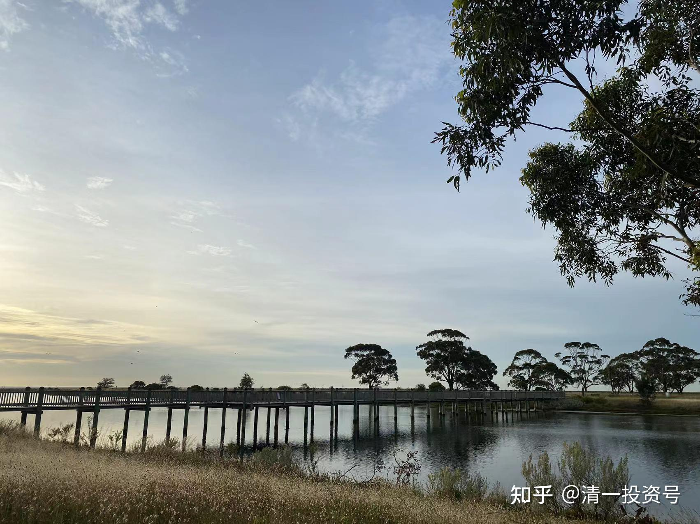
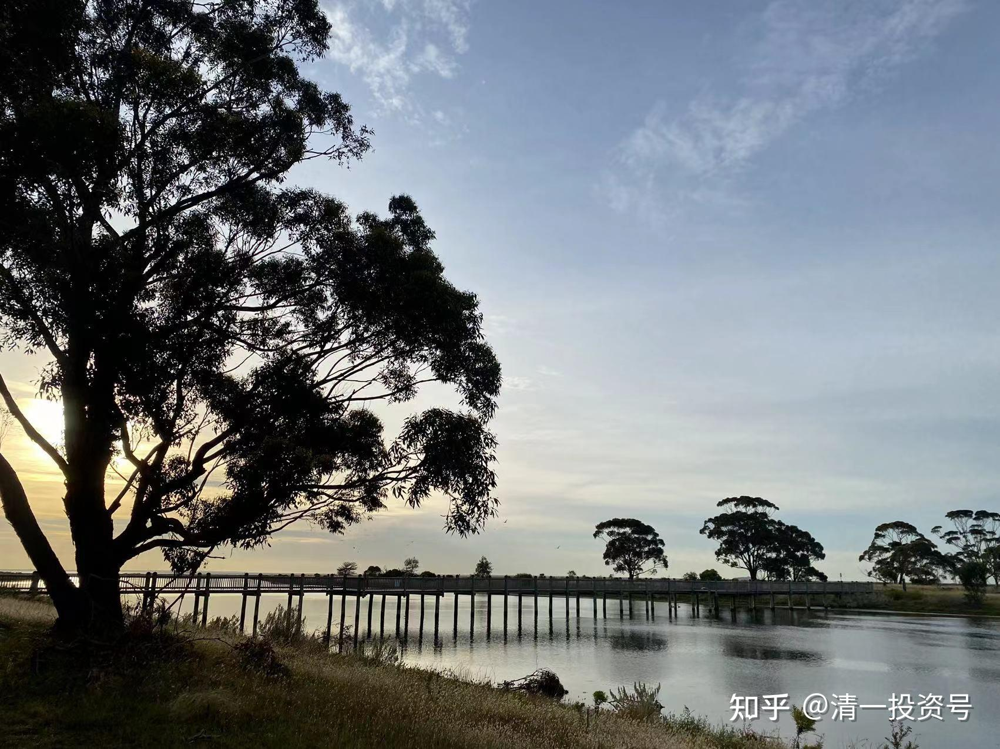

原40篇.无论地产多惨，中海系不会垮

清一山长 2018年4月——2021年10月

清一山长雪球非专栏帖子整理文章第 40篇 《无论地产多惨，中海系不会垮》

灰色钻石$中国海外宏洋集团(00081)$ 港股市场总是不缺捡钱的机会。我比较喜欢在管理层大股东增持价格以下买。1-2月销售增长130%，销售均价也同比大增30%左右，先买1m 放着，不着急。另外我对00081没有仔细研究，报表估计也就看了1个小时，只是觉得大股东的钱肯定也是钱。此股前段时间被控诉供股坑小股东，所以想买此公司的千万自己做主。

清一山长 2018-04-13 17:12 · 来自雪球

支持楼主的购买逻辑。看大家吵供股吵了半天，挺没意思的。要弄清楚供股是否伤害了小股东，很简单：如果你真的认为大股东利用供股占了便宜，稀释了股权。那么你不服气，就比大股东更低的价格参与供股。比如你现在就可以比大股东低10%以上多买一点股票。

其实，大股东如果想要涨，直接二级市场买入10%的股票就涨上天去了。如果大股东4.08元肯要货，现在也可以直接市场上买。别人不买，只是因为要给点流动性。要给小股民赚点钱，赚点人气。不是别人买不起。小股民别把自己的几文钱看的比天还大。

我个人觉得：这一次供股，很像两年前中国宏桥供股。公布后股价下行，大股东包销。有意为之的，别人要的是股权，也说明管理层后市看好公司。是很明白的信息。我就是宏桥4元多供股之后，市场一片骂宏桥的声音，很多人都卖出，股价低于四元的时候大量买进了宏桥。这是送钱的机会，干嘛不要？

不过，宏洋的情况我还不清楚。正在研究中。只是看有人坚持认为供股就是出千，就是损害小股东，认为不合逻辑。

清一山长 2018-08-08 13:06 · 来自雪球

中国海外宏洋我也套住了。有钱就继续补补仓，更便宜了为啥不要？光想涨了卖给别人吗？不如跌了就多买一点。我相信这种国企是不会出老千的。这是港股最大的风险。就是分红少了点，有点遗憾。

清一山长 2020-01-03 12:56 · 来自雪球

$绿城中国(03900)$ 今天才看到，我持有的绿城终于涨过10元了。这笔投资，一直是我的笑话。当初3元买了恒大，5元买了融创。22元多清了恒大，37元清了融创，然后换了绿城，套了两三年，长期绿色，中间浮盈了几百万也没走。害得我的港股账户一直很难看。现在到了翻身时刻吗？另外还持有数量不少（M级）的花样年，中国海外宏洋，还有一点剩下的中国金茂等。房地产，是我一直不敢不持有（因为中国人太爱买房了），但持有后又很纠结的股票，总觉得在中国买房产长期来说靠不住，不像是可以拿十年的股。没啥核心竞争优势，就是个泡沫，但在泡沫中狂欢也挺刺激的。虽然房地产股帮我赚到了8位数的利润，我还是想择机退出，买个机场、港口、高速之类的股票，未来十年就稳稳拿股息好了。用老巴的话说，就是找个傻瓜也能赚钱的行业去投资。房地产是傻瓜企业吗？不太像。

清一山长 2020-04-23 23:11 · 来自雪球

忘了告诉大家：我当年卖掉正通，我买入的这只地产股票是中国海外宏洋，总仓位超过3M了。说了卖的时候要说的。当年因为增发股份被骂老千，价格跌到很低，我当捡垃圾捡回来的。拿了两年多，今年春节前后冲6元左右就卖掉了。利润没有正通赚得多，因为买的民生没赚钱，还好亏得也不是太多。当时资金如果都买了中海，就漂亮了。还留了一点底仓（25万股）看情况，成本负数。最近在大量开买泰国房地产股，一年来他们已经跌了50%左右，泰国最大的五大地产公司，主要买股息率15%左右的三只。现在正好进场。我相信过两三年就会恢复正常了。

上面说的剩余的20多万股的正通，没多久在冲10元大关的时候，我低了几分钱全跑光了。现在持仓是1000股，做个纪念。此笔交易获得总利润6百多万。但回过头来看，这不是我的投机本事好，而是我的运气好才赚钱的。以后再也不买这种股了——拿着实在不安全。虽然原来也是当风险投机股的，没有重仓。但买这种股太接近于赌博，该戒掉这个坏毛病！

清一山长 2020-12-22 14:57 · 来自雪球

$中国海外宏洋集团(00081)$ 进入防御模式，保守投资。啤酒涨停的资金撤回一部分，重新买入中海宏洋。买入价3.94元。目前持仓1470000股。持仓成本0.657元。这是去年3元多不到4元买进的，当时低位配股，很多股民大骂，用脚投票跑了，我趁机买进。就像今年买江苏银行一样。短期套牢之后，就开始上涨了。今年3月份涨到5-6元，就卖出了，现在恋旧，重新买回来部分仓位。

除了恋旧，还觉得他的投资价值比去年我买进来的时候还高，安全边际更强。原因：他家的楼盘卖得特别好，前瞻市盈率才2倍，而且：三道红线对他们家毫无影响，对别的地产公司，包括融创，恒大影响都很大。地产就算不行了，我认为中海系不会不行的。

//桐丞有你6:回复清一山长:

欢迎山长回归，宏洋本是位攻守均衡的选手，如今被逼到了拳台角落，再守几下，等空军累了，也该还手了。

清一山长 2020-12-22 16:24 · 来自雪球 回复桐丞有你6:

佩服你的坚守！在港股，守股不易。A股的看盘技术，在港股几乎无用。只能拿股息，涨了算意外惊喜。有人说：要像守寡一样守股。有道理的。天天盼望解放军，心理上都要出问题的。所以，港股买入后，我基本不看涨跌。

//桐丞有你6:回复清一山长:

港A风格确实相差很大，港股不怎么相信预期和业绩承诺，公司得拿实打实的业绩说话，比较适合深度研究+耐心型价值投资者。这两年港股也趋于结构化，尤其是国企央企这种市场化程度不高的板块，外资流出大于内资流入，水位整体下降明显。前几年坚守价值投资的散户，很多开始自发报团去追热门股，加上无形的手也对股价不管不顾，传统的左侧逆向交易模式很少见了。传统价投要么早就满仓被埋，要么不断在防守中找进攻机会，跳来跳去，很多的结果是被埋的深度不同罢了。像宏洋这样的业绩成长一直不错，也没逃掉被埋的命运，那些成长性降低明显的，估值杀的更惨。当然反过来想，很多今年因为业绩下滑而跌的多的公司，未来业绩存在同比快速增长的空间，股价弹性也更大。不过在弹性股里换的越多，换错的风险越大，不如守住宏洋、中国建材这种稳定成长型好公司，见证从青壮年到中年的这个最幸福阶段。

清一山长 2020-12-22 17:36 · 来自雪球回复桐丞有你6:

说得对。你选的股很稳健。中国建材我也有，两三年前，5元多买进来的。来来回回的坐过山车，我也不管他。因为真不知道卖了，能否再买进来。港股，我就看跌得不像样子就买入，涨了想出货，就不管他未来涨不涨，就卖一点。这样操作，反而简单赚钱了。不能太看好企业。因为他几乎从来不会“溢价”，涨了也是“折价”的，无法实现预期。你也只能折价卖出。A股，经常是超过预期的。比如我买的白酒，涨一两倍卖掉后，还可以再涨一倍，甚至更多。比如酒鬼，我17元拿的。

清一山长 2021-01-05 18:47 · 来自雪球

打赏十元。支持中海宏洋的共同战友。很早就买了，年初涨了不少，就做T跑掉了，现在继续买回来原有仓位放着拿股息，摊低了成本。逻辑就是：无论地产多惨，中海系，肯定是不会垮的。融资成本最低，得等别家都完蛋了，才轮到他。可能轮到他难过的时候，行业就该反转了。

桐丞有你

正本清源，观察假象与真实的循环

清一山长 2021-01-25 12:14 · 来自雪球

$中国海外宏洋集团(00081)$ 很奇怪，为啥我持仓已经不少了， 看到081这样连续地跌下来，快跌到我的买入价了，我还是很高兴呢？肯定我脑子有毛病，被港股套傻掉了。

反正涨到4.5，也没打算卖，宏洋跌到3元，跟涨到4.5，对我都是一样的，都是不想卖的货。除非涨过5元、6元。这样我就坐不住了。我是苦命人，不怕跌，就怕涨。涨了我就坐立不安的。跌了反而睡得好好的。

清一山长 2021-01-27 11:04 · 来自雪球

$中国金茂(00817)$ 这是我的持仓股，昨天一天，就跌了快17%。大家快来看我的倒霉相，损失惨重！。免得总说我：持仓的都涨，也有跌得爹妈都认不出来的股。比如这只！

目前账上持仓金茂2000股，买入均价是1.816元，持仓成本是-910.507元。大约是2016年买进的。后来涨了，就走了。但留了2000股做纪念。结果这两千股的留守部队，就被“闷杀”了！

金茂三年涨了三倍，其实算不错了。现价我觉得：也不算很便宜（跟我原来的买价比）。留意到这只股，其实是因为：这是一只国资股，理论上不会垮的。三年三倍，证明有主力照顾的。所以，如果这种股，股价特别低迷的时候，股息率也比较诱人的时候，坏消息出台的时候，说不定是买入持有的理由。所以，16年看他底部盘整很久了，就买了一些。涨了就走，别指望它创造恒大一样的精彩。低价买入后，如果再跌就死拿到底，因为企业不会垮就不怕。这样来炒股，我认为要亏掉很难——关键点，就是只在低价的时候才买入！而且必须是有业绩保证的。不能是垃圾股、概念股。金茂府，一套多少钱？你们打听一下就知道了。算是地产界的高档货色。买金茂的房子，不如买它的股票。这就是我当年买入的动机。

现在关注它，是觉得她太奇怪了：突然出台资产大幅减值，导致股价大跌。按道理，业绩完全可以平滑过度，何必这样抽自己的老脸？是不是有人想抢筹了？所以开始关注一下它。由于价格并不是太好，相比其他港股，比如中海宏洋，它并无优势。所以我也没有重新买入。除非跌到2港币左右，我就觉得可以赌一把了。现在，港股好多高股息的国资股，应该是个不错的持股吃息的机会。可惜我的啤酒太不给力了，一直没给我机会抽资金出来，只能先看看了。

清一山长 2021-02-08 11:18 · 来自雪球

根据融资利息的高低，来买入低估的地产公司，可以轻松选出一些非常靠得住的，不会垮掉的地产公司，这应该是最简单，最靠谱的办法了。因为银行和金融机构，已经替你审查了公司的信誉和发展空间，也审核了他家的财务报表真实性，是否可能暴雷。

中海宏洋低于4元买入，我就是这个逻辑：我以为这样做，是怎么都不会亏的。安心持有即可。涨了50%就可以考虑逐步卖掉了。我唯一纳闷的是：这些有钱买债券的人，只要2.45%的利息就满足了。既然敢买入081的低息债，干嘛不能买入他家的股票？股息多两三倍不说。还有涨价赚差价的空间。要我就是只买股，不买债，除非股的价格太高了，股息的回报率太低，才考虑债（一般是牛市卖出股票后买债来回避风险）。

清一山长 2021-02-08 14:15 · 来自雪球

$绿地香港(00337)$ 今天卖出了十几万股中国宏桥，挂单价8.66元。看样子这个价格卖得还不错，算是今天的高价范围了。目前持仓已经不足4M了，成本正在接近零元。

今天的资金回来后，继续找新的标的准备买入。原来一直在买的中国建材和白云山都涨了一些，有些犹豫要不要追涨。绿地香港看起来很诱人，价格很低，股息率都超过10%了。市盈率才两三倍。

但研究了一下，放弃了绿地。原因是：这家公司连员工的工资都不发，销售的奖金都要扣，一家连自己的员工都刻薄克扣的企业，我认为恐怕不靠谱。诚信恐怕有问题。他家的报表是真是假不清楚。别为了贪图10%的股息，丢了90%的本金。（华夏的股息原来也很高，说没就没了）。我看地产股，还是中国海外宏洋更靠谱一些！

当代置业价格也不错，9毛多了一些。但我担忧的是：他的贷款利息太高了。不敢过于重仓。

最后1.17元，买入了一些花样年控股，PE才一倍多一点。剩下的钱，继续等待别的机会。

清一山长 2021-04-22 11:59 · 来自雪球 回复清一山长:

去年3月份冲六元卖掉的中国海外宏洋，在一年后，今年再次跌破4元的时候，我又都买回来了。现在继续持仓中，不过六元，就不动了，看都不看的。今天刚看了下价格是5.26元，又多赚了一笔，现在加在一起的利润，超过原来正通的利润了。我的运气看来还不错。这笔资产的接力投资，以几百万的初始资金，总共获得了超过千万的回报。不过，如果坚持一直拿正通到底的话，今天要亏掉几百万本金的。所以证明：

第一，我运气好。

第二，我买进卖出，调仓换股，比持仓不动要好。持仓正通，要亏死。持仓宏洋，现在也没回一年前的价位。依然是苦苦守候。

简单地说：看好一只股票，低位敢买。高位舍得卖。不要想鱼头吃到鱼尾。要留一些利润给别人。正通10元我愿意卖出，因为当年这个券商鼓吹要到14元。我想：这14元给别人赚得了，我已经赚不少了，就走了。很满意，不贪心。结果——我逃掉了一个大坑。中海外宏洋，我6元卖出的时候，不是认为不会涨了。而是说：还有其他不涨的股可以买，干嘛不去救救跌惨了的股？你去看看去年的中国宏桥，当时多惨？才3元多，4元左右。所以，愿意大方地卖出宏洋，买入没涨的中国宏桥等等。今年反过来，我10元也卖出了中国宏桥，不是认为他不会涨到20元，而是觉得：你看宏洋又跌回当初的买点了，跌破4元，买点回来吧。总是这样当好人，都去救落难王子，放掉光彩万丈的白马。结果账户也越来越好了。

一句话：

涨了要舍得卖。跌了要敢于买。套住了也敢买，要跟优秀的企业共渡难关。

这样，当你抱不贪的心来操作、进出，就能得到最好的回报了，市场送给你好心态的利润！

不过， 我知道：说起来容易，做起来难。因为你们涨价，就要抢。更别说分点给人了。一跌你们先跑，生怕跑慢了吃亏。不像我，不怕吃亏，愿意吃亏，才能赚到钱！

清一山长 2021-05-29 15:46 · 来自雪球

$荣盛发展(SZ002146)$ 这个图形，不吉祥。主力资金有出逃迹象，

未持有；估值很吸引人。但——地产小公司的基本面不乐观。我持有的中海系更靠谱一些。行业如果有困难，就要买行业中最不会垮的公司才靠得住。估值之类的东西，要让给可靠性。

清一山长 2021-06-29 20:32

这个文章思路有新意。让我明白为啥不赚钱地产公司也拼命杀进去买地。

不过利好的明显是实力雄厚，银行利率超低的央企。别人拿地亏了，他拿地却可以赚。至少能活下来。

这个相当于非洲草原的旱季，谁活下来就能享受丰厚的利润。我认为是最利好中海系的。她是原来最保守的房企，现在可能表现会最稳定。土储相对也比较多。

中国建筑的保险系数更大，中建地产的竞争力，不亚于中海。

[https://xueqiu.com/6217310837/187715333](http://link.zhihu.com/?target=https%3A//xueqiu.com/6217310837/187715333)

万科在“等鱼断气”?

清一山长 2021-10-19 22:15

今天看看，我原来赚过钱走了的富力地产，以及雅居乐，价格早就跌破我的买入价了。现在的分红利息，都到16%了。跌的惨不忍睹：心想是不是买一点回来？当年就是跌惨了，股息超过9%买的，居然不久就涨了不少，赚了钱就跑了。现在有机会了吗？但看看这个商票贴现率，发现不能买：富力的贴现率36%。高到吓人。雅居乐22%，也很高。说明市场上对他们有违约的担心，属于赌博性质的。

但看看中铁、中建，都只有4%左右。也就是市场根本不担心这些票的兑现问题，基本上等同于银行存单。所以，要补库，也只能补入中国海外宏洋，这种商票贴现极低的公司，没有任何会垮掉的迹象。今天在市场上，我挂单3.99元买了一点，才几万股，居然就涨了。以后还会给我机会买入吗？

[https://xueqiu.com/1917566613/198450747](http://link.zhihu.com/?target=https%3A//xueqiu.com/1917566613/198450747)

商票贴现利率汇总（2021-9-22）

来自票宜贴的雪球专栏

清一山长 2021-10-20 16:32

$中国奥园(03883)$ 曾经在00081两个都是4元不到的时候，犹豫过要不要买奥园，结果买了宏洋。之后看奥园一路直上，破了10元，而我的0081最多到了6元。心里很遗憾，怎么就放过了这种牛股。实在不甘心。今天想补回中海宏洋我5元多卖掉的头寸（今天3.99元补回来的几十万股）。突然看到中国奥园的报价，比中海宏洋还低，价格才3.28了，市盈率才1.31倍了。关键是股息率超高，27.44%的分红率。一元的股票，一年分红快三毛了。真这么好的机会吗？捡钱的生意？

想想还是放弃了，别贪心。我只想要它的分红，她想要我的本钱咋办？除非我确定这家公司的经营没有问题，否则看着馋，也不敢下手呀。只敢买今年拿地第一名的中海，起码别人这架势就是不差钱。分红差一点，也有快10%了，我相信这个分红，明年应该能够拿得到手。奥园的27%？我都担心明年还有钱分不？今年四个亿低价增发，老板3.7元就增发股份，说明：老板认为3.7就愿意卖股了。现在的价格，护城河似乎不太够。记得马云被郭广昌忽悠了20元买股，六年了现在还只有9元多。我觉得大佬拿的成本打上五折，安全度就够了，咱不是没马云有钱吗？所以省着一点花！

今天还补仓了一部分中国宏桥进来，今天共买入471000股。这是上次冲13元多卖掉的头寸，重新买回来。买入价9.70-9.71元。导致现在的买入成本，从2元多，大幅上涨到4.56元,持仓成本为负6.8498元。今天铝价大跌1100元，导致铝股大跌。我心说：我13元卖出的时候，铝价才12000元，现在13000元还多，就跌到9元多了，这帐咋算的?算了，你们不要，我就接回来好了。等下次涨了，谁要给谁。查看买入单，很多是小单，几千股，一万股的。真折腾。

中国宏桥，目前为我的持仓利润最高的个股，算是挽救了我港股投资的失败局面。以负成本持有2M以上级的仓位，还是第一次。希望继续创造新的记录。

清一山长 2021-10-22 13:12

$中国海外宏洋集团(00081)$

破4就买的规律，看样子很有效。没几天，就已经赚到10%了。比傻持中建要强一些。

就不知道原来的破5就卖，是不是还有效。

清一山长 2021-10-29 23:16

$中国海外宏洋集团(00081)$ 3.71元，再补回10万股。不相信你会倒闭！10%的股息有啥担心的吗？不倒闭，就不用担心。倒闭了咋办？此时担心也没有用了，所以也不用担心！

清一山长 2021-11-04 00:18

$中国奥园(03883)$ 市值75亿，关注的人有2.4万人。今天成交1.68亿。中国海外宏洋集团市值123亿，关注的人，却连一半都不到，才9300人。今天成交量，居然是奥园的十分之一都不到，才有1400万元。说明中海的人气很差，被人冷落至极，没人想买，也没人想卖，属于超级冷门股吧？

根据【人多的地方要远离，只去人少的地方】的股市投资原则，似乎应该买00081的。不知这回对不对？

清一山长 2021-11-04 13:20

$中国奥园(03883)$ 昨天我看奥园的走势不对，放量下跌，不忍心，就出来提示一下。持有奥园的人要小心。量太大。提示大家注意量价对比。这是很难作假的指标。没想到今天上完课一看：跌了9%了。恐怕奥园凶多吉少，显然是一些知道内幕的人正在出逃。你我就不要接飞刀了。

虽然我买的中海宏洋一样也套住了，但我不慌。它死不了的。奥园就怕她顶不过去这一劫。从理论上说：你相信奥园能够熬过这关的话，您应该去买奥园的垃圾债。如果奥园缓过气来不死的话，你有翻两倍的空间。破产清算的话。债务的优先级在股东之上。但买股票， 你肯定活下来可以涨两倍吗？

祝福所有被套住的人。希望一切吉祥平安。我只是谈谈投资逻辑，不做可操作指导。奥园我从来没有买过，我看不懂它怎么回事。

