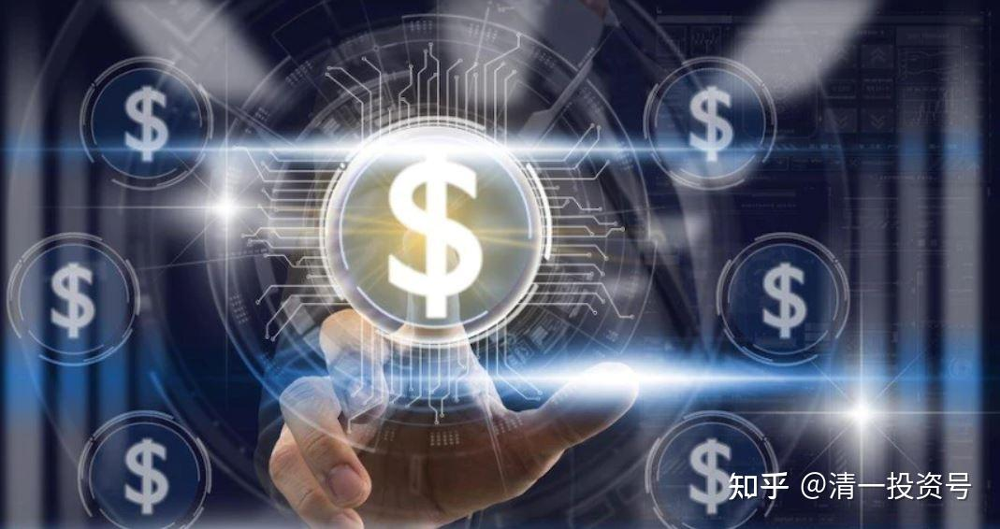

10篇.两种可以辞职的人

清一山长 2021年3月2日

清一山长雪球非专栏帖子整理文章第10篇《两种可以辞职的人》

本文整理自山长专栏文章《清一大学研究生，身价能比华为的博士吗？》[https://xueqiu.com/9310099567/172989072](http://link.zhihu.com/?target=https%3A//xueqiu.com/9310099567/172989072)的跟帖评论

//[@周倩姣静心](http://link.zhihu.com/?target=http%3A//xueqiu.com/n/%25E5%2591%25A8%25E5%2580%25A9%25E5%25A7%25A3%25E9%259D%2599%25E5%25BF%2583):回复[@清一山长](http://link.zhihu.com/?target=http%3A//xueqiu.com/n/%25E6%25B8%2585%25E4%25B8%2580%25E5%25B1%25B1%25E9%2595%25BF):

感恩您，这么好的成长平台，这么好的教育，是中国人的希望，数以万计的人受益！

我是一个在外围学习和默默跟随您九年的学徒，虽然没上过您的课，仅仅是一个清一会员的身份，还由于当时注册有误，用了先生的QQ，所以很少上。从来没和您对上话，但内心对您和平台都怀有一颗炙热的心。是属辗转各大新教育群的搬砖人员，组建过清友线上相亲活动、中医学习群，做过新教育学堂义工。

就个人而言，资质平平，是个比较笨拙的学生，可以说是体制教育失败的案例，当时好强与考试失利，期间出现种种心理矛盾，以为大学可以帮我答疑解惑，但上大学之后，在抑郁纠结的深渊中，还是很多问题想不通，唯一的一根救命稻草就是自己善良喜欢帮助别人的本性，感召到您，是您的博文拯救了我，让我看到了人生的希望和意义，原来自己就是来地球服务付出的，而不是为了得到。

您的博文不仅拯救了我的心灵，还拯救了我的身体健康。

自己大学还没毕业，就出现了各种问题，头痛、失眠、脚抽筋等，后来看了山长您的博文才知道，原来是心态和吃东西的原因。从此开始吃素，开始学倪海厦老师的中医，还带领身边朋友和家人学，不仅成为自己健康的守护神，还成了家人的健康好帮手，一般不用去医院。

另外还有婚姻、教育孩子，都很受益清一山长您创办的新教育，现在家庭幸福，孩子教育较好。快七岁的孩子不仅能自理，洗衣服，还能做各种家务活，这些都是日日不断的，从两三岁就开始慢慢培养的，到现在有活很愿意干，还能做饭；

学习上中文理解还可以，一年级上下课本，一个多月就学完了，会很多的百科，英语听说也不错，时常能讲《伊索寓言》英文故事和跟我用英语讲些百科的东西；

品行上善良，很愿意帮助别人，性格开朗活泼；

运动能劈叉，跑21公里半马没问题，徒步30公里，侧手翻上千个，仰卧起坐几百，俯卧撑几百，吊腰走，各种模仿动物运动等，身体较灵活。虽然身形相对瘦小，但健康到基本没去过医院，除了生他和意外受伤，即使很小，偶尔生病那也是自愈，尤其大些的这两年基本连感冒都极少，因为有比较多的运动。身边有父母很是羡慕的，甚至还让孩子跟我们学，一起晨跑，一起学英语，虽然还有很多待改进的地方，但也走在成长的路上。这个只是个人家庭小小的成果。

而如果有人不相信您，我可以在这里证明，清一山长您创办的学堂，创造了多项教育记录，于国于家都做出了重要贡献。如四个月突破一门英语，从不会英语的小白到能够流利交流；四个月突破十二年的美国数学，成绩还有拿满分的；一年学完大学四年到六年的西班牙语，能够交谈流利，成绩最好可达到专业八级的水平，得到北外院长的认可和称赞；运动就更不用说了，那更是全中国青少年中最牛的，并且这么牛的学生有的都是新教育自己培养出来的十多岁的老师带班的，所以这就是差距。

当您孩子还在郁闷、逃避学习、忙着打游戏的年龄，这些新教育出来的孩子就已经超越了大学生和成年人。这些都有据可查，在bilibili网站上搜“这就是今日学堂”，还有各种新教育的公众号，如“英语零突破”、“清一书院”“一线新教育”等。并且只要你符合要求，好多都是免费的，请问中国哪有这么好的教育。现在跟随的新教育学堂也是如雨后春笋，全国有很多家。

所以让人有点匪夷所思，这么好的可以免费成就人生的好东西，成就国家人才培养的教育，却还有人在搞破坏，真是不知道惜福啊！这损害的可不只是“清黑”个人的福气，而是损害子孙后代、国家和民族的利益，这个结果“清黑”承担得起吗？还是说浪子回头，承担起自己全部的责任，如果有不如意，就慢慢去改变提升，还有出头的机会，不然等待的就是宇宙因果更严厉的惩罚。

在此非常支持您弟子出山正名，这也是数以万计”清粉”拍手叫好的事，这个平台不容易，我自己跟随了九年，看着它历经沧桑，如果不是山长您为了真教育的励精图治，估计也就不可能有今天大家的收益，我们倍感珍惜，这是一个有爱、有温暖为彼此奉献的精神家园，这是一个为了中国人荣誉而战、希望建世界中国名校的老师的梦想之地；这是一个孩子们成长，少年强中国才强的摇篮；这是一个让你身心灵都健康和得到滋养、家庭幸福、人生成长的智慧家园。在此祝福新教育，祝福中国的伟大崛起从新教育开始启航！感恩伟大导师清一山长您！

在此打赏两百元以表支持。

[清一山长](http://link.zhihu.com/?target=https%3A//xueqiu.com/9310099567)[2021-03-02 09:11](http://link.zhihu.com/?target=https%3A//xueqiu.com/9310099567/173174013)回复[@周倩姣静心](http://link.zhihu.com/?target=http%3A//xueqiu.com/n/%25E5%2591%25A8%25E5%2580%25A9%25E5%25A7%25A3%25E9%259D%2599%25E5%25BF%2583):

谢谢支持。新教育真的很简单，自己学习，自己受益。你的身体转变就是大证据。想身体好，不需要付钱给谁来帮你。你自己吃正确的东西，别吃肉和奶。加上正确的运动，身体自动好。找啥好医生，好中医、好西医，都没有可能给你好身体的。

教育也一样：这就是自助者天助！

这样想，其实也没啥赚钱的压力了，其实根本没多少需要花钱的地方。

//[@周倩姣静心](http://link.zhihu.com/?target=http%3A//xueqiu.com/n/%25E5%2591%25A8%25E5%2580%25A9%25E5%25A7%25A3%25E9%259D%2599%25E5%25BF%2583):回复[@清一山长](http://link.zhihu.com/?target=http%3A//xueqiu.com/n/%25E6%25B8%2585%25E4%25B8%2580%25E5%25B1%25B1%25E9%2595%25BF):

能得到您的回复纯属意料之外的收获，感谢您的肯定。是的，孩子跟随新教育，基本上没花过什么钱，至今想想还没有超过一万，除非日后参加夏令营或可能上新教育学堂等，虽然孩子父亲在教育机构上班，一个月万把块钱左右，但家里孩子的奶奶急着建房子（因为乡村还有两个兄弟单身，现在农村男性单身真是一抓一大把，女孩子寥寥无几，我妈妈业余做农村相亲，走访当地不少地方，甚至还去缅甸帮亲友相亲，难得成功），老人家以为这样就可以找到另一半。百善以孝为先，所以我们也只能支持。

关于生病，身边各种癌症的案例已是稀松平常，包括自己的亲戚就有三四个了，有的还在上大学，不了解情况，有的就是长期只吃肉积累导致，最后离世时，都是极度痛苦的，真的就是见证了求生不能、求死不得的活生生的案例。所以我看到您的东西如获至宝，就立马悬崖勒马。

之前也有“清粉”转“清黑”的给我发短信，说自己为了上您的课，把国企工作辞了，还把仅有的自己大学毕业之后工作的积蓄花完了，感觉人生走到了低谷，于是要立誓黑您，还给我发很多证据，还好我也算比较资深的“清粉”，旁观者清，他自己整理的资料漏洞百出，头脑发热地乱做决定，自己本身对您的东西都没有好好理解，只是带着索取的心去的，以为上个课就可以飞黄腾达了，我当时是用了一上午和他发了很长的信息，之后才没有再给我发信息。

所以个人觉得新教育真的不是钱能买到，而是机缘巧合，要有福气和心灵吸收能力的人才能真正领悟到，是生命的一场修行。个人虽然也只是半吊子水平，才入一点门，不敢在您面前卖弄，但真实的经验摆在面前，让我不得不动容分享。

[清一山长](http://link.zhihu.com/?target=https%3A//xueqiu.com/9310099567)[2021-03-02 13:30](http://link.zhihu.com/?target=https%3A//xueqiu.com/9310099567/173212393)回复[@周倩姣静心](http://link.zhihu.com/?target=http%3A//xueqiu.com/n/%25E5%2591%25A8%25E5%2580%25A9%25E5%25A7%25A3%25E9%259D%2599%25E5%25BF%2583):

“之前也有“清粉”转“清黑”的给我发短信，说自己为了上您的课，把国企工作辞了，还把仅有的自己大学毕业之后工作的积蓄花完了，感觉人生走到了低谷，于是要立誓黑您”

还有这种怪物存在？他就继续黑吧！我不在意的。越黑越惨，跟我反向做，不是找抽吗？

凡是上过我的课的学员，都可以证实：我一贯，都是反对学员辞职的。一些在体制学校的教师，想辞职我都反对。说你们在没有找到新的生存手段之前，是不能胡乱辞职的。至少两三年之内是不能辞职的。

因为我知道：体制教育出来的人，很多人有文凭，没脑子，没能力。胡乱跑到社会上闯荡，是没啥生存能力的。我辞职，是因为我哪里都能够生存。只能是具有生存能力之后，再去离开不喜欢的工作。所以，我一贯的不支持学员辞职的。

其实，我很了解：现在的大多数人，都不喜欢自己的工作。但是，非要找个理由，硬说是听了我的课辞职的，就真的太不负责任了！根本就不是我教的——**自我思考，自我选择，自我负责的精神。**只能说，是疯狗一个了，乱咬人！

这些人，跟“惠泉啤酒13～14元追买，被套住的人，跌下来后，怪我示范买啤酒害了他们，我坐庄惠泉啤酒，专门害他们的人”一样，都是一样的脑残分子。都是装受害人的小人。

**学新教育，就学知行合一，学思考能力，学自我负责。最重要的，是学因果。你得到的一切，都是你自己创造的结果。不喜欢现在的结果，就要换一种方式。**

这些人，身上哪有这些理性、责任和思考的东西？所以，“清黑”，都是没脑子的才黑！

明燕多年前，也从深圳一家很好的单位辞职了，她家两夫妻，年入百万。我知道后，还批评她一顿：这么高的工资，辞职干嘛？乱做事。她后来去一家学堂做老师了。再后来被家长推选做今日的校长。现在的工资，都是象征性的。(今日校长的工资，不如带班教师的工资高）

但她今年回深圳跟老同事们聚会，回来告诉我：表示她当年辞职太对了，跟原来的同事们相比，她活在一个完全不一样的世界里面。活出了自己的精彩，不会为了钱，去做一些非常无奈的事情。身体健康也完全不一样，她总说辞职很划算。如果现在还留在单位里面,她要郁闷死了。因为明燕是一个不爱钱的人，爱自由。所以她辞职有她的道理。

所以，只有两种人，才能辞职：一种人就是**不爱钱的人，才可以辞职**。因为新教育的人，生活很简单，需要的东西很少。一点点收入，也可以过得不错。

另一种人也可以辞职：**辞职后，有能力，能赚到更多的钱**。我就是第二种。我辞职离开武大，比留在武大收入更高,更容易赚钱。

其他人：还是老老实实地呆着吧！跟你喜不喜欢你的岗位没关系，跟你的生存能力很有关系。如果没能耐，就守着一个饭碗，尸位素餐，有人供养，算你修来的福气。虽然没啥荣誉可言，但起码混日子，装模做样的还可以。别出来打天下，想装英雄，结果变成了狗熊，就想找我替你背黑锅，好像是我帮你变狗熊的。真是岂有此理！

此文大家好好转发：以后你们凡是听到说我劝人辞职之类的鬼话，全都是骗子，都是谎言。就像你们听到有人说我推股票一样，肯定是骗子。（我认为有些人是故意伪装骗人的，真有这么脑残的？从来没见过谁给我打报告：老师，我要辞职，行不行？我从来没批准过这样的申请。）

深圳的某教育局的官员，我的学生，多年前，一直跟我说想辞职，今年也对我说想辞职，干得没意思极了。我一直都是反对他辞职，现在也说：都快退休了，辞职啥？（此人今年快五十岁了。）喜欢新教育，有时间，就自己学自己的，干嘛一定要辞职？业余时间干啥随意，退休了再来玩。

跟股票一样：我的确示范了我怎样买股票的，但我不推股票。反而提醒你们小心：我总是反向指标。

任何人问我某某股票该不该买？我的观点一直就是：凡是需要问我的，肯定就是不该买股票！至于我买不买、卖不卖，是我的事情。

有人肯定要咬我，说怪我推票，让他损失惨重，这些人，你们都知道：全都是骗子和“清黑”，良心大大的坏了！绝对不是好人。

我不推票，不推任何票。有人打赏给我，我说：不如买点啤酒去，不是让你去买票：而是我认为这两百元，不如买一点实在的东西去，不用打赏给我！

但别以为我想推票。我持仓的股票涨不涨，我根本不在意。你买不买，我更不在意。更不相信你买了，就会涨了。我不相信你们有这能耐。

参考链接：

[116篇 清一大学研究生，身价能比华为的博士吗？](http://link.zhihu.com/?target=https%3A//www.ximalaya.com/sound/476218446)（音频）
