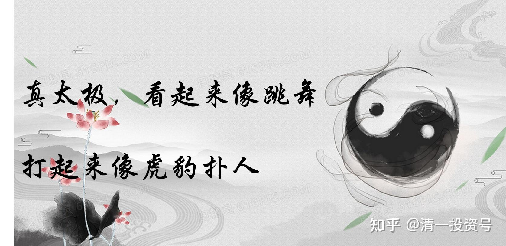

14篇.武道论之一：真比武是什么样的？

清一山长 2021年4月6日

[嗨吃街餐饮服务](http://link.zhihu.com/?target=http%3A//xueqiu.com/n/%25E5%2597%25A8%25E5%2590%2583%25E8%25A1%2597%25E9%25A4%2590%25E9%25A5%25AE%25E6%259C%258D%25E5%258A%25A1)回复[清一山长](http://link.zhihu.com/?target=http%3A//xueqiu.com/n/%25E6%25B8%2585%25E4%25B8%2580%25E5%25B1%25B1%25E9%2595%25BF)：

感恩山长传武分享，让我有幸拜读，在此有一惑求解，我家有女刚满5岁，健康聪颖，爱人现有意送其少林习武两年打基础（这点我们有异议），之后再来衔接新教育体系，期望最好是能直接进入今日学习（这块我们目标非常一致）。至于少林习武，我以为是多余，我宁愿她在进入今日之前哪怕是一张白纸，我们只管负责纸的厚度和宽度，至于蓝图，只想留她在今日里描绘，请山长点明拨正，感谢感恩！

[清一山长](http://link.zhihu.com/?target=https%3A//xueqiu.com/9310099567)[2021-04-06 11:36](http://link.zhihu.com/?target=https%3A//xueqiu.com/9310099567/176371187)回复[嗨吃街餐饮服务](http://link.zhihu.com/?target=http%3A//xueqiu.com/n/%25E5%2597%25A8%25E5%2590%2583%25E8%25A1%2597%25E9%25A4%2590%25E9%25A5%25AE%25E6%259C%258D%25E5%258A%25A1):

登封，少林的**武校，可取之处是锻炼自己吃苦，不可取之处是下层人聚居的地方。容易学会很多坏习惯。**

**想学真武道，可以模仿示范班学生分享的体育动作，公主班学生的训练**。这些虽然不是武术。但可以说**是武术的基础功**。真太极，我们在15岁之后才开始教，专门去清一武道馆训练的。太早了，学不了。因为真的很难理解这种功夫，难度太高，非一般人能学。

迷财道回复[清一山长](http://link.zhihu.com/?target=http%3A//xueqiu.com/n/%25E6%25B8%2585%25E4%25B8%2580%25E5%25B1%25B1%25E9%2595%25BF):

小时候练过流星锤，现在也看到公园里有人练，不过大都当杂耍练。强大的离心力一定要一个稳定的核心。

[清一山长](http://link.zhihu.com/?target=https%3A//xueqiu.com/9310099567)[2021-04-06 12:14](http://link.zhihu.com/?target=https%3A//xueqiu.com/9310099567/176373908)回复迷财道:

如何理解发力点？你们使用流心锤的发力点，力的支撑点，就在你的手上。由于连接是软鞭，所以需要抡起来旋转，用惯性来发力。

劈挂，外家拳，力点降到了腰部，手就像流心锤。

真太极，力点要降到足弓上，难度极高。身子要成为软鞭一样，这样才能出鞭劲。不过，可怕的是：太极的身子，并不是完全是软的，它可以瞬间变硬，就像你的流心锤的软鞭，在软软地打上去的时候，会突然变成一杆长枪，可以直刺。

这就是“刚劲”出来了。太极九柔一刚，这一刚，就要人的命！[俏皮]

[尤文鱼](http://link.zhihu.com/?target=http%3A//xueqiu.com/n/%25E5%25B0%25A4%25E6%2596%2587%25E9%25B1%25BC)回复[清一山长](http://link.zhihu.com/?target=http%3A//xueqiu.com/n/%25E6%25B8%2585%25E4%25B8%2580%25E5%25B1%25B1%25E9%2595%25BF):

我有一战友，从5岁学到15岁，跟一个老头学的。说是至河北传过来的炮拳，练到极处是一拳三炮。战友十年下来，上半身没什么区别，下半身因为练“老树盘根”，腿部肌肉跟筋肉人一样，战友说算是桩把士练十年的效果。作者大大，我战友这算学到真本事了吗？

[清一山长](http://link.zhihu.com/?target=https%3A//xueqiu.com/9310099567)[2021-04-06 12:26](http://link.zhihu.com/?target=https%3A//xueqiu.com/9310099567/176374562)回复[尤文鱼](http://link.zhihu.com/?target=http%3A//xueqiu.com/n/%25E5%25B0%25A4%25E6%2596%2587%25E9%25B1%25BC):

你说的应该是炮锤，不是炮拳。就是陈家沟人学的祖传拳。这是用下半身支持发力的拳。不知道你说的功夫是啥。“老树盘根”，是八卦掌练转身拧腰的练法。当然别的拳派也有。

练炮拳，就算练成了“真炮”，还需要会瞄准，还要有速度、距离感、防守技术等等，不是会发力就有功夫，就能实战的。想试试有无功夫，自己去拳馆打打实战就知道了，不用问我，几句话，我能说啥？（不是让你去踢馆，而是去体验，我的队员，都会去拳馆体验实战的）

[琳溪](http://link.zhihu.com/?target=http%3A//xueqiu.com/n/%25E7%2590%25B3%25E6%25BA%25AA)回复[清一山长](http://link.zhihu.com/?target=http%3A//xueqiu.com/n/%25E6%25B8%2585%25E4%25B8%2580%25E5%25B1%25B1%25E9%2595%25BF):

上了山长的财富、齐家智慧、心里行为课等课，每次都能观摩到山长的武术示范，我虽是女流之辈不懂啥武，但是能看到山长在和很强壮的男学员对决时，轻盈、敏捷，男学员瞬间被放倒（我弟亲身和山长尝试交了下手，之后告知我，自己力量还没出，山长很轻的一出手就感到一股力量让他瞬间就倒下，说当时把他疼坏了[大笑]，他领略了山长真人真功夫[赞]）。不是亲眼见到，一般人很难相信山长对武学的研究，不仅理论通透，而且实操高深。我是亲自验证了，山长不仅是教育家，而且是武术家、音乐鉴赏家、投资专家，这些都是名符其实，当之无愧的[赞]！

[清一山长](http://link.zhihu.com/?target=https%3A//xueqiu.com/9310099567)[2021-04-06 14:02](http://link.zhihu.com/?target=https%3A//xueqiu.com/9310099567/176382520)回复[琳溪](http://link.zhihu.com/?target=http%3A//xueqiu.com/n/%25E7%2590%25B3%25E6%25BA%25AA):

抱歉，让你弟受伤了。以后，你们想看真功夫，就让你们男生来打我的女弟子好了（男弟子你们没法打，他们收不住手的）。我的力量看起来越来越柔，但我的弟子觉得我的力量越来越大，接手不小心都会青淤一片。所以，以后不能与你们过手了。

你们看到的，体验的，还不是我真正的功夫，**太极拳，强调冷、弹、脆、快、重**，我根本就没用这些功夫来打你们，只用了一点绵力。所以你们学员只是摔倒。如果用了脆快力，就要伤人了，所以你们无法体验的，不敢用。

有一次，河南有人过来，非要见识真传统武功。说自己一直热爱武术，练过多年拳击、搏击、格斗。我说你们登封不都有吗？武术之乡。可他说那些武校练的都是假的，专程跑来，想来看我的真功夫。当年我在云南，别人几千里跑过来，总要接待一下吧？这也是武林的规矩。我就跟弟子们练了一下，给他看，他不满意。自己上来跟我像你们一样接手。他还是不满意，说能不能双方都放开了打一场？他要体验，传武怎么对付他的武功的。这种玩，他觉得不真实。

我看此人来意不善，不像是友好交流的样子，而且，真懂武功，我们演示的他应该看出来不是对手的，但非要比，我觉得他不是交流学习，而是想找点成就感，想出去就吹牛他用真功夫掠了我们一把假功夫。我就变了脸色，客客气气地说：“就是说实战模式，自由搏击，不是试招，是吗？”他说：“是。”我说：“好，你就来吧！”

我就站了一个姿势，太极起势，一动不动地等他来进攻。这是武当拳派的攻防之道：后发制人，不先出手。

此君看我不动，先试探着打了几个刺拳，看我毫无反应。以为我像雷雷一样只会站架子。其实，距离上这么远，你打不着我，我动啥？他以为我实战的反应速度不行，几个试探拳之后，就突然一步猛冲上来，用后手摆拳，重重地猛击我的头部，下手一点也不客气。但他的手还没打到我的头部，我就略略向前进了半步，用前手（右手)一巴掌就打在他的左脸上。我是右架，强侧置前。他被打晕了，马上就停手不打了，捂住脸（再打，我再抽嘴巴）。脸上肿起来，五根血红的印子，眼角被打出了血。

还好，这是九年前的事情，我的力道不够（也没下狠手，只是给他一点教训）。他摸摸脸，满脸的迷惑。问：这拳怎么打的，用哪只手打的，他怎么没看见？用的什么手法？问我身边观战的弟子、学生，全都说没看见我是如何打的，更没看见用的哪只手打。只看他冲上来，然后就看到人影一晃，眼前一花，就听到脆脆地响了一声，啥都没看见。这次比武，就这样结束了。此人说：很幸运，总算见到了中国真武术，真功夫，还以为失传了。

这才是真比武。你们学员过来看的“比武”，只是大家友好玩玩罢了。不过让你弟弟感到很疼，肯定是我做错了。

此人记得姓李，河南郑州人，为人狂妄自大，特别的自以为是，喜欢踩别人上位。后来他去做了“清黑”，背后一直骂我。想想也正常，被我不客气地打脸，谁让他没眼色呢？现在如果此人再想找我比武，结果就不会只是脸肿了，而是身上的骨头要断了。我判断对手来意不善的话，会出重手的。冷、弹、脆、快、重。

这种才是真太极，看起来像跳舞，打起来像虎豹扑人。我曾经一拳出去，停在对手的鼻子面前，但对手吓得大哭起来。因为我是在逼他失衡的情况下，击出的一拳，身体躲无可躲，看起来就像要被打死了，的确很吓人[大笑]。

参考链接：

[20220425清一木兰明晓VS金腰带选手 （明晓：Jasmine Sumurai Mulan VS Raveeman Panya）哔哩哔哩](http://link.zhihu.com/?target=https%3A//www.bilibili.com/video/BV1QT4y1r7pt)

[清一木兰VS金腰带选手（佳惠: Alina Sumurai Mulan VS เพชรดารา อ.ยุทธชัย）哔哩哔哩](http://link.zhihu.com/?target=https%3A//www.bilibili.com/video/BV1DL4y1F7Ly/)
