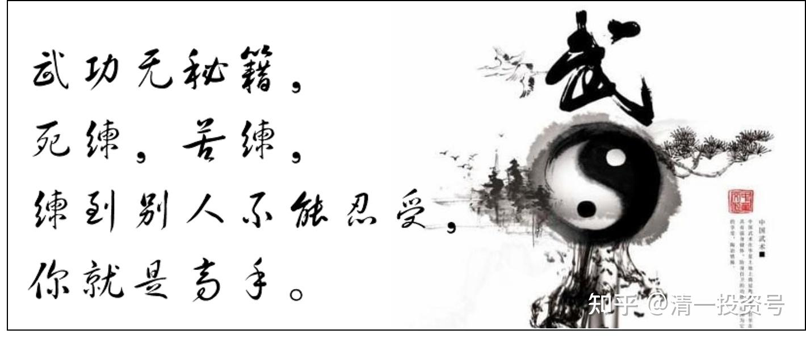

18篇.武道论之六：武功无秘密唯有苦练

清一山长 2021年4月11日

清一山长雪球非专栏帖子整理文章，第18篇《武道论之六：武功无秘密唯有苦练》

此文整理自山长专栏文章《[实战太极与现代格斗之谜1：发力技术！](http://link.zhihu.com/?target=https%3A//xueqiu.com/9310099567/176335637)》[https://xueqiu.com/9310099567/176335637](http://link.zhihu.com/?target=https%3A//xueqiu.com/9310099567/176335637)的跟帖评论

[王华](http://link.zhihu.com/?target=http%3A//xueqiu.com/n/%25E7%258E%258B%25E5%258D%258E_%25E9%259B%25AA_%25E7%2590%2583)回复[清一山长](http://link.zhihu.com/?target=http%3A//xueqiu.com/n/%25E6%25B8%2585%25E4%25B8%2580%25E5%25B1%25B1%25E9%2595%25BF):

国之利器，不可示与人。山长如此早就将秘密公开解析，估计是现代职业格斗人士，就算是知晓，也无法模仿破解？之前是马保国说对手不讲武德，这下估计对手无法将这四个字套用到将来KO他们的武道馆学员这边了：击败你的秘密，我们师父早就告诉给你们了。

[清一山长](http://link.zhihu.com/?target=https%3A//xueqiu.com/9310099567)[2021-4-11 13:59](http://link.zhihu.com/?target=https%3A//xueqiu.com/9310099567/176815346)回复[王华](http://link.zhihu.com/?target=http%3A//xueqiu.com/n/%25E7%258E%258B%25E5%258D%258E_%25E9%259B%25AA_%25E7%2590%2583):

武功其实没啥秘密的，就是自己只要懂得基本的原则，自己去练出来。拳击还有啥秘密？练出来你就拿每场千万的奖金。

泰拳更是这样，**就是死练、苦练，练到别人不能忍受，你就是高手。**看播求的练拳视频，真苦，我们去真受不了，所以他当拳王。

太极也一样，知道原则、方法，还要苦练出来的。太极更难的就是要更多地理解武道，所以粗人没法练，师父教都听不懂。

明骐不就自己说了：几年前，听我讲拳理，他就是听不懂，连女生都比他练得好。他是现在才听得懂我讲的话了，还不一定做得出来。

所以，**没文化的人，是练不出真太极的。但可以练拳击和泰拳。**

**但有文化也不一定能练出来，得像练拳击和泰拳一样苦练才行。**

所以，太极注定是寂寞的拳种，要求文武双全才有可能练出来。

你们看到的全民太极，万人太极，练起来轻松、舒服的太极，注定只是表演罢了，不是真太极！

“现代职业格斗人士，就算是知晓，也无法模仿破解？”

现在的格斗界人士，基本的发力习惯已经固定，是改不过来了。可以借鉴一下，也许可以想出一些应对和破解的方式？不知道。但练过外家拳的人，练内家拳真心不容易，完全改掉原来的习惯太难。这种习惯，经过每天千次的重复，已经变成了神经系统的一部分，改不掉了。只可以改良，提高一些技术，但不能大成。

[广东道法自然](http://link.zhihu.com/?target=http%3A//xueqiu.com/n/%25E5%25B9%25BF%25E4%25B8%259C%25E9%2581%2593%25E6%25B3%2595%25E8%2587%25AA%25E7%2584%25B6)回复[清一山长](http://link.zhihu.com/?target=http%3A//xueqiu.com/n/%25E6%25B8%2585%25E4%25B8%2580%25E5%25B1%25B1%25E9%2595%25BF):

山长所说的太极临战架势与我们武当赵堡太极拳的站立格斗架势比较类似，这一式我们拳架里称为“金刚三大对”，按我们师叔的说法，这个式是整套拳的母体架势。

[清一山长](http://link.zhihu.com/?target=https%3A//xueqiu.com/9310099567)[2021-4-11 16:11](http://link.zhihu.com/?target=https%3A//xueqiu.com/9310099567/176820265)回复[广东道法自然](http://link.zhihu.com/?target=http%3A//xueqiu.com/n/%25E5%25B9%25BF%25E4%25B8%259C%25E9%2581%2593%25E6%25B3%2595%25E8%2587%25AA%25E7%2584%25B6):

您说这个式子，是赵堡起手式，的确很重要。

格斗的攻守兼备动作。不过，我猜你们都不知道用法吧？不是你们老师演练给你们看的：从腰部抬起双手，先接住对方的来拳，化力，拉回来，转过弯，再打出去。或者憋住对方的胳臂，拿住对方缠裹，控住小臂，脚下上步，或者踢一个低踢，破坏对方的重心，或者踢裆等。这是不懂格斗的人，教出来的**“金刚三大对”，**属于书呆子型的功夫，实战中根本用不上。

真正的实战，是要求你这一招，上面一系列的变式，你只能用半秒钟，至少不超过一秒钟，把全部变化都打出来，走完劲（此招全部，至少有八次变劲），让对方一出手打你，就莫名其妙地仰面倒下，甚至你只用半招就赢了。剩下的是白送的半招，就是万一对方防住了你前半招，居然没有仰面倒下，你就让他往前栽倒，实现“犯者立扑”。右脚踢出的这一脚，其实是身子后侧中打出去的，是在手上已经控住对方身体的时候，破坏对方下盘稳定的绝杀招。这一招，需要很强的桩功，单腿发力的技术，才能实现这样的精妙攻击。这才是真正的“金刚三大对”，才能与外家拳格斗并取胜！

原始的赵堡太极，肯定是能实战的。现在传下来的老架、小架，很多都是有实战价值的架势。但是，由于赵堡拳，好像没有人去认真钻研和练习发力技术，拳师们都在谈练拳时候的松、软、慢、绵柔，都不知道咋发力了。所以，这些拳架子，就都是花架子了。后人们都当体操来练，师父也不知道咋打，就忽悠后人：拳打千边理自知！让人傻傻地练套路，我看练千遍的人很多，但知道我上述的“理”的人有多少？我说出来，你们都不知道吧？

其实，太极讲松软，真的没有错。这是**练家子，已经练完了发力，懂得发力的人，自然成天只练松软，让发力可以更透、更快。**我现在就只练松软，看起来就像无害的舞蹈。但你学我这样练，就一辈子练不出了。**现代练太极的人，从来没练过发力技术，就直接练松软，所以练成了骗子拳。**

赵堡有一派，我看还在练发力，但练的人，似乎也不知道咋用吧？就是忽雷架，是练抖身劲的。我觉得这个套路也许还是有点价值的。我以为他们既然会发力，应该会格斗。不过听“写忽雷架书籍”的赵堡研究者说，这些忽雷派的拳师，也无法上擂台真打实战，都不知咋用这些套路。日常互相推手，派内玩玩还可以。实战的话，没听说赵堡谁是真打实练的。而且，现在赵堡被陈家沟的“正宗太极”冲击很大。已经没啥影响力了。

两年前，我在昆明上江湖课。学员找了个练赵堡拳的“知名大师”来。上过中央台的，据说是实战派的太极大师，跟散打队员打过的人，据说练到了“全身透空”的地步。我的学员有拜他为师的，就请来我这里，说是跟我交流，估计是学员们不怀好意，想看我们打一场热闹架。我客客气气地接待了他，还带他去西山玩。因为这人说他练的就是“全身透空，西山悬磬”派的。

我看这人在山上走路的样子，就怀疑这人的功夫是假的。我们是从后山上去的，山上路险，没有正常的路。大石头很多，看他走得战巍巍的，很不稳，走出了一身汗。我给学员示范了一手“走石头山坡”的身法和步法，轻轻松松的，如履平地。无论高低起伏。我身形都一样很稳。我还故意做了几个快走，急停，跳跃的步子，身法如鸟转换。学员一看，就知道不是一回事了。

我也年龄一大把了，快60的人了，可以比年轻人走得更轻松。这人年龄略大一点，底盘功夫就如此差劲，还练啥高级功夫？就是一骗子。这人后来果然闹了大笑话，就灰溜溜地走了。我回去后，就再也不见他了，没空跟江湖骗子玩的。

现在练太极的，恐怕真没几个真练的了。很遗憾。孙、吴、陈、杨、武，历史上都有高手。现在，都只剩全国“太极大师”了。

算算账，就知道现在太极没真的。因为徐冬瓜一直叫嚣打太极，谁如果真有实力，跑去打了徐冬瓜，不仅仅为太极门出了口气，而且名利双收。多少千万，亿万的钱都要滚进来的。每一个江湖大师们，真有实力的人，想要扬名立万的人，不去找徐冬瓜扬名，就太傻了。跟钱，跟名过不去吗？

我等了三年，一个都没瞧见。我知道，中国太极无人了！

[风凌石](http://link.zhihu.com/?target=http%3A//xueqiu.com/n/%25E9%25A3%258E%25E5%2587%258C%25E7%259F%25B3):回复[@清一山长](http://link.zhihu.com/?target=http%3A//xueqiu.com/n/%25E6%25B8%2585%25E4%25B8%2580%25E5%25B1%25B1%25E9%2595%25BF):

山长，你应该站出来替中国传统武术和太极正名。那个徐冬瓜太狂了。

[清一山长](http://link.zhihu.com/?target=https%3A//xueqiu.com/9310099567)[2021-](http://link.zhihu.com/?target=https%3A//xueqiu.com/9310099567/176820265)[04-07 11:52](http://link.zhihu.com/?target=https%3A//xueqiu.com/9310099567/176469395)回复[风凌石](http://link.zhihu.com/?target=http%3A//xueqiu.com/n/%25E9%25A3%258E%25E5%2587%258C%25E7%259F%25B3):

第一：我不会去找徐冬瓜挑战的。我其实很感谢他对中国传统武术做出的巨大贡献。没有他，不知道还有多少人依然蒙在鼓里。被一群江湖骗子、传武大师、太极大师们蒙得团团转，马云这么聪明的人一样上当。这些人，都是中国传武的真粉丝，愿意出钱，出人来练武。但都被骗子骗了。

第二：我去挑徐冬瓜。假如我赢了，骗子们以后都会出来，继续冒充太极，继续骗人。这对传武有啥好处？我砸了徐冬瓜的饭碗，我也不要这种饭碗。但让一众骗子去骗人，学几十年学个虚东西，不如让这些喜欢武术的人，跟现代搏击去学习，起码是真本事。

第三：我毕竟不是专业武者，只是票友。我年龄快60了。现在上擂台合适吗？赢了也只能说我这派后继无人；输了更是自取其辱。老不知老，老不知羞。徐某毕竟是专门吃武术饭的，我若跟他打，也必须全力出击，跟他比体能、技巧、作战经验、临场反应，肯定不行。重量级也完全不是一个档次，打起来也蛮费劲的。我只能跟他死拼功夫：让他来打我，我也同时打他，看谁的力量强。这是武林中最忌讳的两败俱伤的打法。最终，就算结果是我赢了，我也难免要受伤，回来要养很久的。划得来不？（徐冬瓜目前的传武对手，连门都没有入，徐冬瓜其实没有真打他们，没有真发力的。不然，他用全力来出击，这些人全都会受重伤的。他就是玩，知道对手太差）。你们去认真看看视频就知道了，他只是玩一样的打。不是真打，几乎就是一个表演。徐冬瓜很聪明，看起来粗燥，其实精明过人。不会傻到弄出人命了，他只是炒作自己，嘲弄一下“传武大师”们。没玩命去拼的。

第四：就算赢了徐冬瓜，他也不代表现代格斗，这有啥意思？真有本事，真有门派，就去正规的现代格斗场上去打，成建制的去赢。这才是真传武。场下较量？江湖斗殴吗？这可不是传武的做派。真传武，要尊重自己，也尊重对手。**只去参加正规的现代格斗赛事，用现代格斗的规则去比赛，用我们的特有技术来取胜，这才是最正确的选择。**

最终结论：徐冬瓜是中国传武利益集团的“刺”。他打掉了他们每年数以很多亿万的“生意”。想收拾他，让这些利益集团有本事自己去挑战。不关我这民间野人的事情，我只专心培养下一代。不管江湖的事，不进这个江湖。我还没傻到替骗子们火中取粟的。

参考链接：

[山长 清一：实战太极与现代格斗之谜1：发力技术！](https://zhuanlan.zhihu.com/p/362455647)（专栏文）

[清一武道馆：传武杀人技？太极不出门？](https://zhuanlan.zhihu.com/p/354643954)（专栏文）

[清一武道馆：真被“武术界，国术界”给恶心到了！](https://zhuanlan.zhihu.com/p/357918131)（专栏文）

[清一武道馆：实战太极与传武高级黑！是实话，可真相是这样吗？](https://zhuanlan.zhihu.com/p/355026610)（专栏文）

[138篇 实战太极与现代格斗之谜1：发力技术!](http://link.zhihu.com/?target=https%3A//www.ximalaya.com/sound/488865125)（音频）

[哔哩哔哩：实战太极与现代格斗之谜1：发力技术!](http://link.zhihu.com/?target=https%3A//www.bilibili.com/audio/au2820089)（音频）
