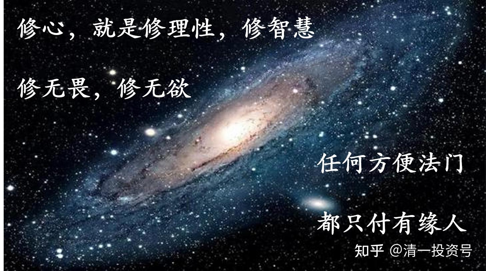

19篇.人学，身、心、灵，妄心，潜意识

清一山长 2021年4月16日

清一山长雪球非专栏帖子整理文章，第19篇《人学，身、心、灵，妄心，潜意识》

此文整理自山长专栏文章《五年后，你买什么车》

[https://xueqiu.com/9310099567/177361148](http://link.zhihu.com/?target=https%3A//xueqiu.com/9310099567/177361148)的跟帖评论

**一、人学，让人回归“人性”**

**[ellhll李华丽](http://link.zhihu.com/?target=http%3A//xueqiu.com/n/ellhll%25E6%259D%258E%25E5%258D%258E%25E4%25B8%25BD)回复[清一山长](http://link.zhihu.com/?target=http%3A//xueqiu.com/n/%25E6%25B8%2585%25E4%25B8%2580%25E5%25B1%25B1%25E9%2595%25BF):**

山长您好，平时在学习刘老师的文章的时候，使用的补充书籍多是山长和刘老师推荐过的，比如《当下的力量》《与神对话》《谁在我在家》《新世界灵性的觉醒》等，这段时间接触另一本书是刘丰写的《开启你的高维智慧》，觉得不错，但不确定。里面有一段是和您这篇专栏提到的科技话题相关的，内容如下，山长读书无数，可否指导这本书籍是否可以作为参考资料？谢谢山长。

当我们把机器人的性能做得比人类强悍数倍的时候，机器人和云端信息的连接对人类来说将是灾难性的。也就是说大部分人,如果不能够跳到知识的上面、跳到云端，他们将沦为机器人的宠物和奴隶。现在的西方科学家已经预言了这种现象的呈现。我们现在的云端技术所支持的机器人几乎已经达到了人类三岁的智力水平。这样推算下来，没有多少年，机器人将在知能（掌握知识的能力）上超越人类。

可喜的是我们人类已经进入了一个新的纪元，这个新的纪元是我们人类从三维认知主导转向高维认知主导的开始，也就是大部分人开始追求心灵的成长。**所谓心灵的成长是高维认知的提升，这种高维认知绝对是超越云端的。**这种能够超越云端的科学、未来的科学技术，我们把它叫宇端科技，宇就是宇宙，宇端就是N维（N趋于无穷大）。人类通过自己的内在修炼，回归内在，绝对可以超越云端，所以他依然可以驾驭这个时空。如果我们只是停留在知识层面，停留在三维认知里面的话，那我们将被淘汰。因为三维世界已经向我们展示了它即将崩坏的所有现象。**现在所呈现的天灾人祸，这一切都是在警示我们,要尽快从三维空间里跳脱出来，进入更高维度。**

当我们能够建构起这样的认知的时候，我们就会消除对三维空间“成、住、坏、空”的恐惧。为什么？**因为我们内在是高维具足圆满的。**如果你不把自己的意识从三维的时空关系中提升起来的话，你就会充满恐惧,你在三维世界里所做的所有的商业、所有的事业，面对的所有的生命状态都会越来越糟糕。眼前的雾霾、商业、金融业，包括天灾人祸以及战争,都会成为我们自己生命的一种纠结。而当我们知道,我们迟早会从这种状态中走出来，而且走得越快越好的时候，这些东西都变成对我们的警示，让我们迅速地精进，提升我们自己内在智慧的维度，让我们真正能够超越和驾驭我们内在的局限。

**[清一山长](http://link.zhihu.com/?target=https%3A//xueqiu.com/9310099567)[2021-04-16 21:17](http://link.zhihu.com/?target=https%3A//xueqiu.com/9310099567/177384560)回复[ellhll李华丽](http://link.zhihu.com/?target=http%3A//xueqiu.com/n/ellhll%25E6%259D%258E%25E5%258D%258E%25E4%25B8%25BD):**

不太知道这人到底如何。只是我同意这句话：

**“如果我们只是停留在知识层面，停留在三维认知里面的话，那我们将被淘汰。”**

我说的话是：**人类与机器来比体能，已经输了（人力时代被能源时代取代）；人类跟机器比知识，也很快要输掉**（现在大学教的内容，都是机器能够掌握的知识）。人工智能，将让很多工人，不会思考的人，变成没用的废物。

**只有比更高的思维和创意，比更大的灵性空间，否则，人类就只能当机器的奴隶了**。（现在已经是这个样子了，一些机器，如游戏、手机，正在“喂养”和奴役一群不愿意思考的笨蛋）。

未来还会有机器仆人、机器女友来“服务”你。其实就是奴役你，让你失能！

新教育正在走这个破局之路。**人学，让人回归“人性”，而不是只能做动物级别（古代社会），以及工人层次（工业化时代）的人，而是追求更完整的“大人之学”，学会自我完善。而不是让人生只是来做工具的，更不是为了一份口粮而活的。**这就是解决之道！不需要搞什么灵学之类的东西，过于玄虚。

**人类如果走不出来，一直追求机器世界的话，恐怕真的会自我毁灭的。**所以，我认为很可能**“现代科学”**就是启动了人类毁灭的按钮。想想看：**原子时代，一个狂人就可以毁掉整个人类，而古代社会，一万个狂人都做不到。**

**二、身、心、灵的修习次第**

**[十一面](http://link.zhihu.com/?target=http%3A//xueqiu.com/n/%25E5%258D%2581%25E4%25B8%2580%25E9%259D%25A2)回复[清一山长](http://link.zhihu.com/?target=http%3A//xueqiu.com/n/%25E6%25B8%2585%25E4%25B8%2580%25E5%25B1%25B1%25E9%2595%25BF):**

山长是走南怀瑾老师的路线？三教兼修。

**[清一山长](http://link.zhihu.com/?target=https%3A//xueqiu.com/9310099567)[20221-04-18 12:18](http://link.zhihu.com/?target=https%3A//xueqiu.com/9310099567/177444310)回复[十一面](http://link.zhihu.com/?target=http%3A//xueqiu.com/n/%25E5%258D%2581%25E4%25B8%2580%25E9%259D%25A2):**

我还读《圣经》，看《可兰经》，看印度教的经典，奎师那的著作。有多少个“教”了？我无门无派，啥教我都尊重，但我啥教都不入。**我不信宗教，只信真理！**

**[九个瓶子八个盖](http://link.zhihu.com/?target=http%3A//xueqiu.com/n/%25E4%25B9%259D%25E4%25B8%25AA%25E7%2593%25B6%25E5%25AD%2590%25E5%2585%25AB%25E4%25B8%25AA%25E7%259B%2596)回复[清一山长](http://link.zhihu.com/?target=http%3A//xueqiu.com/n/%25E6%25B8%2585%25E4%25B8%2580%25E5%25B1%25B1%25E9%2595%25BF):**

老师，您在文中说：“全然忘记了我告诫普通人千万别去玩灵性的提醒。”对于这句话能否多讲些？我们正在跟随刘明慧老师自学。[清一山长](http://link.zhihu.com/?target=http%3A//xueqiu.com/n/%25E6%25B8%2585%25E4%25B8%2580%25E5%25B1%25B1%25E9%2595%25BF)[¥200.00]

**[清一山长](http://link.zhihu.com/?target=https%3A//xueqiu.com/9310099567)[04-17 21:49](http://link.zhihu.com/?target=https%3A//xueqiu.com/9310099567/177427249)回复[九个瓶子八个盖](http://link.zhihu.com/?target=http%3A//xueqiu.com/n/%25E4%25B9%259D%25E4%25B8%25AA%25E7%2593%25B6%25E5%25AD%2590%25E5%2585%25AB%25E4%25B8%25AA%25E7%259B%2596):**

**人，分为身、心、灵三大组合。**只活在身体层次，是无明。**修心，就是修理性，修智慧，修无畏，修无欲等**。**这一关没过，直接去玩灵修。特别是欲望大的人去学灵修，就是找死。**我已经见过太多的人修得疯疯癫癫的，身体也极差，家庭、事业、子女等，也一塌糊涂。

刘老师是身、心、灵一体的，没有分开，而且她不教你们灵修。有人不满足，乱找老师学灵修，就很危险。刘老师只有在你们有身心良好的基础之后，才有可能会教灵修的法（现在都没有教人的）。**你们现在学的，是“慧心”的层次，并不是灵的层次**。这个灵，不要去追求，该有就有。**层次到了就出来的，勉强求来的是灾难。**

**三、放下妄心，信受奉行**

[建芸](http://link.zhihu.com/?target=https%3A//xueqiu.com/1713727777) [清一山长\[¥200.00\]](http://link.zhihu.com/?target=http%3A//xueqiu.com/n/%25E6%25B8%2585%25E4%25B8%2580%25E5%25B1%25B1%25E9%2595%25BF%3Fpaid_mention%3D1)

您好！山长。我是学习深层沟通的受益者，同时也看到很多学习后的受害者。我想问：为什么会这样？我在以后的学习中又应该注意什么才不会走偏呢？谢谢！

[清一山长](http://link.zhihu.com/?target=https%3A//xueqiu.com/9310099567)[2021-04-18 09:02](http://link.zhihu.com/?target=https%3A//xueqiu.com/9310099567/177437314)

我是十几年前见过林显宗老师的人。刘老师跟他学课程的时候，我去参加过林的演讲。我当时跟刘老师就说：他的这个法不究竟，自以为可以拯救人。其实慧根强的人，可以从这个方法中得到帮助；慧根不足的，知道这些前世的东西，可能反而害人害己。

他的理论是：把藏识里面的东西，各种负面的垃圾，拿出来晒晒，看清了，就会慢慢消失了。

问题是：**大多数人是智慧修养不高的人，看到了一些信息，但是看不清的，只会越来越乱，脑子越来越糊涂。**

相当于你**家里有一大堆垃圾，本来是封起来的，你没有处理垃圾的能力，却不断把垃圾堆扒开，只会让家里臭得无法居住。**

只有很有智慧的人，才会有处理的能力，才能去处理垃圾；或者你找到高人帮你清除垃圾，才能去扒开垃圾。可是，很多学这个课程的人，根本连佛经都不看，有啥处理能力？得了一些神通，知道了一点前世的东西，就自大起来，感觉自己了不起，这不是找抽吗？

十几年前，我就说：**林的深层沟通，需要有一个很有智慧的人，在旁边用佛学来解说，做助教，帮助当事人“转识成智”**。**如果做不到这一点，打开“潘多拉的盒子”，就会乱套。**这个帮助事主的人，比沟通师的价值更重要。可林的体系，却没有这种人（这种人很难得）。而且，为了商业的需要，只要掏钱上完他的课的人，不管心性如何，都可以去做沟通师，去赚钱帮人沟通。这就是让有妄心的人更多了，很多人沉迷于找前世的“记录”，玩感觉，哪有啥智慧之光展现？

其实，**无论是学佛也好，学智慧也好，解决自己的困惑也好，我认为：最究竟的道路，就是自己读佛经，并照做，信受奉行。**

我认为：**最适合中国人去读的佛经，就是《六祖坛经》。文字很简单，但智慧不简单，照做、去做就行了。**

**[zheng茱茱](http://link.zhihu.com/?target=http%3A//xueqiu.com/n/zheng%25E8%258C%25B1%25E8%258C%25B1)回复[清一山长](http://link.zhihu.com/?target=http%3A//xueqiu.com/n/%25E6%25B8%2585%25E4%25B8%2580%25E5%25B1%25B1%25E9%2595%25BF):**

山长，你好！你的文章，我从2014年就开始关注，2016年也上过你的财富课程。这几年也一直不断地学习你的文章，一直都很欣赏，我本身也是深层沟通的学员，平时你写的文章我其实大部分都比较认可的，但今天看到你说深层沟通，你从十几年就见过林老师，然后对这个技术印象如此，从十几年前到现在，人都会有进步，十几年前也许是你所看的样子，但十几年后深层沟通技术包，括林老师自己也有很多的突破和进步！

现在的深层沟通的技术已不再是你当年所看到的样子了！

你所讲的：历史上最年轻的沟通师，我也见过，当时她来学习的状况是带着青春期的叛逆，学习靠个人，她个人的执念还带着以前的想法，学习之后，愿不愿意改变执念，也要看她自己是否愿意。

有些人学深沟学的并不好，大部分改变意愿强烈的人，还是有很大的转变，所以才会说我们是深层沟通的受益者！

[清一山长](http://link.zhihu.com/?target=https%3A//xueqiu.com/9310099567)[2021-04-18 23:29](http://link.zhihu.com/?target=https%3A//xueqiu.com/9310099567/177468319)回复[zheng茱茱](http://link.zhihu.com/?target=http%3A//xueqiu.com/n/zheng%25E8%258C%25B1%25E8%258C%25B1):

的确，这十几年深沟如何发展，我也没去了解。**任何方便法门，都只付有缘人。**再好的东西，也有人就是往歪处学，这不能怪老师不好，法门不对，只能怪人心的错乱。有些人，就是学什么都不像什么的。六祖好好传的禅宗，到了中后期，也变成了野狐禅、狂禅、口头禅，误人也自误。

**[可爱SongSong2](http://link.zhihu.com/?target=http%3A//xueqiu.com/n/%25E5%258F%25AF%25E7%2588%25B1SongSong2)回复[清一山长](http://link.zhihu.com/?target=http%3A//xueqiu.com/n/%25E6%25B8%2585%25E4%25B8%2580%25E5%25B1%25B1%25E9%2595%25BF):**

山长您好，现在有很多灵性的课程，讲究提升能量，祛除内心的负面情绪，“给宇宙下订单”，“随心所动”等，听起来像对宇宙人生有了新的解读，当时感觉很好，但是回到生活，又是很难过好，是不是这种灵性的课程虽然道理是对的，但是一帮人修容易走火入魔？普通人是不是只能渐修，按照《六祖坛经》里讲的不断“净心”，后面智慧自然会显现，以至于“开悟”。

[清一山长](http://link.zhihu.com/?target=https%3A//xueqiu.com/9310099567)[2021-04-18 13:13](http://link.zhihu.com/?target=https%3A//xueqiu.com/9310099567/177445951)回复[可爱SongSong2](http://link.zhihu.com/?target=http%3A//xueqiu.com/n/%25E5%258F%25AF%25E7%2588%25B1SongSong2):

**用强烈的欲望，来修“提升生命能量”，越修，能量越低吧？**

**四、如何改变潜意识**

**[皮诺曹0](http://link.zhihu.com/?target=http%3A//xueqiu.com/n/%25E7%259A%25AE%25E8%25AF%25BA%25E6%259B%25B90):回复[清一山长](http://link.zhihu.com/?target=http%3A//xueqiu.com/n/%25E6%25B8%2585%25E4%25B8%2580%25E5%25B1%25B1%25E9%2595%25BF):**

张老师，我可想知道潜意识是如何被改变的了，如果意识与潜意识发生了冲突，如何去改变潜意识？接受，还是继续纠结？纠结肯定不行，接受如何才叫接受？比如接受自己没钱的信念，这样意识与潜意识统一了，到了这一步应该是结束了，如果还想着去改变其实是没有接受呀！我就卡在这个地方了，那改变潜意识又是怎么回事呢？潜意识是不是我们的内在小孩呀？我现在能想到的办法就是催眠回到婴儿状态系统重新植入，我不经意间回去过两次，可是改变不能靠着不经意间吧！还请您解答 [清一山长](http://link.zhihu.com/?target=http%3A//xueqiu.com/n/%25E6%25B8%2585%25E4%25B8%2580%25E5%25B1%25B1%25E9%2595%25BF)[¥200.00]

**[清一山长](http://link.zhihu.com/?target=https%3A//xueqiu.com/9310099567)[2021-05-01 13:25](http://link.zhihu.com/?target=https%3A//xueqiu.com/9310099567/178840975)回复[皮诺曹0](http://link.zhihu.com/?target=http%3A//xueqiu.com/n/%25E7%259A%25AE%25E8%25AF%25BA%25E6%259B%25B90):**

您这种问题，是不可能通过语言，我说几句话来解决的。只有其他路径！否则，就不叫潜意识了。

也可以告诉你**一些改变潜意识的方法和路径**，你是否能做到就不知道了！

方法一：通过“神经链调整术”来改变。新教育，经常用这种方式，来调整学生的状态。（心理行为的高手会做，我正在培养这种教师）。

方法二：可以用“参悟修行”的方式来觉知潜意识，从而实现改变！（老修行会做）

方法三：可以用生活的惨状和生活的教训来改变。（上帝会做）

方法四：可以用不断重复的概念输入来改变。（广告会做）

……

清单很长，暂时到此为止！

（标题为编者所加）

**参考链接：**

[清一投资号：第15篇.武道论之三：拜错老师误终身](https://zhuanlan.zhihu.com/p/522738920)（整理文）

[清一投资号：第13篇.人生很多的都不能改，能改的是态度，是“心”](https://zhuanlan.zhihu.com/p/521610482)（整理文）
