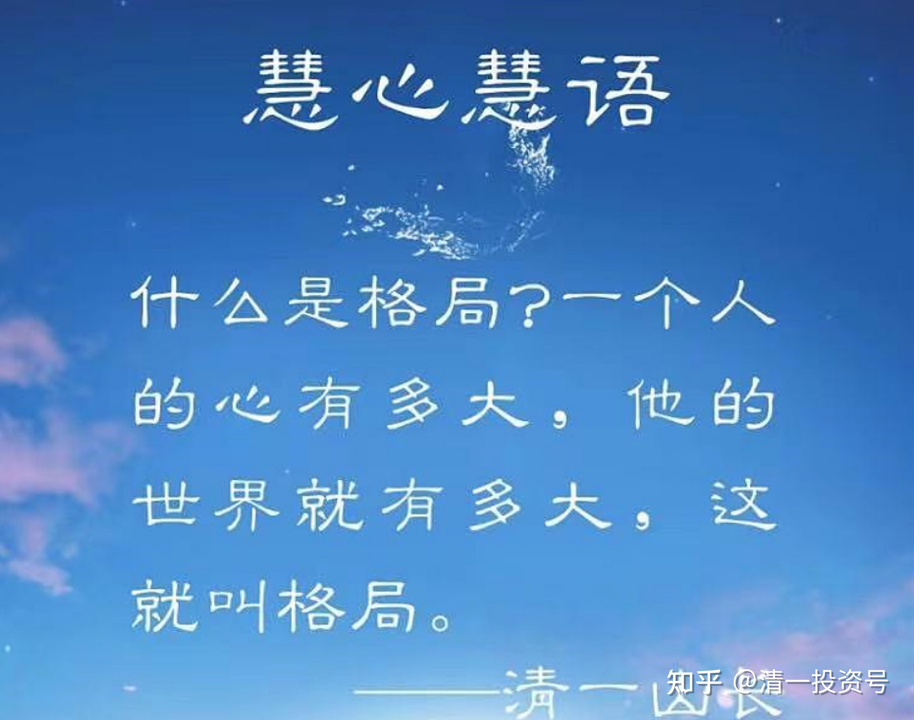

1篇.身体健康的三个因素：心态、运动、食物

清一山长 2021年3月10日[TwenD](http://link.zhihu.com/?target=http%3A//xueqiu.com/n/TwenD)回复[清一山长](http://link.zhihu.com/?target=http%3A//xueqiu.com/n/%25E6%25B8%2585%25E4%25B8%2580%25E5%25B1%25B1%25E9%2595%25BF)：

山长您好，我和我的家庭接触新教育已经两年了，弟弟目前在外围学堂就读，自从接触了新教育的理念之后，我们家的生活方式、理念都有很大改善，尤其是在饮食上，自从接触素食后自己身体的改变是实实在在的，比如：从以前的在体制内跑个1km就气喘到现在可以跑完半马。真的非常感谢新教育给我、我的家庭带来的改变，不过关于饮食依旧有一些问题，望山长解惑。

1：目前身体状况的改变主要是因为自己的生活作息、合理锻炼带来的，还是说主要归功于素食？

2：目前身体状况的改变主要是因为自己之前往身体里塞的“垃圾”太多了（劣质肉类垃圾食品）、现在开始停止塞“垃圾”而带来的，还是说主要是素食特别的好、对身体特别有益而让我的身体状况改变了？

3：目前生活中大部分接触到的肉类都是“毒物”,这一点我非常坚信劣，但是正常的肉类、蛋奶制品是否依旧是不适合进食的。

我相信素食的饮食习惯对身体肯定是有好处的，但是比较想了解的是少量的、正常的肉类制是不是完全不能吃，如果适量、合理进食会不会让自己身体状况更加好？（像有关于蛋白质等问题在肉食和素食之间一直存在争议）。

**[清一山长](http://link.zhihu.com/?target=https%3A//xueqiu.com/9310099567)[2021-03-10 21:52](http://link.zhihu.com/?target=https%3A//xueqiu.com/9310099567/174080130)回复[TwenD](http://link.zhihu.com/?target=http%3A//xueqiu.com/n/TwenD)：**

在身体健康这个问题上——

**第一重要的健康因素是心理和思维状态。**

心态良好，正能量，其他条件差点没问题。而**要心态好，就要“修道”，提升自己的精神级别。这是一切的源头。**

**第二重要的健康因素是正确的体育运动。**

不然，就算你吃得再好，不运动，身体都会坏掉。就像机器不动，时间长久就坏掉了。不是用坏的，是放坏的。人不运动，比机器更容易坏。（西方运动、竞技体育，对身体没好处。游泳等对身体损害更大，不多说了。别说我酸你们有条件。我的家里，有三个游泳池，两个室外的，还有一个室内的。都不会用来当体育设施，只是孩子们用来玩水的地方。室内的调温游泳池，密封环境，对身体更不好，已经关闭了。都是英国人建的，老外的思路，笨！）。

**第三重要的健康因素才是食物，以及食用的方法。**

素食、肉食，对身体肯定有一定的影响，但影响都不如上面的两个重要。在前面两个能够保障的前提下，谈第三个因素才有价值。否则毫无意义。**心坏了，吃得再好也照样得病。**

巴菲特喝可乐，吃汉堡，几十年如此，他却很高寿，健康良好，90多岁了脑子也很清醒。很多中国老人，60岁就老糊涂了。我如果学他一样饮食，可能人早死了。他的健康，不是因为天天吃汉堡、可乐，而是因为他的**心态最好，能量级超高**（大约400级别～600级之间）。**心态是最好的解毒剂**，这些因素对他的影响就不太大。**他赚了几百亿美金，自己非常的节俭。最后的钱也没给儿女，都送给比尔及梅琳达·盖茨基金会做教育和医疗了，他的一切，都特别符合天道的要求，符合富贵修道的要求。所以他当然健康长寿了。**

因为很多中国人是“饿死鬼哲学的心理模式”，评价什么东西，都把吃放在第一位，以为讲究吃就一切都好，这是荒谬的逻辑。实话实说，连动物都不如，动物都没中国人这么贪吃的。据我所知，中国人是全世界最贪吃的国民，没有第二。泰国美食多，但泰国人其实吃得很简单，量也少。中国人普遍的一餐饭量，是泰国人的两三倍。我刚来泰国，也要吃两份才够，现在已经适应了，一份足够了。其实，吃多了，身体负担重，更累人，70%都是排泄掉的，身体根本无法吸收。所以，我认为中国人骨子里面似乎都是饿死鬼，过去世代的记忆，一代代传下来的。

泰国朋友对中国人吃的饭量都表示惊讶——对今日学堂的孩子。这个不是我们教的，全国的家长都在教——多吃点！于是……。只有我家女儿，从小爱吃不吃的，从来不管。她在食物上的价值观，相对正确一点。至于吃肉，吃素之争——

**因强烈的贪欲去吃肉，吃各种大餐，身体绝对不会好。因强烈的对食物贪欲的压抑，勉强去吃素，吃得再正确，身体也不会好。**

（**很多修行人，不明白吃素是身体的需要，以为是自己牺牲口福，去为神做的奉献，就拼命地压抑自己的欲望**，这种人，就违反了第一条，**结果就还不如吃肉的人更健康。真想吃肉，就去吃，并接受自己贪欲对身体的代价**（比如激素伤害、骨质疏松、三高、肥胖等等）。**虽然有损身体，但要比想吃不敢吃，偷偷摸摸地吃肉的和尚、尼姑，对身体要好得多**（巴菲特身体就肥胖）。

你们都喜欢把健康这种复杂的事情，归因于简单的吃素、吃肉两种局限很大的条件，甚至归因于吃某种东西，如虫草，吃某种药，某种高级的汤（佛跳墙、婴儿汤、猴脑宴）。这是**原始人的思维模式，很低级的思维！**

健康是一个很综合的东西。**新教育的学生厉害，就是以上三条都三管齐下，要同时教给学生。**老师的任务，主要是引导第一条（你们看今日学堂示范课、明师荟，是不是都在讲第一条？）。所以体制内的学生才根本不是对手，因为两者教育出来的人，根本就不是一个级别的人，能量值是不一样的。

今天教你们的这三条，我敢说：**“全中国的健康营养专家们，没几个人知道的，很多专家，一样是原始人思维，而且为了利益会乱说话。”**你们好好消化吸收吧！

[惠钢伟_质真如渝](http://link.zhihu.com/?target=http%3A//xueqiu.com/n/%25E6%2583%25A0%25E9%2592%25A2%25E4%25BC%259F_%25E8%25B4%25A8%25E7%259C%259F%25E5%25A6%2582%25E6%25B8%259D)回复[清一山长](http://link.zhihu.com/?target=http%3A//xueqiu.com/n/%25E6%25B8%2585%25E4%25B8%2580%25E5%25B1%25B1%25E9%2595%25BF)：

山长今天讲的又是满满的干货，第一、第二条非常重要。我们这边一个搞辟谷的老师，核心的东西就在讲第一、二条，前年之前很火爆，很多地方的慢性病患者组团来他那听免费课，东北的两口子的肿瘤好了之后，他们带过来好些他们那边的患者来学习，后面规模大了，被举报都上央视二了，然后这老师被抓进去两月，公安局找学员看有没有人指证，可惜没人告发他，没办法给定罪，后面出来就规模很小了，也不敢讲什么辟谷治病了，只有以前一些受益者跟着学。后面和一个在他们那的朋友聊，他说他们老师自己说其实挺幸运的，如果没有这次提前的事件，后面他们开课，刚好碰上疫情，又是全国各地来的人，那他就真出不来了，挺感谢这次事件的。

**[清一山长](http://link.zhihu.com/?target=https%3A//xueqiu.com/9310099567)[2021-3-10 23:12](http://link.zhihu.com/?target=https%3A//xueqiu.com/9310099567/174087103)回复[惠钢伟_质真如渝](http://link.zhihu.com/?target=http%3A//xueqiu.com/n/%25E6%2583%25A0%25E9%2592%25A2%25E4%25BC%259F_%25E8%25B4%25A8%25E7%259C%259F%25E5%25A6%2582%25E6%25B8%259D):**

这种事情是必然的，医疗利益集团是全世界最强大的利益集团，得罪了他们，别说抓进去坐牢，死都不知道怎样死的。

我知道有人就因为公开在媒体上揭露了西医的问题，结果就突然地“失踪”了。**当年我开“大道医学”课程，是冒了生命危险来开的。想多救救人，收费很低，象征性的。后来看很多人也不珍惜，就不开了**。**我一个做教育的，犯不着搭上性命来救你们的命**。后来又加上“清黑事件”，我更不想开大医课了。甚至连原来准备好的清一医学院办学的事情，都准备取消不再办了。救人干啥？想死就死去。

今年准备重新开医学院，是刘老师的心愿。按我的意思，就不管医学的事情，反正人总是要死的，犯不着去救。刘老师心善，总想帮人。但我也告诫她：**不要出来做好事，更不要回国做好事，别把自己玩死了，偶尔帮几个有缘人就行了，别影响别人的生意。**

[慧静666](http://link.zhihu.com/?target=http%3A//xueqiu.com/n/%25E6%2585%25A7%25E9%259D%2599666)回复[清一山长](http://link.zhihu.com/?target=http%3A//xueqiu.com/n/%25E6%25B8%2585%25E4%25B8%2580%25E5%25B1%25B1%25E9%2595%25BF):

在吃的方面，对于儿子我肯定是后妈，但可能因为我引导不到位，现在青春期，反而让他对餐馆吃饭，吃垃圾食品，喝奶茶有种执念。

[清一山长](http://link.zhihu.com/?target=https%3A//xueqiu.com/9310099567)[2021-03-11 09:21](http://link.zhihu.com/?target=https%3A//xueqiu.com/9310099567/174106641)回复[慧静666](http://link.zhihu.com/?target=http%3A//xueqiu.com/n/%25E6%2585%25A7%25E9%259D%2599666):

**吃什么不能禁止，内心会反抗的，越禁止什么，越渴望什么，长大了肯定要反抗。要让身体去体验后果，才是真实的。**

小时候，我儿子喜欢吃麦当劳（其实是喜欢玩具），每次我都带他去。买儿童套餐给他，逼他吃完才能玩玩具。看他每次吃得难受，我还不断笑话他傻，好东西不吃，吃这些垃圾。他不吭气，吃完了就玩玩具。大了，自动不肯去了。吃饼干，我一次让他吃个够，不能吃饭，只吃饼干，吃三天，再也不吃了。冰淇淋、巧克力，全这样玩。

我的观点是，**要吃，就吃个够，单一食物，充分体验**。结果——这些东西以后孩子看见就恶心。**垃圾食品，只有吃到一定的量，身体才会给出信号**。**身体越是垃圾，需要吃的量越大。**

从小身体好的孩子，往往吃几口就会吐，因为身体特别敏感。我小女儿，吃几口肉就会呕吐，她的身体最干净。我老坑她吃垃圾食品，都是很快就有反应。心里想吃，但身体不能吃。

[自愈子](http://link.zhihu.com/?target=http%3A//xueqiu.com/n/%25E8%2587%25AA%25E6%2584%2588%25E5%25AD%2590)回复[清一山长](http://link.zhihu.com/?target=http%3A//xueqiu.com/n/%25E6%25B8%2585%25E4%25B8%2580%25E5%25B1%25B1%25E9%2595%25BF):

我从小不让孩子吃肉和工业食品，反复灌输垃圾食品的概念。现在10周岁，放开了，想吃就吃，结果自动不吃，去外婆家过年，外婆自己养的猪没吃饲料和薬，我鼓励她吃，结果一口都不吃，有一次吃辣条，马上拉肚子。身体不让吃，想吃也没办法！

[清一山长](http://link.zhihu.com/?target=https%3A//xueqiu.com/9310099567)[2021-03-11 22:52](http://link.zhihu.com/?target=https%3A//xueqiu.com/9310099567/174196200)回复[自愈子](http://link.zhihu.com/?target=http%3A//xueqiu.com/n/%25E8%2587%25AA%25E6%2584%2588%25E5%25AD%2590)：

**小时候的习惯养成很重要，小时候错了，将来要花很大的力气才能纠正过来。**

**参考链接：**

[山长 清一：日本武士的传统食物是什么？](https://zhuanlan.zhihu.com/p/510535004)

[山长 清一：吃肉才是科学，吃谷物就是不科学吗？](https://zhuanlan.zhihu.com/p/514940531)

[清一投资号：29篇.食物还是毒物](https://zhuanlan.zhihu.com/p/529676979)（整理文）

[央视发声：近六成孩子尿液中检测出抗生素_腾讯视频](http://link.zhihu.com/?target=https%3A//v.qq.com/x/page/n1344n6pg31.html)

[第89篇.吃肉才是科学，吃谷物就是不科学吗？20220516](https://zhuanlan.zhihu.com/p/514940531)

[第183篇.简单生活，让自己和世界更健康20221020](https://zhuanlan.zhihu.com/p/575677198)

[第204篇.吃素的清一武士今晚首秀VS美国可不是吃素的！](https://zhuanlan.zhihu.com/p/583925499)

[第223篇.张伟丽：碳水化合物是永远的敌人？20221206](https://zhuanlan.zhihu.com/p/586465443)

[33篇.家长为啥每天都要给孩子吃避孕药、抗生素？](https://zhuanlan.zhihu.com/p/543096364)

[83篇.为何东亚文化圈为以白为美？以胖为福？以懒为贵？以无能为尊？](https://zhuanlan.zhihu.com/p/563607298)

[118篇.不懂医学，就用生命来支付无知的代价](https://zhuanlan.zhihu.com/p/577040263)

[171篇.中医西医？谁是骗子？江湖水深，敢不谨慎？](https://zhuanlan.zhihu.com/p/595570991)

[1篇.身体健康的三个因素：心态、运动、食物](https://zhuanlan.zhihu.com/p/513184686)

[3篇.素食与肉食，养生与医疗，古人与今人](https://zhuanlan.zhihu.com/p/518352472)

[29篇.食物还是毒物](https://zhuanlan.zhihu.com/p/529676979)

[30篇.中医与健康](https://zhuanlan.zhihu.com/p/529688759)
