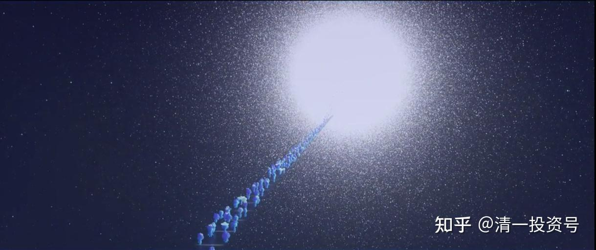

20篇.人学教育，我是之心

清一山长 2021年4月19日

清一山长雪球非专栏帖子整理文章，第20篇《人学教育，我是之心》

此文整理自山长专栏文章《沟通训练：怎样做孩子的贴心朋友，以及做真正的导师？》[https://xueqiu.com/9310099567/177733228](http://link.zhihu.com/?target=https%3A//xueqiu.com/9310099567/177733228)

[lucky-ji](http://link.zhihu.com/?target=http%3A//xueqiu.com/n/lucky-ji)回复[清一山长](http://link.zhihu.com/?target=http%3A//xueqiu.com/n/%25E6%25B8%2585%25E4%25B8%2580%25E5%25B1%25B1%25E9%2595%25BF):

谢谢山长慈悲循循善诱的教导我们，但是作为青春期的孩子特别不喜欢家长给他们讲的一些“不要在意别人的言行，做好你自己就可以了“你改变不了其他人，只能改变你自己的内心”......类似这样的话，她们说是不喜欢鸡汤，不喜欢洗脑，怎么办？

青春期的孩子涉事太浅，遇到的班级小团伙孤立，遇到春心萌动的事情，孩子自己真的是非常焦虑和痛苦，以至于引起身体不适的严重症状，严重失眠和吃饭吸收不好。

好像对青春期孩子没法用直接击中痛处的方式唤醒她们，在大人眼里这都是小事，可对青春期孩子来说就是不能承受之重，最近在反复体会山长文章和刘老师书籍，也发出了申请，希望有机缘得到山长或者刘老师的疗愈。

感恩山长和刘老师。

[清一山长](http://link.zhihu.com/?target=https%3A//xueqiu.com/9310099567)[2021-4-19 17:17](http://link.zhihu.com/?target=https%3A//xueqiu.com/9310099567/177545569)回复[lucky-ji](http://link.zhihu.com/?target=http%3A//xueqiu.com/n/lucky-ji):

“不要在意别人的言行，做好你自己就可以了”，“你改变不了其他人，只能改变你自己的内心”

这些话，没人喜欢听，很空洞。除非，你能用他们能理解，并认同的方式，把这个原则换一种简单、通俗，她完全能够共振的方式来告诉她。

孩子不是不知道这种原则，文字谁都知道。是不知道如何具体实施这个原则，也不知道她内心的感受。你该**告诉她具体怎样理解，怎样做，而且同情和理解她的感受**，这样她才会听你的。不然的话，自然跟你逆反。因为你没真正帮到她。

你们看我跟孩子沟通，可能会说：我也是这个意思？这样也不难嘛？都是大白话。但为啥孩子不听你的，听我的？因为**你们只会贴标签，我会落到实处，跟孩子的心相印。**

清一山长[2021-4-19 18:08](http://link.zhihu.com/?target=https%3A//xueqiu.com/9310099567/177552258)回复[lucky-ji](http://link.zhihu.com/?target=http%3A//xueqiu.com/n/lucky-ji):

谢谢你提供的这个信息，我让我们学堂的预备教师们，实习教师们，去把你说的这两句话（原则话），用跟青春期学生沟通交流的模式，写出两个不同的情景对话来。作为对他们学习和工作的考评，每次作业都要排名，一直排名末位的就要淘汰，失去实习教师资格（当然，不止一次考评。而是这个作业总也做不好的人，我们不能聘用来做教师）。我认为：这个能力对于新教育教师很重要。只会跟你们家长一样说话——说大话，他们是无法赢得学生的心的，我要教会他们说“小话，贴心话”。

[清一山长](http://link.zhihu.com/?target=https%3A//xueqiu.com/9310099567)[2021-04-21 12:52](http://link.zhihu.com/?target=https%3A//xueqiu.com/9310099567/177744784)

会像上文中这样说话的人，在社会上，是“很值钱”的人。你们设想一下：假如我是房地产的推销员，拿业绩吃饭的。我会跟客户用这种方式沟通、交流，你认为：我一年能挣多少提成？绝对远远高于一般的打工收入、工程师收入。去当咨询师，更是高收入；当教师，也是学生最喜欢的教师；去企业，很快就是当管理人员的料。

这就是清一大学教“人学”的价值。兼容性特别强，只要是人做的，我们都可以做到。其实，这种人才，也是社会上最稀缺的人才，比啥理工科人才缺多了。很遗憾的就是：全社会就没有一所学校培养这些东西。学起来，也没有你们想象的这么好学，挺难的。因为要改变自己的思维方式和心理范式才能做到。

我们正在做这种教育，不过，虽然所有的学生都在学我们的“人学”，但我核心的“人学教育”，集中的“沟通交流教育”，主要集中在未来准备做新教育的师资预备班；其他普通班级，主要用于学美国12年课程，要考SAT，剩下的时间，能学多少，再学多少；很多学生和家庭。都要去考国外大学的，咱们不能耽误了家长的要求和目标。

客户满意度才是最重要的，别拿我认为最重要的东西来教学生，而是必须先教家长认为最重要的东西，比如SAT成绩。

现在泰国我身边的几个学生，我教得最多的就是“说话，做人，做事”，教态度，不是教啥技术、知识。别人看我带兵，不知道我教了啥，但这些学生，未来出来带班之后，学生最喜欢。秒杀体制内的大学生、研究生！（大学生、研究生）根本不是她们的对手。她们根本就不拿SAT当事，将来也不准备去考美国大学，她们将来最多去上上泰国的大学，去交朋友，不是学东西。现代的大学，真没啥有价值的可以去学，只有有价值的朋友，可以认识一批。

[ellhll李华丽](http://link.zhihu.com/?target=http%3A//xueqiu.com/n/ellhll%25E6%259D%258E%25E5%258D%258E%25E4%25B8%25BD)回复[清一山长](http://link.zhihu.com/?target=http%3A//xueqiu.com/n/%25E6%25B8%2585%25E4%25B8%2580%25E5%25B1%25B1%25E9%2595%25BF):

感谢山长的分享。

山长说：“用他们能理解，并认同的方式，把这个原则换一种简单、通俗，她完全能够共振的方式来告诉她”。秘诀是**“共振”**，而一般人却是用**“对立”**的方式把孩子推开。

一般人对孩子的情绪，是**“对立”**处理方式：

1.交换：用其他东西转移孩子的情绪（逃避）

2.惩罚：威胁或指责孩子的情绪（打击）

3.冷漠：让孩子自己去冷静或想办法（孤立）

4.说教：对着孩子说很多应该不应该的道理（抗拒）

山长示范的对话是**“共振”**处理方式：

1.接受：注意并接受孩子有这样的情绪。

2.分享：引导孩子分享情绪，再分享事情。（换位分享我的类似经历）

3.肯定：先肯定他可以肯定的部分。（换位让他来肯定我的做法）

4.指出：引导他看到自己的问题，找出需要改变的地方

5.策划：引导孩子对未来采取更合适的行为

1、2、3是为了让孩子觉得【我跟他】是共振的，我和他是一队的；所以到了4、5，孩子很自然地【他跟我】共振了。最后达到对话的目的：引导孩子看到问题，解决问题。

但是看到后面有个地方有点困惑。昨天和一个年轻人对话【宇宙吸引力】，就提到【厌即是恋】：你越讨厌的一个东西，越会被你吸引过来。山长示范的对话后面提到：

【你讨厌什么，你就得不到什么。如果你讨厌成绩优秀的学生，以后你的成绩一定不会好】——讨厌所以得不到

【厌即是恋，他们鄙视你，所以他们也会被鄙视】——讨厌所以得到

这不是矛盾了吗？恳请山长指导。

[清一山长](http://link.zhihu.com/?target=https%3A//xueqiu.com/9310099567)[2021-04-21 16:24](http://link.zhihu.com/?target=https%3A//xueqiu.com/9310099567/177771637)回复[ellhll李华丽](http://link.zhihu.com/?target=http%3A//xueqiu.com/n/ellhll%25E6%259D%258E%25E5%258D%258E%25E4%25B8%25BD):

爱钱之人，就能得到钱吗？未必。如果这样，股市上的人，都是来赚钱的，都富了。

恨钱（仇富）之人，会富裕吗？肯定不会!

**只有“身心富裕”之人，“我是”之人，才能真赚钱。**你去好好悟一下，弄懂赚钱的道理，你就明白吸引力法则了。

[ellhll李华丽](http://link.zhihu.com/?target=https%3A//xueqiu.com/3931532042)2021-04-21 17:24回复清一山长

爱钱的人，心理是：我要钱，因为我没有钱，我是没钱的人。

所以宇宙说：是的，你就是没钱的人。呈现的就是没钱的结果。

仇富的人，心理是：我憎恨富人，因为他们和我相反，我是穷人。

所以宇宙说：是的，你就是穷人。呈现的就是穷人的结果。

**“我是”**是最有力量的一句话，是最能实现的祈愿。

所以**“厌即是恋”**，得到的是厌的结果，还是失去厌的结果，主要看这个发出者的心，真正发出的是什么样的**“我是”**。

上述的示范，讨厌成绩好的人，就是**“仇富”**心理，就会得到和成绩好相反的结果。

鄙视同学的人，反射的是他的内心，他其实就有他所鄙视的东西，所以他就会得到鄙视的结果。

谢谢山长的启发，我想我理解了。

[清一山长](http://link.zhihu.com/?target=https%3A//xueqiu.com/9310099567)[2021-04-23 10:25](http://link.zhihu.com/?target=https%3A//xueqiu.com/9310099567/177962481)

[$珠江啤酒(SZ002461)$](http://link.zhihu.com/?target=http%3A//xueqiu.com/S/SZ002461)珠江涨停。感觉做主力真心不易。要花钱买涨，做示范，要冲在最前面，让小民们勇敢地面对。

不得不承认我的软弱，面对涨停的诱惑，不敢顽强的坚守，不敢指望新高，再新高。今天悄然放手了珠江。本轮最低9.22元再度买入做T的。我觉得已经赚够了，不好意思再拿了。

看样子，珠江新高在即，祝福拥有珠江的朋友们，大吉大利！

[叶孤城007](http://link.zhihu.com/?target=http%3A//xueqiu.com/n/%25E5%258F%25B6%25E5%25AD%25A4%25E5%259F%258E007)回复清一山长:

昨天刚清仓，今天就涨停，气得想打人，一看山大老师的话，心里好受多了，希望主力别拉了。

[清一山长](http://link.zhihu.com/?target=https%3A//xueqiu.com/9310099567)[2021-04-23 13:25](http://link.zhihu.com/?target=https%3A//xueqiu.com/9310099567/177984464)回复叶孤城007:

“昨天刚清仓，今天就涨停，气得想打人”

您给宇宙发送的信息，是“涨停就生气。不喜欢涨停”。您的心，就是恨涨之心。所以，宇宙回报给您的，就是“完美错过涨停”！太准了！

我看兰州黄河涨停，一点也不生气。我不会骂“这种烂股，居然也涨停”。这也是恨涨。

我心里真心实意想的是：我认为这么差劲的股，都会涨停呀？太棒了。以后我买的股，肯定也会涨停的，我愿意耐心等它们起飞。

我的心，就是随喜赞叹之心。看到好的就随喜——跟着喜欢。

假如珠江卖飞了，明天又涨停，我会说：真好，昨天买我的股的人。有福气。该他赚的，胆子这么大，就应该赚。你看——也是随喜。

跌了，我会说：真不好意思，没想到会跌。等我腾出资金，没找到更好的股，一定会买回来的。如果我对下跌很开心：我的心就是——喜欢跌。所以，我以后买啥跌啥！

我看你们不去修心，光学我买股有啥用？买了也赚不到！送你都拿不走。

[记得慢慢来](http://link.zhihu.com/?target=http%3A//xueqiu.com/n/%25E8%25AE%25B0%25E5%25BE%2597%25E6%2585%25A2%25E6%2585%25A2%25E6%259D%25A5)回复清一山长:

按照恨涨的逻辑，如果恨跌，那应该错过跌，但好像不是这么回事。不知道问题出在哪里。请教山长恨跌是怎么理解呢？

[清一山长](http://link.zhihu.com/?target=https%3A//xueqiu.com/9310099567)[2021-04-23 13:51](http://link.zhihu.com/?target=https%3A//xueqiu.com/9310099567/177987926)回复记得慢慢来:

不是您这样简单对应的。

爱涨的，天天追涨停板的人，也一样追不上呢？

恨跌的，天天买到的股就跌！

必须是**“我就是涨之心”**，才能买到涨的股票。听不懂，就算了。以后我的学生再告诉你吧！
