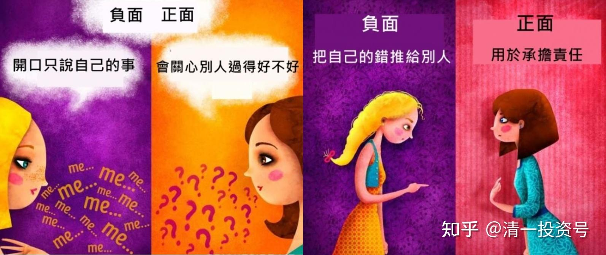

21篇.与孩子沟通的太极方式：舍己从人

清一山长 2021年 4月20日

清一山长雪球非专栏帖子整理文章，第21篇《与孩子沟通的太极方式：舍己从人》

此文整理自山长专栏文章《人生转轨：关键处只需要一场谈话搞定！》[https://xueqiu.com/9310099567/177423259](http://link.zhihu.com/?target=https%3A//xueqiu.com/9310099567/177423259)的评论跟帖

**[唐若闲](http://link.zhihu.com/?target=http%3A//xueqiu.com/n/%25E5%2594%2590%25E8%258B%25A5%25E9%2597%25B2)回复[清一山长](http://link.zhihu.com/?target=http%3A//xueqiu.com/n/%25E6%25B8%2585%25E4%25B8%2580%25E5%25B1%25B1%25E9%2595%25BF):**

感恩山长给到为清一塾孩子们答疑解惑的机会！

听孩子们分享，感受到山长运用“捭阖之道，以阴阳试之。故与阳言者，依崇高；与阴言者，依卑小＂，针对孩子们的不同问题，用阴阳捭阖之道去因材施教，既随顺和接纳孩子有平庸者的念头，又激发孩子们内在有追求卓越的灵魂需求，以让大家扮演不同的角色、不同的立场去激发和引导孩子们，去思考、去选择自己要成为什么样的人，去对自己的人生负责任，帮孩子既清理了平庸者的杂念，又坚定了成为卓越者的信念！

特别感恩山长对孩子们的循循善诱，给予到孩子的帮助；也感恩山长亲自示范“对不同孩子不同问题的回答方式”，也给了我们家长思考和学习的机会。

既入孩子们的心、举重若轻巧妙地化解了孩子所有的情绪，又能给到孩子们充足的力量，还引导孩子们学会换位思考，去体谅家长的感受，并以感恩之心去看待家长的高要求；

对孩子过往被人欺负的事实，也鼓励孩子自强自立成为強者，并将这段经历转念当成一种体验而已，并从中发现正面的价值……每个问题的回答都值得我们好好消化学习，感恩山长的亲自示范，给到我们学习的宝贵机会。

[清一山长](http://link.zhihu.com/?target=https%3A//xueqiu.com/9310099567)[2021-04-20 08:56](http://link.zhihu.com/?target=https%3A//xueqiu.com/9310099567/177597318)回复[@唐若闲](http://link.zhihu.com/?target=http%3A//xueqiu.com/n/%25E5%2594%2590%25E8%258B%25A5%25E9%2597%25B2):

谢谢家长们的关心和支持。

**孩子们难免有种种的情绪和不满，新教育，就是要让教师，在尊重孩子的原则下，发掘出孩子内心深处最强大的一面。**对教师的要求也相对更高。我的目的，也是示范给老师——如何跟学生沟通，达到教学的目标，也不压抑孩子。

对排名靠前的孩子要减压，让她们接受自己的不完美；对排名靠后的孩子，要让他们发现自己的优势，也找到他人值得学习的一面。现在的孩子都早熟，独立性、自我都很强，所以不能一味地说教，只能用**“太极”了——舍己从人！**过于“有我”，只会下命令和要求，就跟孩子们顶抗上了。

家长们要用这个原则来引导孩子：我们要变得更优秀，是因为我们要打败美国人，所以要付出更多的努力；如果不想努力，如果不想打败美国人，平庸一些，跟周围人一样，也可以，只是这样就太遗憾了，有机会没有去抓住，不是谁都有这种机会的。

**鼓励孩子为自己而活。这样，孩子就觉得受到了尊重，愿意努力了。**当然，还会有一些人贪图舒服。所以，回家后就**让孩子体验“平庸的代价”**，了解社会多了，就会越来越热爱学习，真的要去打败美国人了。

**我们必须家校配合，慢慢堵掉孩子逃避的通道，才能让孩子精进**。马上就进入青春期，难免会出状况，家长们要做好准备。

**不要唠叨，而要用同情、理解和支持，巧妙的引导孩子**。

**家长多上示范班的课程，会有帮助的。**内容都是我们教师引导孩子的正向价值观的方式。

[冯瑞丽](http://link.zhihu.com/?target=http%3A//xueqiu.com/n/%25E5%2586%25AF%25E7%2591%259E%25E4%25B8%25BD)回复[璇三星之家](http://link.zhihu.com/?target=http%3A//xueqiu.com/n/%25E7%2592%2587%25E4%25B8%2589%25E6%2598%259F%25E4%25B9%258B%25E5%25AE%25B6)[清一山长](http://link.zhihu.com/?target=http%3A//xueqiu.com/n/%25E6%25B8%2585%25E4%25B8%2580%25E5%25B1%25B1%25E9%2595%25BF)

我家女儿是山长文字里提到的“贪图舒服”的那个类型，前段时间在学堂呈现出极度混日子的状态，我们跟老师商量，把她接回家，让她体验“平庸的代价”，全程完全遵照雨晴老师的思路和方法，在家调整40天，现在回到学堂，状态明显好转，用她自己的话来说：“我要开始逆袭了”！

作为家长，在孩子在家调整的过程中，也有很大的收获，最大的感触是：**全然相信老师，听话照做，结果自然呈现！**

特别感谢雨晴老师，手把手的教我，每一步要怎么做，才会有如此明显的调整效果。

感恩山长创建新教育平台，我们家庭受益匪浅！感恩！

[清一山长](http://link.zhihu.com/?target=https%3A//xueqiu.com/9310099567)[2021-04-21 11:13](http://link.zhihu.com/?target=https%3A//xueqiu.com/9310099567/177734987)回复[@冯瑞丽](http://link.zhihu.com/?target=http%3A//xueqiu.com/n/%25E5%2586%25AF%25E7%2591%259E%25E4%25B8%25BD):

**孩子逃避的时候，家长要做“狠心虎妈狼爸”；孩子心情压抑，遇到困难的时候，要做“知心姐姐”，帮助解决。**这样的家长，就是优秀的家长。

学堂不许老师做虎妈型的，学堂教师，只能做知心姐姐。因此，会偏于宽松一些。家长要设法补上学堂的漏洞。现在的清一塾，正在改革教学方案，会让教师改变原来“很厉害”的形象，主要用于沟通辅导，帮助孩子。这种转变，未来更需要家长的配合协作。

//[@璇三星之家](http://link.zhihu.com/?target=http%3A//xueqiu.com/n/%25E7%2592%2587%25E4%25B8%2589%25E6%2598%259F%25E4%25B9%258B%25E5%25AE%25B6):回复[@清一山长](http://link.zhihu.com/?target=http%3A//xueqiu.com/n/%25E6%25B8%2585%25E4%25B8%2580%25E5%25B1%25B1%25E9%2595%25BF):

我就是文中的C家庭家长，咨询后的第二天孩子状态就非常好！今天周日和孩子通话，孩子全程轻松愉快的和我分享(我已经好久没听她笑了，今天这种状态，原来在她最努力的那个阶段也是没有的，就是打开心门，豁然开朗的那种感觉，原来一直是比较紧的）她分享将咨询的收获落实在学习、运动、做事，各个方面中去的感受，当观念转变后，同样的事情，前后完全不同的心态对比。一场谈话，改变了一个孩子的人生方向，避免了乱做主张，给自己以及家庭带来的灾难性后果。感恩山长！何其有幸，人生得遇名师指路！感恩老师们，在孩子出现问题时，及时的为我们提供的各种支持与协助！感恩！

[清一山长](http://link.zhihu.com/?target=https%3A//xueqiu.com/9310099567)[2021-04-18 19:41](http://link.zhihu.com/?target=https%3A//xueqiu.com/9310099567/177458607)回复[@璇三星之家](http://link.zhihu.com/?target=http%3A//xueqiu.com/n/%25E7%2592%2587%25E4%25B8%2589%25E6%2598%259F%25E4%25B9%258B%25E5%25AE%25B6):

能帮找到你们就好。其实，只要真诚的去理解和支持孩子，就没啥大问题。

**每个孩子，内心深处都是想上进的。给他们符合自己条件的支持和理解就好**。毕竟孩子小，需要有聪明的家长指导、疏通。家长做不到，就请外脑援助。别搞成只会自己孤独地面对，无助地走向灾难。中国的家长，都不善于沟通、交流。希望我们的下一代好一点。

今天本来也有家长咨询的，但我把周日的时间给了清一塾的孩子们聊天。轻松地解决了不少孩子的纠结。类似的集体辅导，如果还是解决不了的问题，家长要学会主动找我帮助。有些孩子就是不善于利用公共资源，家长就需要开通私人渠道解决了。但有些孩子很大方，公开表达也没问题，这些就可以公开处理掉了。但别指望我一个一个的去找学生聊，疏通心结。最多整个班级一起聊，就不错了。

//[@琳溪](http://link.zhihu.com/?target=http%3A//xueqiu.com/n/%25E7%2590%25B3%25E6%25BA%25AA):回复[@清一山长](http://link.zhihu.com/?target=http%3A//xueqiu.com/n/%25E6%25B8%2585%25E4%25B8%2580%25E5%25B1%25B1%25E9%2595%25BF):

每天阅读山长的文章，都像在给自己充电，喜悦无限。

山长文中讲的其中一个孩子，我在参加山长课程时亲眼见过，那时孩子很精进，我惊叹佩服。听同学讲山长是全免费当自个孩子培养她，还计划花巨资请专业高手同时训练培养。过了不知多久，忽然听说这个孩子不学了，要回家赚大钱。我吃惊了一番，同时极度为这孩子家长惋惜。山长亲自培养的机会犹如天上掉馅饼，这种福气世间难遇。遗憾这家长和孩子却把这机缘白白扔了，如山长所讲：**关键点选错了，一生没好运了。**感恩遇到山长“真”人，余生绝不放弃跟随山长学习，期待再上山长的清心课，把自己的“心”继续清洗一番，有觉知地活在世间。

[清一山长](http://link.zhihu.com/?target=https%3A//xueqiu.com/9310099567)[2021-04-18 19:52](http://link.zhihu.com/?target=https%3A//xueqiu.com/9310099567/177458999)回复[@琳溪](http://link.zhihu.com/?target=http%3A//xueqiu.com/n/%25E7%2590%25B3%25E6%25BA%25AA):

最根本的缘由，是这孩子的家族福报不够，不够我送给她的大名（她如果留下来，就会是现在的太极实战第一人），这种名望太高了，她家应该德不配位。所以——接不住这么高贵的礼物。

举个例子：这孩子考上原来的今日高中，当时的高中并没有提供免费条件。考上了，家长才说没钱上学，申请免费。所以我给了全免。但这孩子出去闯商界，想当首富。没多久就觉得没希望（她真没商业天赋的），就“退出商界”了。听说家长后面是拿钱送出国去上国际学校。这——意思就是：家长让孩子上今日学堂，是没钱的。但把钱送给鬼佬用，却很大方。家长实在是看不起我们，自然得不到我们的宝贝了。

目前，接续她练格斗太极的，有四个女生已经超过她当年最高的水平。未来一年内就要出山了。现在，已经没有第一人，而是只有“第一批”了。当年我重点培养，现在是多元发展。谁出来，就算谁的。

[琳溪](http://link.zhihu.com/?target=https%3A//xueqiu.com/6312406367)2021-04-18 22:59[@清一山长](http://link.zhihu.com/?target=https%3A//xueqiu.com/9310099567)

感谢山长回复。当年山长的良苦用心，是宝中之宝，天大的福分。硬是无明家长把山长赠予的前途无量的宝贝踢了。因德不配位这个问题，很多清粉退出了新教育，或者变成了“清黑”，活生生把一些原本优秀的孩子引向无明之路。老实说，开始我对这些家长们的行为想不通，遇到宝贝却成了睁眼瞎子，还好山长解读明白了原因，感恩山长。山长目前培养的新一批孩子，个别我也亲眼见了，实力确实已超越当年那个女孩子，很快会成为我们国人的骄傲。再次感恩山长！

[礼敬](http://link.zhihu.com/?target=https%3A//xueqiu.com/6772921697)2021-04-17 20:53@清一山长

二零零三年，鬼使神差，在我困苦了三五年后，在我亲戚的床上，只有我一个人，突然映入眼帘一本书《世界上最伟大的推销员》，虽然不解，因别无他法，当时已经到了走投无路的地步，随后按要求读了一年。我最关键的一步。后面遇到山长再上台阶，就顺理成章了。

[坚守绿地1500天](http://link.zhihu.com/?target=https%3A//xueqiu.com/1476007226)2021-04-17 21:56[@礼敬：](http://link.zhihu.com/?target=https%3A//xueqiu.com/6772921697)

“二零零三年，鬼使神差，在我困苦了三五年后，在我亲戚的床上，只有我一个人，突然映入眼帘一本书《世界上最伟大的推销员》，虽然不解，因别无他法，当时已经到了走投无路的地步，随仍按要求读了一年。我最关键的一步。后面遇到山长再上台阶，就顺理成章了。”——怎么从困苦解脱的？怎么上台阶的？详细说说

[礼敬](http://link.zhihu.com/?target=https%3A//xueqiu.com/6772921697)2021-04-17 21:59[坚守绿地1500 天：](http://link.zhihu.com/?target=https%3A//xueqiu.com/1476007226)

“怎么从困苦解脱的？怎么上台阶的？详细说说”

买一本我说的书按书中要求读。作者是奥格·曼蒂诺

[清一山长](http://link.zhihu.com/?target=https%3A//xueqiu.com/9310099567)[2021-04-18 08:11](http://link.zhihu.com/?target=https%3A//xueqiu.com/9310099567/177436155)回复[礼敬](http://link.zhihu.com/?target=http%3A//xueqiu.com/n/%25E7%25A4%25BC%25E6%2595%25AC):

不如去念《公主经》，《王子经》。

[佛系小资](http://link.zhihu.com/?target=https%3A//xueqiu.com/1566609429)2021-04-18 08:25清一山长：

洗脑经

[郭凌奇](http://link.zhihu.com/?target=http%3A//xueqiu.com/n/%25E9%2583%25AD%25E5%2587%258C%25E5%25A5%2587)回复[佛系小资](http://link.zhihu.com/?target=http%3A//xueqiu.com/n/%25E4%25BD%259B%25E7%25B3%25BB%25E5%25B0%258F%25E8%25B5%2584):

您难道没有发现您身边的“洗脑经”吗？比如美食广告、游戏广告、电视剧、流行歌曲？这些东西都在不知不觉中对您进行了洗脑，掏空了您的腰包、消磨了您的意志、让您心甘情愿地跳入利益集团的陷阱，您这么聪明的人发现了吗？另外，请问《王子经》/《公主经》您读过吗？

[清一山长](http://link.zhihu.com/?target=https%3A//xueqiu.com/9310099567) [2021-4-18 12:09](http://link.zhihu.com/?target=https%3A//xueqiu.com/9310099567/177444031)回复[@郭凌奇](http://link.zhihu.com/?target=http%3A//xueqiu.com/n/%25E9%2583%25AD%25E5%2587%258C%25E5%25A5%2587):

很多人，都很喜欢对自己完全无知的东西乱下结论。所谓的无知者无畏。

**[一十三号](http://link.zhihu.com/?target=http%3A//xueqiu.com/n/%25E4%25B8%2580%25E5%258D%2581%25E4%25B8%2589%25E5%258F%25B7)回复[@清一山长](http://link.zhihu.com/?target=http%3A//xueqiu.com/n/%25E6%25B8%2585%25E4%25B8%2580%25E5%25B1%25B1%25E9%2595%25BF):**

自上次向山长咨询以后，我们和孩子很坦诚的沟通了一次，告诉她爸妈能力有限，以后不再干涉她的事情，给她绝对的自由，但她必须自己承担所有事情的后果。孩子假期回来后，把之前想做、但我们不让她做的事情列了个清单，都做了一遍，孩子也从怀疑、到挑衅、到相信我们真的不再干涉她了，反而开始认真思考自己真正想要什么。

这次公主班夏令营她主动要求想去，去的当天毫不犹豫的选择了莫阿娜组，还特意打电话给我分享她为什么要选择莫阿娜。这也让我意识到，当我们放下对孩子的捆绑，孩子反而更加能承担自己的责任。

当然每个孩子和家庭所面临的问题也都不一样，山长给我们家庭的解决方案也不适合所有家庭。所以有问题建议向山长咨询，因为山长是根据家庭具体情况，给出针对性，并能解决当下问题的方案。虽然山长咨询的档期太满，但非常值得排队等候。祝福所有家庭都能找到与孩子最适合的相处模式！

[清一山长](http://link.zhihu.com/?target=https%3A//xueqiu.com/9310099567)[2021-07-02 08:36](http://link.zhihu.com/?target=https%3A//xueqiu.com/9310099567/188115663)回复[@一十三号](http://link.zhihu.com/?target=http%3A//xueqiu.com/n/%25E4%25B8%2580%25E5%258D%2581%25E4%25B8%2589%25E5%258F%25B7):

基本上，我咨询完就忘掉了，大多数过程，我也不知道你们是谁，当时咨询的具体情况如何等等。昨天遇到一个一周前咨询的案主的信息，我完全忘掉了细节。只好去重新查了一遍当时的记录，才回忆起来。当咨询师，一般都这样：咨询的结果，案主会记住很多年。但咨询师本人全忘光了。虽然我跟其他心理咨询等还不一样，我提供的基本上是人生规划咨询和难点解决，但也一样，不会愿意去记住案主的细节。

昨天咨询的是一对母女，父亲意外死亡后，女儿又到了青春期，15岁，弄到母女之间很僵持，女儿甚至有很长时间，一两年，不理母亲。母亲无奈找我咨询，幸运的是孩子还愿意跟我谈，现已解决问题。

**青春期是很关键的时间点，如果错过，也许孩子要用一生来懊悔来买单。**其实，很多情况，都是家长处理方式错误，闹成了对立局面。昨天的案例，就是家长不理性，导致的母女不必要的冲突。本来孩子可以有更好的结果。我相信未来孩子会更理性的面对自己人生的，也有行动力。

有趣的事情是：我刚见面几分钟，就说了孩子闹的小笑话，小小的攻击了一下孩子，因为据说这孩子脾气特别大。她虽然对我说的事情感到不好意思，但也一点生气的感觉都没有。说明这孩子不是真的油盐不进。她依然很友好，真诚、坦率地跟我聊了快一小时，说我比她妈妈更理解她，懂得她。虽然我也批评了她的行为和个性，但她能听得进去，也愿意改进。但母亲说她的问题，她就很反感。其实是因为母亲**说话方式太欠缺智慧，不关心她的想法，只知道一味的指责**，**当然没有效果**。**去理解孩子，才是最重要的。**

**附录咨询回访报告：**

清一山长私人客户咨询满意度调查问卷

（案主名###）时间：2021.7.1 上午11:30
交流方式：网络视频
一、请问您对本次私人咨询的评价？是否解决了您想要解决的问题？提供的解决方案，是否具有实操性？可详细描述。
本次私人咨询受益非常大，山长的指导和建议可以解决我的问题。只要有意识去改善就能得到提升。
二、您结束私人咨询后，当下的心境是怎样的？是否能够轻松面对您原来认为很困难，几乎无力解决的困难了？
结束咨询后，当下的心境比较放松，可以接受山长提出的问题以及给出的建议。对之前困扰自己的事也有了头绪和努力的方向。
三、山长对您所说的语言和表达方式，使用的词汇等，您是否能够理解？是否超过了您的理解力，还是使用了您完全能够理解的词语和方式来解释的？
山长的表达方式和语言可以理解。
四、您对本次咨询服务，是否有不满意的地方？您希望我们后续提供什么样的改进意见？
没有，非常感恩山长本次指导。
五、经过本次咨询，您对老师的整体印象是怎么样的？有何感觉？您是否希望下次有问题的时候，继续找老师进行咨询？
感觉山长很有智慧，通过我所说以及之前的所做对我的了解，就比我妈妈对我的了解还更加全面。如果在以后提升的路上遇到问题，会愿意找老师咨询。

**[一十三号](http://link.zhihu.com/?target=http%3A//xueqiu.com/n/%25E4%25B8%2580%25E5%258D%2581%25E4%25B8%2589%25E5%258F%25B7)回复[清一山长](http://link.zhihu.com/?target=http%3A//xueqiu.com/n/%25E6%25B8%2585%25E4%25B8%2580%25E5%25B1%25B1%25E9%2595%25BF):**

两个月前，当时孩子在学校出了比较大的状况，如果不解决可能会出大问题的情况下，我们找山长预约咨询的，山长告诉我们说：

“这孩子很有能量，很有想法，如果她走歪了，进监狱都有可能的（孩子总想干坏事，觉得“干坏事、坑人、看人倒霉”很快乐）。我帮她，也许可以改命。”

的确如此，我们用山长给的方案和孩子进行沟通和相处，孩子从开始和我们的对抗模式，慢慢变得学会理解和包容我们。山长给的方案，我们不光会记住很多年，也会一直去消化落实。咨询结束后，我把内容全部用文字打印了出来，因为我们的惯有模式太严重了，在和孩子相处的过程中，会经常出现旧有的模式，这个时候把咨询的内容拿出来消化，会更加清晰和坚定，也更能体会到向山长咨询的价值。

如果没有山长的梳理，可以想象的是，我们家在未来大部分时间里就会陷入和孩子不断撕扯的状况中，轻则和孩子的关系水火不容，重则孩子可能会走极端，所以山长不仅改了孩子的命，也改了我们整个家庭的命运。也期待孩子在公主班夏令营能找到比她生命更重要的事物，然后用全部的生命去浇灌它！

[清一山长](http://link.zhihu.com/?target=https%3A//xueqiu.com/9310099567)[2021-07-02 14:48](http://link.zhihu.com/?target=https%3A//xueqiu.com/9310099567/188175810)回复[一十三号](http://link.zhihu.com/?target=http%3A//xueqiu.com/n/%25E4%25B8%2580%25E5%258D%2581%25E4%25B8%2589%25E5%258F%25B7):

想起来了。这孩子很聪明的，越聪明，夏令营对她的帮助就越大。我猜她夏令营结束后会有很大改变的，因为她的理解力比别的小朋友更强，你们观察看看结果。

**[ellhll李华丽](http://link.zhihu.com/?target=http%3A//xueqiu.com/n/ellhll%25E6%259D%258E%25E5%258D%258E%25E4%25B8%25BD)回复[清一山长](http://link.zhihu.com/?target=http%3A//xueqiu.com/n/%25E6%25B8%2585%25E4%25B8%2580%25E5%25B1%25B1%25E9%2595%25BF):**

感谢山长分享。

祝福获得理解的孩子，祝福看见孩子的爸爸妈妈。他们是有福气的，能在问题恶化前得到解决。

也为山长提到的两个被抑郁药毒害的孩子，每个父母都爱孩子，但是无明的爱不是爱，而是真正的毒害。这样的结果，任谁看了都痛心，痛心之余，记住山长的话“**看别人得病，自己先找药吃**”。

还没得病不想吃药的，要做预防，也要给自己备着可靠的医生：山长和刘老师的咨询。

我记得法萨的李小虎李总写过：按他公司的收益，他每个小时的时间成本是几十万，他今年要花一年的时间在武道馆学习，那他肯定是认为向山长的弟子学习的价值是高于每小时几十万的；这些弟子和李总都是向山长学习的，这样推论，山长每个小时的价值是高于山长弟子的。

现在，咨询者，支付1万，获得山长1个小时的引导，这个价值是**﹥**山长弟子**﹥**李总几十万/小时。这样高价值的福利，真的只能“清粉”才有，否则，山长整天坐在咨询室也忙不过来。

[清一山长](http://link.zhihu.com/?target=https%3A//xueqiu.com/9310099567)[2021-04-29 17:35](http://link.zhihu.com/?target=https%3A//xueqiu.com/9310099567/178651158)回复[ellhll李华丽](http://link.zhihu.com/?target=http%3A//xueqiu.com/n/ellhll%25E6%259D%258E%25E5%258D%258E%25E4%25B8%25BD):

我拒绝了一些要求咨询的单子的。有些贵妇人，说要约我咨询，让她事先提出咨询内容和问题，拉拉杂杂写了一堆祥林嫂一样的话题。我认为，**这些人，就是花钱找“高级聊”的**，估计跟她们买个高级的包包一样。我就让助理直接拒了。有钱也不赚！我要求付费，就是怕人胡乱消费我。我没时间到处乱作好事的。

**只有真心有问题，有事情，着急、焦心的人，我才接单，去解决问题。**凡是空洞无聊的，都不理！而且，我的服务还有一个准则，事后付费。觉得我没帮上忙，可以拒绝付款。

说不定，贵妇人来消费我一通，聊完，表示我没有满足她们的要求，就连咨询费都不出，就走了！我也没脾气！

参考链接：

[清一投资号：第20篇.人学教育，我是之心](https://zhuanlan.zhihu.com/p/523037306)（整理文）

[清一投资号：19篇.人学，身、心、灵，妄心，潜意识](https://zhuanlan.zhihu.com/p/522970634)（整理文）
