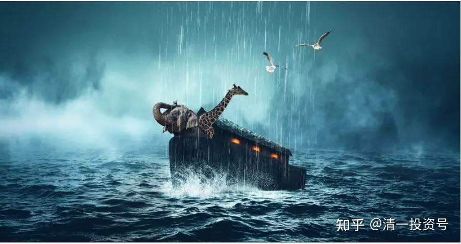

25篇.惩恶扬善或是承担共业

清一山长 2021年 4月28日

清一山长雪球非专栏帖子整理文章，第26篇《惩恶扬善或是承担共业》

[清一山长](http://link.zhihu.com/?target=https%3A//xueqiu.com/9310099567)[2021-04-28 12:14](http://link.zhihu.com/?target=https%3A//xueqiu.com/9310099567/178458426)

[$伊力特(SH600197)$](http://link.zhihu.com/?target=http%3A//xueqiu.com/S/SH600197)刚有人私信给我，说：准备搞价值投资，买伊力特长持。问我意见如何？今天涨停价，来价值投资？这人好虚伪！

我直接拉黑了他！

不是买[伊力特](http://link.zhihu.com/?target=https%3A//xueqiu.com/S/SH600197%3Ffrom%3Dstatus_stock_match)不是价值投资，不是伊力特不会继续涨。我拿伊力特，就是准备长持的，除非伊力特连拉涨停赶我走。我买入价值投资，卖出价值投机，这就是我的投资模式。

但是，这人在[伊力特](http://link.zhihu.com/?target=https%3A//xueqiu.com/S/SH600197%3Ffrom%3Dstatus_stock_match)前段时间，才十几元的时候，你不来价值投资，快30的时候，涨停了，你居然跑来玩“价值投资”，还问我？这种人太虚伪了！我就毫不客气地拉黑了！

BTW：别私信找我问事，很容易被我拉黑的。

公开问，问错了，不拉黑，只是不理你。

公开的不讲文明礼貌，会拉黑。因为你心黑。

私信找我问私事，要我荐股等等，都拉黑。因为你心理阴暗！说话做事见不得人的样子。除非真的有重要理由。

瞧我这样子，根本不适合做庄。我应该高位大声呼唤：快来呀！看我都赚了大钱了。很多大V都这德行，低的时候不说，因为股票跌了就招人骂；涨了拼命说，因为都叫好。我都怀疑是不是被庄家买了号。

我低位说票，高位不吹票，这是道德。万华一路上涨，我吭都不吭的，就怕谁傻乎乎地跑去“跟学我”！我40元买的好不？

跟你们实话实说：每天都有人私信找我**“谈合作”**。我知道是啥人找我，都有目的。我可以轻松卖粉丝赚一笔钱，我相信东博老股民当年就是这样干的——卖粉丝。我不相信全仓[吉艾科技](http://link.zhihu.com/?target=https%3A//xueqiu.com/S/SZ300309%3Ffrom%3Dstatus_stock_match)是他的大脑理性判断的结果，我认为是有人给他钱，让他“全仓”的。

但我理解他卖粉丝的行为。这些粉丝，也没给他什么好处，还老嘲笑他，消费他。他多年一路带过来，帮粉丝赚的钱很多了。庄家拿出上千万，买他吹票，他收一点回扣，可以理解。

我不卖粉丝，是因为我尊重你们，我认为你们不是一个号几百元去就可以买走的。你们起码值上万元，有些人还值十几万，几百万的。但我相信没人愿意出上万一个号来买你们的。所以，有人给我千万，我也不卖你们的。

我认为：**你们粉我，是你们沾我的便宜，不是我沾了你们的便宜。因为你们分享了我几十年的人生和股市的成功经验**。但有人以为你粉我了，我就欠了你一样。你就应该对我指指点点，胡乱要我做这做那的。这种人，没基本的做人素质，不尊人，不尊自己，就早点滚蛋。我不缺粉丝！

不满意我，就取关。取关我，不是我的损失，是你的损失。不信十年后来看！

十年前，取关我的人，活得怎样了？黑我的人，你们好吗？我只知道：真正粉我，学我的人，这十年，已经完全改写了人生。而取**关我的人，再度关注进来，已经一身的伤疤！可怜，非要去找抽。**

[清一山长](http://link.zhihu.com/?target=https%3A//xueqiu.com/9310099567)[2021-06-23 16:35](http://link.zhihu.com/?target=https%3A//xueqiu.com/9310099567/186908169)

[$吉艾科技(SZ300309)$](http://link.zhihu.com/?target=http%3A//xueqiu.com/S/SZ300309)很久没看，现在来看东博老股民的【收官之作】，感叹良多。可惜了，一代股票英才，耐心长持的价值投资者，最终名节却毁于跟庄买妖股。当年我投资银行股，也常常得益于老股民的见解，还给我的粉丝介绍过他，说他很稳健。当年得知他卖掉[兴业银行](http://link.zhihu.com/?target=https%3A//xueqiu.com/S/SH601166%3Ffrom%3Dstatus_stock_match)买这个一看就很不靠谱的妖股（一个民企，跨界玩金融，能玩出啥突出的业绩？），我就怎么想，也想不通道理。不知道他是有意，还是无意地卖了粉丝。

不过平心而论，很多粉丝，素质德行也太差，老股民就算好心分享真正的投资心得，他们也动不动就网上骂人，还不断冷言冷语的讥讽人，自以为高人一等。所以，估计老股民一怒之下：粉丝算什么东西？给他啥好处了？不如大家都不讲感情算了。

其实我的粉丝也是一样，有一群脑残，就是猪一样的理解力，怎么费心教，都是要赔钱的。就连[惠泉啤酒](http://link.zhihu.com/?target=https%3A//xueqiu.com/S/SH600573%3Ffrom%3Dstatus_stock_match)这么好的短线投机品种，这么容易赚钱的股票。我特别强调：10元以下越跌越买，套住就装死。十元以上，就是择机卖出的区域，忌讳新买入（除非做T），不然小心套牢。这样来操作股票，其实风险真不大。我也在10元之前公开分享操作记录，已经够尽力了。可是，一些粉丝还在骂人。这次很短时间就再度从7元冲14元，是一个很容易的盈利标的。我都又再度的大赚一笔，可还是有人出来骂骂咧咧的说**“泰国人”**忽悠了他们之类的鬼话。我相信老股民，也是忍够了这种脑残和道德残废者吧？

我相信这些恶人只是一小群。但沉默的大多数，并不去清除垃圾，只是贪好处，置身事外，最终惹怒老股民，觉得粉丝都是一丘之貉。最终也许就把所有粉丝都卖了。真是惋惜！国人的共业吧！**你没有对作恶者表达不同的身份，自然与作恶者会遭遇一样的待遇。**

[吉艾科技](http://link.zhihu.com/?target=https%3A//xueqiu.com/S/SZ300309%3Ffrom%3Dstatus_stock_match)，现在已经沦为真正的吸血妖股，一个净资产都归零的股票，居然热度还蛮高的。一个月的成交量，居然是1-2倍的市值。成为一群疯狂的傻子、骗子、疯子的乐园。中国的股民，什么时候才能够成熟一点？有一点基本的理性？

[ellhll李华丽](http://link.zhihu.com/?target=https%3A//xueqiu.com/3931532042)2021-06-23 17:57回复山长：

谢谢山长分享。

一、【这些恶人只是一小群】社会为恶的人也只是少部分；

二、【但沉默的大多数，并不去清除垃圾，只是贪好处，置身事外】；

大部分人呆在自己的舒适圈，只要还没有影响到自己目前的生活，便事不关己高高挂起，做潜水者，做旁观者，存在侥幸的心理，认为或许这些恶人的事情不会危及自己，又或许有其他人会去收拾恶人。

三、【最终惹怒老股民，觉得粉丝都是一丘之貉。最终也许就把所有粉丝都卖了。真是惋惜！】

物质上：环境破坏了，大家都要呼吸有毒的空气，喝有毒的水；当急功近利只追求更多盈利的常态进入食品产业，大家吃的都是有毒的食品；地球是个活的生物体，它会用自己的方式自我保护，或许，当某一天它承受不了了，就让依赖它生存的所有生物集体死去，这又有什么不可能呢？

非物质上的，民族共受集体灾祸的不止一次，最近的历史有文革，远一点的历史有清朝、明朝、元朝、宋朝、唐朝的颠覆等等，哪一个不是大量百姓、军人的死亡，数量甚至达到山长所提及的90%人口的消失。难道再有这样的颠覆，我们就有信心会是那10%的幸存者吗？

四、【国人的共业吧！你没有对作恶者表达不同的身份，自然与作恶者会遭遇一样的待遇。】

我不想成为共业的承受者，因为我没有信心，当集体惩罚到来的时候，我能成为极少数的幸存者，我能搭上“诺亚方舟”；我也不认为自己有这样的智慧和能力参与创造“诺亚方舟”。《与神对话》中神对尼尔不断追问世界末日的问题，神说，是否有末日，是由你们集体决定的。所以我想参与唤醒更多的人，来主导我们的集体意识，来决定我们集体的未来是一个美好幸福的未来。

山长的雪球主页，一直在呼唤这样的集体觉醒，一直在致力于我们走出动物级别的浑噩和沉迷。关注山长的粉丝有8万+了，专栏阅读量基本是8万以上，有的几十万，有的上百万，但是点赞的、转发的、评论的数量却和这个粉丝数、阅读数相差巨大。为什么呢？这里有多少是潜水者、旁观者的心态？

多媒体时代信息量太大，大部分人靠一目了然的数据来决定自己要不要阅读一篇文章。如果自己真觉得老师说的东西是有道理的，时间有限的人点击转发、点赞，路人看到：哇，这个数字那么大，点开看，一次没接受，5次、10次、100次总有一次接收到了；一个人没看到，10个、100个、1000个，总有人会看到。

有空的人在底下评论，不带强烈的情绪词句，理性地说出自己的理解，哪部分受益，用客观事实和数据。看客看到跟随者不是信徒，而是独立思考的理性人，自然推理老师是更理性、更智慧的人，被老师所吸引。这就让路人有机会接触到山长的智慧和呼吁。更多的转发、评论、点赞，就会吸引更多的路人转发、评论、点赞，这样形成一个良性的循环。

一滴水如何不干涸？把它放入大海。我们都是很普通的人，只是一滴小水珠，汇成小溪流入大海，和老师的智慧在一起，和老师的呼吁在一起，我们才能让理性成为集体意识的常态，我们才能真正把握和决定我们集体的未来。

上医治于未病时，智者谋于未动时。让意在唤醒人类觉醒的文字被更多的人看到，我们就是积极的参与者，不管最终的结局如何，我们都能无愧于人、无愧于己。

[岁月静夕阳红](http://link.zhihu.com/?target=https%3A//xueqiu.com/1089838891)2021-06-24 09:51

补充李华丽女士的发言：有些恶是大部分人共有的，比如事不关己，高高挂起，不肯为正义呐喊助力，这种小我就是一种恶，所谓姑息养奸，干坏事的人一看没人反对，就会大胆胡作非为，最终危机来了，环境污染就是例子，对于排毒气，废水的企业大家都不叫停，默许，最终空气有毒、水有毒，恶果还是大家承受。鲁迅当年企图唤醒世人，至今还是很多人不觉悟。大部分还是糊里糊涂活着，执迷不悟。什么时候，大多数人觉醒，才会有全新的世界。试想，大多数人去声讨去打击少数坏蛋，还能不胜利吗？时间问题。关键是大多数人的觉醒很难。

[ellhll李华丽](http://link.zhihu.com/?target=https%3A//xueqiu.com/3931532042)2021-06-24 08:36回复岁月静夕阳红：

允许行恶之人行恶，允许恶事继续发生，本身就是行恶。从这个意义上说，确实是如您所说的【有些恶是大部分人共有的】。没有无缘无故的福，也没有无缘无故的祸。

虽然很难，总是要做些事情的。善恶同源，要有多大的伟业，必然需要有多大的险阻。人类能延续至现在，我们能在这里交流，这个结果上看，还是伟业战胜了险阻的。既然如此，为什么这次就要例外呢？

//[@覺清2020](http://link.zhihu.com/?target=http%3A//xueqiu.com/n/%25E8%25A6%25BA%25E6%25B8%25852020):回复[@清一山长](http://link.zhihu.com/?target=http%3A//xueqiu.com/n/%25E6%25B8%2585%25E4%25B8%2580%25E5%25B1%25B1%25E9%2595%25BF):

是啊！我们要集体觉醒，不能忽悠自己的良知。明明看到不对的地方连一句公道话都不敢说，很多人都是站在自私的立场自以为聪明的选择了自己的言行。

[ellhll李华丽](http://link.zhihu.com/?target=https%3A//xueqiu.com/3931532042)[2021-06-24 18:48](http://link.zhihu.com/?target=https%3A//xueqiu.com/3931532042/187101144)[回复覺清2020](http://link.zhihu.com/?target=http%3A//xueqiu.com/n/%25E8%25A6%25BA%25E6%25B8%25852020):

对待善恶，我们有【惩恶】【扬善】。

山长前几天有个帖子这样写的：

【我的名言是：我绝对不会骂你是猪，我只证明你是猪！前者是情绪、是非理性、是负能量，后者是理性、是思辨、类比，不是负能量。如果后者采用“证明你是猪”的方式，目标是帮助你提升、改变，不是为了攻击你。结果就是正能量！所以，不要拘泥于某些词汇，而要观“心”之所在。当然，如果你们“没心”的话，不建议模仿我。就只说好话，别说坏话！别惹祸上身】

我是觉得自己的能量和思维，没能力骂人，也没能力证明恶人。

所以我更多的是用【扬善】的方式，传播老师的智慧，礼赞善的东西。比如点赞、转发、评论老师的文字让更多人看到，比如参与喜马拉雅【清一新教育】音声平台的建设，让山长和刘老师的智慧有更多的传播途径有更多的方便法门。比如，看到的人觉得这些文字和音声资源是智慧的，分享给更多的人，这些都是扬善。
