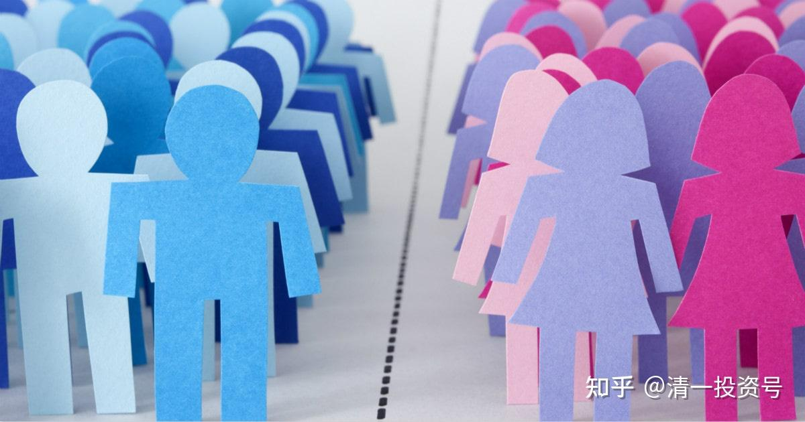

32篇.重男轻女，潮汕文化，世界的尊重

一、转文章

昨天新教育圈被一篇文章刷屏了，这篇文章是山长的助教蔡慧英老师2021年撰写，记录了山长最新的一课智慧教导。分享给有缘人。

《山长给富二代的私家课》

链接[https://mp.weixin.qq.com/s/6IkCpjvFtX1EactmB03Xtg](http://link.zhihu.com/?target=https%3A//mp.weixin.qq.com/s/6IkCpjvFtX1EactmB03Xtg)

二、整理文章

清一山长2021年10月7日

清一山长雪球非专栏帖子整理文章第45篇《重男轻女，潮汕文化，世界的尊重》

此文整理自山长专栏文章《[重男轻女给我们社会带来了什么结果？](http://link.zhihu.com/?target=https%3A//www.ximalaya.com/sound/461074286)》[https://xueqiu.com/9310099567/199485659](http://link.zhihu.com/?target=https%3A//xueqiu.com/9310099567/199485659)的跟帖评论

2021年10月6日

清一山长：

重男轻女的习俗，给你轻视的女生，带来了多大的压力？给你重视的男孩，带来了多大的灾难？**天道的道理，就是平衡。歧视他人，最终导致的是自己的被歧视！**这篇文章，太值得一读了——我特别希望我们学堂的家长们，宠男生宠得一塌糊涂的男生家长们，要好好思考你的所做所为了，也许将来最让你打脸的，就是你重男轻女的思维！

转发原文：

引言：我爸妈都是小学老师，在他们从业的这三十余年里，最后能顺利读完高中、考上大学、离开我们县的人几乎都是女生，男生大部分会在小学升初中时流失一批，在初中升高中时再流失一批，等到考大学时，小学里的一个班能最后剩下一到两个男生已经算是罕见。**“以为可以靠自己的生殖器就优越于女生的男生们，最终遭到的居然是这种完全被漠视的打击”**。

原文：微信[网页链接](http://link.zhihu.com/?target=https%3A//mp.weixin.qq.com/s/Sx62F-GroDiI3CnCdWdHew)

[https://mp.weixin.qq.com/s/Sx62F-GroDiI3CnCdWdHew](http://link.zhihu.com/?target=https%3A//mp.weixin.qq.com/s/Sx62F-GroDiI3CnCdWdHew)

[梅骁 ：县城里的蝴蝶效应](http://link.zhihu.com/?target=https%3A//mp.weixin.qq.com/s/Sx62F-GroDiI3CnCdWdHew)

//[ellhll李华丽](http://link.zhihu.com/?target=http%3A//xueqiu.com/n/ellhll%25E6%259D%258E%25E5%258D%258E%25E4%25B8%25BD): 回复[清一山长](http://link.zhihu.com/?target=http%3A//xueqiu.com/n/%25E6%25B8%2585%25E4%25B8%2580%25E5%25B1%25B1%25E9%2595%25BF):

谢谢山长分享。

看了心里唏嘘不已。虽然是河北，但和我出生地潮汕地区重男轻女的氛围很像，和我的成长经历很像。

潮汕地处粤东，有很强的地方色彩，代代相传的地方习俗和节日，让重男轻女的观念始终保留毫不动摇。祭神、婚嫁、丧葬、宴请、扫墓、族谱，这些是每家每年甚至每月都在反复参与的事情，全部是以男为贵，甚至规定部分女子不得参与。在家乡，没有儿子，就是矮人半截，因为没有后继男丁可以参与这些需要男士参与的活动。

爷爷有三个儿子，三个女儿，年轻时在家乡是有名望的人。爷爷的六个子女全部要生到有儿子为止，包括我的父母。我一直记得妈妈说的场景：爸爸看到二妹出生时，坐在门口抱头痛哭。二妹已经是这样，更别说，我还有三妹、四妹。

我看到爸妈的不易，也和爸妈承担起这样的不易。4岁会烧柴火煮饭，几个妹妹由我带大，我的童年没有玩乐，只有责任，没有周末假期，十岁不到就开始做手工赚钱补贴家用。最开心的是奶奶偶尔心情大好，能松绑了我背着妹妹的肩带让我歇一歇；最害怕的是和伙伴在外面玩晚回家妈妈的板子；最无奈的是冬天里三餐一家人的碗筷锅铲。

很小很小，我就在心里下决心，我要出去，一定要出去，所以很用心读书。初中的时候，我的窗口5点多就有灯光，那是在学英语，邻居赶早市卖菜的叔叔说，我比他起得还早。我是拼了命地学习的，哪里需要爸妈监督！哪里需要老师激励！学会了书本的还担心掌握不好，课外练习做了一本又一本；自己对哪科成绩一般，想破脑袋地去找科任老师的优点，看怎么能喜欢上这个老师，然后学好这一科。

后来我终于如愿地考上了理想的学校，离开了家乡；三个妹妹，也都一样，虽然她们责任没有老大的多，但重男轻女的氛围，农村人的闭塞，姐姐的示范，让她们也竭尽所能读好书，然后离开。最终，我们都做到了。

最小的是弟弟，从小集四个姐姐、爸爸妈妈、爷爷奶奶宠爱于一身，想什么有什么，别人有的他一定有，别人没有的我们也尽量去给他，就是觉得，我们小时候没能有的东西，让他有了，就好像是对我们自己童年的补偿一样。

结果如何？我们几姐妹学业都好、事业有成、家庭不错，弟弟初中都没读完，实在读不会。出到社会，让社会教育吧！什么结果？当然很多问题，最后都是找了爸妈给他兜底，爸妈兜不了的，就来找我们几姐妹。

四个女儿自懂事就在回报爸妈，弟弟一直到现在都在索取。爸爸一谈及弟弟就生气，妈妈一谈及弟弟就掉眼泪。我和妹妹都曾问爸爸：“现在对比我们和弟弟，还会想一定要生儿子吗？”爸爸说：“哎，就算是这样，也是要儿子的，你不懂，这是周围的实际，必须要的。”

这样现实，还是这样的观念！可想整个环境的情况。

爸妈重男轻女，在我很小的时候把过多的东西让我承担，我没有童年的自由，不管对不对，弟妹挨打我一定有份；弟妹受伤跌疼哭了我也要受罚，就更别说分到一些爸妈温情的疼爱。

前几年和妹妹说起小时候爸妈的一些做法，还会难过。所以，以前我跟爸妈是不亲的，有怨，有评判。上了慧心课，在刘老师的引导下，慢慢地疗愈自己，也疗愈了和爸妈的关系。

现在想起爸妈，是爱和感谢。没有这些经历，我就不是现在的我：有学问，有能力，财务自由，更重要的是心的自由。所以，就像这篇文章写的一样【在命运这条线上，开局不利的女性们，以不同的方式找回了自己的人生】，这样的环境，就像淤泥，让女儿能长成美丽的莲花。

[https://www.sohu.com/a/430772842_120179484](http://link.zhihu.com/?target=https%3A//www.sohu.com/a/430772842_120179484)

[梅骁：县城里的蝴蝶效应:严丝合缝又曲折离奇](http://link.zhihu.com/?target=http%3A//www.huogua.net/a/37859)

**[清一山长](http://link.zhihu.com/?target=https%3A//xueqiu.com/9310099567)**[2021-10-07 21:59](http://link.zhihu.com/?target=https%3A//xueqiu.com/9310099567/199542487)回复[ellhll李华丽](http://link.zhihu.com/?target=http%3A//xueqiu.com/n/ellhll%25E6%259D%258E%25E5%258D%258E%25E4%25B8%25BD):

原来你是潮州人。我20多年前，做企业的时候，去过潮汕的潮阳镇做生意。当年在潮汕的老板家里吃饭，发现只有男人才能上桌。女人们要做好饭，先给男人吃，要等男人们都吃完了，才能坐上桌吃剩饭。男人们喝茶、聊天、玩，啥事不干。很多事情都是女人在干的。生意上，女生做的事情也不少，收货、理货、发货啥的。男人们似乎只管喝茶、交朋友。但实际上的事情，做得很少。地位似乎是皇帝一样，天生的。但潮州的男人们都很自豪，说潮州的女人最好。当然，这些老板如果没有做生意，闯出一片天地，也会被人瞧不起，我知道的潮州老板还是外出到处拼搏的，老乡也很团结。

你家的故事，非常的典型。现在很多父母，爱儿女就跟你们家宠儿子一样，把孩子全宠变废物了。其实，**真爱孩子，就是要对他/她狠一点**。你父母无意中做到了我的新教育要求。**现在的家长，就要学当后母后爸，才能把孩子培养出来**。把孩子当爷，将来培养出来的，就都是你弟弟一样的人了。不怪你弟弟天生就不成器，实在是父母和家人，从小把他宠坏了，让他变得无能的。

//[ellhll李华丽](http://link.zhihu.com/?target=http%3A//xueqiu.com/n/ellhll%25E6%259D%258E%25E5%258D%258E%25E4%25B8%25BD):回复[清一山长](http://link.zhihu.com/?target=http%3A//xueqiu.com/n/%25E6%25B8%2585%25E4%25B8%2580%25E5%25B1%25B1%25E9%2595%25BF):

谢谢山长分享，我们以一生为代价来领悟一个道理，山长总是在他人的故事里一下就看到了问题的根源。愚者和智者的区别是这样的明显，但很多人却还是愿意继续做愚者，也不愿接受警示清醒过来。除了愚不可及，也是山长曾经讲过的“沉没成本”吧——不能接受损失的心态。

您描述的男先女后、男喝茶女干活的现象在现在的潮汕地区还存在，表现方式可能有些不同，但本质是一样的。

潮汕女儿从出生就浸泡在这样的环境中，大部分养成了隐忍和坚韧的性格，唯有如此才能争得更多生存的空间。以妈妈为例，家族里的兄弟姐妹都有儿子，就她一直没有，还未有儿子的11年时间里，家人、他人以此来评价她：你没用，你很差。她不去辩驳这样的评价，生男生女不是她能控制的，但她能控制她能做的，她的孩子最多，但她绝对不让孩子过得比他家孩子差，除了繁忙的家务、农活，尽量挤时间赚补贴——半夜起来或凌晨早起，在小灯泡下妈妈做手工的背影，一直留在我们的脑海里。妈妈的心气很强，不能让人看扁了，不能比别人差，她决心要做到就一定要做到，一天天，一月月，一年年，后面我们真的过得比很多家庭还好。

爸爸是典型的潮汕男主，有些想法做法我们并不赞同，但是他的责任心却是我们所敬佩的，他自己很节省，很努力赚钱供养整个家，很小的时候他就对我们说：只要你们考得上，就算卖房也会供你们读完书。因着这样的承诺，我们学得很有希望，很有底气。

爸爸妈妈在这个大环境中，尽他们所能给了他们能给一切，承担起他们能承担的最大极限，他们正向上的示范是我们成长的养分。爸爸示范了力量，让我们能承担一切；妈妈示范了韧性，让我们可以柔化所有的磨难。

山长提到的潮汕人的团结，与当地的习俗有很大的关联。每年几个大型的祭神、宴请、丧葬，一些扫墓，一些乡村建设的捐赠，全部是以宗族的形式进行；大的宗族有自己的族谱，有祠堂，只有本宗族的人才能使用；小的宗族没有只能凑合着用一个，说话的底气都小很多。这样无处不在的宗族意识，让大家从小就有很强的大家庭意识，很维护本族的利益和荣誉，对外表现出来的就是团结和拼搏。

在家乡是宗族，在外面的世界，就是潮汕大家族，团结在一起，能抵抗其他群体的攻击，必要的时候也能有强大的攻击力。是一个很坚固的壁垒，但同样的，意识形态也很难进入其中，很难接受新的思想和观念。

我一直有留意，潮汕地区什么时候有新教育的身影。几年了，最近我看到义工里面有2位是同个地区的，这次山长国庆分享的110个分会场，有一个在潮汕。我像在沙漠里走很久看到了一株绿苗一样欣喜。期望新教育能在那里生根发芽，让顽石点头。

感谢山长的新教育，感谢山长国庆的法布施，这几天都在消化您的智慧分享。

**[清一山长](http://link.zhihu.com/?target=https%3A//xueqiu.com/9310099567)**[2021-10-08 13:39](http://link.zhihu.com/?target=https%3A//xueqiu.com/9310099567/199596479)回复[ellhll李华丽](http://link.zhihu.com/?target=http%3A//xueqiu.com/n/ellhll%25E6%259D%258E%25E5%258D%258E%25E4%25B8%25BD):

关于潮州人的教育观点：非常的务实。当年我打交道的潮州人，一般读了几年书，初通文墨之后，就弃学不读书，去父母和亲戚的企业当学徒，学做生意。因为潮州人不看重文凭，看重本事，特别是做生意的本事。对于内地追求大学和文凭，他们觉得书读多了都是浪费时间的。关键是读完了没用。因为潮州人不喜欢去打工，更喜欢创业，即使是一个小摊档。

现在的情况不知道。但这种文化，显然创造了**潮州人的务实精神，在全世界都有很强的竞争力。不过也有缺点：就是太不重视文化**。其实泰国的潮州人很多，最富裕的也是潮州人。但潮州人在教育的投入真的很有限，也没有什么文化追求和理想。所以——虽然经济地位很高，但社会地位不太高。在其他国家，排华现象，很多是因为潮州人的理念守旧、俗气，过分看重钱财引起的。泰国佛教文化，还比较包容这些。

**未来的华人，要获得世界的尊重，必须有除了有钱以外，更重要的东西，比如更高级的文化和教育**。希望**我们能够在海外为中国人树立一点比钱更重要的追求。**

//[ellhll李华丽](http://link.zhihu.com/?target=http%3A//xueqiu.com/n/ellhll%25E6%259D%258E%25E5%258D%258E%25E4%25B8%25BD):回复[清一山长](http://link.zhihu.com/?target=http%3A//xueqiu.com/n/%25E6%25B8%2585%25E4%25B8%2580%25E5%25B1%25B1%25E9%2595%25BF):

感谢山长为民族文化的复兴立下如此的大愿。新教育圈里的人都是被这样的愿心所吸引，跟随山长建设属于中国人自己的文化平台，去振兴中华传统文化。虽然知道自己的能力很有限，但是一点点也是大于零，有山长和刘老师在前面引导着，我们有希望，有底气，这个愿望是可以实现的。

关于潮汕人的务实、重金钱、轻文化，我写一些现象，冒昧请求山长指导一下分析的方向是否对。

1.拼男丁——爷爷奶奶的年代，脸上有光、腰板挺直的是家里生的男丁多，像爷爷有几个兄弟，堂兄弟也有几个，爷爷奶奶有三个儿子，所以这一个家族很是自豪。

2.拼养家——爸爸妈妈的年代，能养活一个大家庭，能盖一个宽敞的房子，还能有小余款，那这一家就是大家眼里很不错的家庭。

3.拼读书——到我这一代，不知为何，整个大氛围都认可考上好高中，好师范大学，那样在大家眼里是中状元的光荣。我记得我考上省师范的时候，爸爸宴请了宗族的亲朋，在我家乡，为女儿设宴一生只有两次：一次十五岁成人礼，一次是出嫁。不单我家，其他也一样。爸爸6个兄弟姐妹都在比谁家的孩子成绩更好，考上的更多。可见在家乡人的眼里，能有好成绩，考上好学校是多荣耀的事。包括底下有帖子提到的，潮阳的一个很出名的私立中学，我有同学在里面做老师，每次高考，都是捷报多少高考状元的，各种红头喜报。

4.拼心气——潮汕人外出，很多是团队里的负责人，不喜欢为人打工，不愿居人之下，受人指派，宁可辛苦自己守着小生意，自己做主。

5.拼赚钱——出外的人最能展示成功的是财富，最快得到财富的是生意。不只是泰国，以前生意上的伙伴是智利的，他说智利最有钱的是一个潮汕人，在智利很出名。

6.宗族最大——家乡外出打拼的，做了多大的生意，每逢大型的祭神，或是重要族人离世，多忙都回来参与。

所以，我想，是不是因为潮汕这种代代相传的宗族观念，敬鬼神，重祖先，深入骨髓的荣耀宗族的渴望，让这个区域的人，随着时代的价值观的变迁，重视的、拼搏的也不同呢？高考状元，清华、北大，是这个时代的荣耀标志，所以拼出了潮阳这个小地方却出了全省名中学；财富是无论哪个时代都会有一定地位的，表现出来拼财富的最多，形成了重金钱的印象。所以，关键是哪个能让他们觉得是荣耀祖先了，他们就能像创造出财富成就那样创造其他领域的成就呢？

假设，新教育的文化圈子成了这个社会的荣耀标志，那是不是也可能拼新教育了，不再是轻文化的现象呢？

这样请问很是冒昧，再次向山长致歉。实在是很想知道。感谢山长。

**[清一山长](http://link.zhihu.com/?target=https%3A//xueqiu.com/9310099567)**[2021-10-08 22:03](http://link.zhihu.com/?target=https%3A//xueqiu.com/9310099567/199645813)回复[ellhll李华丽](http://link.zhihu.com/?target=http%3A//xueqiu.com/n/ellhll%25E6%259D%258E%25E5%258D%258E%25E4%25B8%25BD):

潮汕人民风强悍，跟温州类似。地少人多，所以必须拼搏才会赢。重商主义传统很强，很早就闯天下，下南洋等。只是，财富提升之后要做什么，其实他们没概念的。没有想到可以认真做发展高端文化事业。而是用来摆面子，撑场面的很多。李嘉诚这方面好一些，也支持办大学。但更多的是慈善性质，还没有见到建立文化上层高地的潮州人。当然，与中国的历史关系很大。**文化上层，在中国已经消失了两千年，秦朝以后就没有了**。所以，**未来需要更多的有心人来建设文化上层。西方社会，一直都有富贵双全的文化、政治、经济上层。中国千年来就只有政治、经济的上层。文化只是点缀**。潮州更惨，似乎主要集中在财富上层。政治、文化，都隔得很远。有“边民”的特征，专心过日子。

未来，在美国和西方封锁高端教育的环境下，中国人对于精英教育的需求是很强大的，可能会催生中国教育文化上层的产生。

**[ellhll李华丽](http://link.zhihu.com/?target=https%3A//xueqiu.com/3931532042)**[2021-10-09 07:59](http://link.zhihu.com/?target=https%3A//xueqiu.com/3931532042/199659706)**[清一山长：](http://link.zhihu.com/?target=https%3A//xueqiu.com/9310099567)**

感谢山长的分享。**“未来，在美国和西方封锁高端教育的环境下，中国人对于精英教育的需求是很强大的，可能会催生中国教育文化上层的产生”**这样的愿景很是振奋人心。**巨大的变动有大危机，也有大机会，我们每一个人都要好好想想，自己想得到的是危机，还是机会？当机会来临的时候，自己是否配得上。**

参考链接：

[215篇 重男轻女给我们社会带来了什么结果？](http://link.zhihu.com/?target=https%3A//www.ximalaya.com/sound/461074286)（喜马拉雅音频）

[215篇.重男轻女给我们社会带来了什么结果？](http://link.zhihu.com/?target=https%3A//www.bilibili.com/audio/au2627001)（B站音频）

[县城里的蝴蝶效应](http://link.zhihu.com/?target=https%3A//mp.weixin.qq.com/s/Sx62F-GroDiI3CnCdWdHew)
