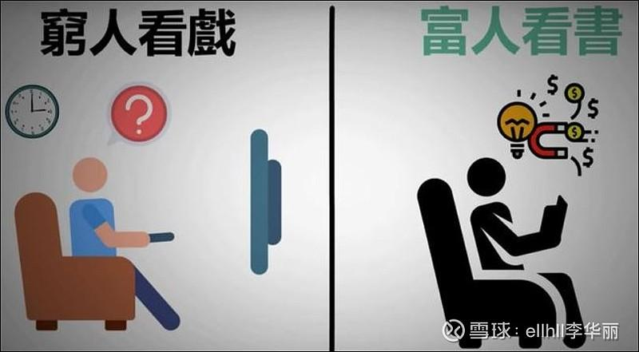

34篇.穷人思维和富人思维

清一山长2021年6月12日

清一山长雪球非专栏帖子整理文章，第35篇《穷人思维和富人思维》

此文整理自山长专栏文章《千万大礼，送给穷人会是啥结果？》[https://xueqiu.com/9310099567/182731174](http://link.zhihu.com/?target=https%3A//xueqiu.com/9310099567/182731174)

[https://www.ximalaya.com/shangye/52603303/450944851](http://link.zhihu.com/?target=https%3A//www.ximalaya.com/shangye/52603303/450944851)

**[ellhll李华丽](http://link.zhihu.com/?target=http%3A//xueqiu.com/n/ellhll%25E6%259D%258E%25E5%258D%258E%25E4%25B8%25BD)回复[清一山长](http://link.zhihu.com/?target=http%3A//xueqiu.com/n/%25E6%25B8%2585%25E4%25B8%2580%25E5%25B1%25B1%25E9%2595%25BF)：**

谢谢山长分享。

看到山长的园丁6000泰铢每月，即使山长主动升到7000泰铢，一年也才8.4万泰铢，养活5口之家。

上个作业我是根据山长提到的盒饭15泰铢一人，度假村450泰铢一晚算出的29万泰铢吃住费用，加上30万泰铢预备款作为出行和出国旅游用，一共59万泰铢，相当于7个园丁家庭的收入了。

如果100万人民币（500万泰铢）买入的中国建筑，分红25万泰铢，如果算收益是75万泰铢，相当于9个园丁家庭的收入。上次山长提过拦着园丁不拿花园里的蚂蚁回去吃，那园丁应该是肉食，清粉是素食的简单饮食习惯，可能开支比园丁还要少。就是清粉的生活方式，5口之家一年的消费在泰国居然不用8万泰铢。每年75万的收益，还能有67万多继续买入中国建筑。

第1年的67万泰铢乘于1.15的9次方是2356977泰铢

第2年的67万泰铢乘于1.15的8次方是2049545泰铢

第3年的67万泰铢乘于1.15的7次方是1782200泰铢

第4年的67万泰铢乘于1.15的6次方是1549710泰铢

第5年的67万泰铢乘于1.15的5次方是1347605泰铢

第6年的67万泰铢乘于1.15的4次方是1171830泰铢

第7年的67万泰铢乘于1.15的3次方是1018986泰铢

第8年的67万泰铢乘于1.15的2次方是886075泰铢

第9年的67万泰铢乘于1.15的2次方是770500泰铢

9年之后合计有12933428泰铢（1293万）

原来的500万泰铢加上1293万泰铢合计1793万泰铢（385万人民币）

9年时间从100万本金到385万人民币结果，额外还——

提供了生活费；

提供了自由时间；

提供了教出职场赢家孩子的可能；

做自己热爱的事情；

基础只是100万人民币，居住泰国，新教育践行理念。

不是谁都有园丁的运气能得到山长的邀请，教其孩子改变阶层！

所以大家旁观会可惜园丁不懂得珍惜。

但是100万人民币的财产，居住泰国，践行新教育理念，应该很多人可以做到。没有100万，50万也绰绰有余，无非总数小些，其它收获是不变的。

我们很清楚地看到了园丁的可惜，我们才可能会清醒地做出自己的选择？

**[清一山长](http://link.zhihu.com/?target=https%3A//xueqiu.com/9310099567)[2021-06-13 18:15](http://link.zhihu.com/?target=https%3A//xueqiu.com/9310099567/182832112)回复[ellhll李华丽](http://link.zhihu.com/?target=http%3A//xueqiu.com/n/ellhll%25E6%259D%258E%25E5%258D%258E%25E4%25B8%25BD)：**

算的挺仔细的，学霸！

【9年时间从100万本金到385万人民币结果】，你算的是股价这九年永远不涨的情况。如果万一风口来了，股价随便涨一涨，就更多了。

所以，有一百万资产，足够财富自由。在云南昆明这样的城市，都能生活下去了。其实中国人来泰国的生活成本比泰国人高得多。光签证费用，就要花掉一大笔。泰国政府会让我们每三个月签证一次，这是让我不选在清迈办学的最大困扰。而且如果家长的年龄不到50岁的话，取得长期签证费用更高。泰国人拥有的很多免费的基础生活条件，我们不能拥有的。一个月几千泰铢还真的活得比较穷困。

不过今日国际学校所在地免除了签证费用（很低，可以忽略），这个地方生活水准与清迈差不多，可以实现你的这种海外生活财务计划。

**[球友甲](http://link.zhihu.com/?target=http%3A//xueqiu.com/n/%25E4%25BD%25A0%25E4%25B8%2580%25E8%25B7%25AF%25E4%25B8%258A%25E6%259C%2589%25E4%25BD%25A0)回复[清一山长](http://link.zhihu.com/?target=http%3A//xueqiu.com/n/%25E6%25B8%2585%25E4%25B8%2580%25E5%25B1%25B1%25E9%2595%25BF):**

清一山长你就是个自恋狂，好像高人一等似的，穷人怎么了，每个人都有自己的生活，应该互相尊重。

**[清一山长](http://link.zhihu.com/?target=https%3A//xueqiu.com/9310099567)[2021-06-13 19:55](http://link.zhihu.com/?target=https%3A//xueqiu.com/9310099567/182836765)回复[球友甲](http://link.zhihu.com/?target=http%3A//xueqiu.com/n/%25E4%25BD%25A0%25E4%25B8%2580%25E8%25B7%25AF%25E4%25B8%258A%25E6%259C%2589%25E4%25BD%25A0):**

如果您认为的自恋狂，就是“很喜欢，很享受我现在的样子和社会层级”的人，我必须承认：您说的自恋就是对的。

不过，我看您自己，也很喜欢您自己现在所在的层级和生活状态，并不想改变什么，您只是希望我们不要来改变您，甚至不要让你们知道你们跟我们不一样。所以，其实骨子里面，我们俩是一样的人，对自己的身份都很满足。所以，我们俩，就不用互相攻击，到底谁更自恋了吧？

另外，**虽然我喜欢我现在的样子，但并不意味着我要否定与我做出了相反选择的人的生活和行为。**实际上，我非常非常地尊重您的生活和您的选择，并且非常地感恩您，以及你们的存在和努力。因为，**我今天得到的一切，其实都来自于你们的赐予和放弃**。狮子怎么可能仇恨羊群呢？**羊群效应，就是狮子选择生活的存在前提**。假如世界上，你们都选择做狮子去了，我看，我就会选择做一颗草去了。我会永远选择与您不同的路径的。

当然，我知道：虽然你们亲手送给了富人一切。但你们却表现得并不很情愿的样子，有点分裂。你们会假想，似乎是别人夺走了你们的一切好处，其实真的，一切都是你们自己放弃的。比如，我在股票下跌的时候买入，我相信没有人用枪逼你们低位割肉卖给我。我在惠泉13元以上的时候卖出股票，我看到的成交单，有很多是一手、几手的买入小单。但显然，当时并没有人在用枪逼您花钱来买。是您们**“愚蠢但却自以为聪明的脑袋”让您自动买进的。**

所以，我的富裕，的确来自于你们的恩赐，但绝非你们的期待。您的期待，其实是相反的，你更想抢走我们的钱。只是因为你们过于贪婪没有做到罢了。所以，我对此最终的结局，并无任何的愧疚之心，对你们只有满满的感恩之心。毕竟**这就是一场游戏，你只不过由于太没头脑，输掉了您本来跟我一样多的筹码和资源。我愿意把这些财富，替你们用在更有价值的地方去。**

通过您的发言，很明显，我们并不是一路人，您也不想成为跟我们一样的人。您对我充满了仇恨和厌毒之心。基于您所说的“互相尊重”（其实我猜您根本不知道这个词的真正意思），我决定替缺乏践行尊重原则行动力的您，做一点小小的亲自的一对一服务：由于担心我的不良言论恶心到您，影响您的心情，这就太对不起您了！我就替您拉黑我自己吧！让您高兴地活在您喜欢的世界里面。祝福您心想事成！

**[一点点智慧](http://link.zhihu.com/?target=http%3A//xueqiu.com/n/%25E4%25B8%2580%25E7%2582%25B9%25E7%2582%25B9%25E6%2599%25BA%25E6%2585%25A7)回复[清一山长](http://link.zhihu.com/?target=http%3A//xueqiu.com/n/%25E6%25B8%2585%25E4%25B8%2580%25E5%25B1%25B1%25E9%2595%25BF)：**

他们的孩子如果按照你这种养法，孩子就不是他们的了，孩子成了你的。价值观念和你一致，想法和你一样，血亲是他们的孩子，观念和意识里，是你的孩子。这可能是他们不同意的根源。

孩子是心头肉，他们也不放心，不能排除将来会发生什么不好的事情。

这些孩子是陪读，中国以前的大户人家请先生教书的时候，会给自己家孩子找的陪读。

人过一辈子，不过是过热乎乎的日子，跟孩子思想各方面都格格不入了，生活便少了意义。

**[清一山长](http://link.zhihu.com/?target=https%3A//xueqiu.com/9310099567)[2021-06-13 20:04](http://link.zhihu.com/?target=https%3A//xueqiu.com/9310099567/182837214)回复[一点点智慧](http://link.zhihu.com/?target=http%3A//xueqiu.com/n/%25E4%25B8%2580%25E7%2582%25B9%25E7%2582%25B9%25E6%2599%25BA%25E6%2585%25A7):**

您说得对。孩子来上学之后，思想会变得和原来的圈子不一样。

但，当教授，必须和园丁的思想不一样。也只有教授能教出教授吧？我父母如果是园丁，估计我也差不多就会种花了。我父母当特级教师，所以我就当了特级的教师。有样学样，我女儿也学父亲，以当教师为目标，所以当不上商人。如果我想让孩子当商人，我会送孩子到我的商人朋友家去的。所以，园丁想让孩子当教授，就必须让孩子和自己不一样。

**[周倩姣静心](http://link.zhihu.com/?target=http%3A//xueqiu.com/n/%25E5%2591%25A8%25E5%2580%25A9%25E5%25A7%25A3%25E9%259D%2599%25E5%25BF%2583)回复[清一山长](http://link.zhihu.com/?target=http%3A//xueqiu.com/n/%25E6%25B8%2585%25E4%25B8%2580%25E5%25B1%25B1%25E9%2595%25BF)：**

读懂山长文章的人绝对知道这样说不是不尊重穷人，而是尊重事实。穷人大都很“善良”，安于本分，但普遍眼界不高是真的。山长这里讲的，应该是思维之别，不是人之高低贵贱之别。

就像我跟一个青梅竹马的朋友聊天，让她这次捐点款修路，很难得的公益事业，只可惜我各方面跟她都分析得明明白白，她口上也很认可这是好事，应该捐，还佩服我，但最后都没有拿钱，这时我就清楚了，她的大气没出来，还是家乡喜欢贪便宜的小家子气。而集款完，组织者发红包，就赶快出来抢了，而这些喜欢抢红包的，大都在集资过程中甚至一言都不发，也不捐款。真是一到做事情就掉链子，一旦有好处比谁都手快。

[清一山长](http://link.zhihu.com/?target=https%3A//xueqiu.com/9310099567)[2021-06-13 20:18](http://link.zhihu.com/?target=https%3A//xueqiu.com/9310099567/182837789)回复[周倩姣静心](http://link.zhihu.com/?target=http%3A//xueqiu.com/n/%25E5%2591%25A8%25E5%2580%25A9%25E5%25A7%25A3%25E9%259D%2599%25E5%25BF%2583)：

**富人喜欢付出，穷人喜欢白占便宜。由于心不一样，最终的结果就是不一样。**

**[DLJb2o](http://link.zhihu.com/?target=http%3A//xueqiu.com/n/DLJb2o)回复[清一山长](http://link.zhihu.com/?target=http%3A//xueqiu.com/n/%25E6%25B8%2585%25E4%25B8%2580%25E5%25B1%25B1%25E9%2595%25BF)：**

山长您好，从是否有金钱这个角度来定义穷人和富人的话，我认为我是一个穷人。穷人之所以穷，是因为德行不够，那日常生活中我怎样去做来提高我的德行？谢谢山长。

**[清一山长](http://link.zhihu.com/?target=https%3A//xueqiu.com/9310099567)[2021-06-14 08:37](http://link.zhihu.com/?target=https%3A//xueqiu.com/9310099567/182898155)回复[DLJb2o](http://link.zhihu.com/?target=http%3A//xueqiu.com/n/DLJb2o)：**

修十善业

修布施法门。你们无非就是缺钱而已。布施就是付出，帮助他人。不一定用钱。

//[球友乙](http://link.zhihu.com/?target=http%3A//xueqiu.com/n/%25E8%258C%2583%25E5%25B0%258F%25E5%2585%25B5kal):回复[清一山长](http://link.zhihu.com/?target=http%3A//xueqiu.com/n/%25E6%25B8%2585%25E4%25B8%2580%25E5%25B1%25B1%25E9%2595%25BF):

通篇就是傲慢。没有谁天生就是富人，没有谁天生就是穷人。您就算有再多的钱，境界也不过如此。没有国家的强大，您什么都不是！100多年前，中国最富的人，在外国人眼里连人都不配。您又有什么资格鄙视穷人呢？！

**[清一山长](http://link.zhihu.com/?target=https%3A//xueqiu.com/9310099567)**[2021-06-14 08:46](http://link.zhihu.com/?target=https%3A//xueqiu.com/9310099567/182899240)回复[球友乙](http://link.zhihu.com/?target=http%3A//xueqiu.com/n/%25E8%258C%2583%25E5%25B0%258F%25E5%2585%25B5kal):

骂别人傲慢的人，是不是自己的偏见很严重呢？替您拉黑我了！因为您真没有必要，来看一个境界不如您高明的人的文字。

**[多多YS](http://link.zhihu.com/?target=http%3A//xueqiu.com/n/%25E5%25A4%259A%25E5%25A4%259AYS)回复[清一山长](http://link.zhihu.com/?target=http%3A//xueqiu.com/n/%25E6%25B8%2585%25E4%25B8%2580%25E5%25B1%25B1%25E9%2595%25BF)：**

不知为什么，看了山长的文章感觉很有道理，但是总有点不舒服。不知是山长讲话风格的原因，还是自己穷人心态和认知不到位的原因？

**[清一山长](http://link.zhihu.com/?target=https%3A//xueqiu.com/9310099567)[2021-06-14 08:56](http://link.zhihu.com/?target=https%3A//xueqiu.com/9310099567/182899580)回复[多多YS](http://link.zhihu.com/?target=http%3A//xueqiu.com/n/%25E5%25A4%259A%25E5%25A4%259AYS)：**

您不舒服，无非是认为您的身份被冒犯了而已。当您认为我代表富人鄙视了您，您的情感受伤。您给宇宙发出的身份信号就是“我是穷人”“我是被人鄙视的”。宇宙将把这个结果送还给您，您喜欢不喜欢就不好说了。

我不抬举富人，我也不踩穷人。我只说事实，只讲我看到的东西。我就算是愿意帮助穷人，穷人还不要我的帮助。我说话来帮助穷人，穷人也不爱听我说，认为我废话。可是富人却愿意拿钱来听我说话。自然，他们只会越来越富裕。好像听我说话给钱越多的人，就越富裕。这就是真实身份的问题：由于富人更愿意付出，穷人更愿意求取。即使他们干一点活，也要相应的经济计较才愿意做。没有金钱的回报，甚至是短期内没有经济回报的事情，再好他们也不会去做的。

**我说话给你们听，这也是我的劳动，而且是非常高级的劳动**，很多人没有这个能力来做这种服务的。但我计较过你们必须打赏给我才能听了吗？**我根本不在意任何回报，甚至收获了一些人的恶言恶语，我也不在意**这个结果。所以，我是富人一点也不奇怪。因为这是我展示的身份——**我的心灵富足，不以外物穷达而转！**

**[球友丙](http://link.zhihu.com/?target=http%3A//xueqiu.com/n/%25E6%258A%2595%25E8%25B5%2584%25E6%2594%25B9%25E5%2586%2599%25E5%2591%25BD%25E8%25BF%2590)回复[清一山长](http://link.zhihu.com/?target=http%3A//xueqiu.com/n/%25E6%25B8%2585%25E4%25B8%2580%25E5%25B1%25B1%25E9%2595%25BF):**

这个清一山长，我见一次举报一次，把自己搞得高高在上的感觉，总是觉得自己是高贵血统，在时代里的汪洋大海里只是一粒沙子而已，别太狂妄，做人低调点好。

**[清一山长](http://link.zhihu.com/?target=https%3A//xueqiu.com/9310099567)[2021-06-16 16:29](http://link.zhihu.com/?target=https%3A//xueqiu.com/9310099567/183203615)回复球友丙：**

您想用骂我来改变您自己的命运，恐怕不够现实。**如果您真想改变您的命运，您需要首先改变您的想法。**如果您只是想要通过骂我，来改变我的命运，恐怕也只能是痴心妄想。除非我跟您持有一样的想法，否则我的命运依然不会改变。

您关注我，却又恨我，您太原谅您自己了。您还没学会与自己相处呢！当然，您更没有学会如何与别人相处。对我这样的人，至少您应该感谢我：因为在我这儿留言，比您自己写帖子会获得更多的流量。其实我还有更多您值得感谢的地方，我就不一一列举了。因为您可怜的智力，恐怕永远也无法理解您需要感谢他人，而不是指控他人。

我非常地感谢您，以及你们的存在。我真诚地认为：是你们，成就了我的现在！**没有黑，哪儿来的白？没有绿叶，哪来来的鲜花？**

我也欢迎您举报我：我只是很好奇：您想用啥理由来举报我？我难道骗了您的色？还是骗了您的财？让我来猜测的话，您的财，实在不足以自恰。哪有多余的让人觊觎？至于您的色，就算您貌比潘安，但您这样说话的样子，脸上一定是很难看的。不如您先照照镜子，整整容，再出来。免得吓死别人了！

也许您就是故意装厉鬼，故意出来吓人的吧？好吧！我要承认：您真的吓到我了。您的举报其实是威力无穷的。也许您可以召唤人民警察为您服务？还是让鬼魂来拷问我的灵魂？

看您恨我居然恨成这样子，我很诧异，似乎我抢走了您的女朋友一样。可您居然管不住您的手，居然同时要关注我。基于对您心灵所受伤害的万分同情，以及缺乏自我管控的能力，我就替您拉黑我自己了。

感谢您的这场表演和演说：您的存在，让我觉知到，像您这样的人，也许就是大多数，只是他们沉默不语罢了。您也许只是他们的代言人，提醒我注意到你们的存在，以及内心满满的恶意。我真的很畏惧你们的存在，所以我更愿意远离你们，我的子孙后代，也愿意离你们远一点。**我只愿意跟文明、友好和善良的人，在一起共居。老子云：“居善地”，我正在实践他老人家的教诲。**

祝福您以及你们的同类，愿你们过着你们选择的生活。我也感谢上帝，没有让你们掌握权柄，掌握司杀之权。不然，我哪里还有活路！

**[李宇萌](http://link.zhihu.com/?target=http%3A//xueqiu.com/n/%25E6%259D%258E%25E5%25AE%2587%25E8%2590%258C)回复[清一山长](http://link.zhihu.com/?target=http%3A//xueqiu.com/n/%25E6%25B8%2585%25E4%25B8%2580%25E5%25B1%25B1%25E9%2595%25BF)：**

山长我想请问一下，您说了很多人的劣根性，那为什么现在发展得越来越好甚至可能成为世界强国呢？是因为近一两百年积攒的福和受的苦；苦受够了，福没享到，所以时来运转了？如果福消耗了，又造作，就会没落和受恶报？

**[清一山长](http://link.zhihu.com/?target=https%3A//xueqiu.com/9310099567)[2021-06-16 22:17](http://link.zhihu.com/?target=https%3A//xueqiu.com/9310099567/183233856)回复[李宇萌](http://link.zhihu.com/?target=http%3A//xueqiu.com/n/%25E6%259D%258E%25E5%25AE%2587%25E8%2590%258C)：**

大清、大明、大宋、大唐、大汉时代，都是世界第一的经济强国，甚至是世界第一的军事强国。

但是，您认为：这些朝代为何悲惨地灭亡呢？清亡于民国，亡于西方势力的兴起。但您别忘了，大清换政，是人口死亡最少的朝代，几乎就是相对和平换政的。更强大的大宋、大明，乃至汉唐，繁荣的王朝灭亡的时候，暴力杀戮非常的严峻，甚至[90%的人口被灭杀](http://link.zhihu.com/?target=https%3A//wenku.baidu.com/view/592b321814791711cc791742.html)。

论军事实力，宋明时代，科技水平，以及火器、火炮技术，居然是世界第一的，您知道这些历史真实的一面吗？大明与日本最强的丰成秀吉交战，战胜的秘诀是火器营。别说大清用大刀、长矛对付西方火器才输掉了。大清输给西方，是观念的落后，不是武器的落后。大清其实当年买了很多[德国的克虏伯大炮](http://link.zhihu.com/?target=https%3A//history.sohu.com/a/556706593_121199396)，但根本没用过，一直放在库房里面。八国联军进京，赫然发现：大清武库里面的武器、枪支，比他们手上使用的更先进。所以，大清不是被西方的火器击败的，是被腐败的思想，自己击败自己的。

您认为：只要军事能力强，您手上有钱，您的生活和后代子孙，就有保障了？您太天真了。起码历史不是这样写的。

还有，东南亚的华人怎么这么多？他们怎样去的南洋？历史上，就是各种战乱，貌似下海逃过来的。没逃走的家人，可能留下来的就死了。

**[集中投资](http://link.zhihu.com/?target=http%3A//xueqiu.com/n/%25E9%259B%2586%25E4%25B8%25AD%25E6%258A%2595%25E8%25B5%2584)回复[清一山长](http://link.zhihu.com/?target=http%3A//xueqiu.com/n/%25E6%25B8%2585%25E4%25B8%2580%25E5%25B1%25B1%25E9%2595%25BF)：**

你的这篇文章我是很认可的，你的修为水平非常高。我认为这来源于你的儒释道的国学水平扎实。估计你佛道双修。但，居高者，形逸而神劳；处下者，形劳而神逸。所以你知道的越多，心忧就越多，看问题就越深入，可大多数人还在为五斗米折腰，还没有这种境界去感悟人生，所以很难接受现实世界的残酷，基本上就是鸡同鸭讲。

这个世界，“仓廪实而知礼节，衣食足而知荣辱”是不会改变的。这个话题只适合私聊，看破点破公开在论坛，效果不会很好。

期望拜读你更多大作。

**[清一山长](http://link.zhihu.com/?target=https%3A//xueqiu.com/9310099567)[2021-06-16 19:14](http://link.zhihu.com/?target=https%3A//xueqiu.com/9310099567/183220479)回复[集中投资](http://link.zhihu.com/?target=http%3A//xueqiu.com/n/%25E9%259B%2586%25E4%25B8%25AD%25E6%258A%2595%25E8%25B5%2584)：**

感谢您的提醒，您的善意心领了。

我虽明知鸡同鸭讲，有时候也不得不讲。特别**居住在异国他乡，看到的国民素质，对比过于明显和令人难堪，身为华夏子孙，对此情况实在让人难以心安，无法满足于只是过自己家庭“福寿安康”的生活。所以我明知讲出来，会让人想要骂我致死，也不得不说这些不好听的话，期待也许会有些人，被我的言语刺痛后，能痛加改变。**

虽然说“仓廪实而知礼节，衣食足而知荣辱”。如果生存都有威胁，自然谁都无法来论道谈佛。也许我没有经济支撑的话，也只是贩夫走卒之一员，忙于生计罢了。**只是我居于泰国，虽然国民的生活水平、经济能力，远低于国内。但国民的素质、心态，却远高于国内。我只能痛心：中国虽然现在已经富裕了，但国民精神依然穷困不堪，某时期对于传统文化的全面否定和打击，已经断掉了华夏善文化的根。国民负面意识非常的严重，一方面，我们举国在追求物质丰富的路上狂奔；另一方面，国民的内在精神世界却在裸奔。**

这样持续下去，天知道何种惩罚就会降临到这些无知愚蠢的国人头上。毕竟造作恶业、不善之业，必然有恶报。邪恶之心，必引邪恶之报。但华夏人之共业，必有共报。覆巢之下，安有完卵乎？

**[ellhll李华丽](http://link.zhihu.com/?target=https%3A//xueqiu.com/3931532042) [2021-06-16 20:15](http://link.zhihu.com/?target=https%3A//xueqiu.com/3931532042/183224839)回复清一山长**

明明忙晕了，还是忍不住打开看山长的雪球。句句触目惊心，句句发自肺腑。

“毕竟造作恶业，不善之业，必然有恶报。邪恶之心，必引邪恶之报。但华夏人之共业，必有共报。覆巢之下，安有完卵乎？”这样的果报让人不寒而栗。文革时代的文字、记录、故事，即使到现在，我还不敢、不愿去看，实在是承受不起的沉重。那个时代的人，谁能不被卷进去？

《新世界：灵性的觉醒》中有大量篇章描述“集体痛苦之身”的，某个民族的、种族的、某个国家的，这样的“集体痛苦之身”，不单只是同时代的人一起承担，未来的子孙也一样要承担这个集体所创造出来的痛苦，代代承受，无处可逃。

很多人选择性的眼盲，但肯定也有心里亮堂的人。

过去已经过去，我们改变不了。未来还未到来，我们还有机会。

请多些再多些，请多些再多些，

再多些人敢于唤醒昏睡者，

再多些人传播智者的呼喊，

再多些人愿意去分享提升他人的智慧，

振兴中华真文化，

创立一个精神强大的我们的民族。

**参考链接：**

[175篇 千万大礼，送给穷人会是啥结果？](http://link.zhihu.com/?target=https%3A//www.ximalaya.com/shangye/52603303/450944851)

[哔哩哔哩：千万大礼，送给穷人会是啥结果](http://link.zhihu.com/?target=https%3A//www.bilibili.com/audio/au2526521)

[【示范班今日明师荟#12】明瑞老师：“揭秘财富本质”_哔哩哔哩_bilibili](http://link.zhihu.com/?target=https%3A//www.bilibili.com/video/BV1nD4y1X7nY)

[20201127明瑞老师：“揭秘财富本质”_哔哩哔哩_bilibili](http://link.zhihu.com/?target=https%3A//www.bilibili.com/video/BV1w5411K7jq)

[喜马拉雅：清一山长雪球专栏](http://link.zhihu.com/?target=https%3A//www.ximalaya.com/album/52603303)（音频）

[哔哩哔哩：清一山长雪球专栏](http://link.zhihu.com/?target=https%3A//www.bilibili.com/audio/am32848405)（音频）
