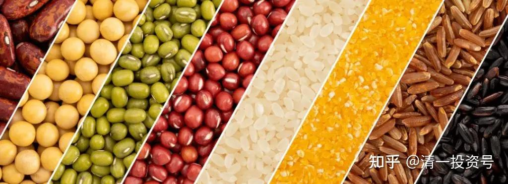

3篇.素食与肉食，养生与医疗，古人与今人

清一山长 2021年3月9日

清一山长雪球非专栏帖子整理文章 第3篇《素食与肉食，养生与医疗，古人与今人》

此文整理自山长专栏文章《为何东亚文化圈为以白为美？以胖为福？以懒为贵？以无能为尊？》[https://xueqiu.com/9310099567/173913840](http://link.zhihu.com/?target=https%3A//xueqiu.com/9310099567/173913840)的跟帖评论[清一山长](http://link.zhihu.com/?target=https%3A//xueqiu.com/9310099567)[2021-3-09 14:53](http://link.zhihu.com/?target=https%3A//xueqiu.com/9310099567/173923143)

我儿子16岁的时候，还没有到1.7米。他年龄是班上最大的，但身高却是班上最矮的（可见我家的孩子真是另类，极其少见的没用激素来催长的，现在身高正常，比我略高）。我的一个老同学见他，就呵呵大笑；说他儿子才12岁就超过1.7米了，笑话我不会养儿子，16岁了才长这么一点；骂我就是舍不得给孩子吃肉，喝奶（孩子五岁多跟随我就以素食为主了，也不喝牛奶）。我就弱弱地抗议说：“你这样比不公平，怎么能拿洋鸡来跟土鸡比。”

12～13岁，长到跟父母一样的身高，真不是啥好事。就像洋鸡，3个月比9个月的土鸡都大。但，对鸡来说，难道是好事吗？**除非你家儿子是当肉鸡来养的，否则真的别把体重、身高当指标。这是养猪、养鸡的指标，不是养孩子的。孩子到了年龄，该长的时候，自然就会长了。**用动物激素催长的，就是要命的勾当。

[双一流](http://link.zhihu.com/?target=http%3A//xueqiu.com/n/%25E5%258F%258C%25E4%25B8%2580%25E6%25B5%2581)回复清一山长:

楼主，为什么现代人寿命长？吃的好不是主要原因？

[清一山长](http://link.zhihu.com/?target=https%3A//xueqiu.com/9310099567)[2021-3-09 16:33](http://link.zhihu.com/?target=https%3A//xueqiu.com/9310099567/173938230)回复双一流:

现代人寿命长？您真会睁眼说瞎话。成年就该多吃肉？爱吃你就吃去，吃死也不干我事。别说你懂科学，你懂自杀才对。

现在50岁的人，身体比70～80岁的老人好吗？还是相反？你自己去看看？

我家的故事，拿命买来的故事，爱听就听，不听拉倒！

**我是我们家最不会吃东西的人，从小就这样。**

我有零花钱，一定节省下来买书看。家里给早餐的钱，一天两毛钱，我都会节省下来，攒够一个星期，去买一本《十万个为什么》。上了大学，也一样，省下伙食费去买书。一天就只吃白饭加咸菜，一个月只花5元钱伙食费。不是因为我懂不能吃，而是我更爱书。因为穷，就只能省下吃的去买书。无意中，逃过了吃菜，吃肉多，损害身体的毛病。

我弟弟妹妹，都比我会吃，也吃了各种好东西，但身体远远不如我。**我弟弟体重比我重几十斤。但他47岁就死了**。说是急病。其实就是吃多了，吃错了。

但我的身体，还没有我老妈好。她老人家，现在眼睛都不花。为啥？80多岁了，每天锻炼身体，做家务，忙个不停。为啥？因为年轻时一直穷，吃不了啥肉蛋奶。口味清淡。另外习惯好。

我是40岁才改的饮食习惯，已经中了一些毒。当年做老板，啥东西我吃不起？都吃。结果身体越来越差。改掉后，马上感觉就健康多了。

我妈现在都说我，这一辈子特别可怜，干得最多，吃没吃啥好东西，玩没玩啥好东西，苦命人一个！每次回家，都要弄牛肉给我吃，害得我每次都是突袭，不提前告诉她我会回家（她自己也不太吃，平时不买牛肉）。

她每次这样说，我就说：“妈，您不是希望我像弟弟一样过好日子吧？吃好喝好玩好？”

她马上就不说了，就是叹口气。就算用人命买来的教训，她还是不能理解。

自然，我也不能指望你们理解。各位：你们想吃就吃，想死就死。这是你们的选择，我不在意！

[裸奔de瓶子](http://link.zhihu.com/?target=http%3A//xueqiu.com/n/%25E8%25A3%25B8%25E5%25A5%2594de%25E7%2593%25B6%25E5%25AD%2590)回复清一山长:

我们这有个较出名的儿童中医，不管多小多大孩子去看病，告诉所有家长不喝奶粉，不吃牛奶，让把什么鱼肝油、钙片这些都甩了，家长们都是惊掉下巴。

[清一山长](http://link.zhihu.com/?target=https%3A//xueqiu.com/9310099567)[2021-03-09 16:04](http://link.zhihu.com/?target=https%3A//xueqiu.com/9310099567/173934560)回复裸奔de瓶子:

好人一个，良心人。不知道会不会被领导批评、开除？

[裸奔de瓶子](http://link.zhihu.com/?target=http%3A//xueqiu.com/n/%25E8%25A3%25B8%25E5%25A5%2594de%25E7%2593%25B6%25E5%25AD%2590)回复清一山长:

不会，是自己的诊所，并且告诉我终生不吃奶、鱼肝油、钙片。

[清一山长](http://link.zhihu.com/?target=https%3A//xueqiu.com/9310099567)[2021-3-09 16:38](http://link.zhihu.com/?target=https%3A//xueqiu.com/9310099567/173938761)回复裸奔de瓶子：

我的观点：西药可以外用，不能内服。啥西药都不能吃，保健品更不能吃。**喝粥，就是最好的保健品。**

病了咋办？慢性病？（急病抢救，西医还可以用。）想办法找中医，找不到，就等死算了。因为反正要死，等死，总比找死强吧？

[陌上听涛](http://link.zhihu.com/?target=http%3A//xueqiu.com/n/%25E9%2599%258C%25E4%25B8%258A%25E5%2590%25AC%25E6%25B6%259B)回复清一山长:

尊敬的道长，拿我们国家来说，现代人的平均寿命70（岁）的多普遍比1949年时候35（岁）要长是个不挣的事实。《黄帝内经》记载的古人长寿数字已无从考证，即使有也是个案了。

从历史资料统计汉朝时平均寿命20多岁，全国总人口也就6000多万，随着医疗卫生的发达现代人的出生死亡率比古时候要低，寿命也长很多啊！这个有疑问吗？

[清一山长](http://link.zhihu.com/?target=https%3A//xueqiu.com/9310099567)[2021-3-09 17:53](http://link.zhihu.com/?target=https%3A//xueqiu.com/9310099567/173947654)回复陌上听涛:

数据倒是真的。但这是战乱导致的问题，还是西医的功劳？扯到现代医学帮助人类长寿，恐怕不靠谱。我说了我家的案例了。

汉朝死了多少人？开国之年，连四匹同色的马给皇帝拉车，都找不出来。汉武帝穷兵黩武，又死了多少人？两汉更替，又死了多少？不看这些，不懂这些，只懂几个数字？投资上，这叫呆会计！

西医，在我看来，就是一个笑话。十年之后，清一医学院，将证明这个笑话给你看：我会培养出一批年轻的学生出来，实实在在的证明：西医真的不会治病。双方可以面对面的打擂台！拿出100个疑难杂症，随机挑选病人，各50个病人自己去治疗。半年后比疗效！西医注定惨败！哈佛医学院、普林斯顿医学院，这些世界顶尖医学院，都会败在清一医学院的学生手上的。今年9月，我就开招第一届医学生。

就像现在比教育：清一大学绝对完胜现在的大学一样！（下周孩子们的擂台就摆出来了）

不信你们来比：赢了，拿一千万走。

将来你们的医学院来比清一医学院，打医疗擂台。比赢了，你们拿一个亿走。

[舒缓](http://link.zhihu.com/?target=http%3A//xueqiu.com/n/%25E8%2588%2592%25E7%25BC%2593)回复清一山长：

有些急救我是心有余悸。稍微懂了一点佛学知识后，我在心里老是想起一个镜头：有一次我去省二院急救室，躺在床上的一个六十多岁的妇女，干瘦，全身已经瘫软，惨白惨黄的，基本没了人气。两个医生过几分钟就用两个点击器（有手把，下面是二十厘米直径圆的铁板，不专业呀），来几下，身体剧烈抖动，人一点反应也没有，半个多小时，我走时还没见停。

[清一山长](http://link.zhihu.com/?target=https%3A//xueqiu.com/9310099567)[2021-3-09 17:40](http://link.zhihu.com/?target=https%3A//xueqiu.com/9310099567/173946169)回复舒缓:

能理解你的心情。

我弟弟死的时候，我去ICU陪护了几天。回来就跟老婆和孩子们说：将来我如果像我弟弟一样，出了啥事，意识不清了，千万不要送我进医院。让我在家里等死好了，死在家里更好些。大家都不麻烦。我也可以宁静地离开。

我看到的ICU，真不是个救人的地方，就是让你“不得好死”的地方，做了很多让你求死不能，求生不得的事情。不如让我在家里安安静静的死去！

[适度分散拥抱成长](http://link.zhihu.com/?target=http%3A//xueqiu.com/n/%25E9%2580%2582%25E5%25BA%25A6%25E5%2588%2586%25E6%2595%25A3%25E6%258B%25A5%25E6%258A%25B1%25E6%2588%2590%25E9%2595%25BF)回复清一山长:

请问清一医学院用CT彩超血压计温度计健康码口罩纱布......等西医设备吗?对了，建议前台用珠算，别用电脑。

[清一山长](http://link.zhihu.com/?target=https%3A//xueqiu.com/9310099567)[2021-3-09 18:29](http://link.zhihu.com/?target=https%3A//xueqiu.com/9310099567/173950782)回复适度分散拥抱成长:

第一：这些CT彩超，是西医用来检查病人的，您觉得很高级，很了不起。我们看来都是破铜烂铁，不会去用的。我们治疗病人，靠实在的本事，不靠这些电器、电脑、仪器、仪表。

第二：我们不用电脑看病。电脑会看个鬼的病，人工智能也不会治疗的。当然，更不用珠算。这跟看病治疗，有啥关系？难道用算术、微积分来治病，才算高级吗？我们的学生，懂小学数学，就足够击败哈佛医学院了（指治疗效果）。

第三：您不相信也没问题，等十年后再看结果也不急。就像当年不相信今日学堂的人一样，我让他们十年后看结果。现在不都看到了？不服，就来拿1000万元！

第四：您就是个杠精！不是来好好讨论问题的。我这里不欢迎脑残杠精，我也没啥可以教你的，您可以滚了。好好去享受你的西医吧！祝福您一切如意！

[般若蜜](http://link.zhihu.com/?target=http%3A//xueqiu.com/n/%25E8%2588%25AC%25E8%258B%25A5%25E8%259C%259C)回复清一山长:

为什么有的和尚、尼姑吃素就各种营养不良？是否和练功有关？我们不给孩子喝牛奶，老人家说现在连大米、菜里面都有激素，吃什么没有激素？！

[清一山长](http://link.zhihu.com/?target=https%3A//xueqiu.com/9310099567)[2021-3-10 09:15](http://link.zhihu.com/?target=https%3A//xueqiu.com/9310099567/173994542)回复般若蜜：

和尚、尼姑吃素，营养不良，是犯了一个大忌：第一是吃很多菜，觉得多吃蔬菜才好。其实蔬菜基本没营养，而且现在的蔬菜有很多毒，特别是大棚蔬菜。可能不比肉类的毒素少。第二就是怕营养不够，使劲吃，吃撑了，伤了胃气，导致糖尿病等等富贵病。其实，**如果不懂吃素的方法，只喝粥就最好，清粥，杂粮粥。**

[兽医初一plus](http://link.zhihu.com/?target=http%3A//xueqiu.com/n/%25E5%2585%25BD%25E5%258C%25BB%25E5%2588%259D%25E4%25B8%2580plus)回复清一山长：

不支持全素，长期全素的人因为缺少动物蛋白会造成贫血、胆结石这样的共性问题。我是从事营养专业的。

[清一山长](http://link.zhihu.com/?target=https%3A//xueqiu.com/9310099567)[2021-03-10 09:21](http://link.zhihu.com/?target=https%3A//xueqiu.com/9310099567/173995238)回复兽医初一plus：

营养专业的就懂营养了？

如果这样，为啥北京外国语言大学，专业人员，教学各种语言，就比不赢我们这个山寨大学？

中国这么多的专业武术专业人才，就培养不出清一武道馆这样的传武格斗选手？

牛吃草，牛身上这么多的动物蛋白怎么来的？没见过牛吃肉吧？

您吃牛蛋白，身上长的就是牛蛋白吗？

中国的专家，还是砖家？只会搬砖——搬书上的砖头拿来砍人？

[JustDoitmh0](http://link.zhihu.com/?target=http%3A//xueqiu.com/n/JustDoitmh0)回复清一山长:

吃的问题，养生的问题，医疗的问题，社会舆论全部为商业利益共同体所绑架，谁要是敢动他们的奶酪，就要招到联合绞杀。拉筋拍打这么好的道医，就是这样被死死地按在地板上的。人间正道是沧桑啊！

[清一山长](http://link.zhihu.com/?target=https%3A//xueqiu.com/9310099567)[2021-03-10 11:10](http://link.zhihu.com/?target=https%3A//xueqiu.com/9310099567/174016488)回复JustDoitmh0：

拉筋拍打，真的是好东西。我不舒服就打打，效果一级棒。可惜——没钱赚。另外，皮肉有受点苦，一般人喜欢舒舒服服的，吃点药，等着别人伺候。所以，注定只有极少数人才会用。

这些方法动了利益集团的奶酪，所以被联合封杀。一切不要钱的，都不能存在。中医也一样，真中医，啥药都不要就治好病了。

刘老师今天告诉我：前段时间治疗的一个偏瘫病人，家属又来找她了，想要再捐款一万元给基金会，希望刘老师再帮忙做一次疗愈。因为上次神志不清，糊里糊涂的偏瘫病人，经过刘老师的语言治疗，居然慢慢清醒过来了，现在还要给家人帮忙，做事，各方面好了很多。家里人很惊喜，原来是死马当活马医的。刘老师其实也没指望——说连脑子都不清楚了，还找她干嘛？没想到效果还不错。

不过刘老师直接拒了这案子。说病人已经在好转，就行了。这不是治病，只是调整能量。好转就是调顺了，不用继续看病，不像医院一样要“坚持治疗”。如果有其他问题要解决再说。

如果医院都像刘老师这样子，咋赚钱？还有——刘老师此举，让病人省了多少到处求医的开销？完全是断人的财路。所以，这种事情，还是少做为妙。道家说的：救人也别多救，闲事尽量少管。“吹毛用了急需磨”，本领不能乱用，宝剑就算吹毛立断，用了马上要磨。刘老师用来陪这些家人磨时间玩，不如用来自己修炼提升能量，以备下次。这才是道医。

[不服输的平头锅](http://link.zhihu.com/?target=http%3A//xueqiu.com/n/%25E4%25B8%258D%25E6%259C%258D%25E8%25BE%2593%25E7%259A%2584%25E5%25B9%25B3%25E5%25A4%25B4%25E9%2594%2585)回复清一山长:

一个天天吃牛肉的人肯定比一个天天吃草的人强壮，大自然一直都是肉食主义者的天下，强如老牛、野猪也只有被狮子老虎按在地上摩擦！

[清一山长](http://link.zhihu.com/?target=https%3A//xueqiu.com/9310099567)[2021-03-10 12:52](http://link.zhihu.com/?target=https%3A//xueqiu.com/9310099567/174026862)回复不服输的平头锅:

我刚打赏了这条评论¥1.00，也推荐给你。你可以把蠢话说得像聪明话一样，怪不得你要“不服输”。就因为您脑子不好用，得到的结果总是输！你服不服，都一样！

我住的泰国，我家院子里面、外面，经常有不少凶猛的肉食类猎食动物出没——动物界的顶级猎食者：猫科动物——没错，就是猫。

我看这肉食动物，活得极其的艰难。我认识其中一只母猫，最近三年，生了超过十个小猫，只养活了一只，还是刘老师经常给点食物才养活的。母猫自己也瘦得骨头都看得见。我经常感叹——猫生真不易。我家厨房进过一次老鼠，我去抓老鼠，就让这猫也进去一起抓。我把门关好，从隐蔽处把老鼠赶出来，让猫给抓住给吃了。

至于您瞧不起的草食动物，牛，在我家后面的河边，天天悠然自得的吃草。还有羊，我的小农场里养了8只山羊。我从没见过高级的肉食动物——猫，敢去惹牛和羊。谁在天堂？我看是牛羊才对。只是——人才能收拾它们。泰国其它动物都拿他们没办法。

别以为肉食动物多高级——这就是一个笑话。完全不符合自然界的真相。

比如，我这草食动物，跟您这肉食动物比。您比钱比不过我，比力气想打架，也绝对比不过我。比吵架，我认为您也不行。您这肉食动物，有多高级？我就没看出来。

拿了钱，您就走吧！你名字就是一愤青的样子，到处找人干仗的相，实在不适合呆在我这里。

[志西](http://link.zhihu.com/?target=http%3A//xueqiu.com/n/%25E5%25BF%2597%25E8%25A5%25BF)回复[水木清华076](http://link.zhihu.com/?target=http%3A//xueqiu.com/n/%25E6%25B0%25B4%25E6%259C%25A8%25E6%25B8%2585%25E5%258D%258E076):

[河南95岁高龄老人长寿秘诀：吃小米饭，吃馒头，喝白开水，别的都不吃。](http://link.zhihu.com/?target=https%3A//www.ixigua.com/6874114520747344391)[网页链接](http://link.zhihu.com/?target=https%3A//mp.weixin.qq.com/s/_0AEigM-cbEGi3Aer-THFg)

[https:v.youku.com/v_show/id_XNDg0MjEyOTM4NA==.html](http://link.zhihu.com/?target=https%3A//v.youku.com/v_show/id_XNDg0MjEyOTM4NA%3D%3D.html)

[河南95岁高龄老人长寿秘诀](http://link.zhihu.com/?target=https%3A//mp.weixin.qq.com/s/_0AEigM-cbEGi3Aer-THFg)

[清一山长](http://link.zhihu.com/?target=https%3A//xueqiu.com/9310099567)[2021-03-10 16:57](http://link.zhihu.com/?target=https%3A//xueqiu.com/9310099567/174056400)回复志西:

你转的链接，我在国外都打开了，也看了视频，挺清晰的。偏有人就是打不开，有点好玩。一个访谈，内容很惊人，居然跟我说的一样——人，只需吃点粥，吃主食，就够了。其他啥也不吃，人就只需要这个。不好意思，我自己倒是知道：这样做就够了，但真没做到。会吃点“好吃”的东西，在泰国最喜欢买水果。承认自己是馋，不是身体需要。老实一点。别吃啥肉蛋奶、虫草、茅台，等等啥的，你就是不安分，却非说是自己的身体需要这些，是科学，还说不吃还不行。都是大骗子。骗自己，骗别人。【[河南95岁高龄老人长寿秘诀：吃小米饭，吃馒头，喝白开水，别的都不吃。不吃肉，不吃鸡蛋，不吃菜，不吃水果。一辈子没生过病，没吃过药](http://link.zhihu.com/?target=https%3A//new.qq.com/omn/20210510/20210510A0AZ5F00.html)】

这位老人，儿孙让他吃饺子，居然就吐了。说明身体其实不需要吃菜。我家小女，如果吃不好的东西也会吐，现在吃肉就吐。说明身体会告诉你，它不需要这些东西。身体很干净（小时候6岁左右，在学堂还吃过一点肉）。小女馋垃圾食品，就会让她尽量多吃，很灵，刚开始很喜欢，但多吃一点就会吐。饼干、蛋糕啥的。用这种方式，她吃的垃圾食品越来越少。就水果例外，吃很多都高高兴兴的。一次买20斤橘子给她吃。身体反应，是老天给的探测仪，别忽略了身体语言。肉吃多了，其实很难受。我们学堂想吃肉的学生，会让他们好好的去吃一顿大餐，自助餐。结果很多人会吐。

[清一山长](http://link.zhihu.com/?target=https%3A//xueqiu.com/9310099567)[2021-03-10 09:53](http://link.zhihu.com/?target=https%3A//xueqiu.com/9310099567/174001733)

昨天我写本文出来，大量掉粉，两百多人取关。是我看到记录上唯一的净关注减少的日期。

说明：要增粉，要当专家大腕，就要黑中医，黑传武，要吃肉。敢黑西医，敢吃素，不吃肉蛋奶，注定是被人侧目而视的。

这个国家，的确好玩。

本人脾气依然不会改。想说就说！想骂就骂！你敢来打我，我就打回去。我又不想卖粉丝。粉不粉我，是你的事情，不干我事。

**太阳不会因为“有人赞颂它”而多照耀几个小时，也不会因为“有很多人躲阳光、想美白”就藏起来不出面。**

**付出是自己的本性，收益是自己的福报。**

参考链接：

[清一投资号：第1篇.身体健康的三个因素：心态、运动、食物](https://zhuanlan.zhihu.com/p/513184686)（整理文）

[山长 清一：日本武士的传统食物是什么？](https://zhuanlan.zhihu.com/p/510535004)（知乎专栏文）

[清一投资号：83篇.为何东亚文化圈为以白为美？以胖为福？以懒为贵？以无能为尊？](https://zhuanlan.zhihu.com/p/563607298)

[122篇 为何东亚文化圈为以白为美？以胖为福？以懒为贵？以无能为尊？](http://link.zhihu.com/?target=https%3A//www.ximalaya.com/sound/485885449)（音频）
