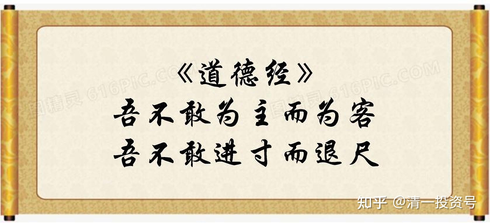

7篇.齐家智慧：吾不敢为主而为客

清一山长 2021年3月8日

清一山长雪球非专栏帖子整理文章第7篇《齐家智慧：吾不敢为主而为客》

此文整理自山长专栏文章《[低级人类，与高级人类！低级投资者，与高级投资者](http://link.zhihu.com/?target=http%3A//www.360doc.com/content/21/0308/13/1575720_965776960.shtml)》[https://xueqiu.com/9310099567/173702496](http://link.zhihu.com/?target=https%3A//xueqiu.com/9310099567/173702496)的跟帖评论

//[@周霖灵Bounty](http://link.zhihu.com/?target=http%3A//xueqiu.com/n/%25E5%2591%25A8%25E9%259C%2596%25E7%2581%25B5Bounty):回复[@清一山长](http://link.zhihu.com/?target=http%3A//xueqiu.com/n/%25E6%25B8%2585%25E4%25B8%2580%25E5%25B1%25B1%25E9%2595%25BF):

去年家里的人发生了一些事情，我一直都想不明白，结合山长针对不同人类思维行为方式的文章，算是有了一些思路，也说来给大家听一听。

爱人的姨夫一直都有腰椎间盘突出问题，直到去年严重到无法行走，疼痛难忍的地步。当时我们想对接一位传统正骨老师，我也是亲眼见过这位老师治好了很多在西医看起来必须要开刀的腰病患者。被婆婆拦住，说她这边的亲戚早就看不惯我们的生活方式，不会相信我们推荐的中医保守治疗的。想想也是，我们以为好的，别人不一定，不能给别人找堵啊！后家人介绍到上海有名医院的全国知名医生那里，开了刀一个多月后看起来恢复很好（至于后遗症，当下没出现就假装不会有。）

这些在世俗中看起来还算正常，让我有些想不明白的是：爱人舅舅看到姨夫开完刀下床后能吃能喝，变得又白又胖后，觉得自己腰也时常不好，就跟大家说，早晚都要开刀治疗，晚开不如早开，越晚开刀年龄越大，越不容易恢复。另外，现在认识的这个专家技术这么好，不能浪费机会。于是，真的就通知了儿女，结伴跑到了上海做了这个本可以不用做的手术和受的罪。可是，舅舅没有姨夫幸运，开完刀后两三个月都无法起身下床，面对这样的场景，舅舅的反应是——

一、年龄比姨夫大就是不好恢复了；

二、姨夫身边有小姨和儿女轮流伺候，自己只有护工，家人也只是有空才过去照应（潜台词是没有被照顾好）；

三、以前说自己劳累，大家不相信（因为舅舅是法官，姨夫是打工的），现在事实情况呈现出来了吧！腰病是累出来的，术后恢复不好更是前期透支导致的身体亏空。

于是，在这看起来有理有据的说辞下，成功地获得了很多亲友的注意，所以我婆婆在过年算经济账时，感叹地说一句，这一年光给她哥哥（我们舅舅）的人情钱就够她和公公的一年生活费了。听起来好像也很不舍给哥哥花钱，但又不得不去做的意思。

接下来还有，舅舅可以下床走路后没太长时间，姨夫腰病复发，再次送到上海又开了一次刀，回来后，舅舅和姨夫同病相怜不断感叹说，人老了，就是各种毛病多，别想太多了，有吃有喝再多请两个保姆，少做事多活几年。其他亲友也纷纷赞成，两位“老人”在亲友“鼓励”下，默默地达成了接下来生活的协议。

从这以后，姨夫更是大吃特吃，其余时间就是找人陪着玩牌；舅舅就活在了腰病啥时复发，啥时要去开刀的恐惧中……

我以为这是特例。婆婆说，舅舅在决定开刀的时候也让她去了，只是婆婆还没下决定罢了，幸好复发的结果来得很快，让婆婆自动断了没病找抽的念头。

婆婆接着说，从小到大，舅舅说好就会跟着去做。以前为舅舅在城里工作，让全家亲戚花了很多钱农村户口转城市，结果现在农村户口更值钱；还有舅舅让买保险，也是全家都上阵，本来说60岁后每个月就有一笔钱，结果现在要等到80岁；还有买学区房，每家都在买，所以当知道我们家放弃学区房的优势而走新教育后，舅舅和其他亲戚结盟先把我说一顿，看说不通，再骂我爱人不长脑子，看我们还是“不知悔改”，每次和公婆见面时，都会说公婆居然都不当孩子的家，孙子就要毁在这个媳妇手里之类的话。幸好，我和公婆十几年来相处得一直很好，也看到我们和孙子的变化，两位老人还能保持清醒。

我和爱人以前对于舅舅等亲友的反应模式，会认为是因为每个人认知水平不同和所处年代不同而造成的隔阂，虽说我做什么不关他的事情，他的控制和干涉已经给我们带来困扰，但总归还是希望我们好。但是看完此篇文章，更加看清了这种借亲友关爱的名义，背后实际上是“我不好，你们也别想好”，“我有关系给你们办事，你们要记着一辈子”，“我是家里的老大，你们都要听我的和围着我转”等心理，这不就是损人不利己嘛！

幸好，舅舅不理我了，我有充分的理由（不希望自己的出现让舅舅生气）可以远离这类人，当然，更加**理智的做法是找出身边有此底层信念的人，主动隔离。**

感恩山长的文字警醒，在人生有限的时间里多和高能量人在一起，才能创造生命的价值。

[清一山长](http://link.zhihu.com/?target=https%3A//xueqiu.com/9310099567)[2021-03-08 14:40](http://link.zhihu.com/?target=https%3A//xueqiu.com/9310099567/173791130)回复[@周霖灵Bounty](http://link.zhihu.com/?target=http%3A//xueqiu.com/n/%25E5%2591%25A8%25E9%259C%2596%25E7%2581%25B5Bounty):

这故事真够狗血的。佛家说，这叫“我大”。每个人都想扮演“神”，想指挥控制一切。中国人的控制欲特别强，如果控制不了别人，就回家控制家人，控制亲人朋友啥的。所以，远离这些负能量，的确就轻松很多了。

要改变他们，也不是不可能，就要等时间，要等很长。估计10年以上，20年左右。

我的孩子，当年种种的质疑，甚至是很过分的指责“你要害死你儿子吗”。但现在，儿子20多岁了，亲戚们，开始反过来说“这孩子比别的孩子好得多”，他变成女孩子心中的男神了。

我的身体也一样：同龄的亲人们，开始羡慕我身体好，体力好，精神好。开始想要学一些我的东西了，偷偷摸摸的学。

这就是**亲人——越亲，越是不能接受你。直到有一天，他只能仰望你的时候，就变过来了！**

你们继续加油！**别人想看你的笑话，想看你倒霉，你就把这种嘲笑，变成你一定成功的动力！更加认真、踏实地学习、进步。**我就是这样的。

[清一山长](http://link.zhihu.com/?target=https%3A//xueqiu.com/9310099567)[2021-03-08 17:00](http://link.zhihu.com/?target=https%3A//xueqiu.com/9310099567/173813890)

“每次和公婆见面时，都会说公婆居然都不当孩子的家，孙子就要毁在这个媳妇手里之类的话。”

你们这个处理不太对，教各位一招。对婆婆，要让老公出面扛着，啥都是老公的主意，自己是完全支持公公婆婆的，就是老公不听话；对岳父岳母，家里啥事，就是媳妇要出来扛着，老公没出息，全都听媳妇的。这样才能避免家庭矛盾。

我妈知道我媳妇吃全素，就说这习惯不好，身体弱。我出来说：是我教她的，这样身体才好。媳妇赶快说是的，是跟我学的。我妈马上说：女人吃素也可以，弱一点没事，但男人一定要吃肉，还要我媳妇做肉给我吃。我媳妇马上答应：“好好好，他想吃啥肉，我都做给他吃。外面有啥好吃的，就买给他吃。就是怕他不吃，拿他也没办法。”让老妈多教训儿子。我妈自然没意见了。

前些年，我老妈想要让小女去体制上学，我说就是不去。老妈找媳妇要支持。媳妇表示：坚决支持老妈。然后说：主要是你儿子不干，非要自己教，她也没办法。要老妈教训她儿子去。

我妈来说我，还说让她来亲自管孩子上学的事情。我说：自己的孩子自己管，她教儿子教得不错，但别剥夺了我的机会，我也想把女儿教好，给我个机会练练手，试试看。我老妈自然也没脾气。

反过来，教育我家的小孩子，如果要出重手，打屁股之类的，岳父岳母看不得，护孩子。媳妇就站出来挺我：说这是她的意思，小孩子，就是要多打打屁股，长大了才会乖。自然，岳父岳母也就不多说了。只能怪自己的女儿脾气倔！女婿的形象不至于太坏。

跟老人相处，还是要中国式智慧，大家庭和睦一些。齐家，不容易！

//[@心领意随](http://link.zhihu.com/?target=http%3A//xueqiu.com/n/%25E5%25BF%2583%25E9%25A2%2586%25E6%2584%258F%25E9%259A%258F):回复[@清一山长](http://link.zhihu.com/?target=http%3A//xueqiu.com/n/%25E6%25B8%2585%25E4%25B8%2580%25E5%25B1%25B1%25E9%2595%25BF):

谢谢山长的示范，刚才老丈人说二孩马上要到上学年龄了，送去体制吧！大的已经在走新教育，两个对比一下吧！我就没山长的智慧，直接说肯定还是走新教育，不用他们姐弟对比，今后与亲戚的差不多大的孩子就可以对比啊！目前他们还是体制的优秀学生呢！丈人没说话，看了山长的示范可以推给妻子来说啊！

[清一山长](http://link.zhihu.com/?target=https%3A//xueqiu.com/9310099567)[03-08 19:39](http://link.zhihu.com/?target=https%3A//xueqiu.com/9310099567/173829740)回复[@心领意随](http://link.zhihu.com/?target=http%3A//xueqiu.com/n/%25E5%25BF%2583%25E9%25A2%2586%25E6%2584%258F%25E9%259A%258F):

您错了，不能照搬的。而是您要顺着老丈人说：这主意真不错。好的，就这样办。我们来看哪一种教育效果更好。

马上您又开始犯愁了，向老丈人讨教：“不过，万一以后孩子长大了，去体制上学的孩子，比不赢去新教育的孩子，大了改也改不过来。他要知道我们当初是拿他来做对比试验的，会不会觉得我们偏心？不肯花钱送他读新教育？会不会恨死我们当爹妈的？而且以后俩孩子关系肯定也不好，教育背景都不一样，很多矛盾。他也会恨比他更成功的、新教育培养的哥哥姐姐。这咋办？”

你看老丈人咋说，让他拿主意。

估计，他想半天，说出来，就是：“还是算了，咱们拿亲戚家的孩子来对比吧？这俩孩子，都是自己的，一定要公平！”

您赶快拍马屁：“高，还是您老人家考虑问题全面，什么难题都难不住您！这么好的主意，要庆祝一下。我给您买酒，爷俩喝一杯！”

我看，这女婿在老丈人心中，就怎么看都顺眼，怎么看都很喜欢了。

这，就是老子教的智慧——“吾不敢为主而为客，吾不敢进寸而退尺！”

你的方式，就是为主，就是进，让老丈人觉得，你这个女婿，太不听话了，居然敢驳他的话。进，不如退！

//[@走上归家路](http://link.zhihu.com/?target=http%3A//xueqiu.com/n/%25E8%25B5%25B0%25E4%25B8%258A%25E5%25BD%2592%25E5%25AE%25B6%25E8%25B7%25AF):回复[@清一山长](http://link.zhihu.com/?target=http%3A//xueqiu.com/n/%25E6%25B8%2585%25E4%25B8%2580%25E5%25B1%25B1%25E9%2595%25BF):

夫妻意见大相径庭怎么办？全家就我一人想送孩子上新教育，结果老妈把孩子藏起来了。

[清一山长](http://link.zhihu.com/?target=https%3A//xueqiu.com/9310099567)[2021-03-08 18:03](http://link.zhihu.com/?target=https%3A//xueqiu.com/9310099567/173821062)回复[@走上归家路](http://link.zhihu.com/?target=http%3A//xueqiu.com/n/%25E8%25B5%25B0%25E4%25B8%258A%25E5%25BD%2592%25E5%25AE%25B6%25E8%25B7%25AF):

轻车让重车。谁脾气更大，谁更没理性，就听谁的。上士不争，新教育教不争。反正，就算以后教坏了，也是她的孩子坏了。教好了，就算她赢了。

参考链接：

[120篇 低级人类，与高级人类！低级投资者，与高级投资者](http://link.zhihu.com/?target=https%3A//www.ximalaya.com/sound/485885640)（音频）

[哔哩哔哩：低级人类，与高级人类！低级投资者，与高级投资者](http://link.zhihu.com/?target=https%3A//www.bilibili.com/audio/au2526569)（音频）
