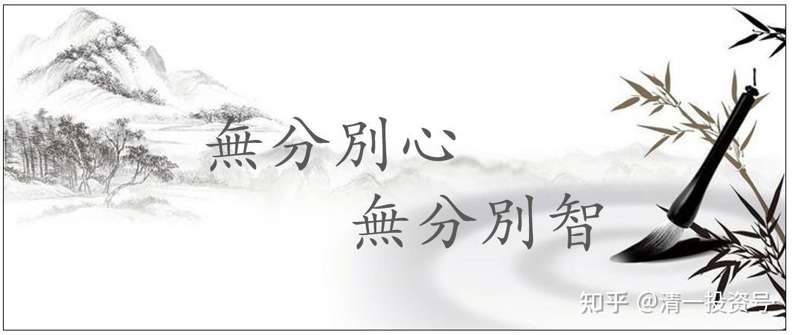
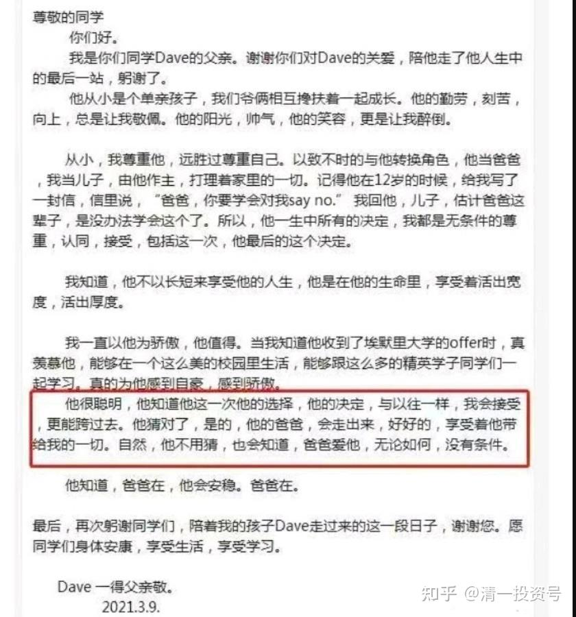

8篇.爱己爱人，真实与理想身份，无分别心

2021年3月18日

清一山长雪球非专栏帖子整理文章第8篇《爱己爱人，真实与理想身份，无分别心》

**一、先做到真正的爱自己，才能真正爱他人**

//[@水火既济g5g](http://link.zhihu.com/?target=http%3A//xueqiu.com/n/%25E6%25B0%25B4%25E7%2581%25AB%25E6%2597%25A2%25E6%25B5%258Eg5g):回复[@清一山长](http://link.zhihu.com/?target=http%3A//xueqiu.com/n/%25E6%25B8%2585%25E4%25B8%2580%25E5%25B1%25B1%25E9%2595%25BF):

山长，今天晚上在网上看到一个叫张一得的优秀常春藤学生自杀了，据说这个孩子生前的确很阳光、很优秀。他爹一直以来也都是很多妈妈的偶像，不晓得为什么突然就自杀了呢？很多说因为他爹逼他追求优秀，压力太大，这个理由感觉好牵强啊……配图是儿子死了以后他爹给写的公开信，的确不懂，感觉这个爸爸很尊重自己儿子啊！一直各方面的锻炼孩子，也不是一味鸡娃的那种啊！作为一个妈吗有点丧，到底怎样才能避免这种情况呢？求开示！[@清一山长](http://link.zhihu.com/?target=http%3A//xueqiu.com/n/%25E6%25B8%2585%25E4%25B8%2580%25E5%25B1%25B1%25E9%2595%25BF)[¥200.00]

致埃默里大学Dave的同学们

　　尊敬的同学

　　你们好。

　　我是你们同学Dave的父亲。谢谢你们对Dave的关爱，陪他走了他人生中的最后一站,躬谢了。

　　他从小是个单亲孩子,我们爷俩相互搀扶着一起成长。他的勤劳、刻苦、向上,总是让我敬佩。他的阳光、帅气,他的笑容,更是让我醉倒。

　　从小，我尊重他，远胜过尊重自己。以致不时的与他转换角色，他当爸爸，我当儿子，由他作主,打理着家里的一切。记得他在12岁的时候,给我写了一封信，信里说,“爸爸，你要学会对我say no.”我回他,儿子，估计爸爸这辈子，是没办法学会这个了。所以，他一生中所有的决定,我都是无条件的尊重,认同,接受，包括这一次,他最后的这个决定。

　　我知道,他不以长短来享受他的人生，他是在他的生命里，享受着活出宽度,活出厚度。

　　我一直以他为骄傲，他值得。当我知道他收到了埃默里大学的offer时，真羡慕他，能够在一个这么美的校园里生活，能够跟这么多的精英学子同学们一起学习,真的为他感到自豪,感到骄傲。

他很聪明,他知道他这一次他的选择，他的决定，与以往一样,我会接受，更能跨过去。他猜对了，是的，他的爸爸，会走出来，好好的,享受着他带给我的一切。自然，他不用猜，也会知道，爸爸爱他，无论如何，没有条件。

　　他知道,爸爸在,他会安稳。爸爸在。

　　最后，再次躬谢同学们，陪着我的孩子Dave走过来的这一段日子，谢谢您。愿同学们身体安康,享受生活,享受学习。

Dave一得父亲敬。

2021.3.9.

[清一山长](http://link.zhihu.com/?target=https%3A//xueqiu.com/9310099567)[2021-03-18 19:56](http://link.zhihu.com/?target=https%3A//xueqiu.com/9310099567/174818880)回复[@水火既济g5g](http://link.zhihu.com/?target=http%3A//xueqiu.com/n/%25E6%25B0%25B4%25E7%2581%25AB%25E6%2597%25A2%25E6%25B5%258Eg5g):

你这个问题挺有难度的。其实西方心理学家已经无法回答了。不过，用东方智慧来回答，就很简单：因为**这个家庭的序位是错误的，孩子用自杀来反抗老爸“爱的捆绑”，解放自己，也解放老爸。**

**家庭里面，父亲的角色，是规范，是崇高，是敬仰，是规则，是惩罚。而母亲的角色，是支持，是关爱，是纵容，是慈爱。**

**孩子就在父母之间，通过两者的平衡来学习和提升自己。**他在母亲这里找到关爱，在父亲这里找到规则，找到指导。甚至他/她会在父亲这里故意地尝试超越界限，但如果被父亲打了屁股，他/她反而觉得很幸福（我女儿就这样）。孩子往往通过挑战父亲的权威来获得成长。如果这样，他/她就能成长为一个正常的人。

（你在这个父亲的信件中，已经看到儿子做了我女儿做的一样的事情，估计是故意地超越界限，试探老爸的底线，故意做坏事。但父亲选择了纵容，表示“我接受你的一切，甚至你干坏事”。这让孩子感到很失望，也觉得父亲很愚昧,自己也更孤独了）。

这个爸爸的角色，不像正常的爸爸，甚至也不像妈妈。他像一个奇怪的怪物，他是一个没有自我的人。他像孩子的奴才、跟班，通过服务孩子，与孩子“共生”，来获取自己的存在感，弄得他自己像个需要关爱的婴儿。他纵容一切，他让孩子来“当家长”，他愿意为孩子做一切，为孩子荣而荣，为孩子耻而耻。**看起来是宠爱，其实就是放弃了自己的责任。而且他失去了自我，他的内在自我，已经死亡。**

所以孩子感到茫然，而且觉得负担特别重。孩子的阳光，只是做给父亲看的面子，内心是孤独的。最终选择离开世界，很正常，因为他没有得到真正的爱。

**所有的自杀者，都是极度缺乏爱的孩子。**父亲**没有付出爱，他只是付出了服务**，把孩子视为他唯一的希望，索取爱的工具，因为他自己也缺乏爱。

所以，没有爱的家庭，就没有生命力。这是一个死气沉沉的、恐怖的家庭。谁都想逃走，甚至通过死亡来逃走。

我相信这个父亲是不会沟通交流的。孩子尝试过沟通，但失败了。他**只是单向地给孩子不需要的东西，强行加给孩子**。孩子最终选择了自杀，是因为孩子缺乏人生的指导，觉得人生没有希望。父亲靠不住，也不忍心让父亲失望，就自己了断了。

如果用轮回的案例来说，这孩子是善缘，他不愿意伤害父亲，但实在承担不了父亲的爱，他放弃了自己！

**他一直没有为自己而活，因为父亲没有给他示范为自己而活。**

既然人无法为自己而活，那就为自己而死吧！

这就是他这样做的心理行为机制。

好了，这就是答案。我相信你找不到任何心理专家会这样回答你。但我相信是对的。

可惜了这孩子，他如果跟我谈一个小时的话，他就会换一种活法。他和父亲去找刘老师咨询，也一样能轻松解决问题。可惜——**有人就是宁死也不愿意思考和面对，甚至不愿意求教**。其实这父亲就是不沟通，不交流，不学习的呆子——他丢了心。

//[@WEHKGKE](http://link.zhihu.com/?target=http%3A//xueqiu.com/n/WEHKGKE):回复[@清一山长](http://link.zhihu.com/?target=http%3A//xueqiu.com/n/%25E6%25B8%2585%25E4%25B8%2580%25E5%25B1%25B1%25E9%2595%25BF):

看过这个新闻，感觉他父亲接受采访时，平静而又理智得让我感到不寒而栗。据说这名父亲是国内科学育儿的神级人物，他的育儿理念上过无数报纸、电视和专访，还开设亲子教育讲座。

[清一山长](http://link.zhihu.com/?target=https%3A//xueqiu.com/9310099567)[2021-03-18 21:36](http://link.zhihu.com/?target=https%3A//xueqiu.com/9310099567/174826990)回复[@WEHKGKE](http://link.zhihu.com/?target=http%3A//xueqiu.com/n/WEHKGKE):

不是他会教孩子，而是这孩子是善缘。

**善缘的孩子，都会尽量满足家长的欲望**，即使是疯狂的欲望。但如果完全违背孩子的心意，被剥夺了生命的自主权，也感受不到家长的爱，最终受不了，就会放弃自己。

如果是恶缘，就根本对着干的。出身在这种人家，从小就当问题孩子了。

所以，**家长愚痴，善缘、恶缘，最终都会结出恶果；但家长智慧，就算是恶缘孩子来了，也会变善缘的。**难度大，但真的可以做到的。

//[@欣yu](http://link.zhihu.com/?target=http%3A//xueqiu.com/n/%25E6%25AC%25A3yu):回复[@清一山长](http://link.zhihu.com/?target=http%3A//xueqiu.com/n/%25E6%25B8%2585%25E4%25B8%2580%25E5%25B1%25B1%25E9%2595%25BF):

山长的解析，让我联想到一个状态，家长和孩子共生，共荣辱，此生活着只为儿女。在这样的状态下，孩子的状态会如何？养育孩子是生命经验的一部分，并不是全部。我将用什么样的剧本体验这次旅程，这之中有个不变的中轴，此生我只为自己负责，这责任包含父母责任，子女责任，也包含对自己生命探索的责任！

[清一山长](http://link.zhihu.com/?target=https%3A//xueqiu.com/9310099567)[2021-03-19 12:08](http://link.zhihu.com/?target=https%3A//xueqiu.com/9310099567/174880817)回复[@欣yu](http://link.zhihu.com/?target=http%3A//xueqiu.com/n/%25E6%25AC%25A3yu):

这种家长很多，但都有一个共同点：很苦，年纪越大越苦。孩子大了更苦。因为违背了“人道”。

//[@金淼儿](http://link.zhihu.com/?target=http%3A//xueqiu.com/n/%25E9%2587%2591%25E6%25B7%25BC%25E5%2584%25BF):回复[@清一山长](http://link.zhihu.com/?target=http%3A//xueqiu.com/n/%25E6%25B8%2585%25E4%25B8%2580%25E5%25B1%25B1%25E9%2595%25BF):

老师博古通今，文武双全，才財兼拥，品高德厚！在雪球有幸有缘和老师学习投资的同时，还拜读了育人和心理学等等很多方面的文章！不可多得的良师！敬仰！

[清一山长](http://link.zhihu.com/?target=https%3A//xueqiu.com/9310099567)[2021-03-18 21:30](http://link.zhihu.com/?target=https%3A//xueqiu.com/9310099567/174826470)回复[@金淼儿](http://link.zhihu.com/?target=http%3A//xueqiu.com/n/%25E9%2587%2591%25E6%25B7%25BC%25E5%2584%25BF):

财富=博古通今，文武双全的结果。

他这问题是心理学。炒股，必须懂心理学，不是懂大学教的心理学，而是懂人类的的真实心理学。**炒股成功，必须懂古代的哲学，懂得财富来自于富足之心；炒股赚钱，必须懂现代企业运行，必须通今；炒股，还必须拥有坚韧的心态，必须练武**——欧美金融职业人，会定期去日本修习武道。所以，一切的背后，支撑完成了我的财富。当然。懂得这些一切，自然可以办教育。因为很多人不懂。

希望大家了解这其中的因果关系！是层层递进的。

都做到了，就稳定获得财富；不然，就是偶然；都违背，就是亏本。

**无知而且不想费力提高自己，就想轻松地获得财富，其实正好是韭菜**。

**二、真实身份和理想身份**

//[@ellhll李华丽](http://link.zhihu.com/?target=http%3A//xueqiu.com/n/ellhll%25E6%259D%258E%25E5%258D%258E%25E4%25B8%25BD):回复[@清一山长](http://link.zhihu.com/?target=http%3A//xueqiu.com/n/%25E6%25B8%2585%25E4%25B8%2580%25E5%25B1%25B1%25E9%2595%25BF):

感谢山长。这是一个直达心灵的帖子，是我接受到的山长第一个慧心课程。异常珍贵。借着山长的引导，我把《与神对话I》和《谁在我家》相关章节重温了一遍。

我先看父亲的信，再看山长的分析。

看信的时候，我获得的两个信息是：

1.父亲不爱自己，或是说，他不懂得如何爱自己。

证据为信件的描述【从小我尊重他，胜过尊重我自己】

2．父亲做了儿子，让儿子做了父亲。

证据为信件的描述【与他转换角色，他当爸爸，我当儿子，由他做主；儿子，爸爸这辈子永远没办法对你说no】

第一个信息，让我想到了《与神对话I》第8章，关于关系的论述。

摘录和具体页面如下：

最懂得爱的人是那种以自我为中心的人。P151

如果你无法爱你的自我，你就无法去爱别人。P151

许多人犯下了错误，试图通过爱别人来爱自我。P151

他们想：“如果我能够爱别人，他们也将会爱我就好了。那样我就是值得爱的，我就能爱我自己。”P151

你的第一个关系必定是你与你的自我的关系。你首先必须先学会尊重、珍惜和爱你的自我。P154

你必须先认为你的自我有价值，然后才能认为别人有价值。P154

从今往后，永远以你的自我为中心。无论在什么时候，你要关注的是你现在是谁、正在做什么事、拥有什么东西，而不是别人过得怎么样。P155

你必须尊重你的感受。因为尊重你的感受意味着尊重你自己……如果你无法尊重你自己内心的感受，你又如何能期待去了解和尊重别人的感受呢？P156

在与别人进行交往的过程中，最早需要解决的问题是：在这种关系中，你的身份和你的理想身份是什么？P156

山长说《与神对话》是白话版的《道德经》。我对它的感受是时时看时时新。

第二个信息，对照山长的分析【父与子关系的错位】，对应海灵格大师《谁在我家》第三章【父母和孩子】P99的一个案例。摘录如下：

【当伴侣的需求未被满足时，求助于对方或求助自己的父母才是最合适的。当他们求助于自己的孩子以期得到安慰和安心时，家庭中的角色和功能就颠倒了。这就是父母认同，孩子假定自己是父母的一方。孩子们没有保护自己的抗拒这种过程的能力。】

从信的内容获悉这是个离异的父亲。他在伴侣亲密关系上是不完整的，没有疏通自己的未被满足，心理上的缺失企图通过儿子来获取。

儿子爱父亲，但不堪重负，选择自杀来抗议。用自己的生命告诉父亲，告诉世人：父亲是错的。如果他的父亲是一个科学育儿的权威，追随的妈妈们是该好好反思：如果权威是错的，把他捧成权威的她们，是不是也是错的？

[清一山长](http://link.zhihu.com/?target=https%3A//xueqiu.com/9310099567)[2021-03-19 09:52](http://link.zhihu.com/?target=https%3A//xueqiu.com/9310099567/174859992)回复[@ellhll李华丽](http://link.zhihu.com/?target=http%3A//xueqiu.com/n/ellhll%25E6%259D%258E%25E5%258D%258E%25E4%25B8%25BD):

你的确是好学生！[献花花]这两部书，参考阅读，对自己提升很有价值。

//[菠萝尔@ellhll李华丽：](http://link.zhihu.com/?target=https%3A//xueqiu.com/4679325748)

“在与别人进行交往的过程中，最早需要解决的问题是：在这种关系中，你的身份和你的理想身份是什么？”。

如果在工作中与同事这种关系里，我的身份是同事，我的理想身份是什么样的呢？

[清一山长](http://link.zhihu.com/?target=https%3A//xueqiu.com/9310099567)[2021-03-19 11:23](http://link.zhihu.com/?target=https%3A//xueqiu.com/9310099567/174875648)回复[@菠萝尔](http://link.zhihu.com/?target=http%3A//xueqiu.com/n/%25E8%258F%25A0%25E8%2590%259D%25E5%25B0%2594):

关于你的**“理想身份”**是什么，这里借您的问，给大家有心的人上个小课吧！

就是你内心深处，想要呈现出来的，你认为最美好的身份。

上面某人出来喷：“什么高手、沽名钓誉、教育本来就是个说不清的事、类似于江湖骗子”，他想展示的理想身份是：这些大家眼中的高手，其实是低手，他自己才是高手，才最有眼光，最有思考，最有判断力，不人云亦云，不跟随别人盲目判断。

这个身份挺理想的，其实是大多数人，都很喜欢的身份：我们都喜欢与众不同，都喜欢自己卓越超群，都喜欢做高级人。

但我们用啥事实来证明？来展现？

**用贬低他人来证明，真实身份就是“无能者”。**

**用攻击谩骂来实现，就是“喷子”。**

**用更清晰的逻辑和事实、结果来证明自己的身份，他就是“超级高手”。**

比如说，他能够发现我的逻辑漏洞，或者指出我的问题所在，或者用事实来证明：他的思维跟我不一样，但比我更成功，间接可以证明也许他是对的。他就成功地捍卫了自己的“理想身份”——超过他眼中的高人的更高人。

他随即就展现了自己的判断，是什么呢？他的判断是“教育就是说不清的事情”——暗含意思，就是“其实我根本不懂教育是啥，说不清是啥”。这也没毛病，自己无知，不好下结论很正常。遵循他的逻辑，他也不应该评点我，因为他认为说不清，就别说了，啥都别说。可他又要说，还要给我贴标签，是江湖骗子。这就超越了自己的预设，把他说不清的事情又跳出来“说清”了。因为他想表达自己是“明白人”，通过“我就是要反对你，你肯定是错的”来证明“我比你、比你们都更明白”。

所以，他想要展现的理想身份是“傲视一切的高手”，展现出来的真实身份是“糊涂蛋，无知的蠢货”。他想用“贬低别人盲目跟随、无脑”，来展现自己的“有脑”；但盲目反对，也一样“无脑”，也许更无脑，因为他连山一样大的事实都看不清，看不见，却想通过否定别人的一切来“证明自己的身份”。他选择了错误的身份，所以证明了“与理想身份相反的身份”。

所以，他遭到的命运是相反的命运，不是认同者更多，而是更少，他更没朋友。他被人拉黑——其实更多的人在心里拉黑了他。这种人注定是无法建立亲密关系的孤独者。他的页面，显示零粉丝——除了自己，没人认为他“高”，生活中可能更失败。网上可以装，生活中会把你所有的装全部撕掉的。因为他太想表现了，但他的表现，不但没有展现自己“更高级”的身份，反而证明了自己“更低劣”的身份，而且会越来越低。谁是江湖骗子？他自己就是。因为他就是想出来骗人、拉粉的，说话展现自己“很不凡”的。结果，只是骗自己玩儿的。

我的逻辑，就是看到有些人喷我，我看粉丝数很多的，我就不拉黑了。因为说明既然有这么多人认同他，应该还是有点水平的。虽然出来说我的话，很没水平，但这种人也有可取之处。我就不拉黑他们。比如，某中医黑的雪球大V。但他们可以拉黑我，我不在意。

以上就是逻辑和分析。看起来很麻烦。其实一瞬间就完成了判断。只是推理过程，有点麻烦。所谓的一眼就看破本质，就是这种能力！

**三、无分别心**

[@木成来了](http://link.zhihu.com/?target=http%3A//xueqiu.com/n/%25E6%259C%25A8%25E6%2588%2590%25E6%259D%25A5%25E4%25BA%2586):回复[@清一山长](http://link.zhihu.com/?target=http%3A//xueqiu.com/n/%25E6%25B8%2585%25E4%25B8%2580%25E5%25B1%25B1%25E9%2595%25BF):

山长先生，看您的言词很重，是否你的心是慈悲的态度对待他们吗？所谓的喷子还有救吗？

[清一山长](http://link.zhihu.com/?target=https%3A//xueqiu.com/9310099567)[2021-03-19 12:05](http://link.zhihu.com/?target=https%3A//xueqiu.com/9310099567/174880569)回复[@木成来了](http://link.zhihu.com/?target=http%3A//xueqiu.com/n/%25E6%259C%25A8%25E6%2588%2590%25E6%259D%25A5%25E4%25BA%2586):

您的问话，想展现什么身份呢？

您一定最想展现的——就是“我是个好人”的身份，展现您最慈悲的身份。

可惜，你不知道慈悲是什么。就像问话中的父亲不知道爱是什么一样。回帖中的胡适给儿子的话，是满满的爱。有这样的父亲真幸福。而自杀学生的背后的父爱，并不是爱，更不是慈悲，而是控制。用爱的名义来控制。

我的回复，你觉得是诅咒吗？因为你觉得与我相反挺惨的。但他显然认为：与我相反挺自豪的。

他自己选择的道路，就算是要去吃屎，我也允许他选择，支持他与我相反去做。等于狗咬我，嘲笑我吃饭不吃屎。我说：我祝福您与我不一样，甚至与我相反。我现在不吃屎，你喜欢，就吃吧！也许哪天我做了狗，我再吃屎好了。

这是慈悲，还是不慈悲？

我的话不好听吗？不是，我是无分别心。你有分别，因此你有评判。

我对女儿就这样说的。我说，**有些人就是喜欢吃屎，但你要允许别人吃屎，只是你没必要跟随别人一起吃屎，你可以正常的吃饭。**

我还对女儿说：如果她有一天想吃屎，我也允许她吃屎（指干坏事，自伤、伤人之事）。所以，有时候我故意坑她，说她可以早恋、吃垃圾食品之类的话。她就很不服气的样子说：“我才不吃屎呢！”

无分别心，不是去吃屎，而是认为别人吃屎——比如狗——是很正常的，跟我们吃饭一样正常。

引出吃屎话题的讨论，是我们家，今年养了两只村民送给我们的小狗。小女发现小狗会去吃屎，比如吃外面的牛粪，就很生气，觉得：我给小狗还买专门的碎肉、骨头等来给它，食物很充足，干嘛小狗就非要去吃屎。我对她的开导是——狗吃屎，就像你要吃巧克力一样，我觉得都不好，但都是很正常的。猫就不吃巧克力，但不能说猫就比你高明。

我原来的一个学生，现在真的在吃屎，据说是吃自己的屎。他还秀出来，说自己已经“证道”了，达到了“悟道”的地步了。他现在已经“无分别心”了。以吃屎为证！我实在无语。您讲慈悲，其实你有分别心；他吃屎，其实还是一样的分别心。

而我认为：吃屎和不吃屎一样的，才是没分别心。狗吃屎，你不鄙视它，认为和您吃巧克力是一样的档次。您就是没分别心了。您去跟狗一样吃屎来证明，你依然是分别心，分别心还特别的重。

我不鄙视我这个学生吃屎，只是觉得：没吃死就好。但我没必要去模仿他，证明我跟他一样“悟道”了。所以，我才没分别心。

你们学佛的，别乱学，更别乱用词汇。不客气地说，很多现在学佛的人，越学，离佛越远。学佛三年，佛在天边！

大德可以呵佛骂祖，你去试试看？结果会很惨的；大德可以故意去穿写有“佛”字的内裤，你去穿试试？可能就烂裤裆了。

**“万法由心”，心不到，处处是非法。**

**参考链接：**

[喜马拉雅：清一山长雪球专栏集 免费在线阅读收听下载](http://link.zhihu.com/?target=https%3A//www.ximalaya.com/album/52603303)（音频）

[哔哩哔哩：清一山长雪球专栏](http://link.zhihu.com/?target=https%3A//www.bilibili.com/audio/am32848405)（音频）
