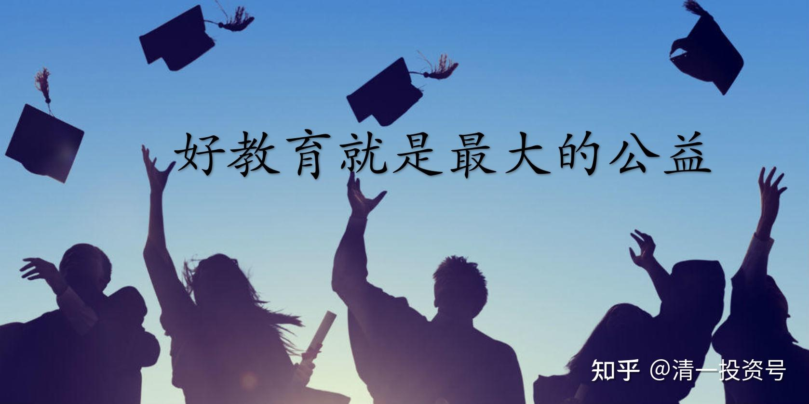

9篇.好教育就是最大的公益[——设擂台的目的是什么](https://zhuanlan.zhihu.com/p/519684875/edit)

——设擂台的目的是什么

清一山长 2021年3月24日

清一山长雪球非专栏帖子整理文章第9篇《好教育就是最大的公益——设擂台的目的是什么》

本文整理自山长专栏文章《两位20来岁的小女生：真筹到了一千万？》的跟帖评论[https://xueqiu.com/9310099567/175227574](http://link.zhihu.com/?target=https%3A//xueqiu.com/9310099567/175227574)

**一、好教育就是最大的公益**

//[@ellhll李华丽](http://link.zhihu.com/?target=http%3A//xueqiu.com/n/ellhll%25E6%259D%258E%25E5%258D%258E%25E4%25B8%25BD):回复[@清一山长](http://link.zhihu.com/?target=http%3A//xueqiu.com/n/%25E6%25B8%2585%25E4%25B8%2580%25E5%25B1%25B1%25E9%2595%25BF):

山长您好。澳洲这边发了擂台赛的信息之后，有些人质疑：

1.设擂台的1000万哪来的？学校出，还是家长出？

2.为了钱比赛还是为了吸引眼球而比赛？有这个钱为什么不去做公益？

3.如果自己真的认为自己的大学那么好，就自己好好学习好了，也不用出来争辩什么，冷暖自知，掌握知识是为了更好地工作生活，不需要和其他人比较。一个内心充盈的人应该不会在乎外界对他的评价。

山长这篇雪球专栏很清楚地回答了第一个质疑。

1.两人开班，一年带50个学生，每个收费20万，有1000万。

2.两人去新教育学堂培训师资，多家学堂堂主争着支付1000万。

3.两人去企业培训员工，企业老板出资1000万聘请。

4.两人一个帮企业家赚钱，一个做企业家儿子的私教，企业家出资1000万争着要。

所以，这1000万是设擂台的学生自己赚的，不是学校也不是家长出的。

质疑1和2，我的回答是：

设擂台不是为了擂主自己，也不是为了擂主的学校，而是希望通过这个比赛，让我们的社会反思：我们的教育是否走在对的路上，我们的教育是否有需要改革的地方。教育直接关系到目前2.3亿学生的未来，影响所有有孩子的家庭，教育输出的人才直接决定国家未来的国力。这样的教育擂台赛，如果真能促成教育更新换代的改革，其功德不是捐款1000万给慈善机构可以比拟的，甚至可以说它的影响是1000万的n次方。

不知道我这样理解的方向是否对，请山长解惑质疑1和2。感谢您！

[清一山长](http://link.zhihu.com/?target=https%3A//xueqiu.com/9310099567)[2021-03-24 10:01](http://link.zhihu.com/?target=https%3A//xueqiu.com/9310099567/175264213)回复[@ellhll李华丽](http://link.zhihu.com/?target=http%3A//xueqiu.com/n/ellhll%25E6%259D%258E%25E5%258D%258E%25E4%25B8%25BD):

回答：有这个钱（1000万）为什么不去做公益？

什么是公益？

首先，**好教育就是最大的公益，坏教育就是对公民最大的损害。**

其次，**把钱公开地拿来为公众服务，提供给不认识的人，甚至提供给反对自己的人，这就是公，就是无私。目标是为了提升公众的生存品质，这就是公益。**

这件事情，本身就是拿钱来做的公益事业。不是为了某人、某小集团自己的私利，而**是为了“让国人能够看到教育的本质”给出来的参与奖金**。这不是公益是啥？

这件事情，同时也是教育事业，我们让国人知道有另外一种活法，可以选择另外一种人生——更有价值的人生。两个小女生，明明有赚大钱的机会，自己也不去外面赚钱，而是安安静静地拿一份小钱教书育人。明仪更是要求去武道馆练武，去准备百人组手战，去进行自我提升，连每月两万的带班工资都不去拿。她们这一次，却愿意为了捍卫自己母校的荣誉来“卖”了自己，为别人的愿望而牺牲自己的愿望，去为别人工作服务一年，不为自己得到金钱，而是为了给反对者发大奖，因为知道国人是“无利不起早”的。现在世界上，还有几个这样淡泊名利的人？有几个人能做到“见钱眼不开”？这个动作，已经说明我们培养出来的人不一样：**能力超常，心态超好，欲望超低。**

以为做公益，就是拿钱出来“救济穷人”，这难道不能说：只是为了秀自己的优越感、物质上的存在感吗？用“给钱比自己差的人”来证明自己很了不起——而“付出自己的时间、牺牲自己的利益、拿出自己的名誉来垫底、来做公益事业”，却要被嘲笑“居心不良”？这是啥逻辑呢？

第二：1000万代表什么？如果一些考上清北的优秀学生，会为了每年十万的奖金，重新复读，再复读，给一些中学争面子，争名额；每年高考状元们，都能得到当地政府部门、中学的奖金，因为他们努力为当地政府争光了。那么，这种背景下，有1000万可赚，为啥体制学生不一百倍地努力来挣这笔大钱呢？恐怕不是不愿，只是不能吧？

第三：我会拿出十种方法，让体制大学的学生能够赢下清一大学。因为我相信中国大把的“千里马”，中国的大学生很多是很优秀的。但我反感的是：中国的这些优秀学生，却被这些“园丁”们拿来拉车，这是对中国人才的滥用，对天才的误用。这才是最对不起学生的事情。

**体制大学不是“赢不了清一大学”，而是他们就不愿意去好好珍惜人才，使用人才；更不愿意去发挥人才的最大价值，甚至抱残守缺，明明有机会也不去争取。这就是体制最大的问题。**

**二、设立擂台的目的**

明仪、明颖真的很稀奇吗？现在看，当然稀奇。全国也没几个是她们的对手。

你现在，去跟两女生全面PK，我认为你也没有赢的希望。但是，如果你十来岁，就来今日学堂接受教育，你绝对不会比她们差的，甚至可能会更好。因为我看你学习的态度很好，领悟力也不错。而你这样的学生，中国每年都会有上百万。谁说体制没人才？

如果让我从体制每年的数千万学生中，选出上百万有潜力的优秀学生，再从中选出几十个人，来专门培养跨学科人才。这些人，将来取得的成就，将远远超过现在的清一大学的学生，要击败清一大学的学生很容易。因为我们可选范围太小了，我们只能得到相对平庸的“材料”，但我们做出了最优秀的“产品”。如果给我们最顶尖的“材料”，我们能创造更大的奇迹。

但是，没人来做这种事情，也没有人能让我来做这种事情。宁肯让学生们低效、无效地学习、浪费天赋，也不让他们来发挥自己的天性，这就是落后的教育系统最可恶的地方。

**我们发出这个挑战，目标也很简单：清一大学真要创世界名校，就必须吸引素质顶尖的精英学生、不愿意浪费自己生命、愿意努力又有悟性的学生前来上学，就必须让清一大学的优胜之处让更多人知道。**如果我们用目前这么小的样本，就做出了体制海洋般的资源都做不到的成绩；如果我们把平庸之人都能变成天才，那么，真给了我们天才学生，我们会拿出什么样的结果来呢？这就是这个挑战的思考和必然的设想。最终，就是世界最顶尖的名校必然在中国产生。

**我们必须不断地提升我们初级生源的素质，而不是人数。将来有一天，我才有机会说：中国最优秀的学生，都已经来清一大学了。即使让我去外面找学生来对战，我找不到战胜清一大学的可能性。这才是我想要的目标。**

现在，只要给我机会选人，不用全国选秀，只要去一个名牌大学，甚至名牌中学范围内选人，来对战现在的清一大学，两年后，清一大学就会被击败。您认为我会满意清一大学的这个结果吗？我们超越体制，其实只是超越了两年而已！

现在的笑话就是：体制大学，明明有机会击败清一大学，却没人敢来，只会说怪话。**说明体制内真的没人——不是没有学生，是没有人知道如何指导学生才能击败清一大学。**不是体制大学生清高、不想要钱，是真的不知道如何才能拿到钱。没有脑子来拿钱罢了。

这是中国大学的悲哀——集体无能症！

[//ellhll李华丽](http://link.zhihu.com/?target=https%3A//xueqiu.com/3931532042)2021-03-24 11:16[@清一山长](http://link.zhihu.com/?target=https%3A//xueqiu.com/9310099567)

感谢山长这么详细的解答。看到最后让人捶胸顿足！

清一大学只有100来个资质普通的学生，体制学校有海量的资源和“千里马”，出来的结果却完全逆转——**震撼**

山长想为国家和民族，让优秀的学生物尽其才，齐心为中国创建世界顶尖的学校。结果却是“没人来做这种事情，也没有人能让我来做这种事情。宁肯让学生们低效、无效地学习、浪费天赋，也不让他们来发挥自己的天性”——**悲凉**

山长一直在为教育开创新局面、创造新纪录，对这样一个“全国3700万人无人能应战的局面”，却说“您认为我会满意清一大学的这个结果吗”。永远在超越自己，这就是给顶级精英最好的精神示范——**赞叹**

好教育就是最大的公益。明颖、明仪不要千万金，付出时间，垫上名誉，为真教育代言。她们淡泊名利、大公无私的行为示范就是最好的教育——**赞扬**

我这样已过青春的人，看到清一新教育的光芒，虽不可能回炉重造、像10来岁的孩子般学习，但是，求学永远不迟，我不会气馁、不会停步。以前看过侯老师分享她跟在山长身边学习了16年，我当时就想：我跟随山长学习，先以超过16年为目标。就像山长讲的，体制学校的学生和清一大学的学生相比，相差的只是2年的时间，只要有明师指导，超越就有可能。即使16年后我仍不能追上老师们，我的孩子也有追上的可能——**不轻易言败**

3700万大学生，2.3亿的学生，4.6亿的父母，难道真的没有人看到新教育？没有人敢于、能于试一试吗？

**三、问题的根由在于生态系统**

//[@国学中医黎天焕](http://link.zhihu.com/?target=http%3A//xueqiu.com/n/%25E5%259B%25BD%25E5%25AD%25A6%25E4%25B8%25AD%25E5%258C%25BB%25E9%25BB%258E%25E5%25A4%25A9%25E7%2584%2595):回复[@清一山长](http://link.zhihu.com/?target=http%3A//xueqiu.com/n/%25E6%25B8%2585%25E4%25B8%2580%25E5%25B1%25B1%25E9%2595%25BF):

山长，我认为这一“仗”没有那么容易打起来。

第一，输不起心理，某些高级教育人物是不敢出头接招的，他们的心理是赢了还好讲，输了就没办法混了。

第二，一盘散沙，如果官方没接盘，民间的就更不会接，单独接盘是不可能的，联合起来就更加是散沙。跑出来黑一下的能力是很厉害的，真要上台，他们很清楚自己的斤两。看看播求来中国这么多年，基本上都是打那些包装过的。

[清一山长](http://link.zhihu.com/?target=https%3A//xueqiu.com/9310099567)[2021-03-24 14:07](http://link.zhihu.com/?target=https%3A//xueqiu.com/9310099567/175298917)回复[@国学中医黎天焕](http://link.zhihu.com/?target=http%3A//xueqiu.com/n/%25E5%259B%25BD%25E5%25AD%25A6%25E4%25B8%25AD%25E5%258C%25BB%25E9%25BB%258E%25E5%25A4%25A9%25E7%2584%2595):

您说对了：应该打不起来！我知道这是最可能的结果，虽然是最令人失望的结果。

**您说的情况，叫做生态系统问题：我们要求的这种物种（跨学科人才），虽然看起来并不稀奇，但如果生态系统不对，就怎么都长不出来这种人的。**几千万人都选不出一队人的，一两个超越的人，有可能。

香蕉树稀奇吗？泰国到处都是。但您在中国的北方能发现吗？我相信绝无可能（除非专门的试验机构特种温室里面的样品）。我们没必要找遍中国整个北方的每一寸土地才能总结说：中国北方没有一棵香蕉树。

中国教育系统，是一片贫瘠的土壤，生态环境太差，不太可能长出如此多彩的花朵。就像西藏高原长不出一棵小树来一样。

7年前（2013年）的大学生辩论赛，为啥弟子们还没出山、一仗未打，我就判断中国大学生们必败？因为我知道中国大学的辩论模式，就是耍嘴皮子的游戏，有口无心。全国大学都这样玩，都玩虚的，不来实在的。都只秀个人技术，没有团队配合。我们只要不耍嘴皮子，我们玩真功夫，真研究，我们玩团队配合，协同作战，他们就绝对会输掉的。这个，真没啥技术难度，只要用心就可以了。问题是：大学生知道心在何处吗？

当然，如果当年真给1000万元的奖金，我相信大学生们绝对能够拿走的。其实，给一百万，他们就能拿走了，可以完败今日。因为：看在一百万的面子上，大学生们就会自动自发地组织起来，与今日真正的对战，我们就会输掉了。也就是说：中国的大学实力是有的，但需要更强烈的刺激才会去“用心”。否则都是混混日子的。

现在这个比赛，虽然比辩论赛难多了，但中国大学依然是可以赢的，因为真不难。只要用心还是可以赢的，我说过：准备两三年，就可以赢过我们的学生了。

但难点在于：大学生倒是很想要奖金，但实力不足。虽然可以培训出实力来（我们挑战的内容都没啥技术含量，比武也不是要你拿世界冠军），但没有人来组织和系统地培训对战。他需要一个系统来做这件事情。

而中国的“系统”是很昂贵的，运作起来特别的不容易，他不可能自动产生这种结果。最糟糕的是：这个系统，要用来克服的，并不是我们，而是他们自己。除非有大领导拍板、消除这些牵制，否则他们自己就把自己打垮了。

如果要一些有能力的人，能够调用得到资源的人，用他们的系统资源来专门地做这件事情，就会成功了。拿到一千万又嫌太少了，他们想要十个亿，因为他们的胃口太大了。

当然，没人会拿十个亿给他们的。这笔钱，可以办十个清一大学了。

所以，这个答案，对于体制来说，是无解的。虽然他们大幅调整了系统，但真这样做了，中国教育就开始改变了。中国很可能成为世界创新教育的领导阵营。

我们如果对海外的国家，海外的大学，我们开出同样的这个条件来比赛，我们会输掉的。因为：海外的教育系统，有足够的“生态系统”，可以生产出特别门类的学生，要找出10个人来拿一千万是很容易的。他们可以很低成本地运作起来，学生们会自动自发地组织起来，利用社交账户，发布组队消息，符合要求的人会自动报名，他们会弄成一个必赢的“特战队”，就像寻宝小组一样，大约需要用半年时间来做准备，最终就击败我们了。**不是我们差了，而是对方的“题库”太大，优秀者很多，我们其实真实能力，是无法对抗全国的精英的。**

中国的大学生，根本就不会做这种事情。少数能做这种事情的人，也得不到别人的配合，无法协同一致，沟通成本太高。所以，要找到一两个人来挑战，肯定是有的；但要找5个10个来比赛，几乎没可能。他们先就输给自己了。

简单地说：**我们在大陆做这种比赛，相当于我们用火枪，对方用大刀。**你就算有一个亿的军队，跟我们一百多个人的团队来作战，也不是我们的对手。来多少，死多少。

**但在西方，相当于我们用先进的冲锋枪，对手只是落后的火枪而已。**但架不住他们人太多，各种手段都用上，跟他们去作战的话，最终一定是我们输掉。

因为：**机枪也好，火枪也好，都是一个档次的战争。只是程度不一样。枪对大刀的作战，是没有可比性的。完胜。**

中华真武功，对西方格斗，是不会差距太远的。双方的技术差距，没有想象的这么大。谁没练好，谁就输了。

但如果可以用一把小刀来对付武功高手，只要有初级的武功水平，不是菜鸟，就足以击败世界冠军。

这就是我的最终答案！我根本不相信中国大学能培养出啥真正的对手出来。只抱有万一的希望，也许——某地会冒出一批会做事的大学生？这几乎是奇迹了。

我很希望我是错的。但看样子，我真没错！

//[@刘先生lgm](http://link.zhihu.com/?target=http%3A//xueqiu.com/n/%25E5%2588%2598%25E5%2585%2588%25E7%2594%259Flgm):回复[@清一山长](http://link.zhihu.com/?target=http%3A//xueqiu.com/n/%25E6%25B8%2585%25E4%25B8%2580%25E5%25B1%25B1%25E9%2595%25BF):

不是没人应战，是新教育的知名度太低了，很少有人知道这个事情，如果能上热搜，央视报道了，肯定有很多人来应战的。

[清一山长](http://link.zhihu.com/?target=https%3A//xueqiu.com/9310099567)[2021-03-24 18:21](http://link.zhihu.com/?target=https%3A//xueqiu.com/9310099567/175330576)回复[@刘先生lgm](http://link.zhihu.com/?target=http%3A//xueqiu.com/n/%25E5%2588%2598%25E5%2585%2588%25E7%2594%259Flgm):

您的意思，就是长春没找到香蕉园，但如果在CCTV的电视台发布消息，让全体东三省的人都知道：有人在找香蕉树，还给1000万元，就可以找到了。是吗？

想找香蕉树，不如去海南找吧？

雪球上我的粉丝并不多，但也有六七万人了，我相信地理上，已经覆盖全国的范围，加上他们的亲朋好友们，绝对覆盖了全国的大学校园。给了一千万，真有其人，就会来拿的。抢都要抢的。没见到雪球上，发个几元的红包，都有一批的人到处抢呢？更别说一千万了。没人吭气，自然是没人有这实力来拿奖。别找啥面子话、场面话，怪我们没上热搜。只能说：中国格式化教育真的太严重了，的确无人拿得出来！

**四、富人穷人聪明人笨人都需要学新教育**

//[@-lily-](http://link.zhihu.com/?target=http%3A//xueqiu.com/n/-lily-):回复[@清一山长](http://link.zhihu.com/?target=http%3A//xueqiu.com/n/%25E6%25B8%2585%25E4%25B8%2580%25E5%25B1%25B1%25E9%2595%25BF):

感触很深。我是一名体制生。比明颖明仪大几岁。能力素质都差很多。初高中时通过网络接触到今日学堂，不过没有条件上。本科也是武大（现本科已毕业，不过已入科研的坑）。很佩服山长，也很喜欢山长的弟子。我了解新教育后，就没有让后代去体制的想法。不过之前总觉得新教育是富人玩的游戏，现在觉得自己或许也能做一点事。好好努力，前面有一大批人带队呢！

[清一山长](http://link.zhihu.com/?target=https%3A//xueqiu.com/9310099567)[20212-03-24 18:07](http://link.zhihu.com/?target=https%3A//xueqiu.com/9310099567/175329176)回复[@-lily-](http://link.zhihu.com/?target=http%3A//xueqiu.com/n/-lily-):

原来是“武大郎”。欢迎武大有人组队来，击败两位小女生，拿走这一千万。赢了就拿走全部奖金，都给队员，输了我来垫背。没啥企图：只是捍卫母校荣誉而已。老武大人的一份情怀。只是怕现在的年轻人不行了，扶不起来。

//[@武洛奇](http://link.zhihu.com/?target=http%3A//xueqiu.com/n/%25E6%25AD%25A6%25E6%25B4%259B%25E5%25A5%2587):回复[@清一山长](http://link.zhihu.com/?target=http%3A//xueqiu.com/n/%25E6%25B8%2585%25E4%25B8%2580%25E5%25B1%25B1%25E9%2595%25BF):

感恩山长的示范，每天都会来雪球逛一逛，看完之后每次都有些新的思考。

这个回复特别有意思，让我想到了前一段时间阅读的过程中看到的一段话。

大概意思是：有人说新教育是富人才学的，因为新教育的学费真的不是普通家庭能够承受的。

对于大多数人来说，走新教育似乎并不是最好的选择，毕竟从时间、精力、收费等来看，都比体制要花费更多的个人精力、时间才有可能看到自己想要的结果。

并且新教育没有“保障”，只是说这是一种新的教育理念。这也是很多人反对的理由之一。

不过我并不认同这个观点。甚至说强烈反对！

我认为富人的确要学新教育，毕竟你的亿万资产如果想要传承，想要家族传承，必须了解人性，子女教育也要从小做起，搞不好很可能变成他人生的灾祸根源。

但如果你现在还是个中下层，那你更需要去学新教育了，因为这是你未来提升自己家族竞争力，甚至是超越别人的法宝。

结合自己的经历来看，学历真的是不重要，如果我们没有学会独立思考，为自己负责，哪怕就是学到了博士也只是个无脑跟随的棋子，被别人、被社会无形中操控的木偶人。

我也不是从小学习新教育，第一次知道新教育也是4年前了，4年过去了，又是一个大学的时光，但我和4年前已经完全不一样了。

回头看看自己曾经走过的路，真的觉得挺有意思。很多比我更早接触新教育的人，慢慢地也退出了这圈子，过上了自己想要的“幸福生活”。

对于这一次比赛丝毫不感兴趣，我认为这并不是装的，我也将这些相关的内容转发给了一些看起来很厉害的朋友，但基本上没什么音讯，竹篮打水一场空。

我历来听不惯别人背后嘀嘀咕咕说母校的“坏话”，也不觉得自己的母校差。但对于这件事我只能直接认怂。因为，根据我的认知这件事绝无胜出的可能。

虽然您也在雪球、QQ群里发言说，如果给你一些机会，你可以带外面的学生轻松打败清一大学的学生。您有自己的方案，我相信这是真的，因为您从来不吹牛。一路走来，反对您的人似乎都没有得到什么好处，尽管我不是所谓的骨灰级粉丝，但我也知道，如果仅仅是为了反对而反对，那和蠢货没有什么区别。

再说方案，从看到信息第一天我就将自己带入角色，一直在思考:

如果我现在还是大学生，我是否有勇气来应战？

如果我想迎战，我需要具备哪些能力才有可能博得一局胜利？（因为我觉得全面胜利几乎没有可能，至少在我目前的认知里面是这样的）

如果我是高校的负责人，我有哪些资源可以调动？如何才能够激发我的学生来应对？等等……

很遗憾，想了几天，我想破脑袋也想不出来个一二三。感觉比江湖课的策论还难。

[清一山长](http://link.zhihu.com/?target=https%3A//xueqiu.com/9310099567)[2021-03-25 10:53](http://link.zhihu.com/?target=https%3A//xueqiu.com/9310099567/175392485)回复[@武洛奇](http://link.zhihu.com/?target=http%3A//xueqiu.com/n/%25E6%25AD%25A6%25E6%25B4%259B%25E5%25A5%2587):

说得对！

**富人肯定要学新教育。**

**穷人，就更要学新教育。否则无法改变命运。学了，就可以与富人站在一起了。**比如明颖、明仪的家庭，不是富裕人家，都是工薪阶层。但现在，亿万富翁的孩子，能追上她们就算家族有光。她们已经改变了家族的地位。如果她们是去读体制大学，现在正忙着到处找工作吧？富贵人家，谁会把她们当回事呢？

**聪明人和笨人，也都要学新教育。聪明人学了更聪明；而笨人学了新教育，学不会也没太大关系，总有人学不会的，但起码能落个好身体、好心态，做个好员工没问题。**

**只有一种人,才不需要学新教育——蠢人！找抽的人!**

**五、成功组队挑战者需要的两个条件**

[燕子学习投资和中医](http://link.zhihu.com/?target=https%3A//xueqiu.com/3263527455)[@清一山长\[¥200.00\]](http://link.zhihu.com/?target=http%3A//xueqiu.com/n/%25E6%25B8%2585%25E4%25B8%2580%25E5%25B1%25B1%25E9%2595%25BF%3Fpaid_mention%3D1)

山长好！我想咨询一下，我能不能去做“实筹千万对赌真假大学”的组织者？需要什么样的条件和能力？

一是因为我想挣钱，但是我不敢再在圈子外面挣钱了，因为我就是体制出来的那种特别容易被骗的人，被骗怕了，如果不是遇到清一新教育，现在还在继续向下滑，现在在工厂打工。

二是想在新教育圈里做点事，但是能力不够，不知道可以做啥，做义工的话，实力还不允许。

因为字数限制，我简单介绍一下个人情况：1981年出生的，独生女，扩招上的二本，在体制内上班七八年。两个孩子，入读过新教育学堂一学期，后来被爷爷奶奶带回老家。二婚，目前备孕中，每天学习倪海厦老师的中医视频。

我自己的同学圈子可以联系，因为他们不少人毕业之后做了老师。有一个舅舅在东南大学教体育，已经到了退休的年纪了，不过圈子应该还在，我可以联系看看。

[清一山长](http://link.zhihu.com/?target=https%3A//xueqiu.com/9310099567)[2021-04-14 22:43](http://link.zhihu.com/?target=https%3A//xueqiu.com/9310099567/177169668)

我只能担保这一千万是真实存在的。但我无法确认你能拿到这一千万，因为你必须打赢，才能拿到钱。

如果是我，是能够拿到这笔钱的。但我需要拿两年来准备。因为体制学校，现成的符合要求的学生，应该不存在，只能花两年时间来培训一下。好在体制内优秀的学生多，找一队人马，用两年培养一下跨界的能力，针对性训练一段时间，是可以取胜的。毕竟参加高考，也要专门的针对性训练。没有针对性的培养，是没可能拿走这笔钱的。学生，可以选择高中生中的优秀者，以及大学生中的优秀者，都可以。

至于您怎么办：

第一，你必须能够有能力找到优秀的大学生，各方面能力素质强的组队来比赛。

第二，你能够找到帮助他们补强弱项的方式。给你一点时间你就可以做到。

两项本领都具备，你才有拿这一千万的可能。否则，就没希望。你啥都不会做，凭啥给你分钱？就算有这种人存在，你也找到了，他们也会自己联系组队，确认比赛，把你丢开的。因为你必须去做一些大学生们做不到的事情，比如良好的组织管理，以及培训补强工作。啥都不会，凭啥拿钱？

新教育的一些堂主、教师，其实有这能力进行培训补强工作的。他们第一是不愿意去主动的帮大学生来对战清一大学，除非顺便；第二是他们也找不到这种人出来比赛，关键是找不出这批愿意来对战的大学生，必须是很优秀的学生才有可能取胜。

（本文标题一二三四五为编者后加）

参考链接：

[129篇 两位20来岁的小女生：真筹到了一千万？](http://link.zhihu.com/?target=https%3A//www.ximalaya.com/sound/488865802)（音频）
