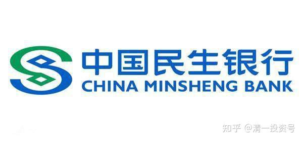

11篇.买入并持有民生银行H股的投资逻辑

2017年9月13日～2018年4月23日

一、民生银行H股股价已处于历史低位

二、复星低价退出不影响自己的投资逻辑

三、无论从投资角度还是投机角度，民生银行H股相对胜率更高

四、便宜才是王道，不涨就不卖

**一、民生银行H股股价已处于历史低位**

云蒙[发布于2017-09-13 19:55](http://link.zhihu.com/?target=https%3A//xueqiu.com/3037882447/92304219)

《全国重要银行AH股涨跌及估值情况》

雪球链接：[https://xueqiu.com/3037882447/92304219](http://link.zhihu.com/?target=https%3A//xueqiu.com/3037882447/92304219)

@云蒙回复@sunny11123:

其实不爬出来又何妨，目前民生银行港股股价对应人民币为6.50元人民币，动态每股净资产已经达到10元，市净率为0.65倍，过去十几年民生银行历经风风雨雨收盘价比这个估值还低的天数只有8天。……（详见上面链接）

清一山长2017-09-14 11:49:15评论上帖：

我刚打赏了这条评论￥66元，也推荐给你。祝福云蒙，希望你成功逆袭戴维斯的双击。民生是我10年的重仓股，2012年初就跑掉了。后来一直嫌他价格高，总有一堆人来捧他（史玉柱、安邦等）。**直到最近一段时间，才开始觉得：可能到了买民生的时候了。**可惜IB给民生的质押率太低了。

**二、**复星低价退出不影响自己的投资逻辑

[fimdy](http://link.zhihu.com/?target=https%3A//xueqiu.com/1915834490)[2017-09-21 09:59](http://link.zhihu.com/?target=https%3A//xueqiu.com/1915834490)

雪球链接：[https://xueqiu.com/1915834490/92731571#comment](http://link.zhihu.com/?target=https%3A//xueqiu.com/1915834490/92731571%23comment)

@云蒙回复@fimdy:

关于复星减持民生银行，我个人看法如下：

……（详见上面链接）

清一山长2017-09-21 14:18:43评论上帖：

我刚打赏了这篇帖子￥66元，也推荐给你。今天买入民生，用实际行动支持复星[大笑]。也许今年的内房股行情，就是未来的银行股走势。不必在意每天的涨跌。

复星低价退出民生肯定有他的逻辑。**买入民生，有自己逻辑就行。我现在刚开始重新配置民生，我觉得同时配置三四只低估的银行，不全仓一只，避免黑天鹅。**

[云蒙](http://link.zhihu.com/?target=https%3A//xueqiu.com/3037882447)2017-09-21 14:29回复[清一山长](http://link.zhihu.com/?target=https%3A//xueqiu.com/n/%25E6%25B8%2585%25E4%25B8%2580%25E5%25B1%25B1%25E9%2595%25BF)：

清一老师这个底抄得牛[牛]。

清一山长2017-09-21 17:09:37跟帖：

据联交所资料，民生银行副董事长卢志强2017年5月26日增持民生银行H股1亿股或1.44%，每股作价7.8港元，总值7.8亿港元，最新持股量增至7.36%。

跟董事长一起套牢。要赔钱，反正他多赔一些！要赚我少赚一些。因为我啥活也没干。认了！[牛]

清一山长2017-09-21 17:23:52再次跟帖：

复星其实很早就打算离开民生了。看下面年初的董事会消息！老郭应该一直在找减持的机会，结果等来了现在这个最低谷[为什么]！民生银行新一届董事会延续了9位股东董事、3位执行董事和6位独立董事的格局。最引人注目的九位股东董事中，东方集团董事局主席张宏伟、泛海集团董事长卢志强、新希望集团董事长刘永好“三巨头”不离不弃；“安邦系”姚大锋后来居上，势不可挡；“网络红人”史玉柱闪亮回归。而上届董事会三名成员复星国际董事长郭广昌、国寿投资控股总裁王军辉、新希望集团副董事长王航则选择离场。

**三、无论从投资角度还是投机角度，民生银行H股相对胜率更高**

[月下寒漪](http://link.zhihu.com/?target=https%3A//xueqiu.com/5498002897)[2018-01-05 08:48](http://link.zhihu.com/?target=https%3A//xueqiu.com/5498002897/98764058)

《多么痛的领悟！（17年总结&18年展望）》

雪球链接：[https://xueqiu.com/5498002897/98764058](http://link.zhihu.com/?target=https%3A//xueqiu.com/5498002897/98764058)

清一山长2018-01-22 14:58:28评论上帖：

我刚打赏了这篇帖子￥10.00，也推荐给你。居然没人打赏本文吗？我来开个头吧。比惨的话，云蒙比你更惨，你的民生才90%仓位，她恐怕是190%的仓位重仓“套牢”[大笑]。

我正在增加民生仓位，小目标是10%。**作者买民生A的逻辑和换股思路对我有启发。感谢。不过我还是不买民生A。除非比值接近1.1。**

[云蒙](http://link.zhihu.com/?target=https%3A//xueqiu.com/3037882447)[2018-01-23 21:25](http://link.zhihu.com/?target=https%3A//xueqiu.com/3037882447/100088610)

《没有对比就没有伤害》

雪球链接：[https://xueqiu.com/3037882447/100088610](http://link.zhihu.com/?target=https%3A//xueqiu.com/3037882447/100088610)

清一山长2018-01-26 20:59:32评论上帖：

我刚打赏了这篇帖子￥66.00，也推荐给你。用事实和数据说话，好！[很赞]。我也卖掉了绝大部分2014～2015年重仓的招商，换了兴业。现在用涨了的中信和光大换民生。**原因就是：我更喜欢低估的股。**

不过国人的脾气是：涨了，无论何种原因都是对的，不涨就是错的。跌了就是错上加错。**跟这些人，无法去教育和理解。自己耐心持有就好。**

[五迷发布](http://link.zhihu.com/?target=https%3A//xueqiu.com/5298718725)[于2018-03-21 01:23](http://link.zhihu.com/?target=https%3A//xueqiu.com/5298718725)

[《赌徒的心态》](http://link.zhihu.com/?target=https%3A//xueqiu.com/5298718725)

[雪球链接](http://link.zhihu.com/?target=https%3A//xueqiu.com/5298718725)：[https://xueqiu.com/5298718725/103558423](http://link.zhihu.com/?target=https%3A//xueqiu.com/5298718725/103558423)

@云蒙回复@五迷:

嗯，我再说说我的几点意见，供交流。

……（详见上面链接）

清一山长2018-03-21 17:53:05回复云蒙:

回答真好，很专业的回复。

其实投机就投机，没什么不好的。不一定投资就是好。懂投机的承认自己投机就行了，别装投资。索罗斯就是投机大师，比老巴更赚钱（年化收益率）。**我也承认自己很有一些“投机”的成分，我认为自己是“价值投机”派的。不是纯正的价值投资。**

**但如果明明在投机，却偏要坚持自己是“价值投资”，就没意思了，这种思想和行为的分裂，迟早会造成投资的失败。**我尊重投机派，也尊重严肃的价值投资派。

我佩服云蒙的，不是因为她2014～2015年赚了很多（不好意思，我其实赚到更多，无论比率还是总数）。也不是2017年她几乎没有赚钱，完美地错过了一波港股升值一万点的大行情。但她还是依然坚持自己的观点不动摇，典型的“巴菲特式价值投资模范”，**还因为云蒙是很认真的投资，是言行合一的投资人。所以，这种人不论一时之长短对错，长久来看，一定会赢的。**投机，就算赢一百次，一次就会输光的，靠不住的。

我也说说我现在买民生银行的理由：

投资角度上，云蒙已经说了很多，我就不说了。**其实，我认为从投机的角度上来看，买民生比买招商的胜率要高一些。**我原来是低价坚持买招商的人，后来20元多就都卖掉了。因为我觉得现价的招商，投资上不说了。投机价值也比不上民生。上涨的空间也比不上民生。民生涨一倍到13～14元人民币不稀奇，招商再涨一倍到60元恐怕难度更高。**所以，我买了民生——以投机的理由。因为民生创造了历史最低估值，而招商是近年来最高估值（就差跟2007年比了）。**

**四、便宜才是王道，不涨就不卖**

清一山长2018-03-20 22:06:29

$民生银行(01988)$今日操作：买入150万股民生银行。买入价格是7.98港币。这是年前19元多卖出全部兴业持仓之后的第一次买入操作。虽然兴业也下跌了，我觉得以现在的价格买入兴业也是划算的。但因为我觉得民生更便宜，跌得也更多。所以用三分之一的仓位，换了一点民生进来。一股兴业换了两股民生还多。0.9PB的兴业PK0.61PB的民生，我买兴业的手就下不去了。目前还不知道这笔生意是否划算。**不过买东西，原则就一句话：便宜才是王道！不涨就不卖！**

另外今天还买了一百万股中国交建H。理由依然是便宜！我觉得现在的交建，比中国建筑更便宜。

**剩下的资金，以后等待机会再说。慢慢地买，创新低就买。**我总觉得不会这么顺利就上涨的。**依然用防守型操作方式来对待市场。**

清一山长2018-03-23 15:31:25评论上帖：

等了这么久，以为不跌了的。结果刚买入就打脸[哭泣]。都怪账上的钱放久了我闲得慌。本来知道应该慢慢地等下跌的，偏偏还是沉不住气，结果一买就套[哭泣][哭泣]。

早说了你们都别跟我的，我买入后往往下跌，卖出后常常上涨。我是典型的反向指标[滴汗]。

计划继续当反向指标，资金还有不少在账上。这股市，不套我套谁呢？

@明达野老回复@清一山长:

[赞成]我也没沉住气，前天买的民生H也被套住了，搞得账面绿油油的（IB红通通），怪自己手痒，没完全忍住，看到民生H砸到历史最低估值，馋的我一不小心就进去了，然后就没有然后了，今晚关灯吃面吧[哭泣]。唯一值得安慰的是，今天把前天想买没买完的也抽空买入了，刚看了下，浮盈6分，今晚吃面就可以暂时加根蜡烛了。不过，很有可能，蜡烛不是一直有的，而面是常有的。

目前来看，只能躺倒装死，留出的大头资金继续等着进去找套、找熬[关灯吃面]。做垃圾典当行也不容易，不仅要承受这垃圾的臭味，还要忍受无尽的面味儿。

清一山长2018-03-23 17:05:37回复明达野老:

[赞成]就是，民生这个估值新低诱惑了我们。没想到新低后，还有新低的。天天创纪录，我们就买记录吧！

清一山长2018-04-23 21:51:09

$民生银行(01988)$今天7.27元，买了几十万民生银行。没别的想法，就是民生创新低的时候，买一点做纪念。涨不涨就不管了。

兴业银行，今天也买了五万股，16.16元，挺好玩的数字。本来应该多买一点的，离我春节前的兴业仓位还差很多。主要是觉得：兴业还是比民生贵一点，所以下不了狠心多买。但不买吧！又觉得高位卖出了补不回有点对不起兴业[为什么]。**其实现在的持仓，就是等分红持仓。稳定有余，进取不足。**

**参考链接：**

[清一投资号：1篇.银行股的投资逻辑](https://zhuanlan.zhihu.com/p/489850963)（整理文）

[清一投资号：2篇.江苏银行的投资逻辑](https://zhuanlan.zhihu.com/p/494495300)（整理文）

[清一投资号：3篇.2015年银行股投资回顾——“价值投机法”之示范（上）](https://zhuanlan.zhihu.com/p/502367347)（整理文）

[清一投资号：4篇.2015年银行股投资回顾——“价值投机法”之示范（下）](https://zhuanlan.zhihu.com/p/506271066)（整理文）

[清一投资号：5篇.价值投机派的投资思路与心态——兴业银行的实操分析](https://zhuanlan.zhihu.com/p/509443218)（整理文）

[清一投资号：6篇.买入农业银行（H股）、中国银行（H股）的投资逻辑](https://zhuanlan.zhihu.com/p/513108169)（整理文）

[清一投资号：8篇.徘徊于历史最低PB估值附近的兴业银行](https://zhuanlan.zhihu.com/p/523235722)（整理文）

[清一投资号：9篇.建仓、持有贵阳银行的投资逻辑](https://zhuanlan.zhihu.com/p/528438150)（整理文）

[清一投资号：11篇.2017年中国银行A、H股换仓套利](https://zhuanlan.zhihu.com/p/546999971)（整理文）

