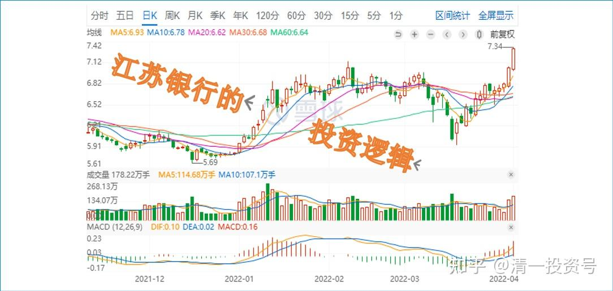
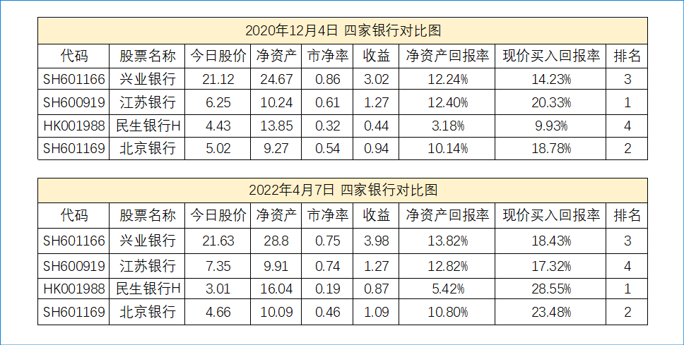
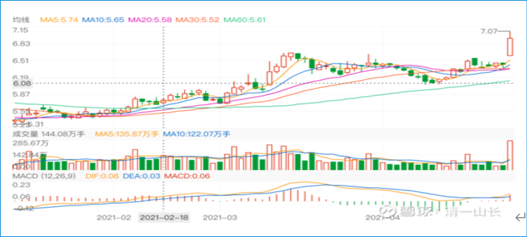
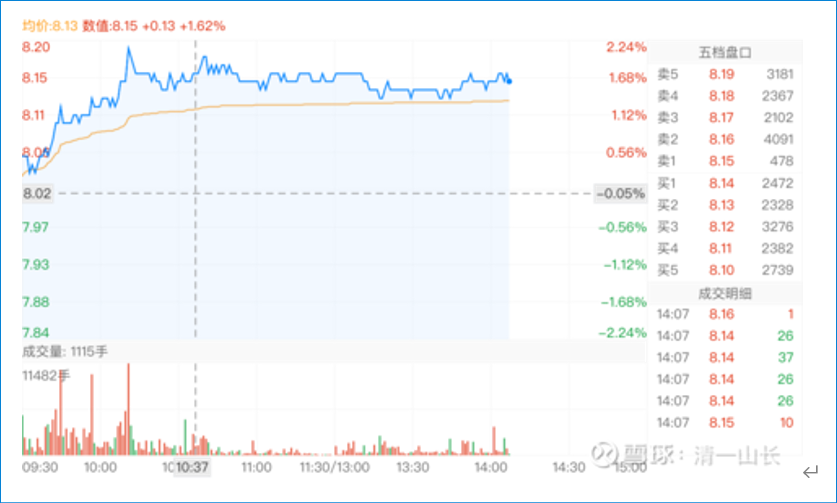

1篇.江苏银行的投资逻辑

清一山长 2020年12月4日～2021年12月29日

**一、为什么看好江苏银行**

1. **投资回报率高；江苏银行所在地经济发展良好**

[雨荷dhx](http://link.zhihu.com/?target=https%3A//xueqiu.com/3870836328%2522%2520%255Ct%2520%2522https%3A//xueqiu.com/u/_blank)[@清一山长：](http://link.zhihu.com/?target=http%3A//xueqiu.com/n/%25E6%25B8%2585%25E4%25B8%2580%25E5%25B1%25B1%25E9%2595%25BF%3Fpaid_mention%3D1%2522%2520%255Ct%2520%2522https%3A//xueqiu.com/u/_blank)

[\[¥200.00\]](http://link.zhihu.com/?target=http%3A//xueqiu.com/n/%25E6%25B8%2585%25E4%25B8%2580%25E5%25B1%25B1%25E9%2595%25BF%3Fpaid_mention%3D1%2522%2520%255Ct%2520%2522https%3A//xueqiu.com/u/_blank) 尊敬的山长老师，近段我在看您的博文，对于您在分析银行投资估值的一个关键项不太清楚，就是"以今天的现价买入后的资产回报率"，这个百分比是用怎样的公式算出来的？恳请山长老师指点，非常感谢！

[清一山长](http://link.zhihu.com/?target=https%3A//xueqiu.com/9310099567%2522%2520%255Ct%2520%2522https%3A//xueqiu.com/u/_blank) 2021 [03-05 12:50](http://link.zhihu.com/?target=https%3A//xueqiu.com/9310099567/173575715%2522%2520%255Ct%2520%2522https%3A//xueqiu.com/u/_blank)

**比如：江苏银行的ROE大约是13%左右。现价是0.72PB。你以现价买入的实际资产回报率，就要用13%除以0.72。这个数字超过了18%。所以，你的这笔投资资产的净资产回报率相当于18%。从指标上看，是很划算的投资。事实上，我推荐买入江苏银行的价格比现价还低10%左右。所以，当时买入的实际资产回报率，相当于20%。**

当然，这是在财务报表和企业正常发展下的数据。目前江苏银行的估值低。是因为市场认为将来不可能维持这个回报。否则，不可能出现这种价格。

估值上看，民生银行H应该比江苏银行更低。

看到没：很简单，小学数学就解决了。投资，真的不需要啥高级的数学公式。

[清一山长](http://link.zhihu.com/?target=https%3A//xueqiu.com/9310099567%2522%2520%255Ct%2520%2522https%3A//xueqiu.com/u/_blank) 2021-[03-05 13:09](http://link.zhihu.com/?target=https%3A//xueqiu.com/9310099567/173577502%2522%2520%255Ct%2520%2522https%3A//xueqiu.com/u/_blank)

3季度末期，北京银行的ROE是8.32%。江苏银行是9.35%。所以，同等资本，江苏银行的产出利润更高。北京银行略低。所以现价PB就更低了，只有0.52倍。现价买入北京银行，这笔投资的回报率，是超过20%的。

**江苏银行，因为所在地是经济发展良好的江苏地区，估值高一点很正常。**不过：北京银行是首善之区，中国的都市。怎么都不会差吧？所以，我的四大银行组合中，也带入了北京银行。2015年，它也是涨幅超过其他银行的银行庄股之一。堪比华夏，我当年就用一股华夏，换了一股招商银行。华夏当年是我赚钱最多的银行股，第二个才是浦发银行，第三个是招商银行，但华夏的指标，比北京要差多了。现在我就根本不碰了。

[雨荷dhx](http://link.zhihu.com/?target=http%3A//xueqiu.com/n/%25E9%259B%25A8%25E8%258D%25B7dhx%2522%2520%255Ct%2520%2522https%3A//xueqiu.com/u/_blank)回复[清一山长](http://link.zhihu.com/?target=http%3A//xueqiu.com/n/%25E6%25B8%2585%25E4%25B8%2580%25E5%25B1%25B1%25E9%2595%25BF%2522%2520%255Ct%2520%2522https%3A//xueqiu.com/u/_blank):

先把小学的问题搞懂，才能上中学，大学，如果能再上山长的商学院就更棒了[献花花]我刚才去把几个银行的都算了一下，华夏银行的的确太差了。这个估值方式好像不太适用于别的行业，比如啤酒，中国中车，它们三季度ROE很低3%-5%，PB都在1.39-1.8,回报率很低。那么可能要从另外的角度灵活分析了。

[清一山长](http://link.zhihu.com/?target=https%3A//xueqiu.com/9310099567%2522%2520%255Ct%2520%2522https%3A//xueqiu.com/u/_blank) 2021- [03-05 14:38](http://link.zhihu.com/?target=https%3A//xueqiu.com/9310099567/173589691%2522%2520%255Ct%2520%2522https%3A//xueqiu.com/u/_blank)回复[雨荷dhx](http://link.zhihu.com/?target=http%3A//xueqiu.com/n/%25E9%259B%25A8%25E8%258D%25B7dhx%2522%2520%255Ct%2520%2522https%3A//xueqiu.com/u/_blank):

现在买中国的银行，可以用小学数学算账，就行了。（这一套，对外国的银行不起作用）

买中车，啤酒，要用中学的水平，不算PB、PE、ROE了，很多人看不懂中学数学。但我在啤酒上却赚得最多，每家啤酒都给了我8位数的盈利，最差的燕京啤酒盈利也超过我原来最赚钱的酒股顺鑫农业了。

买科技股，就要用大学的水平了。不懂，敢装懂，买错就亏钱！[大笑]（我水平还没到大学水平，不敢买科技股）

买今日学堂，要用研究生的水平来估值。不然用小学的指标算账，算PB、PE、ROE，都是体制学校全胜。[俏皮]

[清一山长](http://link.zhihu.com/?target=https%3A//xueqiu.com/9310099567%2522%2520%255Ct%2520%2522https%3A//xueqiu.com/u/_blank) 2021-[03-05 14:54](http://link.zhihu.com/?target=https%3A//xueqiu.com/9310099567/173592017%2522%2520%255Ct%2520%2522https%3A//xueqiu.com/u/_blank)

顺鑫农业的ROE才11.46.，今年三季度更差，5.70%。几乎只是江苏银行的六折。但：别人卖的是酒，当然赚的是真钱。银行赚的大约是假钱[大笑]。

顺鑫农业也是我原来重仓股，不是来黑他的。我买入的价格，只是现价的三分之一。所以还算过得去。现在的价格，我怎么都买不下手，宁肯买银行，啤酒。估值低的，拿在手上放心，睡觉安稳。不担心第二天起床看就爆仓了。

**2. 江苏是最快出清银行坏账的地区；江苏银行当时在底部位置**

@凯宝歌回复@清一山长:

山哥哥，真厉害，记得有个人跟他争论江苏银行，那时候还不知道山哥哥的能力圈，以为山哥哥不擅长银行股，就没有买，事实上是马上打了我的脸,且翻看山哥哥的历史帖子，十几年前就开始买银行股了。

[清一山长](http://link.zhihu.com/?target=https%3A//xueqiu.com/9310099567%2522%2520%255Ct%2520%2522_blank) 2021-[04-29 16:46](http://link.zhihu.com/?target=https%3A//xueqiu.com/9310099567/178642119%2522%2520%255Ct%2520%2522_blank)回复[凯宝歌](http://link.zhihu.com/?target=http%3A//xueqiu.com/n/%25E5%2587%25AF%25E5%25AE%259D%25E6%25AD%258C%2522%2520%255Ct%2520%2522_blank):

我买银行股的时候，你们很多人，还不知道在干什么呢？

2011年，我是5元买的民生银行，2013年，10元多走掉。这是我第一次在一个股上，赚到数百万资产。

2013-2014年，满仓满融银行股，以及中国建筑。轮动操作，除了农业银行赚最少外，只赚了500多万（因为我2015股灾前才进入，别的银行赚够了买它避险的），其他银行股，招商，浦发，兴业，华夏等，全都是每只股都赚了超过千万才走的。从此我买股票，起步就千万了[大笑]。

买江苏银行，跟我杠精的人很多，我不愿多说罢了！

这几年不太碰银行，是因为经济下行，有全球金融危机可能，所以为了避险，我买消费股----酒类。已经赚到了2015年的银行更多的钱。

**现在，该慢慢回银行了---因为银行的坏账快要出清了！**

**我是价值投机，不会死守银行。**不会因为银行赚了钱，就以为除了银行都不能买。不过，按照银行人的观点，我买的酒，都是不符合要求的。中国建筑勉强算合格吧？如果这样想，这几年就赚不到钱的。

**因时而动，学会变通，才是真正的懂投资，做投资！**克服自己的思维惯性，很难，也很好玩！

**江苏银行买的理由，就是很简单:江苏将是最快出清坏账的地区。当时它低价，底部位置，不买她买谁？**

贵阳银行也一样：因为贵阳发展良好，它的资产质量没啥问题。看他坏账覆盖率，300%多。民生现在核销巨大，也才有100%多一点。所以民生还在坑中出不来。

买银行，一定要了解这一点：地雷多不多。如果多，就躲着一点，比如东北！

教各位一点银行投资经！老银粉的十几年的经验！[大笑]

**二、如何投资江苏银行**

**1.银行板块内均衡配置、长期持有**

清一山长 2020-12-04 17:25

$江苏银行(SH600919)$ 前几天，银行股涨了，大家就找我要“银行股”。我都不敢说。怕一说你们就去买，一买就套，一套就骂人。中国的学校都没教“教养”，只教知识去了。所以，有知识没人格［吐血］。幸亏我没说，我要说了，这几天跌了，不知道要出多少怪物了。现在跌了，我就说了。

今天告诉你们我预选的银行股。买了就睡觉去，两年后再看。别学啤酒炒炒炒的。**四只银行股，我认为未来比较有潜力。兴业银行（可惜涨了），江苏银行，民生银行H股，北京银行。如果你平均持仓的话，我认为将来不会亏的，每年拿利息就够了。**我相信将来，10年，20年的，这四家银行，不会都倒闭。最多倒下一家吧？所以你们有足够安全的边际。**江苏银行，因为有利空——配股！所以表现不好。表现不好的股，就可以介入了。表现好的股，反而小小心一点。**比如招商，不是招商不好，而是招商未来涨幅未必超得过这四家。招商将来涨一倍，这四家涨1.5倍不稀奇。因此买这四家，应该回报率会比招商好。下周，应该会出现比本周更好的买入时机。你们自己判断吧。

*四家银行山长2020年12月4日及2022年4月7日的数据对比*

但要注意：GJD不喜欢银行涨[大笑]。所以，持股后，要安心拿着睡觉去。没有买啤酒的兄弟，可以考虑银行四大傻。买了啤酒的，如果喝够了啤酒，也可以买入银行四大傻！拿股息。没喝够的，继续喝啤酒，直到喝够为止。中国建筑当然也可以，说过了，就不多说了。

//[@寂寞守护者](http://link.zhihu.com/?target=http%3A//xueqiu.com/n/%25E5%25AF%2582%25E5%25AF%259E%25E5%25AE%2588%25E6%258A%25A4%25E8%2580%2585%2522%2520%255Ct%2520%2522_blank):回复[@清一山长](http://link.zhihu.com/?target=http%3A//xueqiu.com/n/%25E6%25B8%2585%25E4%25B8%2580%25E5%25B1%25B1%25E9%2595%25BF%2522%2520%255Ct%2520%2522_blank):

没有老师您曾经赚了很多的华夏银行吗？[大小]

清一山长回复[@寂寞守护者](http://link.zhihu.com/?target=http%3A//xueqiu.com/n/%25E5%25AF%2582%25E5%25AF%259E%25E5%25AE%2588%25E6%258A%25A4%25E8%2580%2585%2522%2520%255Ct%2520%2522_blank):2020-12-04 17:53

招商银行我也赚了很多，仅次于华夏。

过去不等于未来。活在当下！关注现实。您知道这些格言吗？[大笑]

//[@借股修行](http://link.zhihu.com/?target=http%3A//xueqiu.com/n/%25E5%2580%259F%25E8%2582%25A1%25E4%25BF%25AE%25E8%25A1%258C%2522%2520%255Ct%2520%2522_blank):回复[@清一山长](http://link.zhihu.com/?target=http%3A//xueqiu.com/n/%25E6%25B8%2585%25E4%25B8%2580%25E5%25B1%25B1%25E9%2595%25BF%2522%2520%255Ct%2520%2522_blank):

山长，请教您：这四家哪一家最有可能倒闭呢？

清一山长回复/[@借股修行](http://link.zhihu.com/?target=http%3A//xueqiu.com/n/%25E5%2580%259F%25E8%2582%25A1%25E4%25BF%25AE%25E8%25A1%258C%2522%2520%255Ct%2520%2522_blank):2020-12-04 17:57

如果我觉得谁有可能倒闭，我就删除掉她。根本就不选。我就是不知道，才赌最多有一家会倒闭，是算概率的，是谁，我肯定不知道！也许20年后，这四家都好好的，你就多赚了一家银行。（要不我说最多倒闭三家，剩下一家够你回本了，这样，如果都活下来了，就算你白赚的，好不？[俏皮]）

**2. 作为准现金股**

[清一山长](http://link.zhihu.com/?target=https%3A//xueqiu.com/9310099567%2522%2520%255Ct%2520%2522https%3A//xueqiu.com/u/_blank) 2021-[01-05 17:37](http://link.zhihu.com/?target=https%3A//xueqiu.com/9310099567/167694097%2522%2520%255Ct%2520%2522https%3A//xueqiu.com/u/_blank)

[$江苏银行(SH600919)$](http://link.zhihu.com/?target=http%3A//xueqiu.com/S/SH600919%2522%2520%255Ct%2520%2522https%3A//xueqiu.com/u/_blank) 相比兴业银行，还是江苏银行好呀。抗跌性现在表现出来了[献花花]。虽然没涨，起码别人不跌了，买银行，这就算安慰了。看谁跌惨了，拿银行的钱救济去？把江苏银行当贷款行，现金宝来使了[捂脸]

**3.低位买入 **

[@闷声发大财吧](http://link.zhihu.com/?target=http%3A//xueqiu.com/n/%25E9%2597%25B7%25E5%25A3%25B0%25E5%258F%2591%25E5%25A4%25A7%25E8%25B4%25A2%25E5%2590%25A7%2522%2520%255Ct%2520%2522https%3A//xueqiu.com/u/_blank)回复[@清一山长](http://link.zhihu.com/?target=http%3A//xueqiu.com/n/%25E6%25B8%2585%25E4%25B8%2580%25E5%25B1%25B1%25E9%2595%25BF%2522%2520%255Ct%2520%2522https%3A//xueqiu.com/u/_blank):

大哥，您是高手，都是买在低位，我怎么买了老是被套？

[清一山长](http://link.zhihu.com/?target=https%3A//xueqiu.com/9310099567%2522%2520%255Ct%2520%2522https%3A//xueqiu.com/u/_blank) 2021-[03-11 13:06](http://link.zhihu.com/?target=https%3A//xueqiu.com/9310099567/174138933%2522%2520%255Ct%2520%2522https%3A//xueqiu.com/u/_blank)

回复[闷声发大财吧](http://link.zhihu.com/?target=http%3A//xueqiu.com/n/%25E9%2597%25B7%25E5%25A3%25B0%25E5%258F%2591%25E5%25A4%25A7%25E8%25B4%25A2%25E5%2590%25A7%2522%2520%255Ct%2520%2522https%3A//xueqiu.com/u/_blank):

伙计，您正好弄错了。并不是我“总是买在低位”。而是我“总是到了低位才敢买股”。您看江苏银行我的买点？不就是上市以来最低的位置吗？都跌到腰斩还多了，而且已经检验过两次是底部了。这才敢买进去，才敢告诉你们可以买了。你们不敢买，不愿意跟，不就是想等涨了再说吗？现在涨了，你敢跟不？我不敢，只敢持股[大笑]

你们都喜欢高位追股，不套牢你们套谁？要套我吗？主力先亏死自己再说！我陪绑算了。[俏皮]

**4. 同一板块内轮动——学生抄作业：兴业银行换为江苏银行**

[@Iroh2019](http://link.zhihu.com/?target=http%3A//xueqiu.com/n/Iroh2019%2522%2520%255Ct%2520%2522https%3A//xueqiu.com/u/_blank)回复[@清一山长](http://link.zhihu.com/?target=http%3A//xueqiu.com/n/%25E6%25B8%2585%25E4%25B8%2580%25E5%25B1%25B1%25E9%2595%25BF%2522%2520%255Ct%2520%2522https%3A//xueqiu.com/u/_blank):

山长去年推荐好几次江苏银行，我就把兴业换江苏了。感谢山长！

[清一山长](http://link.zhihu.com/?target=https%3A//xueqiu.com/9310099567%2522%2520%255Ct%2520%2522https%3A//xueqiu.com/u/_blank) 2021- [03-11 14:53](http://link.zhihu.com/?target=https%3A//xueqiu.com/9310099567/174153902%2522%2520%255Ct%2520%2522https%3A//xueqiu.com/u/_blank)回复[Iroh2019](http://link.zhihu.com/?target=http%3A//xueqiu.com/n/Iroh2019%2522%2520%255Ct%2520%2522https%3A//xueqiu.com/u/_blank):

我推荐的四大银行组合，第一名是兴业银行，第二名才是江苏银行。你怎么这样抄作业[捂脸]？卖兴业，买江苏？兴业涨得也不错。

[Iroh2019](http://link.zhihu.com/?target=http%3A//xueqiu.com/n/Iroh2019%2522%2520%255Ct%2520%2522https%3A//xueqiu.com/u/_blank)回复[清一山长](http://link.zhihu.com/?target=http%3A//xueqiu.com/n/%25E6%25B8%2585%25E4%25B8%2580%25E5%25B1%25B1%25E9%2595%25BF%2522%2520%255Ct%2520%2522https%3A//xueqiu.com/u/_blank):

[捂脸]山长，兴业是24+卖的，江苏现在浮盈14%，目前看作业抄的还不是太low吧！

[清一山长](http://link.zhihu.com/?target=https%3A//xueqiu.com/9310099567%2522%2520%255Ct%2520%2522https%3A//xueqiu.com/u/_blank) 2021-[03-11 15:03](http://link.zhihu.com/?target=https%3A//xueqiu.com/9310099567/174155250%2522%2520%255Ct%2520%2522https%3A//xueqiu.com/u/_blank)回复[Iroh2019](http://link.zhihu.com/?target=http%3A//xueqiu.com/n/Iroh2019%2522%2520%255Ct%2520%2522https%3A//xueqiu.com/u/_blank):

板块内轮动[献花花]。2015年，我就是这样干的。啤酒也是[干杯]

**5. 同一板块内轮动——江苏银行换为贵州银行**

清一山长 2021-[04-29 11:03](http://link.zhihu.com/?target=https%3A//xueqiu.com/9310099567/178594856%2522%2520%255Ct%2520%2522_blank)

[$江苏银行(SH600919)$](http://link.zhihu.com/?target=http%3A//xueqiu.com/S/SH600919%2522%2520%255Ct%2520%2522_blank) 你是银行呀？怎么能这样涨的。别把自己当赛道股了好不好？最好每天乖乖的织布。怎么能出来胡乱秀涨停呢？太不稳重了！敢这样再乱涨，我就对你不客气了---直接把你卖到堂子里去！

[清一山长](http://link.zhihu.com/?target=https%3A//xueqiu.com/9310099567%2522%2520%255Ct%2520%2522_blank) [修改于2021-04-29 14:21](http://link.zhihu.com/?target=https%3A//xueqiu.com/9310099567/178618233%2522%2520%255Ct%2520%2522_blank)

[$贵阳银行(SH601997)$](http://link.zhihu.com/?target=http%3A//xueqiu.com/S/SH601997%2522%2520%255Ct%2520%2522_blank) **今天首次买入贵阳银行。是用卖了一多半的江苏银行的钱来换的。**为何这样做呢？我就是赌一把玩[大笑]。我赌江苏银行是一日游。今天涨这么多，是给我面子了。查看我的持仓成本是5.41元，基本上是底部拿到手的。说明上次的持仓逻辑没问题。今年最高6.90元卖出，我很满意了。虽然钱不多，才27%。不过比中国建筑要强多了。虽然我看年报，还不如中国建筑呢。就一季报强一点。贵阳银行其实最近的负面评价很多，玩啥定向增发，摊薄老股东利润了。昨天还是4字头的PE，今天就变5字头了。还要分享老股东的红利，导致分红也减少了。还有——居然他的十大大股东，还公报减持！证明大股东都不看好。这种股怎么能要呢？还有就是要暴雷了等等，看的人怕怕的。**我也怕，所以就是赌一把，不敢推荐各位跟买，你们买破五的中国建筑就好了----安全度高。**

我买入，是要赌贵阳银行的年报，明天不暴雷。万一它还报个喜，像今天的江苏银行一样，我就赚了。如果真爆了雷，我就----卧倒装死算了。我心里，还可以美美的想：其实被套住没啥的。现在一批贵阳的老股东，大股东增发，他们拿的批发价，还是10.27元。把钱都给贵阳银行充实资本公积金了。我一个小股东，拿到手的零售价，才8.13元。我赚了！贵阳银行以后不能让他们赔钱吧？等他们高价拿的都赚钱了，我也赚了！我就这样想的。于是，就算暴雷了，我也不担心，就抱着亏损的贵阳银行，继续好好的睡觉算了！明天，是吃大饼，还是吃大雷呢？不知道了。你们就静静的等看我的笑话吧！反正死不了人。最近很多朋友都掉坑，我也主动找个坑来掉！跟朋友同甘共苦！[加油]

