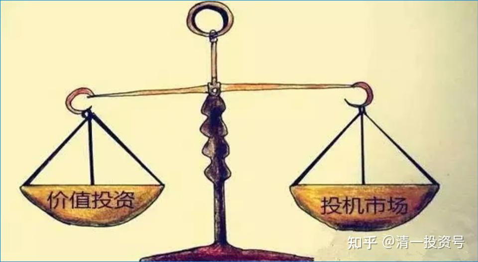

2篇.2015年银行股投资回顾——“价值投机法”之示范（上）

清一山长 2015年4月13日～2015年9月16日

**一、建立投资原则，锁定安全边际**

清一山长2015-04-13 08:29

很欣赏**尔的投资态度，以及对全通30元都不碰的原则。我是93年入市的老股民，还好，目前还没有亏损的记忆。上周用【8元多买的兴业20元卖掉】换了浦发、招商，依旧满仓加融资持有银行股。

**有原则的投资者才能持续地赚钱。有些钱是不能赚的，不符合自己投资原则赚来的钱，也会因为没有尊重投资原则而最终失去！因此聪明和成熟的投资者，永远只赚自己原则之内的钱。建立投资原则，锁定安全边际，是每一个真正的投资者最重要的事情。**（一点小建议：看**尔兄的投资经历，基本上都在A股，是不是以后也关注一下港股和海外市场？比如08年我赚了接近十倍以后，躲掉巨大的损失，就是高点转到B股，买了万科B，中集B，以及威孚高科B），另外在10年5元重仓了民生。这些投资最终锁定了利润。**因此，我觉得在A股疯狂的时候，跨市场套利是一个规避风险的好办法。**今年一直在把赚的利润逐步转往港股投资，上周突然获得大量收益（不过我很不开心涨这么快）。

**二、永远坚持价值第一原则，投机是兼顾的，不期待的**

清一山长2015-04-14 18:01 回复@草帽路飞:

我的操作跟你有一些相同之处：我昨天下午也卖掉了港股的全部招商银行，不过全部换入了农行H，我认为港股农行明显低估。至于招商A是否进一步增仓，要看明天华夏是否上涨，两者差距小于2元，就卖掉华夏换入招商A。招商A从今天的走势来看，明显是故意压盘，大股东还不希望他上涨。华夏倒有点想表现了。

清一山长2015-04-15 20:05

$华夏银行(SH600015)$ 一股华夏换一股招商？看样子很有可能。@云蒙 。

操作记录：今天，我已经按计划，减掉了总仓位超过10%的筹码了。回来复盘，看华夏的走势和成交情况，觉得我今天涨停价放空部分华夏，可能是个错误的决策（这些筹码是12月11日捡进来的廉价货）。因为华夏目前控盘极为良好（盘子不可思议的轻），今天是他近期的第一个涨停，按道理是筹码最不稳定的一天，但也只成交了41亿元，但盘子与之差不多的北京，今天却成交56亿元。因此，该股很奇怪地拉升，快接近招行的价格了，似乎不能用常理去推断涨幅，余下的60%的华夏，就准备按兵不动，观察后再操作。**另外，已经出货的部分，也不要紧：执行价值投资原则，这两天择机买入招商银行即可。如果一股华夏差不多换一股招商，我就赚大了。如果A股不调整，这些资金还掉融资备用，或者把资金用于撤离A股，去买港股农行，都是更有效率的做法。永远坚持价值第一原则，投机是兼顾的，不期待的。**

**三、忘记价格，关注价值**

清一山长2015-08-24 22:15

$招商银行(03968)$ 今天对投资者来说是一个非常难过的日子，我的账户也录得了7月8日来最大的跌幅。**市值损失惨重吗，但是一股未少，我心依然安定，但估计很多人今天睡不着。**因此，今天站出来说说话，希望大家厘清思路，不要在恐慌下乱做事，好好睡觉。

我今天买入了部分兴业，12.88元，北京7.23-7.25元。这些资金是我前期在18-20.79元抛出招商银行换来的资金。而这些招商，是我在前期兴业冲20元，而招商此次不涨的时候卖掉兴业买的招商，我当时还以为错过兴业了，没想到今天全买回来了。**我买入股票，并非预测市场到底了。也许兴业还会跌倒10元去（相当于去年的8元的极端价格），我不能肯定，我只是肯定这个价格（13元左右的兴业）是我很愿意拥有的价格。**我会抓紧这些股份过冬的，就算是跌到8元我也不会卖掉的。测算了一下，兴业跌到8元，我才会爆仓。不过我可以卖出港股（没有融资）来补充。因此安全边际还比较大。

以下是我在内部学员群的发言，供大家参考。**不要恐惧，而要寻找市场的机会（我发现这段时间是“好主意比钱多的时候”），所以，现在有子弹，就是伏击的最好时机。**我今天还关注了复兴国际，这个郭广昌说20元并不贵的股票，也许现在11元的投资机会，是很有诱惑力的，观察中。

内部发言：**今天大家应该知道我的“忘记价格，关注价值”格言有多重要了？只要你的心是关注价格的，今天想死的心都有。假如你是关注内在价值的，你不会在乎什么的，反正你持有的股份没有想卖掉的。**你居住的住房你绝对不会因为邻居卖价很低就认为你破产了。因为你持有的公司还在继续盈利，你没有理由相信这些泡泡的起伏，会影响公司的经营。最起码，你会知道，兴业，招商，以及浦发，这些企业最大的老板，他们不会预期还会跌就“减持”，他们要的是权利，最终赚钱的一定是他们。

当你认为你能够预测市场的时候，你就是神！**我买入的时候，并不预测未来会涨，只是我觉的便宜。当我卖出部分股份的时候，并不是我知道未来会跌，只是我希望安全边际足够高一些，另外我总是希望手上有备用的资金而已。**比如前期我18-20元期间卖出超过百万股招商的理由很简单：招商相对浦发和兴业来说太高了，我不愿继续持有高价资产。但是卖出后我并未立即买进兴业等，而是等等看看是否有机会买入更低的价格（当时想法很简单，就算是A股继续涨，不给我机会，港股还有便宜货可以捡的），因此现在我还有钱买入（今天兴业最低12.88元买进）。我准备好了，他就算继续跌到10元我也接受，留一批子弹等他到十元（我永远不会把钱用完）。然后，就只能装死了。

**其实，投资是一场马拉松，我们不要用短跑的态度来看。因此，借钱炒股是一个坏习惯，就算你赢十次，但输一次就光了。千万要注意风控。**

重新回顾我的财富课，今天面临的问题，我课上早就讲过的。牛市来的太快，你们都忘掉了投资的要诀，不自主的去“炒股”去了。**天天关注自己账面资产涨跌的人，注定是很苦的。**而且，这些人绝对不是投资者。

**四、跨市场套利——重视港股的投资机会**

清一山长2015-09-16 18:50

通告一下：前期低价进的北京，已经在9元以上全部出清。浦发、兴业，在15元以上出掉了融资部分仓位，保留了自有资金仓位。招行由于比价偏高，就基本上出完了，留了十万股作纪念，成本负N元了。继续冲高，这些底货也会卖掉的，换中信H更划算。还留有部分现金备用。**我主要在等港股的投资机会。港股就像两年前的A股，到处是黄金。**

