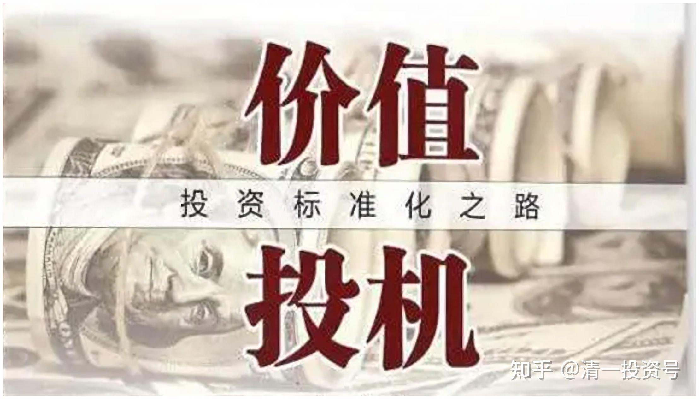

3篇.2015年银行股投资回顾——“价值投机法”之示范（下）

清一山长 2015年9月26日～2015年12月2日

** 一、学大股东长期投资模式，对普通投资者是最有利的**

清一山长2015-09-26 22:11

$中国光大银行(06818)$ **学大股东长期投资模式，选择认为好的股票买入后稳定持有十年、二十年。这样做对我们这些普通投资者是最有利的。**对中国的银行股没信心的人，可以看最新的增发情况：光大银行H定向增发40亿股，每股价格4.8962元，现在价格3.4元。这段时间我看着光大很眼馋，想买可是一直停牌。去年2元多较大仓位买的A股，今年在4～5元左右就全出了，正指望在港股买回来呢！今天得到消息：原来是增发停牌。大股东都敢4.89元批发价买股票，你零售价花3.4元买了还唧唧歪歪的不放心。**是不是小股民的毛病——太贱了？总想价格高一点再买心里才踏实吗？**重庆银行大股东增发价格是7元，现在价格5元多，我们当小股民的其实机会比大股东要好很多的，该知足了。不知道下周开始光大会如何表现。

按道理增厚了净资产是好事，可某些小股民会认为摊薄了每股收益是坏事。在心情不好的情况下，什么事情都有可能解读为利空。我依然持有较大仓位的银行股，不过因为港股有很多比银行还便宜的股票，正在慢慢买入中。不过不敢像银行一样大量持仓，因为小股票进出没有银行股这么方便。另外，中国经济情况似乎正在下滑，要小心可能的经济危机，不建议融资买入，防止风险。**本金买股，反正公司好的话，是可以死扛下去，长期看不会亏的。融资就不行了，来一个金融危机的恐慌，多年的资本积累就玩完了。**

**二、在中国市场，比投机和价值投资更好的方法，是“价值投机法”**

清一山长2015-12-02 15:55

$浦发银行(SH600000)$ 今天很悲哀：不得不与心爱的浦发道别了：今天挂单19.89～19.99元，居然被不知名的土豪，把我的浦发仓位全抢光了！只留了纪念仓位。很怀念浦发这样的好银行，伤心过度的话，就过两天，买入16元的招行H，来安慰一下自己拥有好银行的心理。不过由于账户还有不少兴业持仓，失去了浦发还不是很失落。如果不是在意银行品牌的高大上，卖掉浦发的头寸，就买中信H和光大H，走走灰姑娘银行的路线好了。

另外，今天也帮我家两个孩子静慧和钟瑞，清空了他们一年前以9.1元买入的4000股浦发，赚了四万多元。两孩子今年18岁，计划开自己的投资账户，开始他们的投资生涯了。目前这一笔投资，算是他们的人生投资第一单，在我手上，还算是有个很不错的结果。现在交棒了，加上18岁我送给他们的一小笔投资账户启动资金，儿子已经获得了招行的金葵花客户资格。以后好好投资，他们很快就会靠自己努力，成为这个社会中少数派的“财富自由人”。

我的两个孩子，用的账户，是我在管理的老人养老基金账户。**这个账户，去年到今天一年半左右时间，总共增值了600%左右，主要得益于这个账户虽然一路满仓，但我做了几个套利：**

**一个是我根据市场情况，做了几个关键性的换股活动，一路满仓走来的**，主要是半仓的中国建筑去年赚了一倍多。以及去年主仓是光大银行，光大先涨，就换了最不涨的兴业，兴业涨后，又换了当时价格较低的招商和浦发。招商20元，又卖掉换了兴业，就这几次操作，一年来换股并不多，有时几个月都不看一下这个账户的。

**另外，盈利较高，还因为去年下半年到今年上半年用了杠杆，比例很低，只有当时账户总资产的一半左右。**也就是说一百万自有净资产，只用了50万的融资额度，保障该账户的安全系数较高（毕竟是养老账户）。又正好在股灾前一段时间减仓了中建，多数仓位换了招行持有，招行担任救灾总指挥，18～20元上方减持后，14～16元左右买了兴业。因此，今年的股灾，对这个账户的影响几乎没有，账面收益还比较好，**几个月前就全部清掉了杠杆，开始“相对高位避险稳健法投资原则”，目前是逐步买入低估的港股。**

**但是，我为了给两个孩子做好价值投资示范，我就没有鼓励他们，学我的短线操作切换（我称这种手法是“价值投机法”），只是告诉他们：9.1元买进浦发，是不可能吃亏的，让他们实行不动如山的“傻猫投资法”都可以盈利。**除非他们有明确的理由，否则就不要换股。他们自己也可以操作账户的，但孩子一直没有动，今天，终于取得了耐心投资的好回报。由于钟瑞已经满了18岁，要开设自己的投资账户了，这笔钱正好涨到了可以取出的最佳时机和价位，今天乘机卖出。两孩子一个人投资两万元，今年总收益是44339元。这个业绩，超过大多数基金经理了。“**傻猫投资法**”**的好处就是：免管理费。而且几乎肯定能够跑赢股指。不需要去找什么专家——找到最好的企业让企业帮你打工，就是最好的投资法则。**

今天的另外一笔操作，就是9元多卖掉了富力地产（前期我买入的时候公布过消息的），买入了2.53元的华宝国际。我准备长久投资，除非市场故意错判，让我不得不换股。比如富力从我几周前买入的7.8元，涨到现在9元多，我觉得可以卖掉了。而华宝却从当时的3元多，跌到今天的2.5元，我换股的意愿被大大增强。IB上的港股富力，换的是建业地产，我认为目前相对低估了，就把涨了20-30%的其他地产股换了它，继续傻傻地持有。

**希望我公布的这些操作，能够让你明白，在中国市场，比投机和价值投资更好的方法，是“价值投机法”。可以保证稳健的收益，又可以获得超额的回报，且不需要天天盯盘，有空时看看即可。**

**参考文章：**

[1篇.银行股的投资逻辑](https://zhuanlan.zhihu.com/p/489850963)

[2篇.江苏银行的投资逻辑](https://zhuanlan.zhihu.com/p/494495300)

[3篇.2015年银行股投资回顾——“价值投机法”之示范（上）](https://zhuanlan.zhihu.com/p/502367347)

