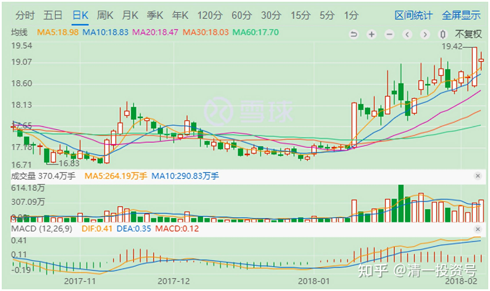
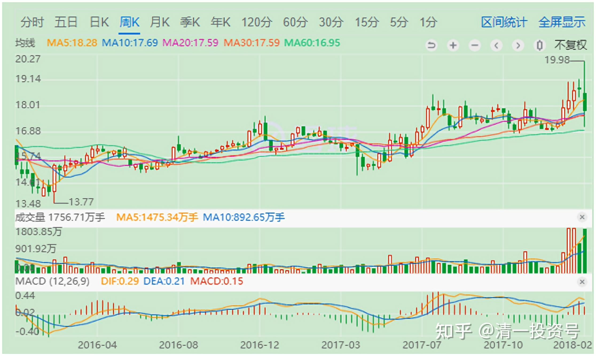
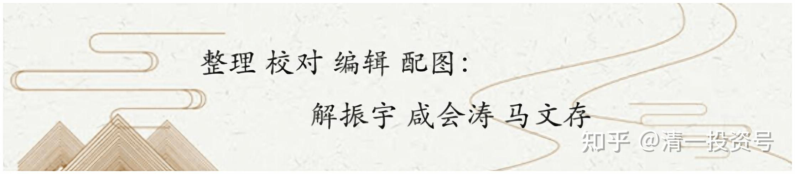

4篇.价值投机派的投资思路与心态——兴业银行的实操分析

清一山长 2018年2月6日～4月26日

**一、2018年“兴业银行”的卖出**

[清一山长](http://link.zhihu.com/?target=http%3A//xueqiu.com/n/%25E6%25B8%2585%25E4%25B8%2580%25E5%25B1%25B1%25E9%2595%25BF) [2018-02-06 15:5](http://link.zhihu.com/?target=http%3A//xueqiu.com/9310099567/179924902)0

$兴业银行(SH601166)$今天以19.12元，卖出了几乎全部的兴业银行，有些是持有较长时间的老仓，成本很低。其中还有相当部分的头寸，是最近在18元用融资高价买入的。看到已经赚钱了，就应该走了。

理由一：这个价格，已经差不多是数年来的新高了，我很满足了。

理由二：兴业如果不调整，我可以买入其他港股银行来补充银行股的头寸，不用担心踏空。比如我不认为民生H就比兴业A更不值钱。用19元多的兴业A，换7元左右的民生H，我觉得是一笔很划算的买卖。

理由三：如果兴业调整，我会在18元下方，考虑再度买入。

理由四：君子不立危墙之下，如果全球金融震荡，A股产生波动也难免。国家队继续拉已经到了前期高位的银行股护盘，兴业继续创新高，似乎不太理智。所以我这种小游击队，今天就先走一步，让强大的国家队来断后。**等国际局面稳定一些后，主力部队重新杀回来的时候，我再跟上大队继续打仗**[笑]**。就算是因为我现在离队，在A股实在找不到让我效力的地方，我就去香港市场，跟外国鬼子打游击去**[加油]**。**

所以，综合各种因素，今天我走了。谢谢兴业，也谢谢各位长久陪伴我的朋友。不是不看好兴业，只是投机本性，导致我难以面对软弱[哭泣]。**希望今天买了我卖掉股票的人会赚钱。**我有一笔卖单，是尾盘用一单就打了1M的货出去，我一回车，发送卖出指令，半秒钟就被收走了，1M的兴业就消失得无影无踪，不知谁买走了。这可是我收集了很久的货呀？谁这么大的实力，吓死我了[捂脸]。

————————

道琼斯股指，继上一交易日狂跌660点以后，今天继续狂跌1175点，几乎是上一个交易日的一倍。这种巨大的跌幅，引起了全世界金融市场的恐慌。香港恒生指数，也狂跌了1401点。**今天是“看股价吃饭”人的末日。不过也请大家自我找乐：你们账上一股都没有少，别去看资金，数数股份数就知道了，不用担心。**

我账上还多了一批现金备用。看今晚道指的表现吧（我先睡，明天有空再看）。如果继续大跌，我看港、A两个市场，起码暂时是难以独善其身的。也好，洗一洗，更健康。我会在跌幅加剧的时候再度买入的。

**卖出是为了买入，不是为了拿钱去存银行**[加油]**。我随时准备再度出手买进，接飞刀主动套牢。**

@doom0675回复@清一山长:

1M市值的可能性更大。1M股票的话，每年吃股息就可以追求诗和远方了。

[清一山长](http://link.zhihu.com/?target=http%3A//xueqiu.com/n/%25E6%25B8%2585%25E4%25B8%2580%25E5%25B1%25B1%25E9%2595%25BF) 2018-[02-06 17:4](http://link.zhihu.com/?target=http%3A//xueqiu.com/9310099567/179924902)0回复doom0675:

别小看1M的市值，也一样可以拥有1M股票的远方和诗[笑]。比如拿住最低估的银行，靠分红足够你在清迈这样的国际城市，过上远方的诗意生活了，就像我一样[笑]。

另外，拿住1M的高息仙股，可以同时满足股数和市值的条件[笑]。

说明：在清迈，一年如果有25万泰铢可用（1M内银行股的分红水平），就基本够用了，清迈人的年薪，才十几万呢!租个小公寓，一个月一千多泰铢。生活费（食物部分）一天一百泰铢有余了。省一点的像我，一餐去市场买上20泰铢的饭菜，也够了。

我的生活费很低，吃的比泰国工人更少。就是私家游泳池的开支太大，还分为室外和室内游泳池[割肉],光电费就超过我的饭费若干倍了[哭泣]，关键还是我几乎就不游泳，特浪费。但女儿喜欢游，客人朋友有时会来游，有啥办法呢！只好维持下去了。

@阿水回复@清一山长:

1M = ？ ，请教下！

[清一山长](http://link.zhihu.com/?target=http%3A//xueqiu.com/n/%25E6%25B8%2585%25E4%25B8%2580%25E5%25B1%25B1%25E9%2595%25BF) 2018-[02-06 17:54](http://link.zhihu.com/?target=http%3A//xueqiu.com/9310099567/179924902)回复阿水:

你们的数学，难道是体育老师教的吗[笑]？内容中已经有提示了，自己推算一下就出来了。

应用题：假如X的5%（1M的分红利息）是25万泰铢，5万人民币，请问X是多少？这种题目，应该是几年级的数学？

风险提示:小学数学必须学好，至少可以考90分，才能进股市！[加油]

@李鹤展回复@清一山长:

价值投资在三种情况卖出手中的股票，请问您今天卖出属于哪一种？而且，短期股市是不可预测的，您怎么知道，明天股市就一定会下跌呢？

[清一山长](http://link.zhihu.com/?target=http%3A//xueqiu.com/n/%25E6%25B8%2585%25E4%25B8%2580%25E5%25B1%25B1%25E9%2595%25BF) 2018-[02-06 18:34](http://link.zhihu.com/?target=http%3A//xueqiu.com/9310099567/179924902)回复李鹤展:

谁说我预测明天下跌了？

我预祝买我股的人明天都赚，我承认我持股心态不好。明天跌了不是我干的。涨了是证明我担心多余，我买单就是了[笑]。

另外，谁说我是价投的？你才价投呢！俺是一个偷鸡的[俏皮]。

@李-LYT回复@清一山长:

说实话，我很喜欢楼主真人真话，虽然我六成仓位在兴业，但是也想说楼主操作没问题，一是有利润，二是国际股市前景不明，就算好了，港股也有低估银行，只是不能打新，按楼主资金量，打新无意义。后市我看多兴业。

[清一山长](http://link.zhihu.com/?target=http%3A//xueqiu.com/n/%25E6%25B8%2585%25E4%25B8%2580%25E5%25B1%25B1%25E9%2595%25BF) 2018-[02-07 10:](http://link.zhihu.com/?target=http%3A//xueqiu.com/9310099567/179924902)32回复李-LYT:

明明兴业卖亏了，还得到您的安慰，真是好心人。祝福好人有好报[赞]。

@奕生回复@清一山长:

后悔吗？

[清一山长](http://link.zhihu.com/?target=http%3A//xueqiu.com/n/%25E6%25B8%2585%25E4%25B8%2580%25E5%25B1%25B1%25E9%2595%25BF) 2018-[02-07 10:](http://link.zhihu.com/?target=http%3A//xueqiu.com/9310099567/179924902)52回复奕生:

我习惯了！总是卖了涨，买了跌。没啥感觉了。涨了好，祝福。关键是：只要您高兴就好！

@明达野老回复@高处看海:

**资本市场想灭掉山长这类“超级狡猾派”商人，我看太不容易了**，我劝主力资金趁早打消这个念头。像巴菲特、李嘉诚这类大鳄等也都是溜得最快的，风险还没来，他们都早出脱差不多了，**他们好像也从不想着把市场每一分钱都赚到手，但是却“一不小心”成为了首富**[鼓鼓掌]。

[清一山长](http://link.zhihu.com/?target=http%3A//xueqiu.com/n/%25E6%25B8%2585%25E4%25B8%2580%25E5%25B1%25B1%25E9%2595%25BF) 2018-[02-07 15:](http://link.zhihu.com/?target=http%3A//xueqiu.com/9310099567/179924902)54回复明达野老:

**他们并不想灭我，只想灭贪心的人，愚蠢的人，有钱的人**[赚大了]。假如真得想灭我，他们的损失肯定比我的损失大。因为他们是穿皮鞋的，犯不着跟我这个穿草鞋的人打架[笑]。

**二、2018年“兴业银行”的再次买入**

[清一山长](http://link.zhihu.com/?target=http%3A//xueqiu.com/n/%25E6%25B8%2585%25E4%25B8%2580%25E5%25B1%25B1%25E9%2595%25BF) [2018-04-26 11:5](http://link.zhihu.com/?target=http%3A//xueqiu.com/9310099567/179924902)3

今天继续买进20万股兴业银行，价格是16.03买入，总持仓已经陆续地买回了三分之一左右份额。**如果兴业继续跌，我就继续买，直到恢复原有仓位为止。相比民生和华夏，还是觉得今天的兴业贵了一点。**不过，就算我当初没卖掉好吧，算我当初一直守仓了好吧！（自我安慰一会，为自己的精算能力不够，敬业精神不佳，找找客观理由[滴汗]）

