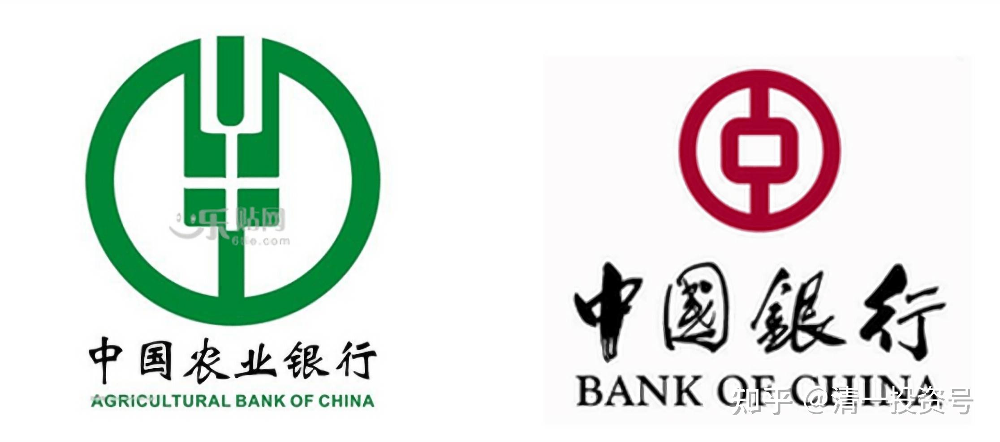
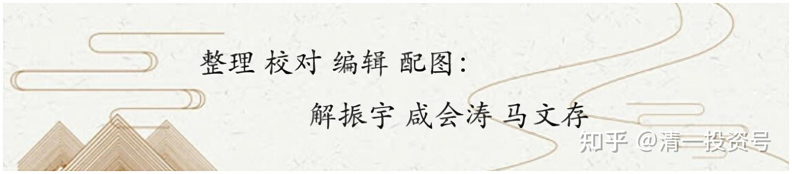

5篇.买入农业银行（H股）、中国银行（H股）的投资逻辑

清一山长 2020年7月10日～7月11日

2020-07-10 16:17:22

清一山长：

$中国银行(03988)$ 今天意想不到会大跌，看兴业银行等都跌惨了，这个美好的日子（我认为大跌是美好的日子，大涨也是），不纪念一下实在不够意思。尾盘这段时间，就花了几百万元，买了俩只最烂的四大行H股,$农业银行(01288)$ ，入手价格2.96元;中国银行，入手价2.81元。

理由：银行，四大行，跌得实在不对劲。特别是农行，复权价都跌到前期平台了，把中国牛市的涨幅全都抹光了，看除权价就更难看了；中国银行，更是代表中国人的脸面，被外资这样打脸，我们有点爱国心的人心中也不好过，就出来，买点四大行，给“中国牛”助助威罢了。虽然我也不知道中国牛在哪里，前几天吹“牛”的大V们，今天在买买买吗？

换个角色来想：如果我是美国人，肯定不乐意中国股市走牛，绝对要利用香港市场来影响中国市场。他们在香港有很多的手段可以使用——牛熊证、期权等等。其中，打压中国的银行是最好的选项，想把中国股市玩残，把国人对牛市的幻想打消，最好的办法，就要拿中国的代表性银行下手，比如四大行等下手。成交单上，农行总共分了八笔成交，平均每笔成交十万股左右，显然不是散户作为。

这样子，肯定就是不能买银行了，注定被美国人打压的。**不过，可以再反过来想呀？中国想要获得世界的金融发言权，就必须让银行系统获得信任。**就算保不了普通的银行，一定会不惜代价保四大行。**如果要有中国牛市，也会拉四大行的。所以，买四大行，可以像买保险一样，不用担心会破产的。我赌中国赢。所以买中国银行！**

下周会再跌吗？我就再买[大笑]。如果被套牢了，我就假装自己是价值投资，是来吃股息的人，守住等明年再说。

如果短期内就涨了，我就学投机客，只要市场给了20～30%利润，我卖了就跑。然后拿着资金等下一次机会。

晕娜:回复@就不帅:

依我看，中建股价到了你说的涨幅，山兄应该会减仓，但，不会清仓。

我瞎猜，山兄会把盈利留作底仓，这钱反正也是白捡的，即便出现较大回撤，也不太心疼。

清一山长2020-07-10 16:55:49回复@晕娜:

如果中建慢慢涨，稳定的上涨，涨了50%我都不会卖。但涨快了，涨急了，我会出掉20～30%的仓位。**短期大涨了，涨到我认为买其他股收益比它更大了，也会跑掉。**（2016年年底，11.35几乎卖完全部的中建，其实是看到她涨了一倍多，但它五元时，三元多的中国银行，依然停在原地不动，相对价格中建就太高了，所以就全换了，没想到歪打正着，后来中建就跌了，中银又涨了一波，纯属我运气好罢了）。

**只要我看中的股票跌急了，我都会额外加码买进一些仓位，多吃一点，涨了就减掉一点，保持余地。**一般这种灵活配置仓位，不超过20～30%。这些仓位，是用来做T投机的，可以明显的增加持仓收益。

以后中建作为主仓，不会轻易全部卖出的，不像原来对待中建的态度（原来的主仓是啤酒，我也没有完全卖出，一直在增增减减的，要不就做T逐步减低成本，T失败了，就逐步退出），中建未来取代啤酒，成为长持的主仓。时间可能漫长（除非啤酒涨太快）。**也可以两个类别一起走。只要谁涨多了，我就会换股的。总仓位，保持平衡状态，永远拥有一批低估的股票拿分红就好。**

晕娜:回复@清一山长:

中国未来会不会也进入零利率时代，现在还真不好说，有危机意识，总不是坏事。

资产荒，应该会很快到来。长期投资持有优质资产，是正确的选择。山兄，您是大V，清粉多，这些话，您多说说吧！有备无患，将来清粉会感激您的。

清一山长2020-07-10 22:08:37回复@晕娜:

**如果真出现资产荒，大杠杆的垄断企业就特别值得投资。**它们原来借了很多钱，买了很多的资产，零利率、资产荒时代，就正好巩固了他们的市场地位。比如银行业，有家企业跟建筑有关——中国建材。它大量借钱，现在正是现金流入时期，实际资产价值会快速提升。这种股，用来作为保值的利器，也许不比中建差。特别在低估的时候，可能空间更大。当然，具体如何，就只能等待市场给答案了。

对了，突然想起你是2014年从农业银行换的中建。过去六年买中建收益赢了农行。**难说风水轮流转，说不定农行又会赶上来（赚大了）。我看中它，是因为它的拨备率超高，大银行中它的拨备率最高，比别家多一倍了。我大胆猜想是利润多了没处放。它是真赚到钱了。拨备低的银行，都不敢碰，怕赚的是假钱。**

清一山长：2020-07-11 10:35:06

说明一下：**我买银行股是投机。只是基于基本价值的投机罢了。如果赌输了，我就拿股息。赌赢了（涨了）就卖出，没准备长持。**这两个股，现在的股价都在低位运行。特别农行，跌到本轮拉升前的平台价位。

**如果发生中美金融对搏的话，四大行是必选的品种，香港就是古时候的中原，是必经的战场，很惨烈，但也有机会捡点战利品。**如果未来市场有拉升动作，它会涨。如果没有，大概率也不会跌。我猜外资也会这样想。所以算起来赔率比较高，算是有底线的赌博罢了，没有考虑长期价值。

长期投资，还是拿中建靠得住。2015年我持有的股份行大涨，卖掉一些后就买了没涨的农行来避险。后来闹了股灾，就找机会卖掉农行，赚了500多万。从此就再也没回头买农行。昨天只是拿赚到的农行一半的利润，来玩玩投机的游戏罢了。中银也是用原来赚了钱的一部分利润来买入的。给昨天跌回原地比较泄气的四大行银粉，打打气[笑]。

参考链接：

[清一投资号：1篇.银行股的投资逻辑](https://zhuanlan.zhihu.com/p/489850963)（整理文）

[清一投资号：3篇.2015年银行股投资回顾——“价值投机法”之示范（上）](https://zhuanlan.zhihu.com/p/502367347)（整理文）

[清一投资号：4篇.2015年银行股投资回顾——“价值投机法”之示范（下）](https://zhuanlan.zhihu.com/p/506271066)（整理文）

[清一投资号：5篇.价值投机派的投资思路与心态——兴业银行的实操分析](https://zhuanlan.zhihu.com/p/509443218)（整理文）

