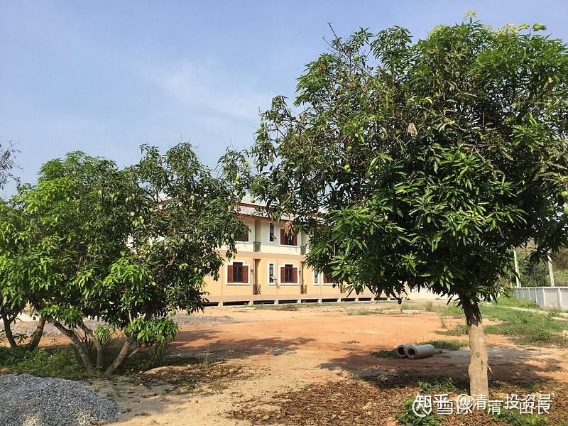

[原雪球专栏](https://zhuanlan.zhihu.com/p/569432171/edit)[142](http://link.zhihu.com/?target=https%3A//xueqiu.com/9310099567/177112317)篇.只学了一年英文的学生，霸气全外语演讲视频

清一山长 2021年4月14日

这个视频是一群13岁的小女生自拍、自编、自导的全英文演讲，明仪的学生们，也跑出来挺老师了！（[哔哩哔哩网页链接](http://link.zhihu.com/?target=https%3A//www.bilibili.com/video/BV1pA411L75T):

[仅学一年的霸气全英文演讲！（由明仪老师的学生自拍自编自导）](http://link.zhihu.com/?target=https%3A//www.bilibili.com/video/BV1pA411L75T/)

[https://www.bilibili.com/video/BV1pA411L75T](http://link.zhihu.com/?target=https%3A//www.bilibili.com/video/BV1pA411L75T)[笑]）

这些小女生，是2019年9月正式入读的，是清一塾的第一批学生。只学了一年的英语之后，她们就没有继续学英语了，因为已经学完了，学好了。将来她们这辈子，再也不需要“学习英语”，只需要“使用英语”了。今年，是她们来今日的二年级时间。从去年9月开学开始，她们学的内容是泰语，小女每周会跟她们交流一次，据说已经很熟练了。每一周，都看得到她们的提升。在新教育上学，仅仅学了不到两年的时间，就成为了全国都很稀有的“三语学生”，而且双外语的能力，都是连外语专业的学生都比不过的水平。这算是什么样的教学效果？还需要怎样的比较，才会明白差距有多大？（在泰国的大学里，我们见过一些来上了三四年的泰语专业大学生，中国的学生，居然还无法开口用泰语来交流）。

今年9月份，会开始她们在我这里的新教育，开始她们的“三年级课程”，内容是演讲和辩论、哲学等课程。现在也是使用英语来学习的第二年。这些孩子，就是示范班所说的“三年学完12年美国课程”的代表。至于低她们一年的学弟学妹，就是现在的示范班学生了。现在才来上学半年多时间，本学期已经开始用英文播报介绍课程学习情况了。这就是“新教育速度”，堪比当年的深圳速度吧？

这些小姑娘，只学了一年的英语？水平到底如何？真能用吗？能比得过学了上十年的中国大学生、研究生吗？想知道答案，您就去看这个视频的全英文演讲评估一下，结论到底如何吧？最终的结论，你来做。

看了视频，您就知道：不学新教育，是谁的损失？这些小女孩，一年就学完了英语，让辛辛苦苦学了十年的学生都比不过。剩下的时间，她们可以用来玩各种花样——包括制作视频，唱歌、跳舞、读书、练武……进行全面的素质教育。到了18岁，她们会去读四个不同国家的一流大学（其中包括一个中国的985大学）。22岁，她们拿着四个跨国一流大学的毕业文凭进入职场，来跟你竞争岗位。这种新教育的物种，您的孩子，怎么才能拼得过她们？我都要傻眼的！[大笑]

目前，3700万中国大学生，面对我的弟子拿出来的一千万元装聋做哑。为啥？体制大学，真没这实力来拼的！而**我们正在批量生产这种跨学科的通识人才！**这些小孩子，就是体制大学生们未来的对手，她们将比现在的明仪、明颖更强悍！素质更全面！因为**她们是新教育的升级版——3.0版本的学生。**

照片中，是清迈我居住的小庄园一角，看到树上挂满了小芒果吗？这是新落成的清一书院宿舍楼，有56个房间。疫情导致一直空闲，如果国际交往一切正常，这里会人满为患的[笑]。将来公主班出国后，会来这里学习的。现在就算打了疫苗，回国依然要关28天禁闭，我都不敢回国了。

（以下内容为编者收录）

**评论回复：**

**[英雄之旅xg6](http://link.zhihu.com/?target=http%3A//xueqiu.com/n/%25E8%258B%25B1%25E9%259B%2584%25E4%25B9%258B%25E6%2597%2585xg6)回复[牛过拔毛](http://link.zhihu.com/?target=http%3A//xueqiu.com/n/%25E7%2589%259B%25E8%25BF%2587%25E6%258B%2594%25E6%25AF%259B)：**

您的发言让我重新理解了名词“客观规律”，谢谢。原来不同人眼里的“客观”并不一样。

**[清一山长](http://link.zhihu.com/?target=https%3A//xueqiu.com/9310099567)[2021-04-14 14:02](http://link.zhihu.com/?target=https%3A//xueqiu.com/9310099567/177115161)回复[英雄之旅xg6](http://link.zhihu.com/?target=http%3A//xueqiu.com/n/%25E8%258B%25B1%25E9%259B%2584%25E4%25B9%258B%25E6%2597%2585xg6)：**

他的意思是，他知道的事情，就是客观规律；他不知道的事情，就肯定是骗子[笑]。就算是做出来，放在他面前，也肯定是“不客观”的。**体制教出来的人，往往自己都弄不懂他们说的话是啥意思，也不关心内容。**

**[周河川](http://link.zhihu.com/?target=http%3A//xueqiu.com/n/%25E5%2591%25A8%25E6%25B2%25B3%25E5%25B7%259D)回复[清一山长](http://link.zhihu.com/?target=http%3A//xueqiu.com/n/%25E6%25B8%2585%25E4%25B8%2580%25E5%25B1%25B1%25E9%2595%25BF)：**

我儿子就是现在这个示范班第二学期的，上个月内部PK惨败回到突破班，经过努力这个月又全胜又回到了示范班[笑]。

**[清一山长](http://link.zhihu.com/?target=https%3A//xueqiu.com/9310099567)[2021-04-14 14:50](http://link.zhihu.com/?target=https%3A//xueqiu.com/9310099567/177121405)回复[周河川](http://link.zhihu.com/?target=http%3A//xueqiu.com/n/%25E5%2591%25A8%25E6%25B2%25B3%25E5%25B7%259D)：**

恭喜家长。示范班的确有升降级制度，不好好学就降班，失去示范资格。因为他们还要对付强大的对手——清一塾的挑战，事关各自学校的荣誉，比打回突破班要重大得多。[笑]

**[周河川](http://link.zhihu.com/?target=http%3A//xueqiu.com/n/%25E5%2591%25A8%25E6%25B2%25B3%25E5%25B7%259D)回复[清一山长](http://link.zhihu.com/?target=http%3A//xueqiu.com/n/%25E6%25B8%2585%25E4%25B8%2580%25E5%25B1%25B1%25E9%2595%25BF)：**

清一塾很强大，很有韧劲，我们全校在全力备战，不敢有丝毫松懈，但是孩子目标感不能持续保持，这个PK升降级制度很好的激活孩子为了荣誉感和羞耻心而努力保持对目标的追求，也就更好的为即将进行的两校PK保持最好的备战状态，否则孩子很容易在温水煮青蛙的“和谐”状态中丢失目标，至少我儿子会这样，所以他即承受这种PK的压力，但又收获了PK成功后成长的喜悦。

**[清一山长](http://link.zhihu.com/?target=https%3A//xueqiu.com/9310099567)[2021-04-14 16:27](http://link.zhihu.com/?target=https%3A//xueqiu.com/9310099567/177132444)回复[周河川](http://link.zhihu.com/?target=http%3A//xueqiu.com/n/%25E5%2591%25A8%25E6%25B2%25B3%25E5%25B7%259D)：**

清一塾最近也改革了教学配置方式，变成了内部PK制度。叠加对外PK（对付今日）。这也好地激活了清一塾的竞争力[献花花]

**[heroq8z](http://link.zhihu.com/?target=http%3A//xueqiu.com/n/heroq8z)回复[清一山长](http://link.zhihu.com/?target=http%3A//xueqiu.com/n/%25E6%25B8%2585%25E4%25B8%2580%25E5%25B1%25B1%25E9%2595%25BF)：**

请教山长，孩子是不是到一定年纪才能显现清晰的本质，有没有可能刚开始凭借孩子的思维和行为，我们推测孩子可能是上等的或者是下等的，但是成长到一定的年龄甚至他经历一些事情后，是不是他们还是有自己开窍的可能。

**[清一山长](http://link.zhihu.com/?target=https%3A//xueqiu.com/9310099567)**[2021-04-14 14:56](http://link.zhihu.com/?target=https%3A//xueqiu.com/9310099567/177122283)回复[heroq8z](http://link.zhihu.com/?target=http%3A//xueqiu.com/n/heroq8z)：

您说的是孩子成长过程中，态度的变化，会带来学习结果，成绩的不同。学习的能力（悟性？），几乎是一个定数。但学习的态度变化，可以让低等生变成优等生，也可以让优等生变成低等生。教师和学校，教学水平，其实主要在态度上做文章。

不过，体制教育，基本上就不谈态度培养了。都是压抑孩子，造成厌学。只有内在态度很好的学生才能适应。

**[素心素说](http://link.zhihu.com/?target=http%3A//xueqiu.com/n/%25E7%25B4%25A0%25E5%25BF%2583%25E7%25B4%25A0%25E8%25AF%25B4)回复[清一山长](http://link.zhihu.com/?target=http%3A//xueqiu.com/n/%25E6%25B8%2585%25E4%25B8%2580%25E5%25B1%25B1%25E9%2595%25BF)：**

作为曾经体制大学里的老师，很清楚这群13岁的女孩子未来绝对碾压大学里的硕士和博士研究生。这也是我六年前选择让女儿走新教育以及我们夫妻从大学辞职出来创办新教育学校的根本原因。人生一辈子就要去玩一个最精彩的游戏才不枉几十年的岁月。看着女儿在视频里演讲的表现，只能感叹新教育绝对是改变命运的教育，改变人生的教育。

**[清一山长](http://link.zhihu.com/?target=https%3A//xueqiu.com/9310099567)[2021-04-14 16:44](http://link.zhihu.com/?target=https%3A//xueqiu.com/9310099567/177134180)回复[素心素说](http://link.zhihu.com/?target=http%3A//xueqiu.com/n/%25E7%25B4%25A0%25E5%25BF%2583%25E7%25B4%25A0%25E8%25AF%25B4)：**

祝福家长，**希望更多的明白人来贴心帮助下一代。**
**成功是正确的方向上努力，用比别人流更多的汗水换来的。**

**[不想仅仅是个生活费](http://link.zhihu.com/?target=http%3A//xueqiu.com/n/%25E4%25B8%258D%25E6%2583%25B3%25E4%25BB%2585%25E4%25BB%2585%25E6%2598%25AF%25E4%25B8%25AA%25E7%2594%259F%25E6%25B4%25BB%25E8%25B4%25B9)回复[清一山长](http://link.zhihu.com/?target=http%3A//xueqiu.com/n/%25E6%25B8%2585%25E4%25B8%2580%25E5%25B1%25B1%25E9%2595%25BF)：**

感觉，就一般吧！如果是那种自然与外国人交流，那学一年确实可以，但是这视频里的语速应该比正常语速慢一倍不止了，实际用起来。

**[清一山长](http://link.zhihu.com/?target=https%3A//xueqiu.com/9310099567)[2021-04-14 17:28](http://link.zhihu.com/?target=https%3A//xueqiu.com/9310099567/177139105)回复[不想仅仅是个生活费](http://link.zhihu.com/?target=http%3A//xueqiu.com/n/%25E4%25B8%258D%25E6%2583%25B3%25E4%25BB%2585%25E4%25BB%2585%25E6%2598%25AF%25E4%25B8%25AA%25E7%2594%259F%25E6%25B4%25BB%25E8%25B4%25B9)：**

你是来搞笑的吧？这种语速的慢，是**发音要饱满，字正腔圆的慢**。**高级演讲的要求。**比说得快要难得多。可不是你们初学英语，读不出来发音，结结巴巴的慢。英文初级程度的慢。

这都看不出，还出来乱说。真有你的[捂脸]。显然没受过正规的外语训练。不懂的话，多看看就行了。她们班视频号，还有其他的内容，你看你会这样慢速说话吗？真是笑话[大笑] 。

**唐若闲回复清一山长：**

弱将手下无弱兵。看着清一塾公主预备班这几位公主大气、自信、淡定的气势，为她们深深自豪！这不是体制同龄孩子能够相比的！

感谢山长创建清一塾！清一塾在陈校的团队精神的带领下，有明仪老师的榜样示范、有静慧老师的智慧谋略，公主班有灿老师的信念系统的扎根教育，还有清一塾所有老师们的精进、踏实和用心，这些孩子太幸运了！[献花花]

也感谢我自己家儿子当初主动选择了清一塾，才有了我们作为第一届清一塾学生和家长的特别身份与荣誉，也感谢国际今日作为伙伴和对手的榜样存在和激励[大笑]，我们一定会努力不辜负山长赋予清一塾的使命！

我们也会努力将清一塾的自立社区和自立学堂建设得更好，让每年清一塾结业下来的孩子不走散，争取帮助他们有机会重返清一塾，也争取为清一塾储备和输送优秀人才，同时让每年清一塾校友们有个回家团聚的地方，将清一塾不抛弃不放弃的团队精神一届一届地传下去，争取一年年凝聚更多的清一塾人来共同建设清一塾平台，也是建设清一新教育平台，为创建世界名校添砖加瓦！[加油]

**[清一山长](http://link.zhihu.com/?target=https%3A//xueqiu.com/9310099567)[2021-04-14 22:57](http://link.zhihu.com/?target=https%3A//xueqiu.com/9310099567/177170678)回复[唐若闲](http://link.zhihu.com/?target=http%3A//xueqiu.com/n/%25E5%2594%2590%25E8%258B%25A5%25E9%2597%25B2)：**

清一塾的家长背后的全力支持，是清一塾维持竞争力的基础[赞]。现在的清一塾，教师团队内部的PK组合模式，更有活力，更有竞争力。将给国际今日带来更大的压力，也更需要家长的支持和理解[献花花]。
