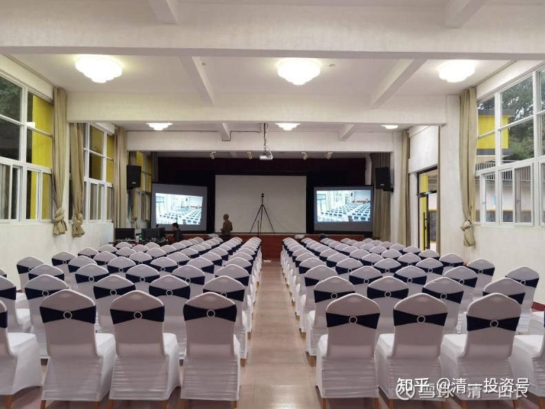
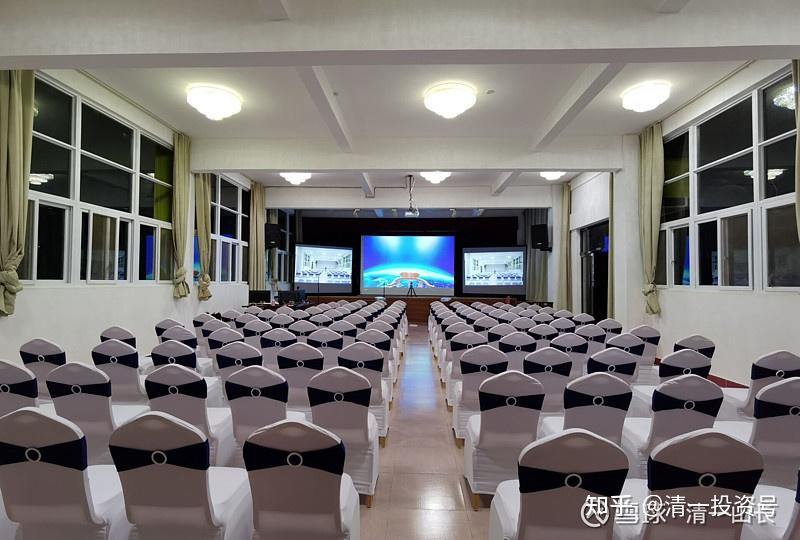

[原雪球专栏](https://zhuanlan.zhihu.com/p/570447582/edit)[150篇.借用外脑，是最低成本的改错方式！](http://link.zhihu.com/?target=https%3A//xueqiu.com/9310099567/178528522)

清一山长2021年4月28日

上图是【“**五一**”**财富思维和行为心理课程**】讲堂。我的助理们正在调试设备，将在“五一”期间接待120名全免费参与的学员。供吃供喝[大笑]。清一商学院的学生们将作为助教，参与和组织教学、课后辅导等。

**心理行为课程，是我的独创课程**。未来出现这个名字的课，都是跟我学的，或者是胡乱盗版的[大笑]。现在全国很多电影课，都是盗我的版。有些就是乱讲一气，甚至从来没有听过我电影课的人，都在装样子讲电影课了[大笑]！

该课程的特别之处，就是把人类的心理模式、思维模式，和行为模式与投资挂钩。投资就是一种行为，但投资什么？为何**买进或卖出**？就是由您的**心智模式来决定的**。如果您的**心智模式是错误的**，您的**投资也必然是亏损的**——**也许短期内会赚钱，长期一定亏损**。这是任何知识、技术都解决不了的问题，是看书也解决不了的问题，**只有改变心理模式才有可能解决**。本课程，就是为了解决这一问题而开设的。商学院的学生，已经从中受益。但学员们往往不了解。原来这种技术，我主要用于今日学堂的教学工作中，但**可以用到任何地方**，包括投资，包括武道！

这个世界其实很美丽：您要的所有资源，地球都提供给您了。您需要的，就是去找到这些资源帮助您。

但中国的家长们，却不知道利用资源，只知道按照一条固定的路线去走，很傻气！买股票也一样，天天追涨杀跌，一条路走到黑。有人连亏12年，基本的门都没入。别人指导她，居然不听，依然用亏本方式去买股，很可笑。

学生也一样。有些家长，会等孩子都快要死了，还不知道改变方法。只知道用原来的方法。昨天，就有一个青春期的，13岁快14岁的孩子，一家三口，找我辅导。这孩子，家长居然13年多，都不了解孩子是啥人。我半个小时，就成为她的“知心朋友”，了解她的想法和心理，也理解她的行为，她也很愿意跟我谈。用她的话说：她愿意跟我说真话（她一直骗她的父母）。她说，她不敢跟我说假话，因为她知道说假话对我没用（她说了假话，我马上知道）。而且，她知道，说什么，我都会理解。所以，也放心告诉了我她“不可告人的秘密”。只是不希望她的父母旁听——她对我比对父母更信任。

这个孩子，已经在学校出了很严重的问题，家长才来找我咨询的。我告诉家长：这孩子很有能量，很有想法，如果她走歪了，进监狱都有可能的（孩子总想干坏事，觉得干坏事、坑人，看人倒霉，觉得很快乐）。我帮她，也许可以改命。我用了两个小时，轮流帮助家长和孩子解决问题，结果如何？

今天收到学生的教师和家长的反馈！

明燕校长，谢谢您的引荐[合十]，刚刚孩子给我们非常兴奋地分享，山长把她的卡点给打通了！看到她完全绽放的笑容，真是太好了！我们心头的石头也落地了！衷心为孩子高兴！特别特别感恩山长的大智慧[合十]

我们刚刚建议孩子这两天可以一边跑步一边好好回想和消化山长的引导，也让她好好感受自己是多么幸运，在她13岁时就能够遇见山长这样大智慧的人生导师的关键指导，也要感恩自己的父母为她创造了这样的条件和机会，还有身边所有老师、同学都在祝福她，爱着她，我们建议她这两天把山长指引的经过和感受用笔给记录下来。

再次感恩您和山长的帮助[合十]（自立学塾的教师反馈）

家长的反馈：刚刚孩子回来也和我视频聊了会天，我感受到孩子的笑容很灿烂，她自己说心结打开了，感恩山长对我们家庭提供这么大的帮助，我要好好消化内容。我会尽快提交调查问卷，感恩您，感恩山长，感恩新教育！

其实说实话：如果让这个家长来辅导，或者请啥大神来辅导，这孩子就废了。家长找我，2个小时，就很简单地解决了问题。不过实话实说：这孩子如果再过3年，再找我就没用了。我依然可以帮她改变，但我需要的不是两个小时，而是——两年。我可陪不起这么多时间，我猜任何家长，也没实力能够买我两年的时间来陪你孩子。所以——教子要趁早！

不过刘老师也觉得有些家长很可笑，甚至很可爱。外围学堂一个家长，居然因为孩子想家，不想上学想回家，就捐款给基金会，要求提供咨询帮助服务。当然，刘老师帮她们家解决了这个问题，刘老师说，很简单的。这种家庭，都是很会借力的。我惋惜的是：一些家庭，问题严重到要死了，都不知道找人帮忙的。

顺便说说：上面的会议教室，就是几年前出国留学回家后，因为空心症、抑郁症，准备去大理玩一趟，就赴死的学员，在费心布置的。当年家里劝说无效，送她来上课，我用了不到一小时的额外加课，挽救了她的生命。今年春节后，来清一教育基金会做志工，做服务了。我们大家都很欢迎她，非常纯粹，用心去做很多杂事。她认为：她的生命，要用来帮助更多的人！这种人，是**中国的未来——为理想而工作，而不是为金钱而工作的人！**

祝福所有的想要提升自我的人！

摄像和屏幕设置也非常大气，为布置现场的伙伴们点赞！

（以下内容为编者收录）

**附录咨询回访报告：**

清一山长私人客户咨询满意度调查问卷

（案主名###）时间：2021年7月1 日上午11:30
交流方式：网络视频

一、请问您对本次私人咨询的评价？是否解决了您想要解决的问题？提供的解决方案，是否具有实操性？可详细描述。
本次私人咨询受益非常大，山长的指导和建议可以解决我的问题。只要有意识去改善就能得到提升。

二、您结束私人咨询后，当下的心境是怎样的？是否能够轻松面对您原来认为很困难，几乎无力解决的困难了？
结束咨询后，当下的心境比较放松，可以接受山长提出的问题以及给出的建议。对之前困扰自己的事也有了头绪和努力的方向。

三、山长对您所说的语言和表达方式，使用的词汇等，您是否能够理解？是否超过了您的理解力，还是使用了您完全能够理解的词语和方式来解释的？
山长的表达方式和语言可以理解。

四、您对本次咨询服务，是否有不满意的地方？您希望我们后续提供什么样的改进意见？
没有，非常感恩山长本次指导。

五、经过本次咨询，您对老师的整体印象是怎么样的？有何感觉？您是否希望下次有问题的时候，继续找老师进行咨询？
感觉山长很有智慧，通过我所说以及之前的所做对我的了解，就比我妈妈对我的了解还更加全面。如果在以后提升的路上遇到问题，会愿意找老师咨询。

**评论回复：**

**粘是帮007回复清一山长：**

看了两周山长的雪球发言，感到山长是充满大爱、大智慧的人，感恩在雪球上遇到您！[献花花]我对山长的关于教育的观点深刻认同，也想参加这个课程，苦于没有认识的清粉，望山长给我一个指引[献花花]我很想下一次能参加这个课程。

**清一山长2021-04-29 08:56回复粘是帮007：**

今年已经没机会了，全报满了[大笑]

**日边来回复粘是帮007：**

我是清粉兼家长，可以推荐您上山长的课程。

**清一山长2021-04-29 12:50回复日边来：**

你们**只能推荐自己熟悉的，靠得住的人来上课**，不能网上不认识的人乱推荐。如果乱推荐，来的人啥都不懂，你们会被取消推荐资格的。**有人以为我这里是推荐股票的，分享小道消息的，有啥秘密的，所以想跑来投点机。这种人，你们离远点**。**要注意珍惜自己的名声！**而且，今年的课程都安排完了，对外已经没有名额了。

**[一十三号](http://link.zhihu.com/?target=http%3A//xueqiu.com/n/%25E4%25B8%2580%25E5%258D%2581%25E4%25B8%2589%25E5%258F%25B7)回复[清一山长](http://link.zhihu.com/?target=http%3A//xueqiu.com/n/%25E6%25B8%2585%25E4%25B8%2580%25E5%25B1%25B1%25E9%2595%25BF)：**

[清一山长](http://link.zhihu.com/?target=http%3A//xueqiu.com/n/%25E6%25B8%2585%25E4%25B8%2580%25E5%25B1%25B1%25E9%2595%25BF)，我就是那个13年多，都不了解孩子是啥人的家长。

之前自己感觉相当良好，很自以为是，觉得一切都在掌控之中，直到孩子这次出现问题（其实孩子一直都有状况，只是我看不到），这个问题我很清楚地知道，一是自己没办法解决；二是如果不解决，后果很严重。所以通过明燕校长预约了山长进行咨询。因为孩子不想让我们参与她和山长的沟通过程，所以山长提前与我和爱人进行了线上视频沟通。山长很清晰的分析让我们看到孩子的状况，也看到我们自己的问题，并给出了我们目前最好的解决方案。

整个过程山长都是站在我们家庭的立场来帮我们分析并给出解决方案，而且这种一对一咨询让我感受到山长更像是我们的大哥或是朋友，用很轻松的方式和氛围就解决了我们最棘手的问题。孩子和山长沟通完了以后，也和我们通了视频，我看到孩子脸上的完全绽放的笑容就知道她的卡点被打通了。

咨询结束后我很激动，又听了两遍与山长沟通的录音，然后再看孩子写给山长的一封信，一边看一边流泪，我终于好像开始看懂了孩子所表达的内容。如果不是山长的帮助，我可能一辈子都不知道孩子是什么类型的人，在想什么，会怎么做。

山长的私人咨询价值极高，我们家庭用了**最低的成本解决了我们最棘手的问题**，通过这次咨询我更加深刻地感受到了山长的慈悲与大爱，唯有好好消化学习才能对的起山长给我们家庭的这份大礼。

在这里我们也要向我的孩子郑重地表达：我们的成长赶不上你，我们没有能力引领你，我们不会再阻碍你的成长！你现在自由了，你的人生由你自己作主！

爸爸妈妈会好好学习，不断提升自己，我们有我们自己的人生目标，期待我们家庭每个人都努力去做我们最好的自己！[拳头]

**[清一山长](http://link.zhihu.com/?target=https%3A//xueqiu.com/9310099567)[2021-04-29 16:27](http://link.zhihu.com/?target=https%3A//xueqiu.com/9310099567/178639230)回复[一十三号](http://link.zhihu.com/?target=http%3A//xueqiu.com/n/%25E4%25B8%2580%25E5%258D%2581%25E4%25B8%2589%25E5%258F%25B7)：**

原来你就是这个家长，也在雪球[笑]。祝福你们一家！

你们夫妻都挺实在的，对付不了这种精灵古怪的孩子。一般人也对付不了她。谁都敢去挑战一番。的确难弄。对家长这是个技术活。

幸亏你们会请外援。我从小就是孩子王，练武之后，更是孩子王。一群孩子都喜欢跟我玩。

不过，也有家长乱请外援的。今天刘老师接受家长要求，辅导一个孩子，几乎是痴呆了。家长说她抑郁症，服用抗抑郁药物。才15岁的孩子，啥抑郁症？鬼话连篇的。结果瞎治疗，弄到像是痴呆一样。家长是当病人来找刘老师看的。把刘老师累坏了，说真难弄。下来跟我骂了一顿西医，以及糊涂家长。

估计这孩子，就是跟你们家孩子类似，有点青春期问题，不开心，闹情绪。家长就送医院，服药。结果——把孩子的智力都损害了。**西医治疗一些所谓的多动症、抑郁症的精神类药物，就是让神经系统钝化的鬼东西，害人不浅**。家长们请这种“外援”，就完蛋了。很多病人，越吃药，越抑郁，就是吃死掉的，都变废人了。这孩子就是：反应都很差，听话都听不懂的样子。

如果这家长刚开始就找我，不是乱找西医乱治一气，我给的方法，就很简单：还不花钱：**尽量多运动，让运动来治疗孩子。别读书了。开心了再去读书。**（现在这样子更是读不了书，都傻了，家长还问：如果治好了，能不能上学去[滴汗]，她现在能自理，不啃老，你就谢天谢地了）。

10年前，见过我一个朋友的傻儿子，胖胖的，憨憨的，不爱说话，也不动。来证券公司大户室等她妈一起回家（她妈和我一个大户室）。坐在沙发上，挺老实的样子。已经成年了。她说他儿子小时候，不是这样的。特别调皮、机灵。老师说他有多动症，她去找医生，开药，吃了就变这样了。

我听说了大骂：这些混蛋！坑人。因为治疗多动症，一样是神经抑制药物。

如何治疗？也一样，**用运动来治疗**。因为小孩子多动，是阳气太足了，静不下来。你就让他多动，有点难度的，消耗体力的运动，耗完体力，他啥也不闹了。而且越来越有序。

我说：“一个聪明孩子，就毁在你们手上。”这位大户妈妈听了，后悔得不得了：说当初孩子小时候，怎么不认识我！

这妈妈是谁呢？她是省委书记的秘书的妻子。她儿子上的是啥学校？烂学校吗？是省级的重点小学、中学，专门为省委高干子弟们办的学校。就这样子，害人不浅！[捂脸]

**[一十三号](http://link.zhihu.com/?target=http%3A//xueqiu.com/n/%25E4%25B8%2580%25E5%258D%2581%25E4%25B8%2589%25E5%258F%25B7)回复[清一山长](http://link.zhihu.com/?target=http%3A//xueqiu.com/n/%25E6%25B8%2585%25E4%25B8%2580%25E5%25B1%25B1%25E9%2595%25BF):**

自上次向山长咨询以后，我们和孩子很坦诚的沟通了一次，告诉她爸妈能力有限，以后不再干涉她的事情，给她绝对的自由，但她必须自己承担所有事情的后果。孩子假期回来后，把之前想做、但我们不让她做的事情列了个清单，都做了一遍，孩子也从怀疑、到挑衅、到相信我们真的不再干涉她了，反而开始认真思考自己真正想要什么。

这次公主班夏令营她主动要求想去，去的当天毫不犹豫的选择了莫阿娜组，还特意打电话给我分享她为什么要选择莫阿娜。这也让我意识到，当我们放下对孩子的捆绑，孩子反而更加能承担自己的责任。

当然每个孩子和家庭所面临的问题也都不一样，山长给我们家庭的解决方案也不适合所有家庭。所以有问题的人建议向山长咨询，因为山长是根据家庭具体情况，给出针对性，并能解决当下问题的方案。虽然山长咨询的档期太满，但非常值得排队等候。祝福所有家庭都能找到与孩子最适合的相处模式！

**[清一山长](http://link.zhihu.com/?target=https%3A//xueqiu.com/9310099567)[2021-07-02 08:36](http://link.zhihu.com/?target=https%3A//xueqiu.com/9310099567/188115663)回复[一十三号](http://link.zhihu.com/?target=http%3A//xueqiu.com/n/%25E4%25B8%2580%25E5%258D%2581%25E4%25B8%2589%25E5%258F%25B7):**

基本上，我咨询完就忘掉了，大多数过程，我也不知道你们是谁，当时咨询的具体情况如何等等。昨天遇到一个一周前咨询的案主的信息，我完全忘掉了细节。只好去重新查了一遍当时的记录，才回忆起来。当咨询师，一般都这样：咨询的结果，案主会记住很多年。但咨询师本人全忘光了。虽然我跟其他心理咨询等还不一样，我提供的基本上**是人生规划咨询和难点解决**，但也一样，不会愿意去记住案主的细节。

昨天咨询的是一对母女，父亲意外死亡后，女儿又到了青春期，15岁，弄到母女之间很僵持，女儿甚至有很长时间，一两年，不理母亲。母亲无奈找我咨询，幸运的是孩子还愿意跟我谈，现已解决问题。

**青春期是很关键的时间点，如果错过，也许孩子要用一生来懊悔来买单。**其实，很多情况，都是家长处理方式错误，闹成了对立局面。昨天的案例，就是家长不理性，导致的母女不必要的冲突。本来孩子可以有更好的结果。我相信未来孩子会更理性的面对自己人生的，也有行动力。

有趣的事情是：我刚见面几分钟，就说了孩子闹的小笑话，小小的攻击了一下孩子，因为据说这孩子脾气特别大。她虽然对我说的事情感到不好意思，但也一点生气的感觉都没有。说明这孩子不是真的油盐不进。她依然很友好、真诚、坦率地跟我聊了快一小时，说我比她妈妈更理解她，懂得她。虽然我也批评了她的行为和个性，但她能听得进去，也愿意改进。但母亲说她的问题，她就很反感。其实是因为母亲**说话方式太欠缺智慧，不关心她的想法，只知道一味的指责**，当然没有效果。**去理解孩子，才是最重要的。**

**[一十三号](http://link.zhihu.com/?target=http%3A//xueqiu.com/n/%25E4%25B8%2580%25E5%258D%2581%25E4%25B8%2589%25E5%258F%25B7)回复[清一山长](http://link.zhihu.com/?target=http%3A//xueqiu.com/n/%25E6%25B8%2585%25E4%25B8%2580%25E5%25B1%25B1%25E9%2595%25BF):**

两个月前，当时孩子在学校出了比较大的状况，如果不解决可能会出大问题的情况下，我们找山长预约咨询的，山长告诉我们说：

“这孩子很有能量，很有想法，如果她走歪了，进监狱都有可能的（孩子总想干坏事，觉得“干坏事、坑人、看人倒霉”很快乐）。我帮她，也许可以改命。”

的确如此，我们用山长给的方案和孩子进行沟通和相处，孩子从开始和我们的对抗模式，慢慢变得学会理解和包容我们。山长给的方案，我们不光会记住很多年，也会一直去消化落实。咨询结束后，我把内容全部用文字打印了出来，因为我们的惯有模式太严重了，在和孩子相处的过程中，会经常出现旧有的模式，这个时候把咨询的内容拿出来消化，会更加清晰和坚定，也更能体会到向山长咨询的价值。

如果没有山长的梳理，可以想象的是，我们家在未来大部分时间里就会陷入和孩子不断撕扯的状况中，轻则和孩子的关系水火不容，重则孩子可能会走极端，所以山长不仅改了孩子的命，也改了我们整个家庭的命运。也期待孩子在公主班夏令营能找到比她生命更重要的事物，然后用全部的生命去浇灌它！

**[清一山长](http://link.zhihu.com/?target=https%3A//xueqiu.com/9310099567)[2021-07-02 14:48](http://link.zhihu.com/?target=https%3A//xueqiu.com/9310099567/188175810)回复[一十三号](http://link.zhihu.com/?target=http%3A//xueqiu.com/n/%25E4%25B8%2580%25E5%258D%2581%25E4%25B8%2589%25E5%258F%25B7):**

想起来了。这孩子很聪明的，越聪明，夏令营对她的帮助就越大。我猜她夏令营结束后会有很大改变的，因为她的理解力比别的小朋友更强，你们观察看看结果。

**[永耕明a](http://link.zhihu.com/?target=http%3A//xueqiu.com/n/%25E6%25B0%25B8%25E8%2580%2595%25E6%2598%258Ea)回复[清一山长](http://link.zhihu.com/?target=http%3A//xueqiu.com/n/%25E6%25B8%2585%25E4%25B8%2580%25E5%25B1%25B1%25E9%2595%25BF):**

认真看了您写的这些案例，吃惊之余还有点后怕，我儿子小学时，老师也常跟我说他有多动症，要我带他去看医生，必要时治疗一下，我琢磨儿子好动还是精力旺盛了，就让他去训练球类，结果他很爱打球。如今，打球成了他生活中的一部分。今天看了山长大哥的文章，庆幸没把他送去医治。长知识了！

**[清一山长](http://link.zhihu.com/?target=https%3A//xueqiu.com/9310099567)[2021-04-29 17:37](http://link.zhihu.com/?target=https%3A//xueqiu.com/9310099567/178651506)回复[永耕明a](http://link.zhihu.com/?target=http%3A//xueqiu.com/n/%25E6%25B0%25B8%25E8%2580%2595%25E6%2598%258Ea)：**

所谓的“老师”们，害掉的孩子太多了！您孩子有您真有福气，不然害惨了！

**[三工](http://link.zhihu.com/?target=https%3A//xueqiu.com/5901774752)2021-04-29 19:33[清一山长](http://link.zhihu.com/?target=https%3A//xueqiu.com/9310099567)：**

万幸！我女儿从幼儿园到一、二年级经常头疼，做过很多检查，包括核磁共振都没找到原因，就去了医生推荐的广州的一家医院看。我把病历和影像胶片给医生看，医生问一些问题后就开药，没说有什么副作用。回家上网一查，是神经抑制方面的药，觉得可能会影响智力，决定不吃药，跟女儿说，再头疼就熬过去算了。后来逐渐好转，现在四年级很少疼了。庆幸没吃药！

**[小尹花花](http://link.zhihu.com/?target=https%3A//xueqiu.com/8375846703)2021-04-29 22:55回复[清一山长](http://link.zhihu.com/?target=http%3A//xueqiu.com/n/%25E6%25B8%2585%25E4%25B8%2580%25E5%25B1%25B1%25E9%2595%25BF)**：[¥200.00]

老师，我儿子幼儿园体检老师告诉我孩子贫血，叫我多给他喝牛奶，多吃牛肉、鸡蛋这些东西，但是现在都是工业养殖，不敢给他吃。然后去医院咨询医生，就给我开了一盒铁粉，我老公不准我乱给小孩吃这些东西，就也没给他吃，所以现在快五岁了，还是贫血。我想请教老师从中医来说，有没有比较好的治疗或改善贫血的方法？

**[清一山长](http://link.zhihu.com/?target=https%3A//xueqiu.com/9310099567)[2021-04-29 23:01](http://link.zhihu.com/?target=https%3A//xueqiu.com/9310099567/178695525)回复[小尹花花](http://link.zhihu.com/?target=http%3A//xueqiu.com/n/%25E5%25B0%258F%25E5%25B0%25B9%25E8%258A%25B1%25E8%258A%25B1):**

我知道怎样处理，但我没法这样回答你。这几乎是一门课程。所以红包退回。

**最简单的方式**，是您**认真去模仿我们[清一武道馆](https://www.zhihu.com/people/mkaga)的生活方式、运动方式，自然就好了**。很简单的，您可以找到链接的。（红包已退回）

**[郡岚空间](http://link.zhihu.com/?target=http%3A//xueqiu.com/n/%25E9%2583%25A1%25E5%25B2%259A%25E7%25A9%25BA%25E9%2597%25B4)回复[清一山长](http://link.zhihu.com/?target=http%3A//xueqiu.com/n/%25E6%25B8%2585%25E4%25B8%2580%25E5%25B1%25B1%25E9%2595%25BF):**

我的孩子早先也上过一段幼儿园，那个时候新教育没有幼儿学堂，孩子提出来想上，就让她去了，结果没多久老师也反应孩子有多动症，让我带去医院看看。我详细地问了老师哪些事情，她认为是多动症的情况，结果是孩子不能和其他孩子统一节奏，包括上课手背在后面，喜欢摸摸这里动动那里，有时候又好像进入自己的世界，听不到老师的指令。我当时就觉得好正常，一个三四岁大的孩子，就让她安安静静地坐着听课，循规蹈矩的，那样的孩子，我反而觉得不正常了。孩子放学回家以后，就比之前烦燥了许多，表现就是停不下来，到了晚上12点还睡不着，睡着以后满床滚，这就是白天太压抑，她说老师要小朋友在教室里趴着不说话，看谁保持的时间久。

我对老师的做法是不接受的，随后就退回家了，一直到大一点进了新教育学堂。第一个学期，打电话回来说每天不上课，老师就是让她做事，各种做事、运动，[捂脸]打扫卫生啥的。

当时的确对新教育没了解透，我对做事、运动是认可的，但是不知道为什么不学习，大部分时间都花在做事、运动上，直到假期接孩子回来，看到孩子面色红润，我自己学过自然疗法，虽然孩子一直都没病没灾的，也一直用了新教育的方式在带她们两个，但是她的脸色一直都是那种没什么光和血色的，我们全家也都反对孩子这么小就离开家里去那么远读书，但是一直到长辈们看到她红扑扑的面庞，就都解除了心中的疑虑。

这还不是最大的礼包。回来以后我惊奇地发现，她能静下来了，做家务比我强多了，我自己也被称为“处女座晚期患者”，没想到她做的超过我，而且看到她从未有过的眼睛里透着的自信的光，和过去那个对啥都无所谓的样子形成鲜明的对比。而且爱上了阅读，以前都是老母亲一本接一本的读到口干舌燥还不能停。现在她不仅自己读，还会带领妹妹，一起运动、学习、做事，我才领会到老师的深意。让孩子在做事上慢慢找回自信，锻炼动手能力，所以心灵手巧，应该是手巧心也灵。同时心也跟着沉静了，心静了才能生出智慧的光。

运动方面，我也发现她提升到距离过去我给的量的数倍，晚上观察她睡觉也不会动来动去了，睡眠好很多，吃饭也不会艰难地吃个把小时才能结束了，吃得香又快，还主动给全家煮一些简单的饭菜。我才意识到，之前给孩子们定的运动量差得太远了！[吐血][吐血][吐血]

以上种种好处太多了，包括对家长的培训，我经常和圈内好友开玩笑说，感觉花了一份的学费，其实同时重塑了一家子[捂脸][捂脸][捂脸]，除了感动都是感激。这种心情，只有真正经历过，才能体会。感恩山长引领[献花花][献花花][献花花]……

**[清一山长](http://link.zhihu.com/?target=https%3A//xueqiu.com/9310099567)[2021-04-30 16:28](http://link.zhihu.com/?target=https%3A//xueqiu.com/9310099567/178788495)回复[郡岚空间](http://link.zhihu.com/?target=http%3A//xueqiu.com/n/%25E9%2583%25A1%25E5%25B2%259A%25E7%25A9%25BA%25E9%2597%25B4):**

好真实的案例[献花花]，几乎就是我儿子小时候送去幼儿园的翻版。班主任老师还告状，说我儿子是班上的最后一名。责备我：怎么你这个大学老师，也不懂教育！孩子都这么差。

其实就是这孩子很聪明，有自己的想法。老师却太压抑他了，所以默默的反抗。这种省级示范幼儿园，只能培养两种人：一种是压抑的胜利者，将来成书呆子，除了读书，啥也不会；另一种是问题儿童、反抗者。没有第三条可走。我儿子，大概率成为第二种——问题儿童。其实，就算成为第一种，也是很失败的结果。

所以，我才只能在儿子三岁多的时候，接回家，自己办学教孩子了。因为我当时，根本找不到一所合适的学校，我的钱再多都不行。你们，已经比我幸运多了！还有新教育学堂可以上。

**[郡岚空间](http://link.zhihu.com/?target=http%3A//xueqiu.com/n/%25E9%2583%25A1%25E5%25B2%259A%25E7%25A9%25BA%25E9%2597%25B4)回复[清一山长](http://link.zhihu.com/?target=http%3A//xueqiu.com/n/%25E6%25B8%2585%25E4%25B8%2580%25E5%25B1%25B1%25E9%2595%25BF):**

我女儿刚去学堂那会儿，就跟我说喜欢学堂，老师都很好，我问她怎么好呢？她举例说，过去幼儿园的老师给她凳子，是直接用脚踢过去的，而她们学堂的老师讲话都不用吼的，椅子也是轻轻地递给她。哎，就这个例子，听到我真是既好笑又心酸，之前我们离开幼儿园的时候，孩子的评语上，老师还留下这样的话：“要记住，老师骂你都是为你好！”我现在还在后悔，当时怎么那么好脾气地离开，没怼回她：“你才多动症，你全家都多动症！”真是可怜又可恨。

我们周围的孩子，也都是在这种环境里面，家长们无奈又麻木。我们一家子，竟然能够跳脱出来跟随新教育，想来应该是前世积了大德吧！因为有了新教育这个大团体，我才能够坚持下来这么多年，所以每次看《盗火者》的时候，尤其是看到新教育遭遇困难重重，家长们团结一心的部分，都会百感交集，泪流满面。

新教育是改命的教育，面对困难、挫折不理解，放弃是最容易的，坚持下来反而需要巨大的勇气和意志，每当自己快要坚持不下去的时候，我就只要脑补一下过去那些无知麻木的日子，顿时就满血复活了！最后讲真，还是新教育那句老话：明师指路，唯有精进！

**ellhll李华丽回复清一山长：**

感谢山长分享。

祝福获得理解的孩子，祝福看见孩子的爸爸妈妈。他们是有福气的，能在问题恶化前得到解决。也为山长提到的两个被抑郁药毒害的孩子，每个父母都爱孩子，但是**无明的爱不是爱，而是真正的毒害。**这样的结果，任谁看了都痛心，痛心之余，请记住山长的话【**看别人得病，自己先找药吃**】，还没得病不想吃药的，要做预防，也要给自己备着可靠的医生：山长和刘老师的咨询。

我记得法萨的李小虎李总写过：按他公司的收益，他每个小时的时间成本是几十万，他今年要花一年的时间在武道馆学习，那他肯定是认为向山长的弟子学习的价值是高于每小时几十万的；这些弟子和李总都是向山长学习的，这样推论，山长每个小时的价值是高于山长弟子的。现在，咨询者，仅支付1万，就获得了山长1个小时的引导，这个价值是**﹥**山长弟子**﹥**李总几十万/小时。这样高价值的福利，真的只能清粉才有，否则，山长整天坐在咨询室也忙不过来。

**清一山长[2021-04-29 17:35](http://link.zhihu.com/?target=https%3A//xueqiu.com/9310099567/178651158)回复ellhll李华丽：**

我拒绝了一些要求咨询的单子的[笑]。有些贵妇人，说要约我咨询，让她事先提出咨询内容和问题，拉拉杂杂地写了一堆祥林嫂一样的话题。我认为，**这些人，就是花钱找“高级聊”的**。估计跟她们买个高级的包包一样。我就让助理直接拒了，有钱也不赚！**我要求付费，就是怕人胡乱消费我，我没时间到处乱作好事的。**

**只有真心有问题，有事情，着急、焦心的人，我才接单，去解决问题。**凡是空洞、无聊的，都不理！而且，我的服务还有**一个准则，事后付费**。觉得我没帮上忙，可以拒绝付款。

说不定，贵妇人来消费我一通，聊完，表示我没有满足她们的要求，就连咨询费都不出，就走了！我也没脾气！[大笑]
