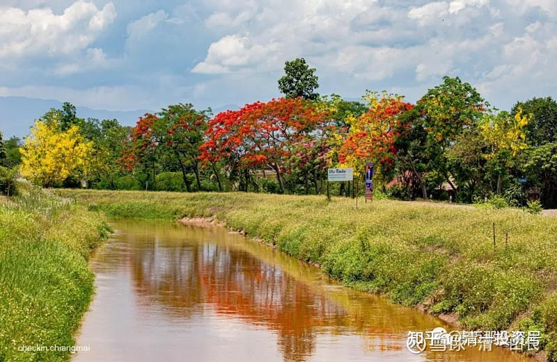
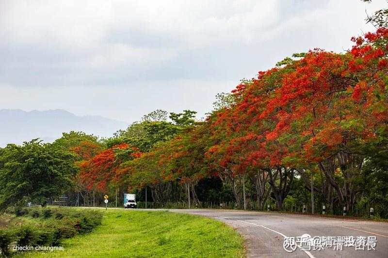
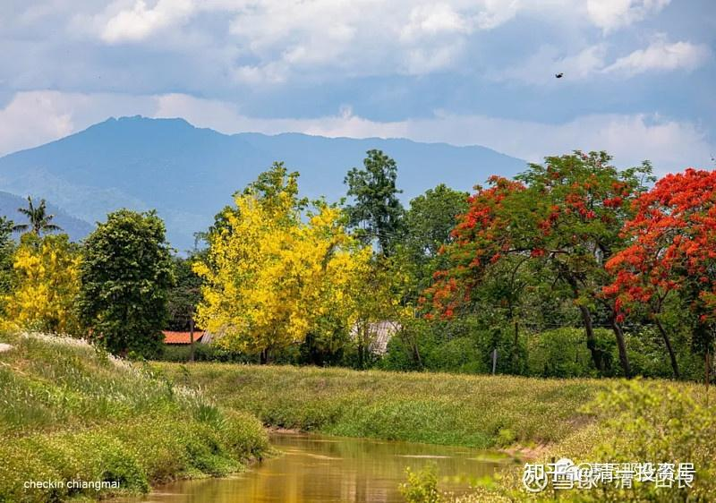
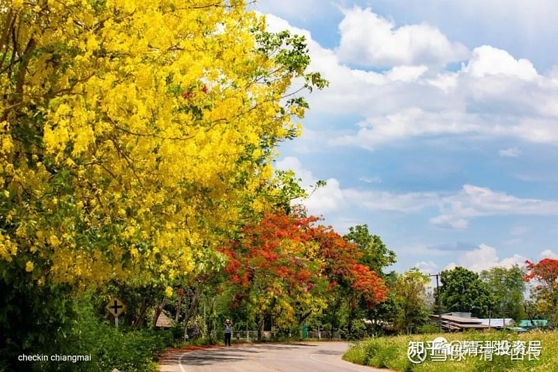
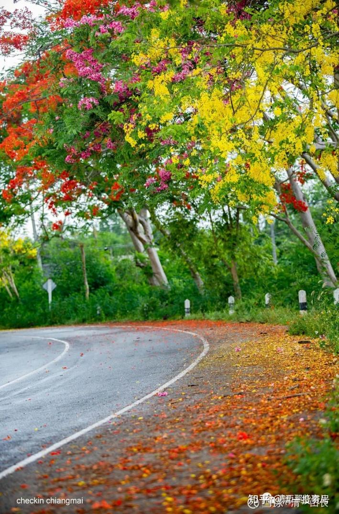
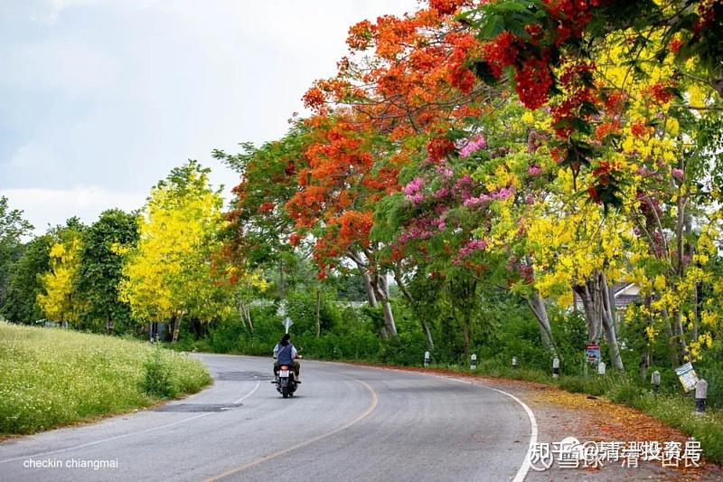
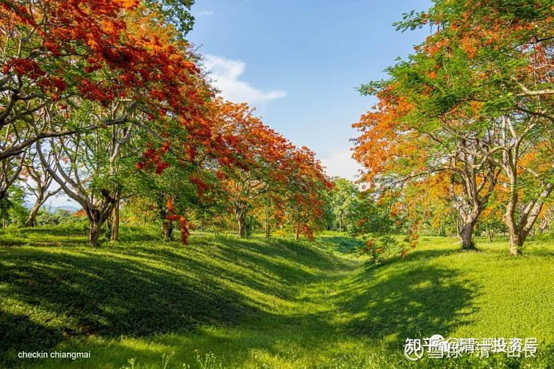
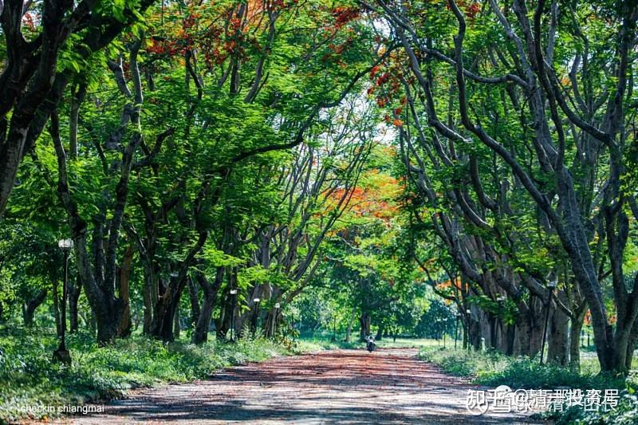

原雪球专栏[160篇.泰国春夏树花开，喜欢就来玩](http://link.zhihu.com/?target=https%3A//xueqiu.com/9310099567/179909813)

清一山长 2021年5月15日

我的家不在清迈城里面，是住在城外的乡下。周围的环境，现在是这样的：树上的花，正好开了，外出看看，很漂亮。

这一条小河，就在我在泰国居住的家后院20多米处。经常见泰国人在里面摸鱼。去年水浅的时候，小女和她的朋友们也去摸了一次鱼，捞了不少小鱼上来，养在鱼池里。

通到我们家的路是类似这样的。泰国的基础道路很通达，都是政府修的。我们还没有付过过路费。

这张照片暴露位置了——我们居住在清迈相对靠山的地方。环境很好，每天早上都是被鸟叫醒的，院子里很多鸟。原来的主人，据说每个月都要打药，我接管后一次都没打过。因为有一次我发现树上很多虫子在啃食树叶，就在我书房外面，有一颗上图开黄色花的树，似乎虫子很喜欢吃这种树叶，有点像菜青虫。但我观察到每天都有小鸟来抓虫子。没几天，虫子全被吃光了，小鸟就不来了。而且树上有一种黄色的蚂蚁，似乎也会抓虫子吃。据说是肉食虫子，泰国人会用这种蚂蚁来做菜吃，西双版纳也吃，叫酸蚂蚁。我查过书，有人专门养这种蚂蚁来进行害虫防治，保护树木。而且这种蚂蚁不进屋，只在室外活动。所以，当发现泰国工人想取我们院子里面的树上的黄蚂蚁窝回去吃的时候，我就阻止了他们。院子里面还有几窝野生蜜蜂，每天忙忙碌碌地采集树花。似乎泰国一年四季都有花开，这里的蜜蜂四季都在忙。这里的生态，在这些生物之间，巧妙地维持了平衡。

我在云南居住的时候，院里有一棵树，没打药，结果最后爬满了虫子，看上去都很恶心，只好拿药来打了。曾经住在云南的一个别墅区，每年物业都要打药。因为云南的野鸟似乎很少，至少是从人住的地方消失了。我在清迈一楼书房的外面，2米处，就有两个鸟窝，分别在两个窗口外面。经常看到小鸟从里面飞进飞出的，很有趣。似乎不关心我在里面干什么。嘴是细长的，显然是吃虫子的小鸟，泰国的虫生存也不易。树上也有鸟窝。有几次小鸟居然把窝都安在我的窗口上，我只好搞破坏，把它们含来做窝的草丢掉。弄了两次后，就不来了。

这种黄色的花，叫做金链子树。似乎是泰国的国花？现在正是开放的时候。我家院子里面有五颗。花开满园的时候特别好看。

说明：这些图片，不是我拍的，取自“清迈这些事儿”公众号。把一些环境跟我家附近相同的照片取下来了。供大家看看玩。这是我喜欢的环境，我不喜欢水泥森林，去上海，去香港，我都闷坏了。

附录：下面为山长回复的三个精选帖子：

1.附近有两个高尔夫球场，一个是泰国皇家球场。环境很漂亮，带孩子去玩过。现在人很少。

2.知道泰国有“国家尊荣卡”吗？我们家有一个终生有效的VIP永居权卡，还是可以传给下一代的这种。我们家，是“警察特保户”，门口都有警局的特别标志，我们离当地的政府机关，只有几百米的距离。警察局也很近，每天都有警察来门口签到打卡的。每个月，我们都有给泰国警察的小费。村长家就在我们家旁边，20米距离。我家的小狗，就是从村长家弄来的。我们与泰国当地人保持友好的关系，因为孩子懂泰语，互相交流较多，也参与当地的活动。孩子都认识当地人，外出还有当地泰国人追着送水果、零食啥的给她们。

3.**泰国是佛教国家，人民懂因果，善良友好，穷人也恪守本分，不仇恨富人。治安比美国不知道好多少倍，这就是我选泰国养老的原因**。美国、加拿大、澳洲，朋友都请我去。我的条件去任何国家都没问题，但最终选了东南亚生活条件最好的泰国，而不是经济发展空间大的新加坡，以及越南等地。泰国现在的疫情，导致很多人很穷，生活有困难，但没有出现啥治安事件。我家周围的农民，其实家庭很穷的。但对我们都很友好，没有人来干扰我们。院子里面，没关门也没人进来，甚至没见过小偷进来。不过，有些地方据说房主不在的话，也有一些吸毒的瘾君子会去偷东西。有一个笑话：去年一个泰国人自杀了。他是债主，借了很多钱给周围的人。但一直收不回来，特别去年疫情，欠债人都说没钱还他。要是出现这种事情，中国追债人不把你逼死才怪。结果这个债主居然不好意思追债，自己生活困难了，觉得对不起家人，就吊死自己了。可以知道：泰国人有时候过于克制自己。当然，你也别瞎惹泰国人，他们是可以合法持枪的。惹急了，也会掏枪出来杀人的。
