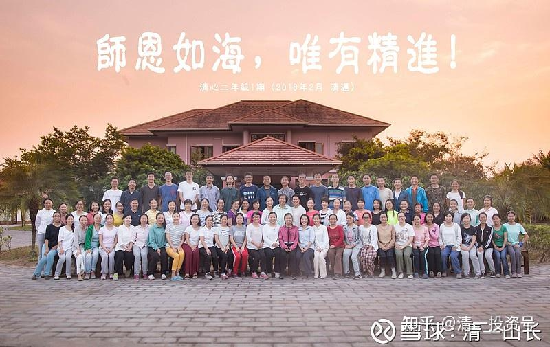
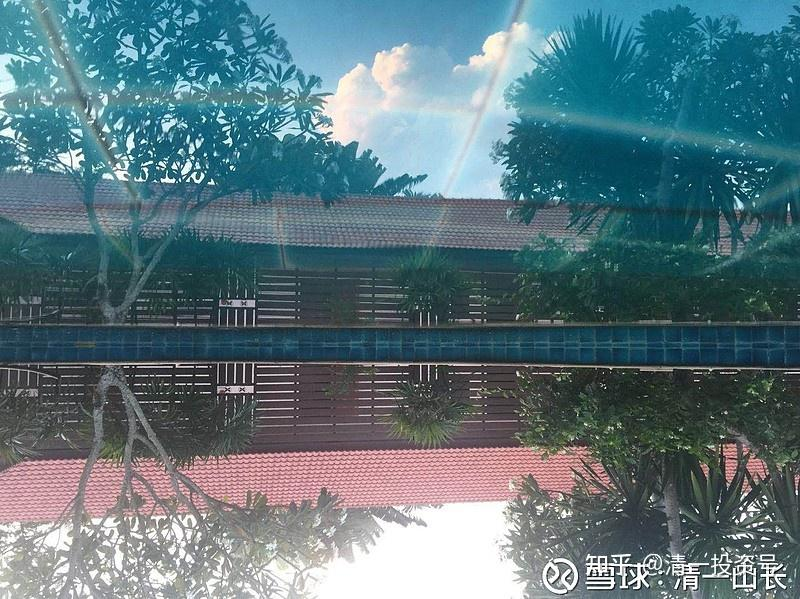
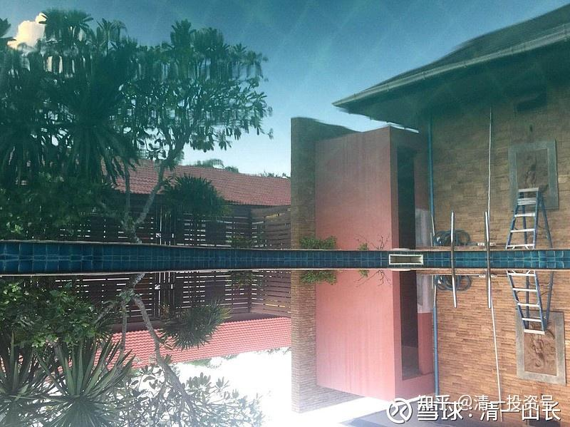
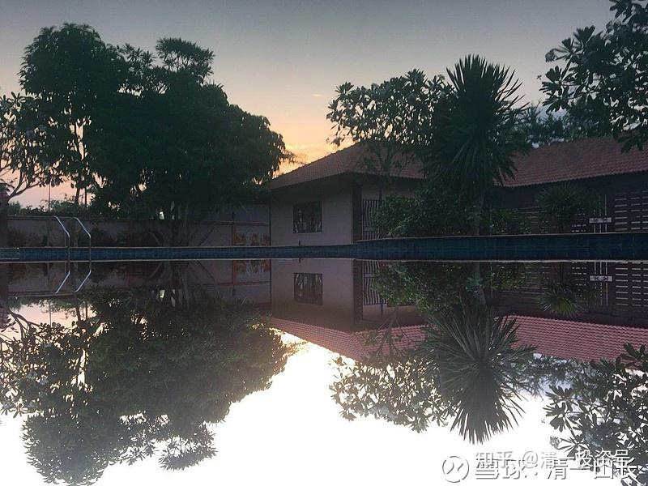

原雪球专栏27篇.清迈书院：寒冷冬日的美丽阳光城

清一山长 2018年8月3日

上传一张最新的学员照片，我们来自全国各地的学员，在这个寒冷的冬日，居然在微笑之国——泰国清迈，享受温暖和灿烂阳光的日子，以及游泳池。下面是首期“清心二年级”的照片，他们马上就要结束在清迈的21天“新教育管理思维原则”培训课程了。这是他们自己拍的照片，我按惯例没有出席。因为我不喜欢照相，就利用做老师的“特权”逃避照相了。所以，您可以认为这只是我在网上淘的一张PS的照片。

谁会猜到照片后面看起来普普通通的“小房子”，居然会有120个床位？里面还有100平方左右的大厨房，300多平方的用餐区，加上100多平方的健身房，室外的游泳池和花园。肯定你们在照片中都“看”不出来吧？这个英国工程师设计的房子，真的很“私密”，外观很普通，可内在强大，功能齐全。所以去年我来这里，只看了第一眼，就喜欢上了这栋房子，当即就拍板决定买下来。让房东还很意外和不敢相信。因为他卖了几年，都没把它卖出去（由于它太大了，一般泰国人没法用，房间太多。家庭用不适合，也太贵了。旅游和公务用，又离城区较远，它虽然紧靠清迈的梅州大学，却又无法做学生的生意）。但我一看就要下来了——这个地方，作为我们在泰国的“中国书院”，简直没有比这更好的地方了，太合适了。

不过，这房子也不是买下来后就能直接使用的，毕竟原来设计的功能不一样。为了符合我们的书院教学使用要求，我拿到手后，花了好几个月时间来完善各项功能，用了几百万泰铢对它进行改造和设施的完善工作，才能够正式地接待国内来的朋友们。目前据学员的反映：相比于我们在昆明接近3000平方米面积的**“中国清一书院”**，他们更喜欢这个**“泰国清一书院”**。其实我对于昆明书院的投资比泰国更多、更早，时间更长，连使用的家具都是红木的。在泰国好家具很难买，只能用普通家具。不过泰国书院的优胜之处，在于周边的环境很优美，而且相对很独立，没有社区的干扰。另外特别“接地气”，不需要住楼上和使用电梯，周围林木繁茂，出外散步很舒服。我们跟周围的泰国居民关系也很友好。学员们说，他们来泰国的机票，时间和价格，都跟飞去昆明差不多，签证也很方便，所以就像跨省一样。并不觉得去“国外”很遥远的样子，反而还能感受异国情调。所以，我注定了不能去美国，不然朋友们来看我，飞一趟飞机都会累死人。

