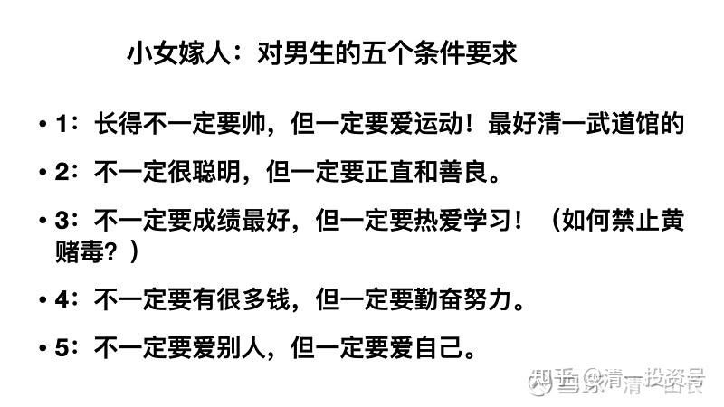
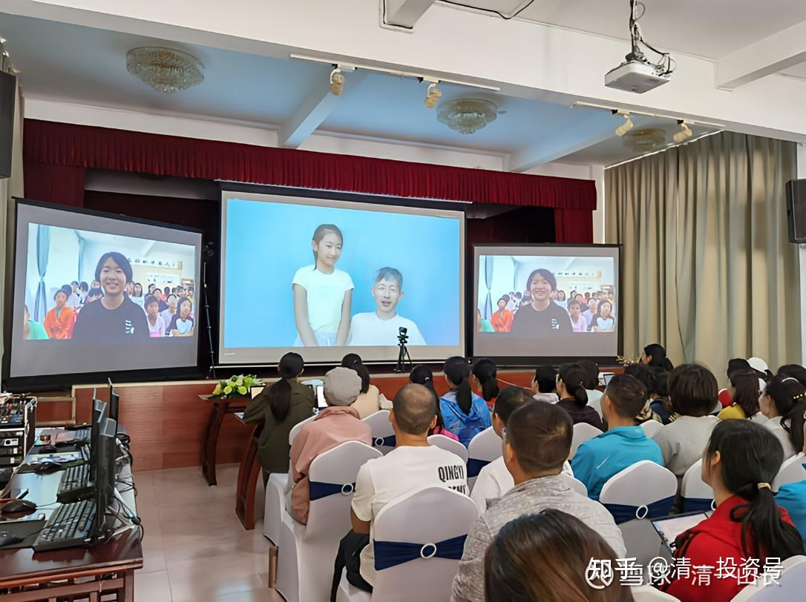

[原雪球专栏](https://zhuanlan.zhihu.com/p/571054205/edit)[164篇.做事一定要有规划：嫁女也一样！](http://link.zhihu.com/?target=https%3A//xueqiu.com/9310099567/180591362)

清一山长 2021年5月23日

我给小女，将来会选什么样的丈夫呢？这个，绝对不是等她长大，马上嫁人时，家长才去跟她谈这个事情的。必须在她青春期之前，就互相沟通好，定好双方都认同的标准，不然心中没数，乱找一气就麻烦了，现在就要教她如何选丈夫。只有从小教的对，长大才不至于吃亏，不断结婚、离婚的。现在都把婚姻当游戏了，可悲！多次试婚，就能成功了？恐怕越来越失败吧？特别是女生，择偶不慎带来的后果，几乎是影响一生的。

就算是对我儿子，我也不马虎。他在7岁的时候，我就不断地教他：**漂亮的女人很危险，讲很多漂亮女人如何骗男人的故事，还带他去见了武汉大学第一美女，让他对美女建立免疫力。避免**他将来看到漂亮女孩，就娶回家。教育结果应该还是很有效的，从小这孩子评价女生不用漂亮，甚至有一次，一个留学回来的漂亮女生跟他放电，他发现自己居然动心了，就马上警惕起来，找机会就跑掉了。他在带青春期班女生夏令营的时候，女生们都争相吸引他的注意力，封他做男神，他也做到了自持。回来后告诉我：他被女生的热情吓到了，女生们也被他的“冷漠”伤害到了。

因为我的这种教育，他顺利度过了青春期。但也有后遗症：他迟迟不愿意进入恋爱关系，跟女生总是保持距离。今年已经24岁了，面对很多女生的“脉脉含情”，他依然保持了“胆小如兔，畏女如虎”的态度，没有敢乱做事，乱进入两性关系。今年开婚恋心理行为课，我给他的命令，让他今年必须给我找个好女孩娶回家，他这才胆小如兔一样的，准备今年正式去谈谈恋爱，正式对女生去表白了。

很多年前，我在新浪博客上发表了我给儿子找媳妇的几条要求，很多人跳出来骂我，说我对女方的条件过于苛刻，这会让儿子永远也找不到老婆的。现在应该可让这些人闭嘴了，他的可选对象，比你们想象的要多得多！有不少很优秀的女孩子，是愿意嫁给他的。虽然他没钱——我宣布是不留遗产给他的，他必须自己做创一代！

今天，我又给出了我对小女选丈夫的五条要求，你们看：是正当要求，还是苛刻的要求？会让小女嫁不出去吗？

**小女嫁人：对男生的五个条件要求**

**●1.长得不一定要帅，但一定要爱运动！最好是清一武道馆的。**

**●2.不一定很聪明，但一定要正直和善良。**

**●3.不一定要成绩最好，但一定要热爱学习!(如何禁止黄赌毒？)**

**●4.不一定要有很多钱，但一定要勤奋努力。**

**●5.不一定要爱别人，但一定要爱自己。**

今天我上课，是给女生上的“魅力男神课”——核心是如何破解女学生们追星，迷小鲜肉的信念系统！避免被人利用。但是，教这个课程，大大违背了我的利益所在。我的[燕京啤酒](http://link.zhihu.com/?target=https%3A//xueqiu.com/S/SZ000729%3Ffrom%3Dstatus_stock_match)，就靠这批无脑迷小鲜肉的女粉丝，靠小鲜肉们来赚钱的呢！怎么能把我自己的钱罐子，给砸了呢？实在太不够意思了。

不过，信念上，我**“要做教育家”**的信念排第一位，胜过了**“我做有钱人”**的信念。所以，最终我还是牺牲利益，教学生们破解追星的迷途，受一点损失也认了。如果中国女人都不追小鲜肉了，我愿意让我在燕京上的上亿投资资金都归零。大义灭亲，够有决心了吧！[加油]

学员日记：部分

今天山长在课上给出了他给明慧定的五条择偶标准：第一是长得不一定要帅，但是一定要爱运动；第二是不一定很聪明，但一定要正直善良；第三是不一定要成绩最好，但一定要爱学习；第四是不一定要有很多钱，但一定要勤奋努力；第五是不一定要能够爱很多人，但一定要爱自己。然后对这五条进行了详细的说明，尤其是对这五条后面展现出来的信念系统。首先对于爱运动这一条，爱运动的人身体一定会很好，也会是一个很自律的人，那么一个自律的人不会去瞎做事。

学员李军：

一、如何破小女孩对小鲜肉的执念
山长今天用现场辅导三位女孩子的方式，再一次让我看到了山长见微知著的能力，还有山长很厉害的读心术，以及通过自己获取的信息，看到孩子的未来。如果不改变孩子的现状，孩子这一辈子估计就废了。孩子是父母的复印件，山长通过辅导第二个孩子的时候，直接指出了孩子的家长、家庭的问题。所以，这份功力不是一下子就练成的。需要在日常生活中，一步步去觉知，去反省，找到假的我，剩下的就是真的我了。
全程观看山长对孩子的辅导，看到了山长设计的一系列方案，真的是很棒。破掉了女孩子们对于小鲜肉的执念。
首先山长让孩子们自己写出未来要嫁给的人的5条标准，然后通过这5条信息线索，看到孩子背后的信念是什么。然后山长开始做引导……下略

学员课堂记录3：郭凌奇

亲身体验过山长对三位学生择偶标准的点评，我忍不住惊叹道家滴水藏海、一叶知秋的“读心术”的强大。当看到第二位女生的择偶标准（长得帅、要善良、不能有黄赌毒的恶习、爱运动、有责任感）时，我心想这个女生的标准跟山长的择婿标准挺一致的。然而经过山长的分析并看到她写的原因时，我意识到她的择偶标准背后隐藏的是恐惧之心和不配的意识（自我审判）。比如，“长得帅”是怕孩子太丑；“要有责任感”是怕丈夫出轨；“要善良”是怕丈夫的欺骗……当问她想不想得到范冰冰的容貌时，她犹犹豫豫地不肯说出自己的答案，虽然她嘴上不说但是她的态度已经做出了回答：她想要但是不敢要（这个孩子自己说：得到了容貌会失去其他东西），喜欢美好的东西同时害怕它们的态度，岂不是把一切美好的事物拒之于外，同时吸引垃圾到自己的身边吗？
